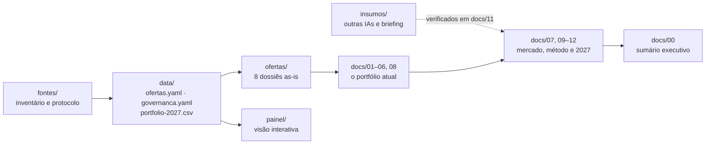

# IT M&A · A&M Digital & Technology Services

Base organizada do portfólio de **IT M&A** da Alvarez & Marsal Brasil (DTS): o que existe hoje, como o mercado está se movendo e a proposta de portfólio para 2027.

> **Comece aqui:** [Sumário executivo](docs/00-sumario-executivo.md). Responde em uma página se dá para criar produtos novos ou melhorar os atuais, como fazer, quanto custa e para quem.

---

## Mapa do repositório



## O portfólio atual (as-is)

| Documento | O que responde |
|---|---|
| [01 · Contexto e proposta de valor](docs/01-contexto-e-proposta-de-valor.md) | Qual é a tese comercial do deck |
| [02 · Jornada do deal](docs/02-jornada-do-deal.md) | Onde a TI cria ou destrói valor em cada fase |
| [03 · Catálogo de ofertas](docs/03-catalogo-de-ofertas.md) | As 8 ofertas lado a lado |
| [04 · Readiness e portfólio](docs/04-readiness-e-portfolio.md) | Maturidade de cada oferta e onde está o risco |
| [05 · Governança](docs/05-governanca-service-line.md) | POs, squads e fluxo de status |
| [06 · Reconciliação de fontes](docs/06-reconciliacao-de-fontes.md) | Onde as fontes divergem |
| [08 · Glossário](docs/08-glossario.md) | Termos de M&A e de TI |
| [Dossiês por oferta](ofertas/) | Detalhe de cada oferta, com selos de origem |

## Mercado, método e 2027

| Documento | O que responde |
|---|---|
| [07 · Estratégia e portfólio 2027](docs/07-estrategia-e-inovacao.md) | **Tabela A** (o que temos e como fica, com e sem IA) e **Tabela B** (10 produtos novos), receita, roadmap e custo |
| [09 · Benchmark de mercado](docs/09-benchmark-de-mercado.md) | O que Big Four, McKinsey, BCG, Bain e especialistas fazem, com foco nos EUA e no Brasil |
| [10 · Modelo semântico da diligência](docs/10-engenharia-e-modelo-semantico-da-diligencia.md) | Como a A&M faz IT DD: ontologia, gramática da evidência e regras, extraídas das 24 skills |
| [11 · Análise crítica dos insumos](docs/11-analise-critica-dos-insumos.md) | O que as outras IAs acertaram, erraram e o que foi aproveitado |
| [12 · Piloto de Technology DD com IA](docs/12-piloto-tech-dd-com-ia.md) | Desenho do piloto de 12 semanas, do zero |
| [`data/portfolio-2027.csv`](data/portfolio-2027.csv) | Tabelas A e B em formato de planilha |

## Como confiar no que está aqui

Cada afirmação traz um selo de origem:

| Selo | Origem |
|---|---|
| 📘 | Deck comercial ou skills internas |
| 🗂️ | Slides "A&M é M&A" e "Status das Ofertas" |
| 📎 | One-pagers (pendentes) |
| ✅ | Fato de mercado confirmado em fonte primária |
| 🔎 | Fato de mercado de fonte única ou com ressalva |
| ⚠️ | Fato fraco ou não confirmado |
| 💡 | Análise, proposta ou estimativa deste repositório, a validar |

**Regras da casa:**
- Nenhum número de mercado sem fonte.
- Nenhum preço inventado: custos aparecem em FTE-mês, com conversão ilustrativa.
- Arquivos-fonte brutos ficam fora do git ([fontes](fontes/README.md)).
- Textos de outras IAs são insumo, nunca fonte ([insumos](insumos/README.md)).

## Painel e scripts

```bash
pip install -r requirements.txt
python3 scripts/catalogo.py validar   # confere os dados e recalcula os índices
python3 scripts/catalogo.py painel    # gera painel/index.html (abrir no navegador)
```

O painel mostra o ciclo do deal, a readiness atual e o alvo, as leituras do portfólio e, para cada oferta, o detalhe do deck e a proposta 2027.

## Pendências

| Item | O que falta |
|---|---|
| One-pagers DTS | Reenviar em versão menor (abaixo de 10 MB) para ingestão |
| 6 ZIPs de skills | Reenviar em partes menores que 5 MB |
| Validação com POs | Propostas de valor, nomes 2027 e notas de prioridade |
| Pipeline e win/loss | Dados internos para calibrar as fatias de mercado e as metas |
