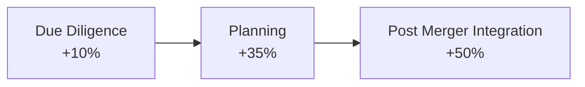
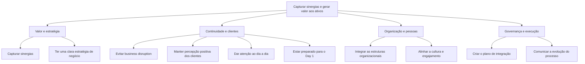
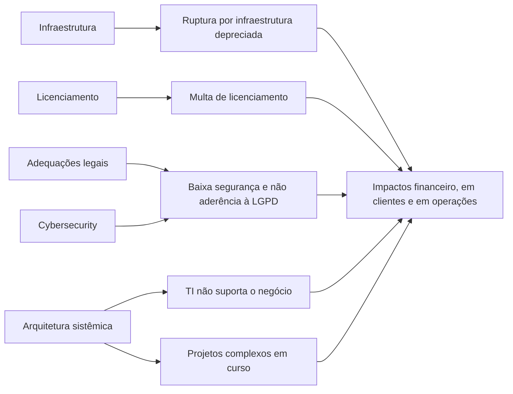
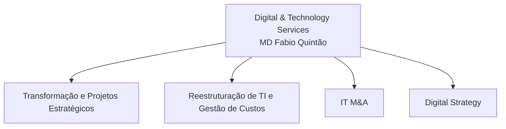
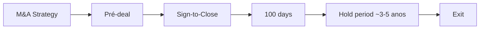
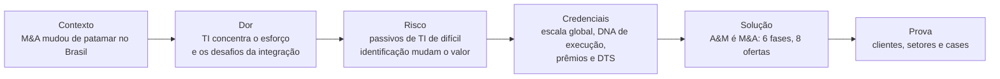

# Contexto e proposta de valor · IT M&A · A&M DTS

> **A tese do deck em uma frase 💡.** O M&A no Brasil mudou de patamar, a TI concentra mais da metade do esforço de integração e esconde riscos que alteram o valor do deal, e a A&M, com DNA de execução, cobre o ciclo inteiro da transação com oito ofertas de IT M&A.

| | |
|---|---|
| **Escopo** | Abertura institucional do deck comercial: contexto de mercado, importância da TI, desafios, riscos, credenciais da A&M, pilares da DTS, catálogo "A&M é M&A", clientes e setores |
| **Fonte primária** | 📘 *Deck Comercial - DIGITAL & TECHNOLOGY SERVICES - M&A - Full v7*, linhas 1–468 da extração textual |
| **Fontes complementares** | 🗂️ Slides "A&M é M&A" e "Status das Ofertas – IT M&A" (via `data/ofertas.yaml` e `data/governanca.yaml`) · 📎 One-pagers DTS (pendente de ingestão; nada foi usado) |
| **Data de referência** | Capa datada de **JAN/2023**. A seção *IT Due Diligence (Buy Side VC)*, fora deste intervalo, traz **"Julho 2023"** (linhas 963–965): o v7 consolida material de datas diferentes |
| **Uso** | Interno A&M. Base para conversas comerciais e porta de entrada para os dossiês de oferta em `ofertas/` |

**Legenda de proveniência.** 📘 Deck Comercial · 🗂️ Slide ("A&M é M&A" ou "Status das Ofertas") · 📎 One-pager (pendente) · 💡 Análise deste repositório, a validar. Tudo o que está marcado com 📘 é rastreável a uma faixa de linhas da extração, indicada em cada seção.

---

## Sumário executivo 💡

*Síntese deste repositório; os números são 📘 e estão detalhados nas seções indicadas.*

1. **O mercado mudou de patamar.** As transações de M&A no Brasil (1º semestre, TTR) saíram de 518 em 2017 para 1.130 em 2022; o deck declara "crescimento de 112% no período" e motivadores cada vez mais diversos, inclusive tecnológicos. → [§1](#1-contexto-de-ma-no-brasil-)
2. **A TI é o centro de gravidade da integração.** Mais de 50% dos esforços de integração de uma fusão ou aquisição estão em TI, com forte variação entre Due Diligence, Planning e Post Merger Integration. → [§2](#2-a-importância-da-ti-em-ma-)
3. **O desafio é holístico, mas passa pela TI.** O deck lista 10 desafios (de capturar sinergias a comunicar a evolução do processo) e 5 riscos típicos de TI, com impactos financeiros, em clientes e em operações. → [§3](#3-os-10-desafios-holísticos-de-ma-) e [§4](#4-riscos-de-ti-e-possíveis-impactos-)
4. **A A&M traz escala e DNA de execução.** 7.500+ profissionais no mundo e 1.000+ no Brasil, 77 escritórios (3 no Brasil), atuação desde 1983, quatro pilares de diferenciação e prêmios em due diligence e turnaround. → [§6](#6-quem-somos-a-am-em-números-) a [§9](#9-esferas-de-atuação-da-am-)
5. **IT M&A é um dos quatro pilares da DTS.** A DTS é liderada pelo MD Fabio Quintão 📘; a service line IT M&A, por Thiago Vieira 🗂️. → [§10](#10-digital--technology-services-pilares-)
6. **"A&M é M&A": seis fases, oito ofertas.** Do *M&A Strategy* ao *Exit*, com uma oferta transversal de *Value Creation as a Service*. A prontidão média da service line é 3,29, com alvo de 3,95 no FY. → [§11](#11-am-é-ma-o-ciclo-e-as-oito-ofertas-)
7. **Há pendências antes de uso externo.** Slide de clientes marcado "Validar c/ Quintão", percentual de crescimento que não fecha com a série, fonte "Exhibit" incompleta e datas mistas. → [§13.4](#134-pontos-a-reforçar-na-próxima-versão-do-deck) e [§14](#14-perguntas-em-aberto-)

---

## Mapa do intervalo 📘

| Bloco do deck | Linhas | Mensagem central | Seção |
|---|---|---|---|
| Capa | 1–9 | *Digital & Technology Services*, Alvarez & Marsal, "Leadership. Action. Results.℠", **JAN/2023** | — |
| Agenda | 11–21 | Contexto → Desafios → Cases → Alvarez & Marsal | [§13](#13-o-que-esta-narrativa-comunica-) |
| Contexto de M&A | 23–47 | M&A em crescimento expressivo no Brasil; objetivos mais diversos | [§1](#1-contexto-de-ma-no-brasil-) |
| Importância da TI em M&A | 51–99 | +50% do esforço de integração está em TI | [§2](#2-a-importância-da-ti-em-ma-) |
| Divisória de agenda | 103–105 | Contexto · Desafios · Cases · Alvarez & Marsal | — |
| Desafios holísticos | 109–153 | 10 desafios para capturar sinergias e gerar valor | [§3](#3-os-10-desafios-holísticos-de-ma-) |
| Riscos e possíveis impactos | 157–205 | 5 riscos de TI com impacto financeiro, em clientes e em operações | [§4](#4-riscos-de-ti-e-possíveis-impactos-) |
| Por que TI é relevante? | 207–221 | Indisponibilidade e falta de cibersegurança atingem o negócio | [§5](#5-por-que-a-ti-é-relevante-) |
| Divisória de agenda | 225–227 | Contexto · Desafios · **Clientes/Cases** · Alvarez & Marsal | — |
| Quem somos? | 231–245 | A&M em números e escritórios | [§6](#6-quem-somos-a-am-em-números-) |
| Por que A&M? | 249–265 | Quatro pilares de diferenciação | [§7](#7-por-que-a-am-quatro-pilares-) |
| Prêmios e reconhecimentos | 269–303 | Prêmios 2021 e 2022 | [§8](#8-prêmios-e-reconhecimentos-) |
| Esferas de atuação | 307–337 | Áreas de atuação da A&M | [§9](#9-esferas-de-atuação-da-am-) |
| Digital & Technology Services | 341–357 | Quatro pilares da DTS, incluindo IT M&A | [§10](#10-digital--technology-services-pilares-) |
| A&M é M&A | 361–443 | Ciclo de M&A em seis fases e oito ofertas | [§11](#11-am-é-ma-o-ciclo-e-as-oito-ofertas-) |
| Divisória de agenda | 447–449 | Contexto · Desafios · Clientes/Cases · Alvarez & Marsal | — |
| Clientes | 453–457 | Slide marcado "Validar c/ Quintão" | [§12](#12-clientes-e-setores-) |
| Experiência em diversos setores | 461–465 | Dez setores | [§12](#12-clientes-e-setores-) |

A partir da linha 469, o deck detalha cada oferta (metodologia, abordagem, entregáveis e cases); esse conteúdo é tratado nos dossiês de oferta, não aqui.

---

## 1. Contexto de M&A no Brasil 📘

Deck Comercial, slide "Contexto de M&A", linhas 23–47.

**Mensagem do slide.** "Processos de M&A têm se tornado cada vez mais comuns e seguem em crescimento expressivo no Brasil." E ainda: "Os objetivos das fusões e aquisições têm se diversificado".

### 1.1 Número de transações de M&A no Brasil

Fonte declarada no slide: *Transactional Track Record (TTR)*, números referentes ao **1º semestre de cada ano**.

| Ano (1º sem.) | Transações 📘 | Variação a/a 💡 | Escala (1 bloco ≈ 50 transações) 💡 |
|---|---:|---:|---|
| 2017 | 518 | — | ██████████ |
| 2018 | 471 | −9,1% | █████████ |
| 2019 | 514 | +9,1% | ██████████ |
| 2020 | 483 | −6,0% | ██████████ |
| 2021 | 916 | +89,6% | ██████████████████ |
| 2022 | 1.130 | +23,4% | ███████████████████████ |

**Destaque do slide:** "Crescimento de 112% no período".

> **💡 Checagem aritmética.** A associação ano–valor foi reconstruída pela posição dos rótulos na extração (os quatro primeiros valores aparecem juntos; 916 e 1.130, isolados, correspondem às barras mais altas). Com essa leitura, 2017 → 2022 resulta em **+118%** (CAGR de ~16,9% a.a.), e a média de 2021–2022 sobre a de 2017–2020 resulta em **+106%**. Nenhuma base óbvia reproduz os 112% declarados. Recomenda-se confirmar a base de cálculo antes de usar o número em proposta.

### 1.2 Principais motivadores

O slide organiza os motivadores sob dois rótulos, **Negócios** e **Tecnologia**, e lista seis itens:

1. Diversificação
2. Aquisição de talentos e competências
3. Crescimento acelerado
4. Aumento de market share
5. Obtenção de partes relevantes de tecnologia
6. Expansão das características de produto/oferta

A atribuição de cada item a "Negócios" ou "Tecnologia" é **trecho ambíguo na extração**. 💡 Leitura provável: *Negócios* reúne diversificação, crescimento acelerado e market share; *Tecnologia* reúne talentos e competências, partes relevantes de tecnologia e expansão de produto/oferta.

### 💡 Leitura

- A série mostra **mudança de patamar a partir de 2021**: o volume semestral praticamente dobra e se mantém em alta em 2022. É o argumento de urgência da narrativa.
- Ao menos dois motivadores (talentos e competências; partes relevantes de tecnologia) colocam a **tecnologia como objeto do deal**, não apenas como suporte. Isso sustenta a necessidade de diligência e integração de TI especializadas.
- A série termina no 1º semestre de 2022. Para uso em 2026, os números precisam de atualização com a mesma fonte (TTR).

---

## 2. A importância da TI em M&A 📘

Deck Comercial, slide "Importância da TI em M&A", linhas 51–99.

**Mensagem do slide (paráfrase).** Empresas envolvidas em M&A têm reconhecido, nos últimos anos, a importância de envolver especialistas em IT M&A em **todas as etapas** do processo.

### 2.1 Onde está o esforço

> **+50%** "dos esforços de integração de uma fusão e aquisição estão em TI", porém "o que é exigido em cada fase tem significativa variação".¹

### 2.2 Esforço e envolvimento de TI por fase

O gráfico "Esforços – Envolvimento de TI" exibe:

- **Fases:** Due Diligence · Planning · Post Merger Integration
- **Percentuais:** +10% · +35% · +50%

A associação de cada percentual a cada fase é **trecho ambíguo na extração**. 💡 A leitura mais coerente com a manchete e com a lógica de um gráfico crescente é a abaixo; validar no PDF original.

### 2.3 Benefícios do engajamento de TI

1. Tomada de controle organizada, evitando perdas de valor para a companhia.
2. Infraestrutura, sistemas e aplicações integrados, aumentando a eficiência das áreas de negócio.
3. Sinergia de dados, negócios, projetos e estratégias das áreas de TI das empresas.
4. Redução de custos e otimização de contratos.

### 2.4 TI e operações na due diligence

O slide afirma que envolver executivos de TI e de operações na due diligence é "uma sábia decisão", pelas contribuições sobre **riscos potenciais**, **projeção de custos** e a **realidade prática da integração**.

**Fontes declaradas no slide:** 1. "Exhibit" · 2. "Cases Alvarez & Marsal".

### 💡 Leitura

- O slide transforma a TI de "área de suporte" em **principal frente de esforço** do M&A. É a ponte lógica para as ofertas de planejamento e de execução (Planning, IMO e SMO).
- A citação "Exhibit" não identifica a publicação original. Antes de usar o +50% externamente, completar a referência (autor, título e ano).

---

## 3. Os 10 desafios holísticos de M&A 📘

Deck Comercial, slide "Desafios holísticos", linhas 109–153.

**Mensagem do slide.** O principal desafio de M&A é "capturar sinergias através de iniciativas, integrando os diferentes aspectos da buyer e target", construindo uma plataforma estratégica para a nova organização e gerando valor aos ativos.

> **Nota de leitura.** A pareação título–descrição é inequívoca. A numeração 01–10 do slide, porém, não pode ser reconstruída com segurança (**trecho ambíguo na extração**). A ordem abaixo segue a sequência das descrições na extração.

| # | Desafio 📘 | O que significa na prática 📘 | Onde a TI pesa 💡 |
|---|---|---|---|
| 1 | Capturar sinergias | Ganhos de escala, crescimento, metas/objetivos, uso da base de clientes | Consolidação de sistemas e contratos; dados de clientes integrados para escala e cross-sell |
| 2 | Evitar business disruption | Capacidade de "comprar", "faturar", "atender" e "acessar" no Day 1; continuidade | A TI é o habilitador direto: sem acessos, faturamento e atendimento funcionando, não há Day 1 |
| 3 | Manter percepção positiva dos clientes | Assegurar nível de serviço, resolução de problemas, retenção de clientes | Estabilidade de canais, CRM e suporte durante a transição |
| 4 | Integrar as estruturas organizacionais | Processos futuros harmonizados e equipes dimensionadas | Modelo operacional de TI-alvo e dimensionamento do time de TI |
| 5 | Alinhar a cultura e engajamento | Evitar fuga de pessoas-chave, liderança alinhada, celebrar milestones, tratar a questão cultural | Retenção de quem detém o conhecimento dos sistemas críticos |
| 6 | Ter uma clara estratégia de negócio | Portfólio de produtos e serviços, expansão, mercado de atuação, negócios combinados | Arquitetura-alvo derivada da estratégia combinada |
| 7 | Dar atenção ao dia a dia | Dedicação das pessoas, tomada de decisão, comitê de governança estabelecido | Separar o time que "roda" a operação do time que integra |
| 8 | Criar o plano de integração | Papéis, responsabilidades e entregas de cada focal point | Plano de TI com focal points por frente (aplicações, infraestrutura, dados, pessoas, contratos) |
| 9 | Estar preparado para o Day 1 | Requerimentos legais, físicos, documentais, tecnológicos e organizacionais preparados | Checklist de Day 1 de TI e, em separações, acordos de serviço transitório |
| 10 | Comunicar a evolução do processo | Estabelecer IMO, plano de comunicação e alinhar stakeholders | IMO de TI integrado ao IMO corporativo |

### 💡 Leitura: quatro famílias de desafio

Quatro dos dez desafios tratam de **continuidade operacional**, justamente onde a TI tem maior exposição. Os desafios de governança (plano de integração e IMO) antecipam, em linguagem de negócio, as ofertas de *Planning* e *IMO*.

---

## 4. Riscos de TI e possíveis impactos 📘

Deck Comercial, slide "Riscos e possíveis impactos", linhas 157–205. Fonte declarada: "Cases Alvarez & Marsal".

**Mensagem do slide.** A TI é parte essencial da estratégia de negócio, e "diversos problemas são de difícil identificação sem uma avaliação técnica adequada e bem executada". Condições complexas podem dificultar o processo de M&A.

**Potenciais impactos (📘):** financeiro, clientes e operações.

Os exemplos abaixo são **genéricos e anonimizados** no próprio deck; não se referem a uma empresa-alvo específica.

| # | Risco 📘 | Sinais típicos 📘 | Tradução para o deal 💡 |
|---|---|---|---|
| 1 | Ruptura por depreciação de infraestrutura, falta de escalabilidade e de sustentabilidade | Investimento imediato em infraestrutura · alto custo de migração de sistemas para nuvem · datacenter on-premises depreciado e em local inadequado · infraestrutura não escalável | CAPEX não previsto no business case; insumo para ajuste de preço ou para o plano de investimento pós-closing |
| 2 | Multa por licenciamento de software sem compliance | Software não licenciado pode gerar multa de até **3.000 vezes** o valor da licença · compartilhamento de licenças e senhas de uso pessoal pode gerar auditorias e multas | Passivo contingente; candidato a indenização específica ou retenção no contrato de compra e venda |
| 3 | Baixa segurança da informação e sistemas não aderentes à LGPD | Ausência de processo adequado de segurança da informação · ativos de TI depreciados e sistemas desatualizados · empresa não aderente à LGPD e passível de multa | Passivo regulatório e reputacional; remediação priorizada no plano de Day 1 e 100 dias |
| 4 | TI não suporta as necessidades do negócio | TI subdimensionada ou com cultura reativa · baixo relacionamento com o negócio · investimento de curto prazo em pessoas, sistemas e infraestrutura | OPEX e CAPEX adicionais; risco à tese de crescimento e ao plano de value creation |
| 5 | Projetos complexos em implementação durante a aquisição | Alto investimento para remediar projeto problemático (*trouble project*) · perda de receita, clientes e eficiência operacional · custo de reimplementação impactando o business case | Risco de execução; decisão de continuar, pausar ou redesenhar o projeto antes do closing |

> **💡 Nota sobre o "3.000 vezes".** A cifra costuma ser associada ao parágrafo único do art. 103 da Lei 9.610/1998 (indenização calculada sobre até 3.000 exemplares quando não se conhece o número de cópias irregulares), que tecnicamente é indenização, não multa. Validar a redação com o jurídico antes de uso externo.

---

## 5. Por que a TI é relevante? 📘

Deck Comercial, slide "Por que TI é relevante?", linhas 207–221.

**Mensagem do slide.** "A indisponibilidade das operações de TI ou a falta de cibersegurança podem culminar em impactos diretos ao negócio", com perda de receita, imagem, investimentos e confiança de clientes, investidores e fornecedores.

**Domínios destacados (📘):** Infraestrutura · Licenciamento · Adequações legais · Cybersecurity · Arquitetura sistêmica.

O rótulo "Cybersecurity" aparece duas vezes na extração; trata-se provavelmente de repetição gráfica, e foi contado uma única vez.

### 💡 Leitura: dos domínios aos riscos

Os cinco domínios funcionam como o **índice implícito de uma due diligence de TI**: cada um corresponde a pelo menos um dos riscos do slide anterior.

---

## 6. Quem somos: a A&M em números 📘

Deck Comercial, slide "Quem somos?", linhas 231–245.

"Desde 1983, a A&M auxilia seus clientes a incrementar seu desempenho e a maximizar valor para seus stakeholders."

| Indicador | Mundo | Brasil |
|---|---:|---:|
| Profissionais | 7.500+ | 1.000+ |
| Anos de atuação | 35+ | 18+ |
| Escritórios | 77 | 3 |
| Países | 25+ | Não se aplica |
| Continentes | 5 | Não se aplica |

### Escritórios listados no slide

O agrupamento por região é 💡 (organização deste documento); os nomes são 📘, na grafia do deck.

| Região 💡 | Entradas | Cidades 📘 |
|---|---:|---|
| Estados Unidos e Canadá | 27 | Nova Iorque, Atlanta, Birmingham, Boston, Calgary, Charlotte, Chicago, Dallas, Denver, Detroit, El Segundo, Greenwich, Houston, Kansas City, Los Angeles, Miami, Nashville, Philadelphia, Phoenix, San Antonio, San Francisco, San Jose, Seattle, Tampa, Toronto, Vancouver, Washington |
| Europa | 24 | Londres, Amsterdã, Atenas, Birmingham, Dublin, Duesseldorf, Estocolmo, Frankfurt, Geneva, Glasgow, Hamburgo, Helsinki, Kiev, Leeds, Madrid, Manchester, Milão, Moscou, Munique, Oslo, Paris, Praga, Warsaw, Varsóvia |
| Oriente Médio | 2 | Riyadh, Dubai |
| América Latina e Caribe | 6 | **São Paulo, Rio de Janeiro, Belo Horizonte**, Bogotá, Cidade do México, Ilhas Cayman |
| Ásia | 7 | Hong Kong, Cingapura, Délhi, Mumbai, Pequim, Seul, Xangai |
| **Total** | **66** | 65 cidades distintas |

Os três escritórios brasileiros (São Paulo, Rio de Janeiro e Belo Horizonte) batem com o número declarado para o Brasil.

> **💡 Inconsistências a corrigir na próxima versão.** (i) A lista tem 66 entradas e 65 cidades distintas ("Warsaw" e "Varsóvia" são a mesma cidade; as duas "Birmingham" são distintas, uma nos EUA e outra no Reino Unido), contra 77 escritórios declarados. (ii) "Desde 1983" equivale a cerca de 40 anos em 2023, acima do "35+" do mesmo slide. (iii) A lista mistura grafias em português e em inglês.

---

## 7. Por que a A&M: quatro pilares 📘

Deck Comercial, slide "Por que A&M?", linhas 249–265.

| Pilar | Atributos declarados (condensados) |
|---|---|
| **Forte experiência em implementação** | DNA de turnaround, com histórico de participação ativa na execução · foco em questões críticas, com acurácia no dimensionamento de oportunidades e investimentos · *problem solvers*: plano de ação realista, considerando viabilizadores e obstáculos, com governança pragmática |
| **Proatividade e rapidez de execução** | Entrega rápida de resultados (*quick wins*), acelerando a captura de oportunidades · mindset aberto a soluções inovadoras, com forte interação com startups e ferramentas atuais · abordagem descomplicada e focada em entregar, como *business partner* e *advisor* |
| **Recursos seniores e com diversos backgrounds** | Executivos vindos da indústria, de consultorias e de instituições financeiras · pragmatismo para destravar situações críticas e assumir posições interinas, se necessário · times seniores compostos conforme as especialidades e as particularidades de cada setor |
| **Alinhamento de interesses com o cliente** | Soluções construídas em conjunto com colaboradores e direção · abordagem *hands-on*, com interesses e objetivos alinhados · relacionamentos duradouros, em todas as fases do ciclo de vida do cliente |

### 💡 Leitura

Os pilares falam a língua de quem compra **execução**, não apenas diagnóstico. Em IT M&A, isso favorece as ofertas de IMO e SMO e a possibilidade de posições interinas (por exemplo, liderança de TI durante a transição). Falta, neste intervalo, uma prova quantitativa própria de IT M&A (número de diligências, integrações ou valor capturado).

---

## 8. Prêmios e reconhecimentos 📘

Deck Comercial, slide "Prêmios e reconhecimentos", linhas 269–303. Textos originais em inglês, traduzidos.

| Ano | Reconhecimento | Premiação ou publicação | Unidade A&M citada | Destaque |
|---|---|---|---|---|
| 2021 | Leading Management Consulting Firms 2021 | Financial Times (Reino Unido) | A&M | Reconhecida entre as consultorias de gestão líderes |
| 2021 | Vault Guide to the Top Consulting Firms | Vault | A&M | Top consulting firm: 11º na América do Norte, 8º na Europa e 8º na Ásia |
| 2021 | Turnaround Team of the Year | Insider Midlands Dealmakers Awards 2021 | A&M | — |
| 2021 | Turnaround/Transaction of the Year – Mega Company | Turnaround Management Association (TMA) | A&M | Caso Murray Energy Holdings Co. |
| 2022 | Specialist Due Diligence Provider of the Year | British Private Equity Awards 2022 | Private Equity Performance Improvement | — |
| 2022 | Financial Due Diligence of the Year | Private Equity Awards 2022 | Transaction Advisory Group | — |
| 2022¹ | Top restructuring consulting firms in Europe | Consultancy | A&M | 1º lugar |
| 2022 | Turnaround Team of the Year | Insider Midlands Dealmakers Awards 2022 | A&M Restructuring | Segundo ano consecutivo |

¹ Ano não explícito no texto; o item está posicionado na coluna de 2022.

### 💡 Leitura

Os prêmios reforçam três credenciais diretamente úteis em M&A: **due diligence**, **private equity** e **turnaround**. Nenhum é específico de DTS, de IT M&A ou do Brasil; a credibilidade vem por associação à firma global.

---

## 9. Esferas de atuação da A&M 📘

Deck Comercial, slide "Esferas de atuação", linhas 307–337.

| Esfera | Foco declarado (condensado) | Interface com IT M&A 💡 |
|---|---|---|
| **Strategy** | Desafios do C-level ligados à definição de caminhos para o crescimento | Estratégia inorgânica; origem de demanda para o IT M&A Playbook |
| **Operations** | Operações, logística e procurement: redução de custo, melhoria do capital de giro e do nível de serviço | Sinergias operacionais que dependem de sistemas integrados |
| **Gestão** | Soluções focadas em resultado, com método, tecnologia e pessoas: performance, governança corporativa, redesenho de estruturas e processos, gestão de projetos, de gastos e de mudança | Governança e gestão de mudança em programas de integração |
| **Finance** | CFO Services, Treasury, Legal, Procurement, Financial Services & Products, para áreas corporativas e instituições financeiras | Integração de sistemas financeiros e fechamento contábil no Day 1 |
| **Reestruturação Operacional** | Gestão operacional de empresas em crise e com forte restrição de caixa, em paralelo à reestruturação financeira, assumindo posições de CEO e/ou CFO até a estabilização | Ativos distressed: TI como risco de continuidade |
| **Private Equity** | Apoio a fundos de PE e grandes empresas: diligências operacionais e de negócio, PMI, carve-out, governança de portfólio de PE, M&A blueprint e modelo operacional, IMO capability, entre outros | **Maior sobreposição**: PMI, carve-out, M&A blueprint e IMO têm componente de TI direto |
| **Transformações Corporativas (TC)** | Projetos com impacto no resultado final, envolvendo duas ou mais áreas; responsável pelo relacionamento estratégico com os principais stakeholders; visão sistêmica das alavancas de valor | Canal de relacionamento e de cross-sell |
| **Digital & Technology Services** | Projetos que transformam e agregam valor aos clientes por meio da tecnologia, apoiando a tomada de decisão | Casa da service line IT M&A (ver §10) |

O rótulo **"Corporate Transformation"** aparece isolado na extração. Pode ser um agrupador visual de esferas ou o nome em inglês de Transformações Corporativas (**trecho ambíguo na extração**).

---

## 10. Digital & Technology Services: pilares 📘

Deck Comercial, slide "Digital & Technology Services", linhas 341–357.

| Pilar | Proposta declarada (condensada) |
|---|---|
| **Transformação e Projetos Estratégicos**¹ | Abordagem prática para desenvolver e transformar a TI alinhada à estratégia de negócio, acelerando a entrega de resultados |
| **Reestruturação de TI e Gestão de Custos** | Tecnologia e abordagem prática para direcionar decisões por meio de serviços inteligentes (governança, processos, recursos e sistemas), implementando projetos com mais eficácia e otimizando custos |
| **IT M&A** | "IT Due Diligence, integração, separação, captura de sinergias e criação de valor através da tecnologia em projetos de M&A" |
| **Digital Strategy** | Criação de estratégia digital e implementação de soluções digitais para melhorar desempenho e entrega de projetos por meio de canais digitais e experiência do cliente |

¹ Rótulo reconstruído; na extração aparece como "Projetos Transformação e Estratégicos".

**Liderança.** 📘 O slide apresenta **Fabio Quintão**, *MD of Digital & Technology Services*. 🗂️ Pelo slide de status, a liderança da service line IT M&A é de **Thiago Vieira**.

---

## 11. "A&M é M&A": o ciclo e as oito ofertas 📘

Deck Comercial, slide "A&M é M&A", linhas 361–443; readiness e status do slide "Status das Ofertas – IT M&A", via `data/ofertas.yaml`.

**Mensagem do slide (paráfrase).** A A&M tem diversas abordagens para suportar todo o ciclo de M&A, "agregando mais de 20 anos de experiência de atuação global", com metodologias e ferramentas abrangentes e adaptáveis, comprovadas em inúmeros casos no Brasil e no mundo.

### 11.1 As seis fases do ciclo

### 11.2 As oito ofertas, fase a fase 📘 🗂️

O posicionamento das ofertas na linha do tempo segue `data/ofertas.yaml`; a extração textual não preserva a posição gráfica.

| Oferta (nome no catálogo) | Strategy | Pré-deal | Sign-to-Close | 100 days | Hold | Exit |
|---|:---:|:---:|:---:|:---:|:---:|:---:|
| IT M&A Playbook | ● | | | | | |
| IT Due Diligence (Buy Side) PE or VC | | ● | | | | |
| IT Separation Strategy & Design | | ● | | | | |
| IT Integration & Separation Planning (Day 1 & 100-Day) | | | ● | | | |
| IT Integration Management Office (IMO) | | | | ● | ● | |
| IT Separation Management Office (SMO) | | | | ● | ● | |
| IT Due Diligence (Sell Side) | | | | | | ● |
| IT Synergies & Value Creation (Value Creation as a Service) | ● | ● | ● | ● | ● | ● |

| Código | Oferta | Em uma linha 📘 | Readiness 🗂️ (atual → alvo FY) |
|---|---|---|---|
| ITMA-01 | IT M&A Playbook | Playbook de TI para M&A sob medida, que prepara a TI para avaliar, preparar, gerenciar e executar aquisições, integrações ou separações | 2,7 → 3,7 |
| ITMA-02 | IT Due Diligence (Buy Side) PE or VC | Identifica riscos que podem afetar o valor do deal, avalia sinergias e garante que os investimentos de TI entrem no plano estratégico do deal | 4,5 → 4,7 |
| ITMA-03 | IT Separation Strategy & Design | Define a estratégia de TI para a separação: diagnóstico da estrutura atual, mapeamento de entanglements, cenários de separação e landscape de TI futuro | 3,6 → 4,1 |
| ITMA-04 | IT Integration & Separation Planning (Day 1 & 100-Day) | Planejamento robusto do projeto e da mudança, com a TI envolvida junto às áreas funcionais, mitigando riscos e antecipando a captura de valor | 4,0 → 4,3 |
| ITMA-05 | IT Integration Management Office (IMO) | Execução do programa de integração (PMI), controlando riscos e gerindo todas as frentes de tecnologia para capturar valor no menor tempo | 3,5 → 4,0 |
| ITMA-06 | IT Separation Management Office (SMO) | Execução da separação e transição de serviços, sistemas e ativos de TI para a NewCo, com resolução de entanglements, gestão de riscos e apoio a novas políticas | 3,9 → 4,3 · *tachada no status* |
| ITMA-07 | IT Due Diligence (Sell Side) | Prepara a organização de TI do cliente para o M&A, com prontidão na diligência, as visões necessárias, oportunidades e potenciais de geração de valor com a transação | 2,7 → 3,7 |
| ITMA-08 | IT Synergies & Value Creation (Value Creation as a Service) | Advisor de tecnologia para fundos de PE na estrutura de value creation, da DD à execução, ao longo de todo o ciclo de investimento | 2,3 → 3,3 |

Nota: o readiness de ITMA-02 vem da linha "IT Due Diligence (Private Equity)" do slide de status. A variante de Venture Capital, que o catálogo junta no rótulo "PE or VC", tem linha própria no status (2,5 → 3,5, tachada).

Escala de readiness 🗂️: 1 Oferta incompleta (risco muito alto) · 2 Oferta inicial (alto) · 3 Oferta definida (médio) · 4 Oferta estruturada (baixo) · 5 Oferta otimizada (muito baixo). O detalhamento de cada oferta está nos dossiês em `ofertas/`; os one-pagers 📎 seguem pendentes de ingestão.

### 11.3 Do catálogo ao status interno 🗂️

| Tema | Catálogo "A&M é M&A" | Slide "Status das Ofertas – IT M&A" |
|---|---|---|
| Número de linhas | 8 ofertas | 10 linhas, 3 delas tachadas |
| Due diligence buy side | IT Due Diligence (Buy Side) PE or VC | IT Due Diligence (Private Equity) |
| Due diligence sell side | IT Due Diligence (Sell Side) | IT Vendor Due Diligence |
| SMO | Presente | **Tachada** |
| DD Corporate | Ausente | **Tachada** (readiness 3,2 → 3,9) |
| DD Venture Capital | Ausente (absorvida no rótulo "PE or VC") | **Tachada** (readiness 2,5 → 3,5) |
| Readiness da service line | — | **3,29 → 3,95** (média simples das 10 linhas) |
| Governança | — | Aviso "POs e Membros serão reajustados"; coluna Status vazia |

O motivo das três linhas tachadas não é explicado; neste repositório elas são tratadas como **em revisão** (ver §14).

### 💡 Leitura

- **A porta de entrada é a oferta mais madura.** A DD buy side (4,5) é a única acima de 4,0 já hoje e é a que o mercado contrata primeiro.
- **A promessa de "todo o ciclo" depende das ofertas menos maduras.** As pontas do ciclo, *Strategy* (Playbook, 2,7) e *Exit* (Sell Side, 2,7), e a oferta transversal de *Value Creation as a Service* (2,3) concentram os maiores saltos planejados (+1,0 cada).
- **O ganho planejado da service line é de +0,66 ponto.** Sem as três linhas tachadas, a média seria 3,33 → 3,97; considerando apenas as oito ofertas do catálogo, 3,40 → 4,01.
- A SMO está no catálogo, mas tachada no status. Antes de apresentá-la a cliente, convém confirmar se continua ativa.

---

## 12. Clientes e setores 📘

Deck Comercial, slides "Clientes" (linhas 453–457) e "Experiência em diversos setores" (linhas 461–465).

### 12.1 Clientes

O slide de clientes traz **três marcações "Validar c/ Quintão"** e nenhum nome legível na extração (os logotipos são imagens). Lista de clientes: **Não informado no deck**. Os cases nominais aparecem nas seções de oferta, a partir da linha 469.

### 12.2 Setores com experiência declarada

| | | | | |
|---|---|---|---|---|
| Varejo | Logística | Indústria | Educação | Alimentar |
| Mercado Financeiro | Tecnologia | Agro | Saúde | Geração de Energia |

💡 São dez setores, sem métricas por setor (número de projetos ou de deals). Cruzar com os cases das ofertas ajudaria a transformar a lista em evidência.

---

## 13. O que esta narrativa comunica 💡

### 13.1 A lógica de venda

| Etapa | Pergunta do comprador que responde | Slides | Mensagem-chave |
|---|---|---|---|
| **Contexto** | "Por que falar disso agora?" | Contexto de M&A | O volume de transações dobrou de patamar e os motivos de compra incluem tecnologia |
| **Dor** | "Por que a TI merece atenção própria?" | Importância da TI · Desafios holísticos | Mais de 50% do esforço de integração está em TI, e os desafios de continuidade passam por ela |
| **Risco** | "O que acontece se eu ignorar?" | Riscos e impactos · Por que TI é relevante | Riscos de TI são difíceis de ver sem avaliação técnica e atingem resultado financeiro, clientes e operação |
| **Credenciais** | "Por que a A&M?" | Quem somos · Por que A&M · Prêmios · Esferas · DTS | Escala global, presença no Brasil, DNA de implementação e reconhecimento em DD e turnaround |
| **Solução** | "O que exatamente vocês fazem?" | A&M é M&A | Uma oferta para cada fase do ciclo, mais uma oferta transversal de value creation |
| **Prova** | "Quem já confiou em vocês?" | Clientes · Setores (e cases nas seções de oferta) | Amplitude setorial; prova nominal pendente de validação |

A agenda anunciada (Contexto → Desafios → Cases → Alvarez & Marsal) difere da ordem real do intervalo, em que as credenciais da A&M vêm **antes** de clientes e cases. A divisória também passa de "Cases" (linhas 11–19 e 103–105) para "Clientes/Cases" (linhas 225–227 e 447–449).

### 13.2 O pitch em 60 segundos

> O M&A no Brasil mudou de patamar e, em toda transação, mais da metade do esforço de integração cai sobre a TI. É ali que estão riscos difíceis de enxergar sem avaliação técnica: infraestrutura no limite, licenças irregulares, exposição à LGPD, uma TI que não acompanha o negócio e projetos críticos em andamento. Cada um desses pontos vira preço, cláusula ou atraso de sinergia. A A&M combina a escala de uma firma global com DNA de execução e cobre o ciclo inteiro: estratégia e playbook, diligência de compra e de venda, desenho da separação, planejamento de Day 1 e 100 dias, IMO e SMO e, para fundos, value creation de ponta a ponta.

### 13.3 Forças da narrativa

1. **Progressão clara do macro ao concreto**: mercado, esforço, desafios, riscos, solução.
2. **Dor quantificada**: série TTR, +50% do esforço em TI e a cifra de licenciamento dão substância à urgência.
3. **Cobertura de ciclo completo** como diferencial frente a quem vende apenas diligência.
4. **Coerência entre o DNA de execução da A&M e as ofertas de execução** (IMO e SMO).

### 13.4 Pontos a reforçar na próxima versão do deck

1. **Atualizar o mercado**: a série TTR termina no 1º semestre de 2022, e os 112% declarados não fecham com os valores (§1).
2. **Completar a fonte do +50%** ("Exhibit") e fixar a associação dos percentuais às fases (§2).
3. **Validar e publicar o slide de clientes** ("Validar c/ Quintão") (§12).
4. **Incluir prova própria de IT M&A** no bloco institucional: número de deals, diligências e integrações, valor capturado. Hoje as credenciais são da firma global (§7 e §8).
5. **Harmonizar números institucionais**: 77 escritórios contra 66 entradas listadas; 35+ anos contra "desde 1983" (§6).
6. **Alinhar datas e nomes**: capa JAN/2023 contra seção VC de julho/2023; nomes de ofertas diferentes entre catálogo e status (§11.3).
7. **Reconciliar o catálogo com o status**: SMO no catálogo, mas tachada no status (§11.3).

---

## 14. Perguntas em aberto 💡

| # | Pergunta | Para quem |
|---|---|---|
| 1 | Qual é a base de cálculo do "crescimento de 112%"? Existe série TTR mais recente para atualizar o slide? | Marketing / dono do deck |
| 2 | Qual é a fonte completa do "Exhibit" citado no slide de importância da TI? | Dono do deck |
| 3 | Os percentuais +10%, +35% e +50% correspondem, respectivamente, a Due Diligence, Planning e PMI? | Dono do deck |
| 4 | Qual é a numeração oficial dos 10 desafios holísticos? | Dono do deck |
| 5 | Como os seis motivadores se distribuem entre "Negócios" e "Tecnologia"? | Dono do deck |
| 6 | "Corporate Transformation" é um agrupador ou uma esfera própria? | Dono do deck |
| 7 | Quais clientes e logotipos estão validados para uso externo? | Fabio Quintão |
| 8 | Por que SMO, DD Corporate e DD Venture Capital estão tachadas no status? Seguem em revisão, foram consolidadas ou descontinuadas? A DD VC tem seção própria datada de julho/2023. | Thiago Vieira |
| 9 | Os números institucionais (7.500+, 1.000+, 77 escritórios, 35+ anos) e a lista de escritórios estão atualizados? | Marketing A&M |
| 10 | Qual é a data de referência do deck v7: JAN/2023 (capa) ou posterior (seção VC de julho/2023)? | Dono do deck |
| 11 | O que os one-pagers DTS acrescentam a esta narrativa? (pendente de ingestão) | — |

---

## Fontes

- 📘 **Deck Comercial - DIGITAL & TECHNOLOGY SERVICES - M&A - Full v7** (PDF), extração textual, **linhas 1–468**:
  - Capa: 1–9 · Agenda: 11–21, com divisórias em 103–105, 225–227 e 447–449
  - Contexto de M&A: 23–47 · Importância da TI em M&A: 51–99
  - Desafios holísticos: 109–153 · Riscos e possíveis impactos: 157–205 · Por que TI é relevante?: 207–221
  - Quem somos?: 231–245 · Por que A&M?: 249–265 · Prêmios e reconhecimentos: 269–303
  - Esferas de atuação: 307–337 · Digital & Technology Services: 341–357
  - A&M é M&A: 361–443 · Clientes: 453–457 · Experiência em diversos setores: 461–465
  - Fora do intervalo, apenas para o registro de data: linhas 963–965 (seção *IT Due Diligence (Buy Side VC)*, "Julho 2023")
- 🗂️ **Slide "A&M é M&A"** e **slide "Status das Ofertas – IT M&A"**, via `data/ofertas.yaml` (campos `descricao_oficial`, `fases`, `readiness`, `situacao_status_slide`, `indicadores_service_line` e `escala_readiness`). Os campos `analise.*` desse arquivo não foram usados como fonte.
- 🗂️ `data/governanca.yaml`: liderança da service line e aviso "POs e Membros serão reajustados".
- 📎 **One-pagers DTS.pptx**: pendente de ingestão; nenhum conteúdo utilizado.
- 💡 Cálculos (variações anuais, CAGR, médias de readiness), agrupamentos e leituras são análise deste repositório e devem ser validados.
