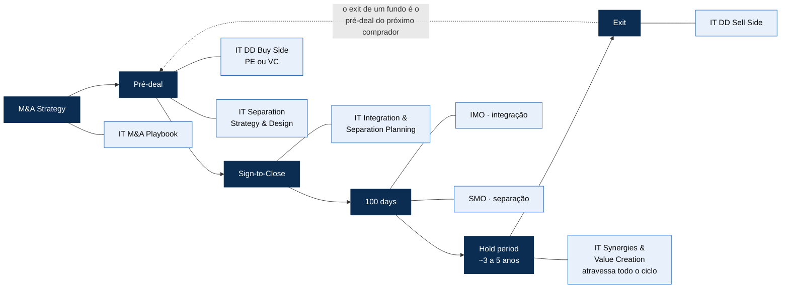
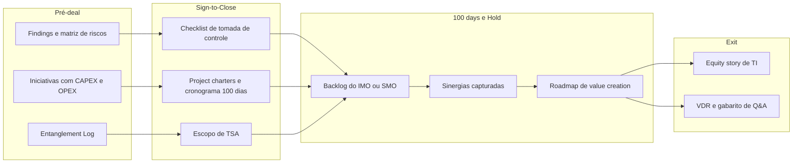
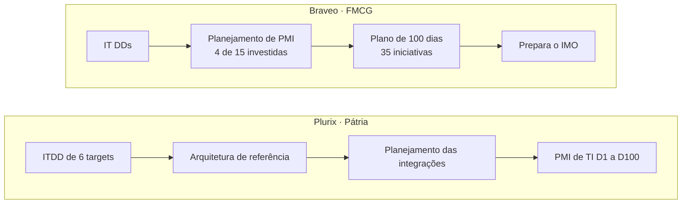

# A jornada do deal: onde a TI cria ou destrói valor

> **Ideia central 💡:** o cliente não compra "ofertas". Ele atravessa um deal, da tese ao exit. A cada fase muda a pergunta que tira o sono do decisor, e a A&M tem uma resposta de TI para cada uma. O valor está nas **passagens de bastão**: o que a DD descobre vira o plano do Day 1, que vira o backlog do IMO, que vira a equity story do exit.

Fontes: 📘 Deck Comercial (ciclo "A&M é M&A", seções por oferta e cases) e 🗂️ slides. Leituras 💡 são análise deste repositório.

---

## 1. O ciclo em uma imagem

Ciclo e posicionamento das ofertas conforme o slide 📘🗂️ "A&M é M&A". O IMO e o SMO se estendem de "100 days" até o "Hold period".

## 2. Fase a fase

| Fase | A pergunta do decisor 💡 | Oferta(s) A&M 📘 | Momento de entrada indicado no deck 📘 | O que passa adiante 💡 |
|---|---|---|---|---|
| **M&A Strategy** | "Minha TI está pronta para fazer M&A de forma recorrente?" | IT M&A Playbook | Não informado | Método, ferramentas e checklist de tomada de controle do próprio cliente |
| **Pré-deal** | "Que riscos de TI mudam o preço e o plano deste deal?" | IT DD Buy Side (PE ou VC) · IT Separation Strategy & Design | DD: no pré-deal, **até 6 semanas** (VC On Demand: 2 a 3 semanas). Separation S&D: **início recomendado no pré-deal** | Findings, matriz de riscos, iniciativas com CAPEX/OPEX · Entanglement Log, cenários To-Be, escopo de TSA |
| **Sign-to-Close** | "Como chego ao Day 1 sem ruptura e com o valor endereçado?" | IT Integration & Separation Planning (Day 1 & 100-Day) | **Entre Signing e Closing**, o "melhor momento para planejar" | Checklist de tomada de controle, project charters, cronograma de 100 dias, RACI, transição para IMO ou SMO |
| **100 days** | "Como capturo as sinergias de TI no menor tempo?" | IMO (integração) · SMO (separação) | A partir do **Closing**: estabilização e depois captura de sinergias | Sinergias capturadas, maturidade de TI elevada, NewCo operando *standalone* |
| **Hold period** | "Como a TI multiplica o valor do ativo durante o investimento?" | IT Synergies & Value Creation · IMO/SMO em continuidade | Ao longo do ciclo de investimento | Roadmap de value creation, KPIs de TI do ativo |
| **Exit** | "Como vendo pelo melhor valor, sem surpresas na diligência?" | IT DD Sell Side (Vendor DD) | **De 1 a 2 anos antes** (transformação), **6 meses antes** (mitigar riscos) ou **na diligência** (prontidão) | Checklist e evidências, roadmap, VDR e gabarito de Q&A, macroplan de separação |

## 3. O fio de ouro: os artefatos que atravessam o deal 💡

Cada oferta produz um artefato que é **matéria-prima da seguinte**. O desenho abaixo junta os entregáveis citados no deck 📘 numa cadeia contínua. A cadeia em si é a leitura 💡.

**Evidência no próprio deck 📘:**

- **Virutex Ilko:** a IT DD mapeou **17 iniciativas** para endereçar riscos e oportunidades, "sendo eles base para o plano de integração". É a passagem DD → Planning.
- **Braveo:** "O planning do PMI é um acelerador das demais aquisições no modelo de Rollout e **prepara o IMO**". É a passagem Planning → IMO.
- **IT Integration & Separation Planning:** a etapa *Consolidar* prevê explicitamente a "transição para o IMO ou SMO".
- **IMO:** executa "as iniciativas mapeadas na diligência e no IT Day 1 & Day 100 Plan".

> **Achado 💡:** o deck descreve as passagens, mas cada oferta usa **sua própria taxonomia de dimensões** (ver [reconciliação, seção 4](06-reconciliacao-de-fontes.md)). Unificar essa taxonomia é o que transformaria a cadeia em um fluxo sem retrabalho.

## 4. Três cases, três jornadas completas 📘

Os cases mais fortes do deck são justamente os que **atravessam várias fases**, ou seja, provas de pull-through.

| Case | Contexto | Jornada A&M | Fases cobertas |
|---|---|---|---|
| **Plurix** | Holding do Pátria Investimentos com foco no varejo regional | ITDD de **6 targets** → arquitetura de referência da tese → planejamento das integrações → PMI de TI entre o **D1 e o D100** | Pré-deal → Sign-to-Close → 100 days |
| **Braveo** | Tese de distribuição indireta de FMCG (15 investidas) | Desenho da arquitetura, IT DDs e planejamento de PMI de **4 das 15 investidas**. **35 iniciativas** de 2 investidas no plano de 100 dias | Pré-deal → Sign-to-Close → 100 days (em rollout) |
| **Invepar / Mubadala** | Carve-out de ativos de mobilidade com criação da NewCo **Hmobi** | Diagnóstico, cenários de separação, landscape de TI futuro e plano de transição. Mais de 67 entanglements mapeados | Pré-deal → Sign-to-Close |

Há outros cases de oferta única no deck: CERC (IT DD para possível investimento do Mubadala Capital), Virutex Ilko (IT DD) e Mubadala/UniFTC (Separation S&D, com mais de 50 entanglements). As descrições do case Invepar diferem entre duas seções do deck; ver [reconciliação, D4](06-reconciliacao-de-fontes.md).

## 5. Quem está do outro lado da mesa 💡

| Persona | Momento em que decide | O que valoriza | Porta de entrada natural |
|---|---|---|---|
| **Deal team de PE** | Pré-deal | Velocidade, red flags que mexem no preço, insumo para o modelo | IT DD Buy Side |
| **Operating partner / value creation de PE** | Hold period | EBITDA, sinergias capturadas, portfólio comparável | IT Synergies & Value Creation |
| **Time de investimento de VC / CVC** | Pré-deal | Produto, escalabilidade, defesa tecnológica | IT DD Buy Side, variante VC |
| **CEO, CFO e CIO de corporate adquirente** | Strategy → 100 days | Continuidade no Day 1, sinergias prometidas ao board | Playbook · I&S Planning · IMO |
| **Vendedor (fundo em saída ou corporate em desinvestimento)** | 1–2 anos a 6 meses antes do exit | Valuation protegido, processo sem surpresas | IT DD Sell Side · Separation S&D |
| **Liderança da NewCo** | Closing → standalone | Operar sozinha, sair do TSA no prazo | SMO |
| **CIO e time de TI do alvo** | Durante toda a diligência | Não ser exposto, ter suas conquistas reconhecidas | Sell Side (preparação) |

## 6. O custo de entrar tarde 📘

O deck quantifica o risco de não planejar:

- **"Empresas que não realizam o planejamento adequado de seus M&As podem gastar de 2 a 3 vezes mais com TI ao final do processo"**, além de aumentar os riscos de cibersegurança, perda de talentos, danos à imagem e ruptura de negócios.
- Três cenários de timing do planejamento de I&S:

| Quando o planejamento acontece | Consequência descrita no deck |
|---|---|
| **Entre Signing e Closing** | Melhor momento: antecipa problemas, tomada de decisão e geração de valor. Cronograma consolidado e executável no Day 1 |
| **No Closing (Day 1)** | Planejamento e execução começam junto com a tomada de controle. As incertezas aumentam o risco, a complexidade e os custos |
| **Pós-Closing** | Tomada da operação sem planejamento gera *distressed projects*, retrabalho, custo maior, mais risco e atrasos |

- No contexto de M&A, o deck afirma que mais de 50% dos esforços de integração de uma fusão ou aquisição estão em TI (leitura da extração do slide "Importância da TI em M&A").

> **Implicação comercial 💡:** o argumento "2 a 3 vezes mais caro" vale para **todas** as ofertas de entrada precoce (Playbook, Separation S&D, Sell Side com 1–2 anos de antecedência), não só para o Planning. Vale torná-lo a espinha da narrativa comercial.

## 7. Momentos da verdade 💡

| Momento | O que o cliente sente | O que a A&M precisa garantir |
|---|---|---|
| **Abertura do data room** | Urgência e opacidade | Data request inteligente e leitura rápida dos riscos (DD em até 6 semanas) |
| **Signing** | Compromisso irreversível com uma tese | O CAPEX e o OPEX de TI estão no modelo; nenhuma surpresa material |
| **Day 1** | Medo de ruptura: "comprar, faturar, atender, acessar" | Checklist de tomada de controle 100% cumprido |
| **Day 100** | Cobrança do board pelas sinergias | Painel de sinergias e riscos do IMO |
| **Saída do TSA** | Autonomia da NewCo | Entanglements resolvidos, sem custos órfãos |
| **Exit** | Medo de desconto no valuation | Evidências, roadmap e gabarito de Q&A prontos |

Os desafios holísticos de M&A listados no deck 📘 (como "evitar business disruption", "estar preparado para o Day 1" e "capturar sinergias") estão detalhados em [contexto e proposta de valor](01-contexto-e-proposta-de-valor.md).
