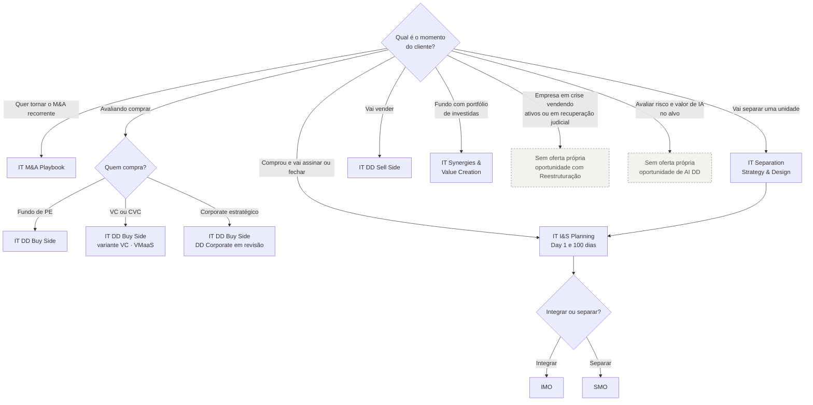

# Catálogo de ofertas IT M&A (as-is)

> Visão comparativa das 8 ofertas do portfólio atual, numa página. Para o detalhe de cada uma, abra o dossiê em [`ofertas/`](../ofertas/). Para a proposta de evolução, veja [estratégia e portfólio 2027](07-estrategia-e-inovacao.md).

Fontes: 📘 Deck Comercial (seções por oferta) · 🗂️ slides "A&M é M&A" e "Status das Ofertas". Leituras 💡 são análise deste repositório.

---

## 1. Mapa oferta × fase do ciclo 🗂️

| Oferta | M&A Strategy | Pré-deal | Sign-to-Close | 100 days | Hold | Exit | Readiness |
|---|:---:|:---:|:---:|:---:|:---:|:---:|---:|
| [IT M&A Playbook](../ofertas/01-it-ma-playbook.md) | ● | | | | | | 2,7 → 3,7 |
| [IT Due Diligence (Buy Side)](../ofertas/02-it-due-diligence-buy-side.md) | | ● | | | | | 4,5 → 4,7 |
| [IT Separation Strategy & Design](../ofertas/03-it-separation-strategy-design.md) | | ● | | | | | 3,6 → 4,1 |
| [IT Integration & Separation Planning](../ofertas/04-it-integration-separation-planning.md) | | | ● | | | | 4,0 → 4,3 |
| [IT Integration Management Office](../ofertas/05-it-integration-management-office.md) | | | | ● | ● | | 3,5 → 4,0 |
| [IT Separation Management Office](../ofertas/06-it-separation-management-office.md) ~~(tachada)~~ | | | | ● | ● | | 3,9 → 4,3 |
| [IT Vendor Due Diligence (Sell Side)](../ofertas/07-it-due-diligence-sell-side.md) | | | | | | ● | 2,7 → 3,7 |
| [IT Synergies & Value Creation](../ofertas/08-it-synergies-value-creation.md) | ● | ● | ● | ● | ● | ● | 2,3 → 3,3 |

## 2. Ficha comparativa 📘

| Oferta | Objetivo segundo o deck | Método (etapas) | Dimensões avaliadas | Entregáveis-chave | Momento / prazo | Modelo comercial | Cases no deck |
|---|---|---|---|---|---|---|---|
| **Playbook** | Desenvolver a TI do cliente com ferramentas e padrões para todo o ciclo de M&A | Compreender → Definir → Acompanhar\* → Preparar | 3 áreas de foco: DD · Plano de I&S · Escritório de I&S | Ferramentas de DD, template de data request, modelos financeiros, checklist de tomada de controle, plano de treinamento | Não informado | Não informado | Nenhum |
| **DD Buy Side** | Mapear o As-Is, identificar riscos e oportunidades e recomendar iniciativas | Compreender → Capturar & Avaliar → Recomendar | 6 competências: Pessoas, Governança, Segurança, Infraestrutura, Sistemas, Digital. VC: 9 módulos | Findings, matriz de riscos, maturidade, iniciativas com CAPEX/OPEX (worst/base/best) | Pré-deal · **até 6 semanas** (VC: 2 a 3 semanas) | Profundidade sob medida (níveis 1–3). VC: **VMaaS** On Demand **R$ 35k/semana**, Package, Full Cycle | CERC · Virutex Ilko · Braveo |
| **Separation S&D** | Estratégia de TI da separação sem ruptura operacional | Compreender → Capturar & Avaliar → Definir (As-Is → Entanglement Log → To-Be) | Pessoas, Processos, Aplicações, Infraestrutura, Governança | Entanglement Log, heatmap de riscos, suporte ao TSA, inventário de aplicações, TOM da NewCo, custos one-time e stranded | Início recomendado no pré-deal | Não informado | Mubadala/UniFTC (50+ entanglements) · Mubadala/Invepar (67+) |
| **I&S Planning** | Planejar a integração ou separação com foco nos 100 primeiros dias | Descobrir → Planejar → Desenvolver → Recomendar → Consolidar | Pessoas, Processos, Aplicações, Infraestrutura, Governança | Checklist de Day 1, project charters, cronograma de 100 dias, RACI, heatmap de pessoas, transição para IMO/SMO | **Entre Signing e Closing** | Não informado | Plurix · Braveo · Invepar |
| **IMO** | Capturar as fontes de valor da integração | Executar · Capturar · Gerir | Estabilização → Captura de sinergias | Execução do roadmap, sinergias, maturidade de TI, gestão da mudança | A partir do Closing: 100 dias e hold | Não informado | Nenhum na seção |
| **SMO** | Separar e transicionar a TI para a NewCo | Não detalhado no trecho extraído | Não detalhado | Resolução de entanglements, políticas da NewCo (descrição oficial) | 100 dias e hold | Não informado | Nenhum |
| **Sell Side** | Preparar a TI para a venda, com máxima valorização e prontidão | Descoberta → Preparação → Aconselhamento | Organização, Estratégia & Governança, Aplicações, Infraestrutura, Segurança | Checklist de tecnologia, evidências, roadmap, gestão do VDR, gabarito de Q&A, macroplan de separação | **1–2 anos antes**, **6 meses antes** ou **na diligência** | Não informado | Nenhum |
| **Synergies & Value Creation** | Advisor de tecnologia do fundo de PE em todo o ciclo de investimento | Não detalhado no trecho extraído | Não detalhado | Não detalhado | Todo o ciclo | Não informado (o VMaaS da DD VC é o modelo mais próximo 💡) | Nenhum |

\* Acompanhar é marcado no deck como "recomendável".

## 3. Qual oferta para qual situação 💡

Árvore de decisão para quem vende. Os nós tracejados indicam situações para as quais **não há oferta própria** hoje.

## 4. Padrões e assimetrias do portfólio 💡

| Padrão | Evidência | Implicação |
|---|---|---|
| **Método em três tempos** | DD e Separation S&D usam *Compreender → Capturar & Avaliar → Recomendar/Definir* | Há uma gramática comum que pode virar padrão de toda a service line |
| **Cinco taxonomias para a mesma TI** | DD (6), DD VC (9), Separation S&D e I&S Planning (5), Sell Side (5 diferentes) | Retrabalho nas passagens de bastão (ver [reconciliação](06-reconciliacao-de-fontes.md)) |
| **Preço explícito só em uma variante** | Apenas a DD VC traz modelo comercial (R$ 35k/semana, pacotes, as-a-service) | As demais ofertas não têm âncora comercial no material |
| **Prazo explícito só na diligência** | "Até 6 semanas" (DD) e "2–3 semanas" (VC) | Os escopos de execução (IMO/SMO) não têm duração de referência |
| **Cases concentrados no miolo** | Cases em DD, Separation S&D e I&S Planning; nenhum em Playbook, Sell Side, IMO, SMO e Value Creation | As ofertas sem case são as de menor readiness (ver [readiness](04-readiness-e-portfolio.md)) |
| **Recorrência só desenhada no VC** | Os modelos VMaaS Package e Full Cycle são assinaturas | O único modelo recorrente está numa variante tachada; Value Creation, a oferta "as a service", não tem modelo comercial |
