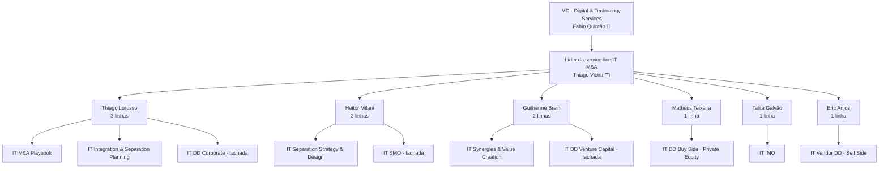
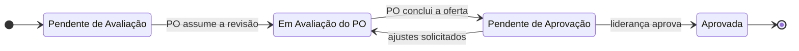

# Governança da service line IT M&A

> Quem cuida de cada oferta, como a maturidade é aprovada e onde a capacidade está concentrada.
> Fonte: slide 🗂️ "Status das Ofertas – IT M&A" e 📘 Deck Comercial (MD da prática). Leituras 💡 são análise deste repositório.
> ⚠️ **O próprio slide avisa: "POs e Membros serão reajustados".** Esta é uma fotografia, não a estrutura definitiva.

---

## 1. Estrutura

## 2. Matriz oferta × PO × squad 🗂️

| Código | Oferta (nome no slide de status) | PO | Squad | Readiness | Status |
|---|---|---|---|---:|---|
| ITMA-01 | IT M&A Playbook | Thiago Lorusso | Glaucea N, Tatiane N | 2,7 → 3,7 | não preenchido |
| ITMA-03 | IT Separation Strategy & Design | Heitor Milani | Marcela B | 3,6 → 4,1 | não preenchido |
| ITMA-02 | IT Due Diligence (Private Equity) | Matheus Teixeira | Julio F | 4,5 → 4,7 | não preenchido |
| ITMA-04 | IT Integration & Separation Planning | Thiago Lorusso | Marcela B | 4,0 → 4,3 | não preenchido |
| ITMA-05 | IT Integration Management Office | Talita Galvão | Tatiane N, Guilherme C | 3,5 → 4,0 | não preenchido |
| ITMA-06 | ~~IT Separation Management Office~~ | Heitor Milani | Guilherme C | 3,9 → 4,3 | não preenchido |
| ITMA-07 | IT Vendor Due Diligence | Eric Anjos | João M, Luana G | 2,7 → 3,7 | não preenchido |
| ITMA-08 | IT Synergies & Value Creation | Guilherme Brein | Giovanna B, Alexandre B | 2,3 → 3,3 | não preenchido |
| ITMA-09 | ~~IT Due Diligence (Corporate)~~ | Thiago Lorusso | Victor F, Thais M | 3,2 → 3,9 | não preenchido |
| ITMA-10 | ~~IT Due Diligence (Venture Capital)~~ | Guilherme Brein | Tatiane N, Thais M | 2,5 → 3,5 | não preenchido |

A ordem é a do slide original. ~~Tachado~~ = linha tachada no slide.

## 3. Fluxo de aprovação de uma oferta

O slide traz quatro status na legenda 🗂️. A sequência abaixo é a leitura lógica 💡 desses status:

> **Na versão analisada, a coluna "Status" está vazia em todas as linhas**: nenhuma oferta tinha status registrado. 🗂️

## 4. Leitura de capacidade 💡

### 4.1 POs: carga e esforço do FY

| PO | Nº de linhas | Linhas tachadas | Gap de readiness sob responsabilidade | % do esforço do FY |
|---|:---:|:---:|---:|---:|
| Thiago Lorusso | 3 | 1 | 2,0 | 30% |
| Guilherme Brein | 2 | 1 | 2,0 | 30% |
| Eric Anjos | 1 | 0 | 1,0 | 15% |
| Heitor Milani | 2 | 1 | 0,9 | 14% |
| Talita Galvão | 1 | 0 | 0,5 | 8% |
| Matheus Teixeira | 1 | 0 | 0,2 | 3% |

### 4.2 Squads: quem está em quantas frentes

| Pessoa | Nº de squads | Ofertas | Leitura |
|---|:---:|---|---|
| Tatiane N | 3 | Playbook · IMO · ~~DD VC~~ | Maior multialocação da service line |
| Marcela B | 2 | Separation S&D · Integration & Separation Planning | Alocação coerente: ofertas vizinhas no ciclo |
| Guilherme C | 2 | IMO · ~~SMO~~ | Coerente: os dois "management offices" |
| Thais M | 2 | ~~DD Corporate~~ · ~~DD VC~~ | **100% alocada em linhas tachadas** |
| Victor F | 1 | ~~DD Corporate~~ | **100% alocado em linha tachada** |
| Glaucea N · Julio F · João M · Luana G · Giovanna B · Alexandre B | 1 cada | uma oferta cada | Dedicação exclusiva |

São 11 pessoas distintas em 16 posições de squad.

### 4.3 O que os números dizem

1. **Concentração:** dois POs carregam 61% do esforço de evolução do ano (ver [readiness e portfólio](04-readiness-e-portfolio.md), seção 6).
2. **Capacidade "presa" em linhas tachadas:** duas pessoas (Thais M e Victor F) estão alocadas só em linhas tachadas. Se essas linhas forem consolidadas na DD Buy Side, essa capacidade fica livre para as apostas de construção (Playbook, Vendor DD e Value Creation).
3. **Squads de uma pessoa** na oferta-âncora (DD Buy Side: só Julio F) e em Separation S&D (só Marcela B) criam risco de "pessoa-chave" justamente nas ofertas mais maduras.
4. **Afinidades naturais:** as squads já se agrupam por família (separação, management office). Isso sugere organizar a service line por **família de ofertas**, não por oferta isolada.

## 5. Proposta de modelo de governança 💡

| Papel | Responsabilidade | Ritual |
|---|---|---|
| **MD DTS** (sponsor) | Prioridades do portfólio e investimento em ativos | Revisão semestral do portfólio |
| **Líder da service line** | Meta de readiness, aprovação das ofertas e alocação de POs | Comitê mensal de readiness (30 min) |
| **PO da oferta** | Readiness da oferta, roadmap de ativos, cases e preço | Atualização mensal no `data/ofertas.yaml` |
| **Squad** | Produção de ativos: templates, metodologia, materiais | Sprints quinzenais |
| **Repositório** (este) | Fonte única da verdade e painel | `scripts/catalogo.py validar` a cada mudança |

**Princípio:** readiness só sobe com **evidência** (ver a rubrica proposta em [readiness e portfólio](04-readiness-e-portfolio.md), seção 7). O status "Aprovada" exige que a rubrica do nível declarado esteja cumprida.
