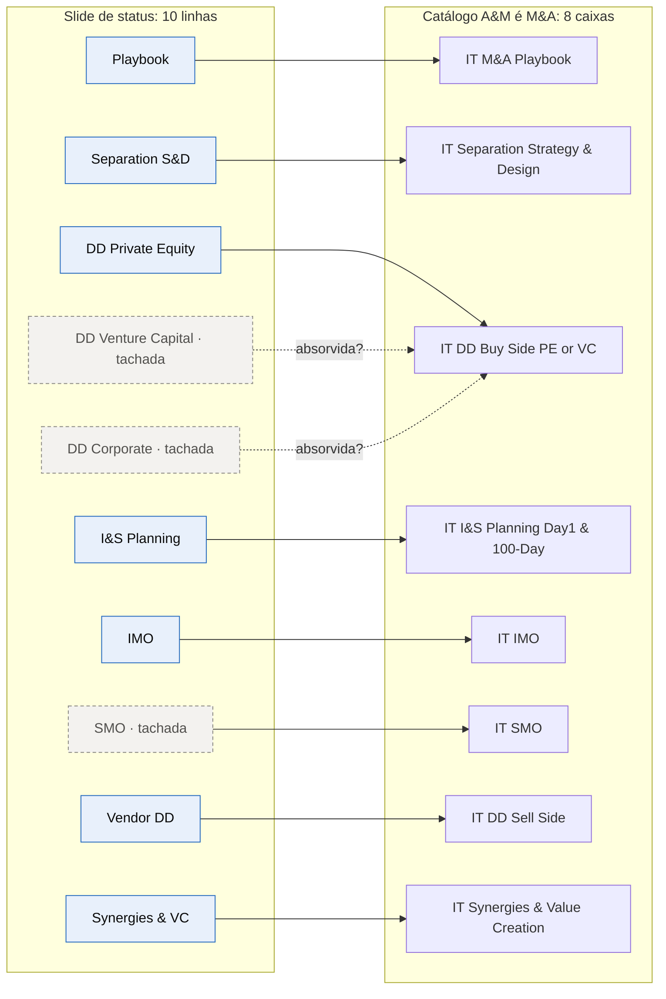

# Reconciliação de fontes

> As três fontes analisadas (📘 Deck Comercial, 🗂️ slide "A&M é M&A" e 🗂️ slide "Status das Ofertas") **não contam exatamente a mesma história**. Este documento registra cada divergência, a leitura adotada no repositório e a pergunta que precisa ser fechada com a liderança da service line.

---

## 1. Quantas ofertas existem?

| Visão | Nº | O que conta |
|---|:---:|---|
| Slide de status 🗂️ | **10 linhas** | 7 ativas + 3 tachadas |
| Slide/catálogo "A&M é M&A" 🗂️📘 | **8 caixas** | Inclui o SMO, que está tachado no status |
| Deck Comercial, seções detalhadas 📘 | **6 seções** | Playbook · Separation S&D · DD Buy Side (PE e VC) · DD Sell Side · I&S Planning · IMO |
| **Leitura adotada neste repositório** | **8 ofertas + 2 variantes** | As 8 caixas do catálogo são as ofertas. DD Corporate e DD Venture Capital são variantes da DD Buy Side, em revisão |

## 2. Tabela de equivalência de nomes

| ID no repositório | Slide de status 🗂️ | Catálogo "A&M é M&A" 🗂️ | Título da seção no deck 📘 |
|---|---|---|---|
| `it-ma-playbook` | IT M&A Playbook | IT M&A Playbook | IT M&A Playbook |
| `it-due-diligence-buy-side` | IT Due Diligence (Private Equity) | IT Due Diligence (Buy Side) PE or VC | IT Due Diligence (Buy Side) · IT DD Buy Side · IT Due Diligence (Buy Side VC) |
| `it-separation-strategy-design` | IT Separation Strategy & Design | IT Separation Strategy & Design | IT Separation Strategy & Design |
| `it-integration-separation-planning` | IT Integration & Separation Planning | IT Integration & Separation Planning (Day1-&100-Day) | Integration & Separation Planning · IT Day 1 & 100 Day Planning |
| `it-integration-management-office` | IT Integration Management Office | IT Integration Management Office (IMO) | IT Integration Management Office (IMO) |
| `it-separation-management-office` | ~~IT Separation Management Office~~ | IT Separation Management Office (SMO) | *sem seção no trecho extraído* |
| `it-due-diligence-sell-side` | IT Vendor Due Diligence | IT Due Diligence (Sell Side) | IT Due Diligence (Sell Side) · IT Sell Side Due Diligence |
| `it-synergies-value-creation` | IT Synergies & Value Creation | IT Synergies & Value Creation (Value Creation as a Service) | *sem seção no trecho extraído* |
| `it-due-diligence-corporate` | ~~IT Due Diligence (Corporate)~~ | *sem caixa* | *sem seção* |
| `it-due-diligence-venture-capital` | ~~IT Due Diligence (Venture Capital)~~ | *(dentro de "PE or VC")* | IT Due Diligence (Buy Side VC), julho/2023 |

## 3. Registro de divergências

| # | Divergência | Onde | Leitura adotada | Pergunta para a liderança |
|---|---|---|---|---|
| D1 | **Três linhas tachadas** no status, sem legenda que explique o tachado | Slide de status | "Em revisão": consolidação ou descontinuação ainda não formalizada | O tachado significa consolidação, descontinuação ou pausa? |
| D2 | **SMO tachado no status, mas presente no catálogo** do cliente | Status × catálogo | O SMO continua sendo vendido, mas a gestão dele como oferta própria está em revisão (possível fusão com o IMO num "Transaction Management Office") | O SMO será fundido ao IMO? |
| D3 | **DD Corporate** não tem caixa no catálogo, que fala em "PE or VC" | Status × catálogo | Corporates (compradores estratégicos) são atendidos pela DD Buy Side | Corporates ficam fora do posicionamento da DD? É intencional? |
| D4 | **Case Invepar descrito de dois jeitos**: "MetroRio e LAMSA" (carve-out entre Mubadala e Invepar) na seção de Separation S&D e "MetroRio e MetroBarra" (preparação do carve-out de TI da Invepar) na seção de I&S Planning. As duas citam a NewCo **Hmobi** | Deck, duas seções | Os dossiês reproduzem cada versão na sua seção e sinalizam a diferença | Qual é a descrição correta e aprovada do case? |
| D5 | **Nome do índice de maturidade:** "Readiness" (status) × escalas diferentes nas ofertas (DD sob medida 1–3; maturidade de TI 0–5 "Caótico → Transformador"; maturidade digital em 4 estágios; governança "Atende / Parcialmente / Não atende") | Status × deck | Readiness mede a **oferta**; as demais escalas medem o **cliente** | Unificar as escalas de diagnóstico do cliente? (ver seção 4) |
| D6 | **O ciclo tem 6 fases no slide geral e 5 nas réguas internas** das seções (a régua por oferta não mostra "M&A Strategy") | Deck | 6 fases, conforme o slide "A&M é M&A" | n/a |
| D7 | **"Value Creation as a Service" (catálogo) × "VMaaS / Value Management Office" (DD VC)** | Catálogo × deck | Conceitos vizinhos; a ligação é 💡 análise | O VMaaS é o modelo comercial do Value Creation as a Service? |
| D8 | **Datas:** capa JAN/2023 × seção VC de julho/2023; o status é do FY corrente | Deck × status | O deck é a base metodológica; o status é a foto de maturidade atual | Existe versão mais recente do deck? |
| D9 | **Cobertura da extração:** o texto extraído termina na seção do IMO | Deck | SMO e Synergies & VC são documentados com a descrição oficial e menções esparsas, sinalizadas nos dossiês | O deck "Full v7" tem seções de SMO e Synergies? |
| D10 | **Coluna "Status" vazia** e **coluna "Peso"** sem pesos efetivos (o índice é média simples) | Slide de status | O índice é tratado como média simples | Haverá ponderação? Ver [readiness](04-readiness-e-portfolio.md) |
| D11 | **Ordem das etapas do Playbook:** numeração 01 Compreender, 02 Definir, 03 Acompanhar\*, 04 Preparar, sendo o Acompanhar "recomendável" | Deck | Mantida a numeração do deck; o dossiê comenta a sequência lógica | n/a |
| D12 | **Logos de clientes** com a nota "Validar c/ Quintão" | Deck, slide Clientes | Clientes citados só quando aparecem em cases com texto | Quais logos estão liberados para uso comercial? |

## 4. Achado transversal 💡: cinco taxonomias para o mesmo objeto

Cada oferta descreve "a TI do cliente" com um conjunto próprio de dimensões:

| Oferta | Dimensões usadas 📘 |
|---|---|
| DD Buy Side | Pessoas · Governança · Segurança · Infraestrutura · Sistemas · Digital (6 competências) |
| DD Buy Side VC | Ativos tecnológicos · Mercado · Escalabilidade · Estratégia · Defesa · Planejamento · Governança · Value Management Office · Produto (9 módulos) |
| Separation Strategy & Design | Pessoas · Processos · Aplicações · Infraestrutura · Governança (5 dimensões) |
| I&S Planning | Pessoas · Processos · Aplicações · Infraestrutura · Governança (5 dimensões) |
| DD Sell Side | Organização · Estratégia & Governança · Aplicações · Infraestrutura · Segurança (5 dimensões) |

**Por que isso importa:** o achado da DD (por exemplo, em "Sistemas") precisa ser retraduzido para "Aplicações" no planejamento, e o vendedor (Sell Side) organiza a informação de um jeito diferente do comprador (Buy Side). Uma **taxonomia única de TI em M&A**, um "fio de ouro" do deal, permitiria:

1. **Pull-through automático:** os achados da DD viram backlog do Day 1/Day 100 sem retrabalho.
2. **Benchmark entre deals:** comparar alvos e medir sinergias realizadas contra as prometidas.
3. **Base para IA:** um modelo de dados comum é pré-requisito para um copiloto de DD e para a "memória de deals" (ver [estratégia e inovação](07-estrategia-e-inovacao.md)).

Proposta de taxonomia-mãe 💡: **Pessoas & Organização · Processos & Governança · Aplicações & Dados · Infraestrutura & Cloud · Segurança & Compliance · Digital & Produto**. Cada oferta usa um recorte dessa base, sem renomear as dimensões.
