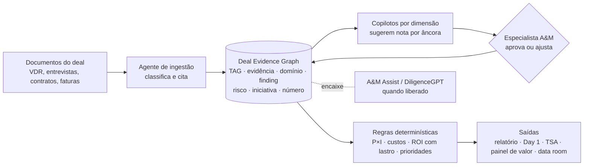
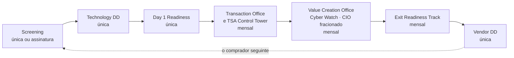
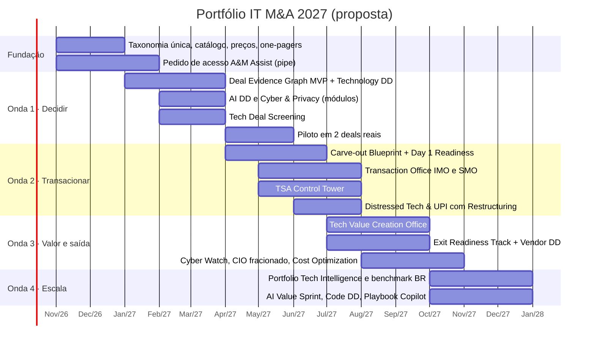

# Estratégia e portfólio 2027: o que mudar, o que melhorar e o que criar

> **Resposta curta 💡: dá para fazer os dois, e o mercado já mostra o caminho.** As 8 ofertas atuais cobrem o ciclo inteiro do deal, mas são vendidas como **horas de consultoria, uma por uma**. Em 2027, a DTS deve:
> 1. **reformular** as 8 ofertas em **4 linhas de produto** com escopo, prazo e preço padronizados;
> 2. **criar 10 produtos e módulos novos**, **6 deles com receita mensal**;
> 3. apoiar tudo num **motor único de evidências com IA** (desenhado do zero, com encaixe para o A&M Assist / DiligenceGPT da firma global).
>
> O alvo são as fatias em que a A&M tem direito de vencer: **fundos de PE mid-market, carve-outs e situações especiais**.

Selos: 📘 fonte interna (deck, slides, skills) · ✅/🔎 fato de mercado (ver [benchmark](09-benchmark-de-mercado.md)) · 💡 proposta deste documento (estratégia, estimativa ou hipótese a validar).

---

## 1. Diagnóstico em cinco frases

1. **O portfólio é completo, mas o produto é fraco.** A DTS cobre as 6 fases do deal 📘, mas só a DD tem prazo definido e só a variante VC tem preço; Playbook, Vendor DD e Value Creation não têm cases e estão em readiness 2,3–2,7 📘 ([readiness](04-readiness-e-portfolio.md)).
2. **A área perdeu espaço porque o foco foi para o TMO** (leitura do usuário). Com isso o *front-end* do M&A (diligência, venda e valor) ficou sem investimento, enquanto o mercado se industrializava.
3. **O mercado industrializou o M&A com IA em 2025–2026.** Deloitte M&A Platform, PwC + Palantir, EY OneEdge, McKinsey myIMO e KPMG com Anthropic ✅. Também dividiu a "tecnologia" em módulos (AI, Cyber, Software & Code, Data) e passou a buscar receita recorrente 🔎.
4. **A DTS tem um ativo escondido: um método de diligência de rigor raro.** A esteira das 18 skills separa "não recebido" de "não existe", dá nota por âncoras e rastreia TAG → evidência → número 📘. Mas as peças não se integram e falta o módulo de IA no alvo ([engenharia](10-engenharia-e-modelo-semantico-da-diligencia.md)).
5. **No Brasil a janela está aberta.** Fundos fazem 50% dos deals ✅ e a recuperação judicial bateu recorde ✅. As páginas locais das Big Four não mostram ferramentas de IA para M&A 🔎. Quem industrializar primeiro aqui define o padrão.

## 2. Norteadores 2027

| # | Norteador | O que significa na prática |
|---|---|---|
| **N1** | **De serviço a produto** | Toda oferta ganha um "kit": módulos, prazo, entregáveis-padrão, preço de referência e KPIs. Produtizar os 80% repetíveis e customizar os 20% que fazem diferença |
| **N2** | **Um fio de ouro do deal** | Uma taxonomia (as 8 dimensões A&M) e um grafo de evidências que acompanham o cliente da triagem ao exit. Cada finding vira item do Day 1, que vira backlog do IMO, que vira KPI de valor, que vira linha do data room do exit |
| **N3** | **IA em dois sentidos** | IA para **fazer** (acelerar a esteira com citação e revisão humana) e IA como **objeto** (avaliar a IA da empresa-alvo e o risco de disrupção por IA) |
| **N4** | **Do evento à recorrência** | Cada oferta pontual ganha uma "cauda" mensal: monitoramento, controle de TSA, prontidão para venda, CIO fracionado, escritório de valor |
| **N5** | **Jogar com o time global** | Plugar A&M Assist / DiligenceGPT, Global Cyber Risk, PEPI, AI-ZBO, Restructuring e Interim Leadership 🔎✅. A DTS entra com método local, execução, português, LGPD e dados brasileiros |
| **N6** | **O TMO vira vantagem, não concorrente** | A execução hands-on que o TMO desenvolveu é o diferencial contra plataformas: "da diligência à execução, com o mesmo time". Clientes de TMO são canal natural para separação, TSA e valor |
| **N7** | **Evidência acima de narrativa** | Vender auditabilidade: todo número com lastro (N1/N2/N3), toda conclusão com fonte. Isso reduz exclusões em seguro R&W e aumenta a confiança do comitê |
| **N8** | **Medir para vender** | Publicar benchmarks proprietários brasileiros (razão de TI, custo total real, maturidade, cyber), no modelo dos relatórios da Kroll e do TechIndicators da Crosslake 🔎. É geração de demanda e barreira de entrada |

## 3. Arquitetura do portfólio 2027

```mermaid
flowchart LR
    subgraph L1["1 · DECIDIR · pré-deal"]
      a1["Tech Deal Screening"]
      a2["Technology Due Diligence<br/>IT · Cyber & Privacy · Software & Code · Data & AI"]
    end
    subgraph L2["2 · TRANSACIONAR · sign-to-close e 100 dias"]
      b1["Carve-out & Separation Blueprint"]
      b2["Day 1 & 100-Day Readiness"]
      b3["Transaction Office<br/>IMO · SMO"]
      b4["TSA Control Tower"]
    end
    subgraph L3["3 · CRIAR VALOR · hold"]
      c1["Tech Value Creation Office"]
      c2["Portfolio Cyber Watch"]
      c3["Fractional / Interim CIO-CTO-CAIO"]
      c4["Cost, License & Cloud Optimization"]
      c5["AI Value Sprint"]
      c6["Portfolio Tech Intelligence"]
    end
    subgraph L4["4 · SAIR · exit"]
      d1["Exit Readiness Track"]
      d2["Technology Vendor DD"]
    end
    subgraph TX["Transversais"]
      t1["M&A Tech Playbook + Copilot<br/>corporates recorrentes"]
      t2["Distressed Tech & UPI<br/>situações especiais, com Restructuring"]
    end
    ENG[("Deal Evidence Graph<br/>motor único com IA<br/>encaixe A&M Assist")]
    L1 --> L2 --> L3 --> L4
    L4 -. "exit de um fundo é o<br/>pré-deal do próximo" .-> L1
    ENG --- L1
    ENG --- L2
    ENG --- L3
    ENG --- L4
```

**Disciplina de nomes 💡:** quatro linhas, nomes **descritivos** e no vocabulário que o mercado já usa ([benchmark, seção 5](09-benchmark-de-mercado.md)). Módulos (AI, Cyber, Code) ficam **dentro** da Tech DD, e não viram marcas soltas. "Deal Evidence Graph" é o motor interno, não um produto vendido.

---

## 4. Tabela A: o que temos e como fica

### 4.1 Visão geral

| # | O que temos hoje | Nome 2027 | Decisão | Sem IA (método) | Com IA (motor) | Receita | Prioridade |
|---|---|---|---|---|---|---|---|
| A1 | IT M&A Playbook | **M&A Tech Playbook + Copilot** | Reformular | Kit por tipo de deal, 3 pacotes e treinamento | Copiloto que responde com base no playbook do cliente e aprende com cada deal | Setup + **mensal** | Onda 4 |
| A2 | IT Due Diligence Buy Side (+ variantes PE, VC e Corporate) | **Technology Due Diligence** (módulos) | Evoluir (carro-chefe) | 3 profundidades × 4 módulos, preço por módulo | Ingestão do VDR, evidências com citação, sugestão de notas, lacunas viram Q&A | Única + **pacote anual para fundos** | **Onda 1** |
| A3 | IT Separation Strategy & Design | **Carve-out & Separation Blueprint** | Reformular e fundir | Catálogo de entanglements por setor e modelo de TSA | Grafo de dependências, leitura de contratos, simulação de cenários e custos | Única → upsell mensal (TSA) | Onda 2 |
| A4 | IT Integration & Separation Planning | **Day 1 & 100-Day Readiness** | Evoluir | Checklist-padrão de 100+ projetos e preço por porte | Plano de Day 1 gerado dos findings, caminho crítico e rascunho de charters | Única | Onda 2 |
| A5 | IT IMO | **Transaction Office: Integration (IMO)** | Evoluir e ferramentar | Método de PMO e painel de sinergias validado por Finanças | Status automático, RAID assistido, alertas e sumário semanal com citações | **Mensal** + bônus por sinergia | Onda 2 |
| A6 | IT SMO (tachada) | **Transaction Office: Separation (SMO)** | Fundir com IMO, não descontinuar | Mesmo método, com foco em NewCo e TSA | Mesmo motor, mais acompanhamento da saída do TSA | **Mensal** | Onda 2 |
| A7 | IT Vendor DD (Sell Side) | **Exit Readiness Track** + **Technology Vendor DD** | Reformular (de relatório para programa) | Programa de 6–24 meses, factbook e checklist de VDR | Verificador de completude do data room, Q&A com citação e "comprador simulado" | **Mensal** + única | Onda 3 |
| A8 | IT Synergies & Value Creation | **Tech Value Creation Office** | Reformular (dar corpo de produto) | Plano de valor por investida, cardápio de alavancas e governança trimestral | Motor de alavancas, previsto × realizado com lastro N1–N3, relatório ao fundo | **Mensal** + por resultado | Onda 3 |

### 4.2 Detalhe por oferta

<b>A1 · IT M&A Playbook → M&A Tech Playbook + Copilot</b>

| Campo | Conteúdo |
|---|---|
| **O que é hoje** 📘 | Método de M&A de TI para o cliente: Compreender → Definir → Acompanhar\* → Preparar. 3 áreas de foco: DD, plano e escritório de integração/separação. Readiness 2,7 → 3,7; sem preço, prazo nem cases |
| **Potencial de melhoria** 💡 | Médio-alto. Playbook em documento virou commodity (a Info-Tech vende blueprint) 🔎. O valor está em **método vivo, usado deal a deal** |
| **Como melhorar sem IA** | Playbook-base por tipo de deal (aquisição, carve-out, fusão); 3 pacotes (Essencial, Completo, Com acompanhamento); trilha de capacitação do time de TI do cliente; 2 cases documentados |
| **Como melhorar com IA** | **Copilot** treinado no playbook do cliente: responde "o que fazer agora", gera checklists por deal e incorpora lições aprendidas após cada transação (a McKinsey faz o mesmo no myIMO ✅) |
| **Nome** | Manter a raiz (o mercado usa *M&A IT Playbook* 🔎) → **M&A Tech Playbook + Copilot** |
| **Formato e receita** | Setup (única) + assinatura anual: copiloto, atualização e horas de suporte (**mensal**) |
| **Para quem** | Corporates com aquisições recorrentes; plataformas de PE em buy-and-build |
| **O que o mercado pede** | Capacidade interna de M&A e redução de dependência de consultoria (o próprio deck usa esse argumento 📘) |

<b>A2 · IT Due Diligence (Buy Side) → Technology Due Diligence (carro-chefe)</b>

| Campo | Conteúdo |
|---|---|
| **O que é hoje** 📘 | DD pré-deal em 6 competências (Pessoas, Governança, Segurança, Infraestrutura, Sistemas, Digital), até 6 semanas, profundidade sob medida. Readiness 4,5, a mais alta. Variantes Corporate e VC tachadas; VMaaS para VC a R$ 35 mil/semana |
| **Potencial** 💡 | **Alto, e defensivo.** A camada documental está sendo automatizada pelos data rooms com IA 🔎. Sem evoluir, a DD vira commodity |
| **Como melhorar sem IA** | Um único produto com **3 profundidades** (*Red Flag* em 1–2 semanas, *Standard* em 3–4, *Deep Dive* em até 6) e **4 módulos** (IT Core · Cyber & Privacy · Software & Code · Data & AI). Saída sempre na linguagem do deal: preço, SPA, Day 1, 100 dias. Reincorporar Corporate e VC como **lentes**, não como produtos |
| **Como melhorar com IA** | **Deal Evidence Graph** ([piloto](12-piloto-tech-dd-com-ia.md)): ingestão e classificação do VDR, mapeamento evidência → domínio com citação, sugestão de nota por âncoras (o especialista aprova), detecção de contradições e lacunas transformadas em perguntas de Q&A, rascunho de findings. O cálculo de risco, custo e ROI fica em regras determinísticas. Encaixe para o A&M Assist |
| **Nome** | **Technology Due Diligence**, com "IT DD" como módulo core. É o termo de PwC ("AI and technology due diligence"), Deloitte UK e Crosslake 🔎 |
| **Formato e receita** | Projeto (única) por profundidade + módulos. Para fundos, um **pacote anual** com N diligências a preço pré-acordado (receita contratada) |
| **Para quem** | PE/VC (50% dos deals no Brasil ✅); corporates estratégicos |
| **O que o mercado pede** | Velocidade, IA no alvo, cyber e tradução em impacto financeiro: KPMG "AI blind spot" 🔎, Deloitte (86% usam GenAI) 🔎 |

<b>A3 · IT Separation Strategy & Design → Carve-out & Separation Blueprint</b>

| Campo | Conteúdo |
|---|---|
| **O que é hoje** 📘 | Estratégia de separação: mapeamento As-Is, Entanglement Log (Major/Minor; Build Duplicate, Rebuild, New Build), cenários To-Be, escopo de TSA. Cases Mubadala/UniFTC e Mubadala/Invepar. Readiness 3,6 |
| **Potencial** 💡 | **Alto.** "2026 é o ano do carve-out": para 40% dos dealmakers, separação de TI e dados é risco material ✅ |
| **Como melhorar sem IA** | Fundir com a parte de separação do Planning num só *blueprint*; catálogo-padrão de entanglements por setor; **modelo de TSA** (serviços, SLA, preço, marcos de saída); custo one-time e stranded padronizado |
| **Como melhorar com IA** | Grafo de dependências a partir de inventário, CMDB, contratos e acessos; leitura de contratos (cessão, change of control, licenças); simulação de cenários com custo e prazo. É o que PwC, KPMG (Carve AI) e SNP já anunciam 🔎 |
| **Nome** | **Carve-out & Separation Blueprint** (o mercado fala em *carve-out*, *separation*, *disentanglement* 🔎) |
| **Formato e receita** | Projeto (única), com upsell natural para o TSA Control Tower (mensal) |
| **Para quem** | Corporates desinvestindo; fundos comprando carve-outs; empresas em RJ vendendo UPIs |

<b>A4 · I&S Planning → Day 1 & 100-Day Readiness</b>

| Campo | Conteúdo |
|---|---|
| **O que é hoje** 📘 | Planejamento entre signing e closing (Descobrir → Planejar → Desenvolver → Recomendar → Consolidar), checklist de tomada de controle, charters e RACI. Cases Plurix, Braveo e Invepar. Readiness 4,0 |
| **Potencial** 💡 | Alto. É a porta para o IMO/SMO, e o deck já quantifica o custo de não fazer ("2 a 3 vezes mais com TI") 📘 |
| **Como melhorar sem IA** | Produto "pronto para o Day 1": checklist-padrão por setor (base de 100+ projetos 📘), cronograma-modelo de 100 dias e preço fixo por porte e complexidade |
| **Como melhorar com IA** | Plano de Day 1 **gerado a partir dos findings da DD** (pull-through via grafo), caminho crítico e dependências automáticos, rascunho de charters. A BCG descreve exatamente esse uso 🔎 |
| **Nome** | **Day 1 & 100-Day Readiness** (integração ou separação): o nome do benefício que o cliente compra |
| **Formato e receita** | Projeto (única) |
| **Para quem** | Compradores após o signing; vendedores com TSA |

<b>A5 e A6 · IMO e SMO → Transaction Office (IMO | SMO)</b>

| Campo | Conteúdo |
|---|---|
| **O que é hoje** 📘 | IMO: executar, capturar e gerir a integração (readiness 3,5). SMO: separação para a NewCo (3,9), **tachado** no slide de status |
| **Potencial** 💡 | Alto, mas é o espaço mais disputado (myIMO, PMI Ignite, Capital Edge, Accenture 🔎). **O diferencial é o DNA de execução do TMO** |
| **Como melhorar sem IA** | Uma oferta única com dois modos. Método de PMO, painel de sinergias com baseline × realizado **validado por Finanças**, rituais de governança e metas contratuais |
| **Como melhorar com IA** | **Control tower**: status lido das ferramentas do cliente (Jira, ServiceNow, planilhas), RAID assistido, alertas de dependência e desvio, sumário executivo semanal com citações, rastreio de sinergias |
| **Nome** | Manter IMO e SMO, que são reconhecidos 🔎, sob o guarda-chuva **Transaction Office** |
| **Formato e receita** | **Mensal** (3 a 12 meses) + componente por sinergia capturada quando contratualmente viável. A McKinsey já tem cerca de 1/4 dos honorários por resultado 🔎 |
| **Para quem** | Compradores em PMI; NewCos de carve-out |
| **Decisão sobre o tachado** | **Não descontinuar o SMO**: separação é o tema do ano ✅. Fundir com o IMO resolve a sobreposição de POs e squads ([governança](05-governanca-service-line.md)) |

<b>A7 · IT Vendor DD → Exit Readiness Track + Technology Vendor DD</b>

| Campo | Conteúdo |
|---|---|
| **O que é hoje** 📘 | Preparação da TI para a venda (Descoberta → Preparação → Aconselhamento), com 5 dimensões, checklist, evidências, roadmap e VDR; entrada de 1–2 anos a 6 meses antes. Readiness 2,7; sem cases |
| **Potencial** 💡 | Alto. Seguradoras de R&W começam a excluir riscos de IA e cyber mal documentados 🔎; o seguro de R&W cresce no Brasil 🔎; fundos precisam de saída com valuation protegido |
| **Como melhorar sem IA** | Separar em dois produtos: **Exit Readiness Track** (programa de 6–24 meses com score trimestral de prontidão, remediação e data room sempre pronto) e **Technology Vendor DD** (relatório independente na hora da venda) |
| **Como melhorar com IA** | Verificador de completude do data room (contra o banco de 96 perguntas 📘 mais as perguntas típicas de comprador); rascunho de respostas de Q&A com citação; **"comprador simulado"**, um agente que procura red flags como o comprador faria |
| **Nome** | **Exit Readiness Track** e **Technology Vendor Due Diligence** (*vendor DD*, *vendor assistance*, *divestiture readiness* 🔎) |
| **Formato e receita** | **Mensal** (track) + única (VDD) |
| **Para quem** | Fundos em saída; corporates desinvestindo; vendedores de UPI em RJ |

<b>A8 · IT Synergies & Value Creation → Tech Value Creation Office</b>

| Campo | Conteúdo |
|---|---|
| **O que é hoje** 📘 | "Advisor de tecnologia do fundo em todo o ciclo" (Value Creation as a Service). Readiness **2,3**, a mais baixa; o deck não detalha o método |
| **Potencial** 💡 | **Muito alto e recorrente.** 71% dos GPs priorizam melhoria operacional 🔎; para a FTI, M&A é a principal alavanca de valor 🔎; a A&M global fala em "diligence-to-execution gap" 🔎 |
| **Como melhorar sem IA** | Dar corpo de produto: plano de valor de tecnologia por investida (100 dias + hold); cardápio de alavancas (licenças, cloud, contratos, automação, IA, pessoas); governança trimestral com o operating partner; KPIs-padrão |
| **Como melhorar com IA** | Motor de alavancas que lê contratos, faturas e inventário para propor oportunidades; estimativa com lastro N1–N3; acompanhamento previsto × realizado; relatório trimestral ao comitê do fundo |
| **Nome** | **Tech Value Creation Office**. "Value Creation as a Service" não é nome usado por nenhuma grande firma 🔎 |
| **Formato e receita** | **Mensal** por investida ou por fundo + componente por resultado (economia comprovada) |
| **Para quem** | Operating partners de fundos de PE; plataformas buy-and-build |
| **Lembrete do usuário** | O "meio de campo" entre tecnologia, fundo, área comercial e RH para montar a tese e plugar a empresa adquirida no módulo certo é exatamente o papel deste escritório |

---

## 5. Tabela B: o que criamos

### 5.1 Visão geral (ordenada pela nota de prioridade)

| # | Produto novo | Tipo | O que é (uma linha) | Com IA | Receita | Nota (0–30) | Onda |
|---|---|---|---|---|---|---|---|
| B1 | **TSA Control Tower** | Produto | Gestão contínua dos TSAs: serviços, SLA, custo, faturas e marcos de saída | IA lê contratos e faturas e alerta desvios e marcos | **Mensal** (6–24 meses) | **27** | 2 |
| B2 | **Tech Deal Screening** | Produto | Triagem de tecnologia e cyber de alvos em 5–10 dias, antes da LOI | IA lê o material do deal e fontes outside-in e propõe red flags | Única + **assinatura de triagens** | **26** | 1 |
| B3 | **Cyber & Privacy DD + Portfolio Cyber Watch** | Módulo + produto | DD de cyber e LGPD, depois monitoramento contínuo das investidas | IA consolida ratings, evidências e alertas em relatório ao fundo | Única + **mensal** | **25** | 1 (DD) / 3 (Watch) |
| B4 | **Fractional / Interim CIO-CTO-CAIO** | Produto | Liderança de tecnologia por dias/mês ou interina, para investidas e NewCos | Copiloto de gestão (status, riscos, board pack) | **Mensal** | **24** | 3 |
| B5 | **AI Due Diligence** | Módulo da Tech DD | Avaliação da IA do alvo e do risco de disrupção do negócio por IA | Testes assistidos (custo, qualidade, dependências) | Única | **23** | 1 |
| B6 | **Distressed Tech & UPI** | Produto | Avaliação expressa de ativos tecnológicos, separação de TI e continuidade em recuperação judicial e venda de UPI | Leitura rápida de inventário, contratos e dependências | Única + **mensal** | **23** | 2 |
| B7 | **Cost, License & Cloud Optimization** | Produto | Captura de economia em licenças, cloud e contratos de TI, com honorário atrelado ao resultado | IA reconcilia contratos, consumo e faturas | Única + **por resultado** | **23** | 3 |
| B8 | **Portfolio Tech Intelligence** | Produto de dados | Painel de indicadores de tecnologia das investidas com benchmark brasileiro proprietário | IA normaliza dados e gera leituras comparativas | **Mensal / anual** | **22** | 4 |
| B9 | **AI Value Sprint** | Produto | Identificar e colocar em produção casos de IA nas investidas em 6–8 semanas | É o próprio produto | Única + **mensal** (operação) | **22** | 4 |
| B10 | **Software & Code DD** | Módulo da Tech DD | Scan de código, open source e licenças, dívida técnica e código gerado por IA | Ferramenta de parceiro com análise assistida | Única | **17** | 4 |

**Como a nota foi dada 💡:** seis critérios de 1 a 5, com peso igual: evidência de demanda, direito de vencer da A&M/DTS, potencial de recorrência, alavancagem de IA, viabilidade em 2027 e sinergia com o portfólio. A conta está na seção 9.

### 5.2 Detalhe por produto novo

<b>B1 · TSA Control Tower</b>

| Campo | Conteúdo |
|---|---|
| **Problema** | TSAs mal geridos alongam a dependência do vendedor e criam custos órfãos; separação de TI e dados é risco material para 40% dos dealmakers ✅ |
| **Como criar** | MVP em 90 dias: inventário-padrão de serviços TSA, modelo de SLA e custo, plano de saída por serviço, painel mensal, ritual comprador–vendedor |
| **Sem IA** | Método e painel com governança mensal |
| **Com IA** | Leitura de contratos de TSA e faturas, conciliação de cobrança × serviço prestado, alertas de marcos de saída e de risco de prorrogação |
| **Receita** | **Mensal** durante o TSA (tipicamente meses) |
| **Para quem** | Compradores de carve-out, vendedores e NewCos |
| **Sinergia** | Nasce do Carve-out Blueprint (A3) e do SMO (A6); usa a execução do TMO |
| **Referências de mercado** | EY Capital Edge acompanha marcos de TSA ✅; PwC e KPMG vendem saída acelerada de TSA 🔎 |

<b>B2 · Tech Deal Screening</b>

| Campo | Conteúdo |
|---|---|
| **Problema** | O fundo olha muitos alvos e só contrata DD completa para poucos; a pergunta "tem algo de tecnologia que mata o deal?" precisa de resposta em dias |
| **Como criar** | Questionário curto padrão, checklist outside-in (domínios, exposição, reputação, stack público), template de 5 páginas, SLA de 5–10 dias |
| **Sem IA** | Checklist e template |
| **Com IA** | Leitura de teaser/CIM e de fontes públicas, varredura outside-in, rascunho de red flags com citação, perguntas para a DD |
| **Receita** | Única (preço fixo) ou **assinatura** com N triagens por mês. Referência pública: boutique americana vende tech DD de 5 dias a partir de US$ 15 mil 🔎 |
| **Para quem** | Fundos de PE/VC e CVCs com pipeline ativo |
| **Sinergia** | Funil de entrada da Technology DD (A2) |

<b>B3 · Cyber & Privacy DD + Portfolio Cyber Watch</b>

| Campo | Conteúdo |
|---|---|
| **Problema** | Incidente de cyber em investida custa em média US$ 2,1 mi, e 80% dos fundos tiveram disrupção no hold period ✅; LPs perguntam sobre cyber das investidas (ILPA DDQ) 🔎; a LGPD multa até 2% do faturamento 🔎 |
| **Como criar** | Módulo de DD (cyber + LGPD) com a A&M Global Cyber Risk Services 🔎; depois um programa recorrente: avaliação semestral, ratings outside-in e plano de 100 dias |
| **Sem IA** | Framework de avaliação e calendário de revisões |
| **Com IA** | Consolidação de ratings, evidências e incidentes; relatório trimestral ao comitê do fundo e respostas a LPs |
| **Receita** | Única (DD) + **mensal** (Watch), no modelo do PCCAP da FTI 🔎 |
| **Para quem** | Fundos de PE e suas investidas |

<b>B4 · Fractional / Interim CIO-CTO-CAIO</b>

| Campo | Conteúdo |
|---|---|
| **Problema** | Investidas e NewCos ficam sem liderança de tecnologia capaz de executar o plano de valor ou a separação; talento é a principal restrição para escalar IA no portfólio 🔎 |
| **Como criar** | Pool de executivos sêniores, modelo de dias/mês, playbook de 100 dias do CIO, integração com a Interim Leadership da A&M (que já oferece CIO, CTO e CAIO interinos 🔎) |
| **Com IA** | Copiloto de gestão: status, riscos e board pack mensal |
| **Receita** | **Mensal** |
| **Para quem** | Investidas de PE, NewCos de carve-out, empresas em reestruturação |

<b>B5 · AI Due Diligence</b>

| Campo | Conteúdo |
|---|---|
| **Problema** | Só 33% dos dealmakers priorizam investigar dívida técnica e de IA 🔎; há casos de *AI washing* punidos pela SEC 🔎; a esteira atual da DTS **não tem método para IA no alvo** 📘 |
| **Como criar** | Framework próprio com 8–10 dimensões (referências públicas: KPMG Suíça usa 10 🔎): capacidade real × *wrapper*, direitos sobre dados, custo de inferência, dependência de fornecedor, qualidade dos outputs, segurança, governança (ISO/IEC 42001, NIST AI RMF, EU AI Act, PL 2338/2023), risco de disrupção do modelo de negócio |
| **Com IA** | Testes práticos assistidos: amostras de outputs, custo por chamada, análise de prompts e de pipelines |
| **Receita** | Única (módulo da Tech DD) |
| **Para quem** | Alvos de software e serviços digitais; teses que dependem de IA |

<b>B6 · Distressed Tech & UPI</b>

| Campo | Conteúdo |
|---|---|
| **Problema** | Recorde de 2.466 empresas em recuperação judicial em 2025 ✅; 159 FIDCs de special situations compram ativos 🔎; venda de UPI sem sucessão reforçada pela lei 🔎. Quem compra ou vende precisa saber, em dias, **o que de tecnologia vai junto e o que quebra** |
| **Como criar** | Kit expresso: inventário de TI da UPI, dependências com o restante do grupo, plano de separação e continuidade, custo mínimo de operação standalone. Oferta conjunta com A&M Restructuring |
| **Com IA** | Leitura rápida de inventários, contratos e acessos; grafo de dependências |
| **Receita** | Única (avaliação) + **mensal** (continuidade e TI interina) |
| **Para quem** | Empresas em RJ, administradores judiciais, FIDCs e compradores estratégicos |
| **Por que a A&M** | É a origem da firma (turnaround); não encontramos oferta de tech M&A para esse caso nas Big Four 🔎 |

<b>B7 · Cost, License & Cloud Optimization</b>

| Campo | Conteúdo |
|---|---|
| **Problema** | Licenças, cloud e contratos são as alavancas de sinergia de TI mais rápidas; o próprio deck alerta para multas de licenciamento 📘 |
| **Como criar** | Diagnóstico de 4–6 semanas, catálogo de alavancas, renegociação acompanhada e validação de economia por Finanças |
| **Com IA** | Conciliação de contratos, consumo e faturas; detecção de licenças ociosas e duplicadas. A A&M global relata ganho de 15–25% de produtividade com o AI-ZBO ✅ |
| **Receita** | Única + **componente por resultado** (% da economia comprovada, com teto) |
| **Para quem** | Investidas de PE, empresas pós-aquisição e empresas em reestruturação |

<b>B8 · Portfolio Tech Intelligence</b>

| Campo | Conteúdo |
|---|---|
| **Problema** | Fundos não comparam a tecnologia das investidas com régua comum |
| **Como criar** | Indicadores-padrão (razão de TI, custo total real, maturidade nas 8 dimensões, cyber, adoção de IA) e uma base de benchmark brasileira anonimizada, alimentada pelas DDs da DTS (Deal Memory) |
| **Com IA** | Normalização de dados heterogêneos e leituras comparativas |
| **Receita** | **Mensal / anual**. Referências: Bain OPEXEngine e Crosslake TechIndicators 🔎 |
| **Pré-requisito** | Volume de deals no grafo e regras de anonimização e consentimento |

<b>B9 · AI Value Sprint</b>

| Campo | Conteúdo |
|---|---|
| **Problema** | Só 36% das investidas usam IA no dia a dia e 66% dos fundos esperam benefício de IA em 12 meses 🔎 |
| **Como criar** | Sprint de 6–8 semanas (diagnóstico, 2 casos em produção, plano), alinhado ao AI-ZBO da A&M ✅; a DTS cuida da camada de tecnologia e dados |
| **Receita** | Única + **mensal** (operação dos casos) |
| **Para quem** | Investidas de PE; empresas pós-aquisição |

<b>B10 · Software & Code DD</b>

| Campo | Conteúdo |
|---|---|
| **Problema** | Open source está em 100% das transações auditadas pela Black Duck, com conflitos de licença em 94% 🔎; código gerado por IA cria incerteza de procedência |
| **Como criar** | Parceria com ferramenta de análise de código (avaliar CAST, Black Duck, Sema) e leitura especializada na linguagem do deal |
| **Receita** | Única (módulo) |
| **Por que é a última** | Direito de vencer baixo (o diferencial está na ferramenta do parceiro) |

---

## 6. Como a IA entra, em uma página

**Princípios:** a IA propõe, as regras calculam e o especialista decide. Toda afirmação tem fonte. Os dados de cada deal ficam isolados, em conformidade com a LGPD. A arquitetura é agnóstica de modelo. Detalhes no [piloto](12-piloto-tech-dd-com-ia.md).

## 7. Modelo de receita: única e mensal

### A escada de recorrência por cliente 💡

### Lógica de preço (sem inventar preço de mercado)

| Tipo | Fórmula 💡 | Âncoras disponíveis |
|---|---|---|
| **Projeto (única)** | Preço = Σ (dias por perfil × taxa diária da tabela A&M vigente), ou preço fixo por pacote e profundidade | Interna: R$ 35 mil/semana no VMaaS On Demand (deck de 2023 📘). Pública: tech DD de 5 dias a partir de US$ 15 mil numa boutique americana 🔎 |
| **Assinatura (mensal)** | Mensalidade = (dias-equipe por mês × taxa diária) × (1 − desconto por compromisso de 12 meses) | Nenhum preço público de assinatura em grandes firmas 🔎 |
| **Por resultado** | Fixo menor + % da economia **comprovada por Finanças**, com teto | McKinsey: cerca de 1/4 dos honorários por resultado 🔎 |

**Exemplo ilustrativo**, só para mostrar a conta (não é proposta nem benchmark): se a âncora interna de R$ 35 mil/semana valesse como taxa de equipe (cerca de R$ 7 mil por dia-equipe), um TSA Control Tower com 6 dias-equipe por mês custaria em torno de R$ 42 mil/mês antes de descontos. **Atualize com a tabela de preços vigente da A&M antes de qualquer uso.**

**Meta proposta de mix 💡:** a receita recorrente da linha IT M&A sai de praticamente zero hoje (só o VMaaS estava desenhado 📘) para **20–25% ao fim de 2027**. A referência externa é a meta da PwC para managed services (20–25% de advisory) 🔎. É um norte, não uma projeção.

## 8. Fatias de mercado: onde jogar

| Fatia | Por que agora (evidência) | Produtos | Direito de vencer A&M |
|---|---|---|---|
| **F1 · Fundos de PE/VC mid-market (buy-and-build)** | Fundos fazem 50% dos deals no Brasil ✅; 71% dos GPs priorizam operação 🔎 | Screening, Tech DD, Value Creation Office, Cyber Watch, CIO fracionado, Portfolio Intelligence | Alto (PEPI, DiligenceGPT) |
| **F2 · Corporates em carve-out e racionalização** | 57% dos corporates estão abertos a racionalizar portfólio ✅; programas como o da Raízen 🔎 | Carve-out Blueprint, Day 1, Transaction Office, TSA Control Tower, Playbook | Médio-alto (execução e TMO) |
| **F3 · Situações especiais (RJ, UPI, special situations)** | Recorde de RJ ✅; 159 FIDCs 🔎; UPI sem sucessão 🔎 | Distressed Tech & UPI, CIO interino, Cost Optimization | **Muito alto** (origem da A&M) |
| **F4 · Alvos e compradores de tecnologia e software** | TI é o setor nº 1 em número de deals no Brasil 🔎; IA reprecifica software 🔎 | AI DD, Software & Code DD, Tech DD | Médio |
| **F5 · Corporates compradores recorrentes** | Prioridade dos corporates é a integration DD 🔎 | Playbook + Copilot, Tech DD, Day 1 | Médio |

**Recomendação 💡: F1 + F3 primeiro, F2 pelo TSA Control Tower.** É onde se cruzam recorrência (F1), direito de vencer exclusivo (F3) e o tema do ano (F2). O usuário pediu para não ancorar num cliente específico: estas são **fatias**, e a validação deve vir de pipeline e win/loss internos.

## 9. Priorização e roadmap

### Matriz de prioridade dos produtos novos 💡

Notas de 1 a 5. Total máximo 30.

| Produto | Demanda | Direito de vencer | Recorrência | IA | Viabilidade 2027 | Sinergia | **Total** |
|---|:---:|:---:|:---:|:---:|:---:|:---:|:---:|
| B1 TSA Control Tower | 5 | 4 | 5 | 4 | 4 | 5 | **27** |
| B2 Tech Deal Screening | 4 | 3 | 4 | 5 | 5 | 5 | **26** |
| B3 Cyber & Privacy + Watch | 5 | 4 | 5 | 3 | 4 | 4 | **25** |
| B4 Fractional / Interim CIO | 4 | 5 | 5 | 2 | 4 | 4 | **24** |
| B5 AI Due Diligence | 5 | 3 | 2 | 4 | 4 | 5 | **23** |
| B6 Distressed Tech & UPI | 4 | 5 | 3 | 3 | 4 | 4 | **23** |
| B7 Cost, License & Cloud | 4 | 4 | 3 | 4 | 4 | 4 | **23** |
| B8 Portfolio Tech Intelligence | 3 | 3 | 5 | 4 | 2 | 5 | **22** |
| B9 AI Value Sprint | 4 | 4 | 3 | 5 | 3 | 3 | **22** |
| B10 Software & Code DD | 4 | 2 | 1 | 3 | 3 | 4 | **17** |

### Roadmap 2027 💡

## 10. Quanto custa construir

Estimativas de esforço 💡 em **FTE-mês** (pessoa em tempo integral por um mês). Não são cotações. O custo depende do **custo mensal por FTE (C)** que a A&M usar, por isso a conversão aparece com três valores ilustrativos.

| Fase | Escopo | Caminho enxuto (FTE-mês) | Caminho proprietário (FTE-mês) |
|---|---|:---:|:---:|
| Fundação | Taxonomia única, catálogo de produtos, preços, one-pagers, enablement comercial | 5 | 5 |
| Onda 1 | Grafo de evidências + Tech DD 2.0 + AI DD + Cyber + Screening | 8 | 15 |
| Piloto | 2 deals reais, medição e ajustes | 5 | 6 |
| Onda 2 | Carve-out, Day 1, Transaction Office, TSA Control Tower, Distressed | 10 | 14 |
| Onda 3 | Value Creation Office, Exit Track, Cyber Watch, CIO fracionado, Cost Optimization | 9 | 12 |
| Onda 4 | Portfolio Intelligence, AI Value Sprint, Code DD, Playbook Copilot | 8 | 14 |
| **Total 2027** | | **45** | **66** |

- **Caminho enxuto:** sobre o LLM corporativo aprovado (ou o A&M Assist, quando liberado), ferramentas de mercado e interface simples.
- **Caminho proprietário:** plataforma própria com interface, permissões, integrações e base de benchmark.

| C (custo por FTE-mês, ilustrativo) | Enxuto (45) | Proprietário (66) | Primeiro cheque: Fundação + Onda 1 + Piloto (enxuto 18 / proprietário 26) |
|---|---:|---:|---:|
| R$ 30 mil | R$ 1,35 mi | R$ 1,98 mi | R$ 0,54 mi / R$ 0,78 mi |
| R$ 50 mil | R$ 2,25 mi | R$ 3,30 mi | R$ 0,90 mi / R$ 1,30 mi |
| R$ 70 mil | R$ 3,15 mi | R$ 4,62 mi | R$ 1,26 mi / R$ 1,82 mi |

**Fora dessa conta, a dimensionar no piloto:** consumo de modelos de IA (por deal e por documento), licenças de ferramentas parceiras (ratings de cyber, análise de código), hospedagem e segurança. Se o time for interno e já alocado, o custo real é o **custo de oportunidade** das horas não faturadas.

**Como decidir 💡:** aprovar só o **primeiro cheque** e liberar as ondas seguintes pelos resultados do piloto: horas por diligência, prazo, cobertura de evidências com citação, retrabalho, satisfação do cliente e margem.

## 11. Riscos, KPIs e o que não fazer

| Risco | Mitigação |
|---|---|
| Construir o que a firma global já tem | Pedido formal de acesso ao A&M Assist / DiligenceGPT na Fundação (N5) |
| IA errar em conclusão crítica | A IA propõe, a regra calcula, o especialista decide; citação obrigatória |
| Dados sensíveis de deal | Isolamento por deal, LGPD, aprovação jurídica e de segurança antes do piloto |
| Capacidade (TMO consome o time) | Squad de produto M&A dedicado, protegido do TMO por 2 ondas (N6) |
| Nomes demais, entrega igual | Nomes descritivos em 4 linhas; nenhum nome sai sem kit de produto (N1) |
| Preço sem referência | Usar a tabela vigente da A&M; testar preços no piloto |

**KPIs 💡**
- **Operação:** horas por diligência, dias do VDR ao primeiro rascunho, % de afirmações com citação, retrabalho.
- **Comercial:** win rate, cross-sell DD → execução, receita recorrente (% da linha), clientes com 2 ou mais produtos.
- **Valor ao cliente:** riscos achados antes do signing, meses de TSA economizados, sinergias validadas, prazo até o Day 1.

**O que não fazer:** colar "AI-powered" no material sem mudar o processo; criar chatbot genérico; construir plataforma grande antes do piloto; automatizar conclusão crítica sem revisão; descontinuar o SMO no ano do carve-out.

## 12. Decisões que a liderança precisa tomar

1. **Aprovar a arquitetura de 4 linhas** e os nomes 2027 (Tabela A).
2. **Escolher 3 produtos novos para a Onda 1–2.** Sugestão 💡: Tech Deal Screening, TSA Control Tower e Cyber & Privacy.
3. **Aprovar o primeiro cheque** (Fundação + Onda 1 + Piloto) e o caminho (enxuto ou proprietário).
4. **Abrir o pedido de acesso** ao A&M Assist / DiligenceGPT e à Global Cyber Risk.
5. **Montar a oferta conjunta com Restructuring** (Distressed Tech & UPI).
6. **Proteger capacidade:** um squad de produto M&A fora do fluxo do TMO.
7. **Atualizar a readiness** com a rubrica proposta ([readiness, seção 7](04-readiness-e-portfolio.md)) antes de alocar o orçamento de 2027.

> Os dados estruturados das Tabelas A e B estão em [`data/portfolio-2027.csv`](../data/portfolio-2027.csv), prontos para Excel.
