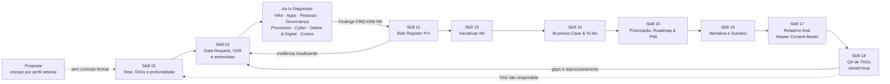
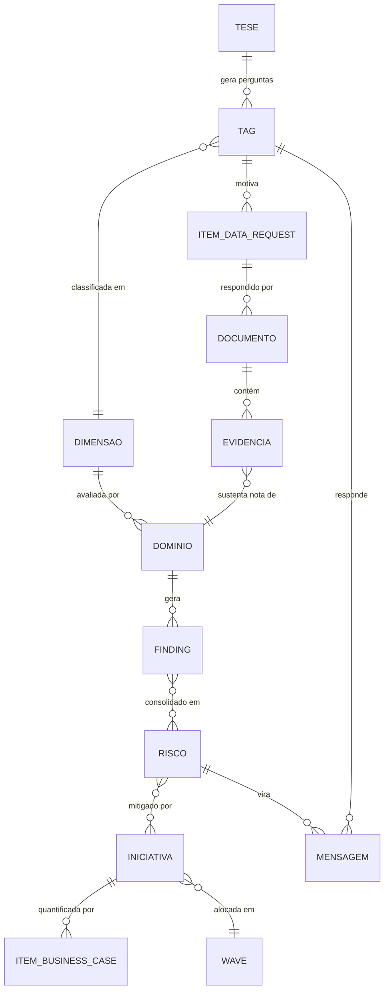

# Engenharia e modelo semântico da IT Due Diligence (A&M DTS)

> **Em uma frase 💡:** a IT DD da DTS já foi pensada como um **sistema de raciocínio auditável**. Cada conclusão nasce de uma evidência classificada, passa por uma rubrica com âncoras, vira achado, risco, iniciativa e número de business case, e no fim volta para a pergunta da tese que a motivou. O desenho é de nível raro. O que falta é a **engenharia de integração**: as peças não conversam com segurança entre si.

**Fonte:** análise dos 24 pacotes ZIP compartilhados pelo usuário (skills de IA da DTS), lidos em 05–06/10/2026. Por decisão do usuário, **nada do código é reaproveitado**. Este documento extrai só a semântica (conceitos e relações) e a analítica (regras, fórmulas e critérios) para servir de fundação a um produto desenhado do zero (ver [piloto](12-piloto-tech-dd-com-ia.md)).
Os pacotes não são versionados aqui. Citações literais são curtas. Não há dados de clientes nos pacotes lidos.

---

## 1. O que são os 24 pacotes

São **Claude Skills** (pasta com `SKILL.md`, `references/`, `scripts/` e `assets/`) geradas por uma fábrica interna chamada **"Meta Skill Engine"** (AMP Flows). Todas seguem o mesmo contrato:

- operações **semânticas** feitas pelo modelo, separadas de operações **determinísticas** feitas por scripts;
- entrada e saída em JSON;
- aviso **"DRAFT ONLY"** obrigatório em todo material para cliente;
- IDs rastreáveis ao longo da cadeia (`FIND`, `RIS`, `INI`, `MSG`, `TAG`).

Há também uma segunda arquitetura, por **atividades** (`ATV-0NN`), para a parte econômica.

| Grupo | Pacotes | Status de leitura |
|---|---|---|
| Proposta e escopo | Escopo da Proposta (`itdd-scoper`, 11 perfis setoriais) · "Definição de escopo da DD" | ✅ lidos. ⚠️ O ZIP "Definição de escopo" contém outra coisa: o próprio *Meta Skill Engine* |
| Evidências e qualidade | Controle de Evidências/VDR (Skill 02) · QA de TAGs & Closed Loop (Skill 18) | ✅ lidos |
| Diagnóstico As-Is | Infraestrutura (03) · Aplicações (04) · Pessoas (05) · Governança (06) · Processos (07?) · Dados & Digital · Custos | ✅ lidos |
| | Cibersegurança (08) · Estrutura organizacional (2 versões) | ❌ não abertos: arquivos de cerca de 9 MB derrubam o conector do Drive |
| Economia | ATV-094 Custos Ocultos (só especificação) · Business Case & To-Be (Skill 14) | ✅ lidos |
| | ATV-091 Razão de TI · ATV-093 Top 20 contratos · ATV-032 | ❌ não abertos (tamanho) |
| Síntese | Riscos (11) · Iniciativas (13) · Roadmap & PMI (15) · Narrativa (16) · Relatório Final (17) · Sumário Executivo | ✅ lidos |

> Para completar a análise, os 6 pacotes grandes precisam ser reenviados descompactados ou em partes menores que 5 MB.

## 2. A esteira de ponta a ponta

Leitura: a esteira tem **dois laços de realimentação**. A evidência insuficiente volta ao Data Request, e o QA final confere se cada pergunta da tese (TAG) foi respondida com evidência.

## 3. Ontologia: os conceitos e como se ligam

| Entidade | O que é na A&M | Atributos-chave |
|---|---|---|
| **Tese / Escopo** | Lógica de valor do deal e recorte do trabalho | Profundidade por dimensão: *Deep Dive / Standard / Light* |
| **TAG** | Pergunta-chave que a DD precisa responder, ligada a uma alavanca de valor | ID `TAG-NN` herdado e nunca renumerado; prioridade *Must / Should / Could* |
| **Dimensão A&M** | Taxonomia fixa de **8 dimensões**: Infraestrutura, Aplicações, Pessoas, Governança, Processos, Cibersegurança, Digital (incluindo Dados), Custos | Não pode ser renomeada nem fundida |
| **Item de Data Request** | Pedido ao alvo, escolhido de um banco de **96 perguntas** de referência | Prioridade derivada da profundidade; status *Não solicitado → Pendente → Parcial/OK/Não aplicável* |
| **Documento** | Material do VDR, entrevista ou e-mail | **Completude** e **qualidade** avaliadas separadamente |
| **Evidência** | Trecho que sustenta um julgamento | *Evidenciado / Inferido / Não confirmado* com citação rastreável |
| **Domínio** | Unidade de avaliação de uma dimensão (Infra tem 15; Pessoas, 9; Governança, 8; Processos, 7; Dados & Digital, 11; Aplicações, 10 por aplicação) | Nota de 1 a 5 por âncoras, ou "Não avaliado" |
| **Finding** | Observação diagnóstica (não é risco) | `FIND-<DIM>-NN`; severidade *Gap comum / Ponto de Atenção / Ponto Crítico* |
| **Risco** | Consequência para o deal | `RIS-NNN`; P×I de 1 a 25; *Gap / Ponto de Atenção / Risco / Red Flag / Deal-breaker* |
| **Iniciativa** | Resposta estruturada a riscos e findings | `INI-NNN`; natureza; prioridade *P0–P3*; horizonte |
| **Item de Business Case** | Valor monetário com lastro | Nível de evidência *N1 (real) / N2 (benchmark) / N3 (hipótese)* e confiança |
| **Mensagem / Relatório** | Narrativa para o comitê de investimento, montada sobre um modelo de conteúdo com proveniência | `MSG-NN`; *Master Content Model* com hash por registro |

## 4. A gramática da evidência

O centro do método é uma regra moral simples: **"documento não recebido nunca equivale a controle inexistente"**.

| Regra | Como funciona |
|---|---|
| **Três estados de evidência** | *Evidenciado* (fonte direta), *Inferido* (dedução declarada, com as fontes-base) e *Não confirmado* |
| **Cinco estados de controle** | Existe · Não existe (exige evidência **ativa** de ausência) · Parcialmente implementado · Evidência insuficiente · Informação não recebida (precedência máxima) |
| **Resolução de conflitos** | Ordem fixa: **corroboração > especificidade > atualidade > natureza da fonte**. Conflito não resolvido vira *Não confirmado* e registra as duas versões |
| **Completude ≠ qualidade** | Um documento pode cobrir tudo e ser pouco confiável, ou o contrário |
| **Citação obrigatória** | Formatos fixos para documento, entrevista e inferência |
| **Atualização incremental** | Evidência nova tem impacto medido nas 8 dimensões, e o reprocessamento só roda com confirmação |
| **Números com lastro** | Custos: *Observado / Estimativa / Não confirmado*. Business case: *N1 / N2 / N3*. ROI só com lastro N1 ou N2 **dos dois lados** (investimento e benefício) |
| **Sem dupla contagem** | Findings são agrupados por causa raiz. Na consolidação de custos ocultos, cada item é excluído, ajustado ou confirmado uma única vez |

## 5. Analítica de julgamento

| Elemento | Regra |
|---|---|
| **Nota do domínio** | Maior âncora (1–5) compatível com a evidência; empate entre âncoras adjacentes fica com a menor (postura conservadora); sem âncora compatível, "Não avaliado — evidência insuficiente" |
| **Semáforo** | 1–2 vermelho · 3 amarelo · 4–5 verde |
| **Maturidade consolidada** | Média simples só dos domínios avaliados, com "N de M" declarado |
| **Encerramento da coleta** | Critério objetivo por módulo (ex.: Infra com 12 de 15 domínios cobertos; Dados com 8 de 11; Aplicações com 60% das aplicações em cada dimensão) |
| **Severidade** | *Ponto Crítico* exige **dois critérios simultâneos** (criticidade confirmada **e** ausência confirmada de mitigação). Cada módulo dá nome próprio ao seu: *Dependência Crítica de Pessoa-Chave*, *Vácuo de Governança*, *Processo Crítico Não Controlado*, *Dado Crítico Sem Governança*. Em Infra, SPOF ou EOL em produção |
| **Veredito de infraestrutura** | *Inadequada* se houver Ponto Crítico ou maturidade < 2,5 · *Adequada com ressalvas* se houver Ponto de Atenção ou maturidade < 3,5 · *Adequada* caso contrário · *Indeterminado* sem base |
| **Recomendação por aplicação** | Exige ≥ 6 de 10 dimensões avaliadas → *Manter / Investir-Modernizar / Consolidar / Substituir / Aposentar com urgência*, por faixas de média (2,0 · 3,0 · 4,0) e notas 1 em dimensões críticas |
| **Concentrações** | Fornecedor ≥ 70% de um grupo · obsolescência em 365 dias ≥ 50% · site único ≥ 50% |

## 6. Analítica de risco e decisão

| Elemento | Regra |
|---|---|
| **Criticidade** | Probabilidade (1–5, faixas de < 5% a > 75% em 3 anos) × Impacto (1–5, % do EBITDA ou critério qualitativo) = 1 a 25 → verde, amarelo ou vermelho |
| **Deal-breaker** | Só com critério objetivo: invalida premissa da tese **ou** CAPEX não previsto acima de **2% do EV** |
| **Materialidade na narrativa** | "Crítica" se for deal-breaker, condição de closing, bloquear a tese ou passar de **5% do valuation** |
| **Consequência plausível** | No máximo **2 elos** de inferência |
| **Iniciativas** | Agrupamento sem a regra "1 risco = 1 iniciativa"; teste de 6 fatores (materialidade, impacto, tese, urgência, viabilidade, escala); prioridade P0–P3 por árvore; não prescrever tecnologia sem evidência técnica |
| **Roadmap** | Piso de prioridade que nunca pode ser rebaixado; elevação de no máximo +1 nível com evidência; Day 1 só com critérios objetivos; waves por dependência; alerta de capacidade acima de 85% |
| **QA de TAGs** | 6 status (de *Respondida* a *Não Endereçada*); TAG apoiada só em evidência fraca é rebaixada; gap que afeta TAG *Must* ou o business case tem impacto Alto |

## 7. Analítica financeira

- **Baseline de TI** em 6 categorias: Pessoas, Software/Aplicações, Hardware/Infraestrutura, Telecom, Outsourcing, Outros.
- **Razão de TI** = custo de TI ÷ receita líquida. Comparada com benchmark **só quando o benchmark é fornecido**; inventar referência é proibido.
- **Custo Total Real** = custo visível + custos ocultos. Os ocultos incluem shadow IT, SaaS pago fora da TI, software no orçamento de outras áreas, PJs de TI fora da TI, telecom e planilhas críticas. A Razão de TI é recalculada sobre esse total.
- **Top 20 contratos** por valor, sem completar linhas vazias.
- **Business case** por iniciativa: CAPEX/OPEX, benefícios (saving anual, saving one-time, receita incremental, custo evitado), **TCO de 3–5 anos só com ≥ 60% de lastro N1/N2**, payback e ROI com as travas de evidência.

## 8. Controles de qualidade

- **Separação explícita** entre o que o modelo decide (suficiência, contradição, redação) e o que o script calcula (estados, notas, agregações). Falha de script é terminal.
- **Master Content Model**: todo número e todo texto do relatório têm proveniência (skill, arquivo, linha) e hash. Assim o relatório pode ser reconstruído de forma incremental, sem recalcular nem reclassificar nada.
- **Closed loop**: matriz *TAG → Resposta → Evidência → slide*.
- **"QA não mascara falta de evidência"**: menção superficial não transforma uma TAG em respondida.

## 9. Vocabulário próprio

| Termo A&M | Significado |
|---|---|
| TAG / Pergunta-Chave | Pergunta da tese que a DD precisa responder |
| Deep Dive · Standard · Light | Profundidade por dimensão |
| Evidenciado · Inferido · Não confirmado | Estado da evidência |
| Gap comum · Ponto de Atenção · Ponto Crítico | Severidade do finding |
| Red Flag · Deal-breaker | Classes de risco de maior gravidade |
| Findings Export | Interface padrão (9 colunas) entre diagnóstico e riscos |
| As-Is Diagnostic Engine · Risk & Opportunity Engine · Initiative & Roadmap Engine | As três camadas do motor |
| Master Content Model (MCM) | Base única do relatório, com proveniência |
| Custo Total Real · Razão de TI | Métricas econômicas centrais |
| N1 · N2 · N3 | Lastro de um valor financeiro |

## 10. Diagnóstico de engenharia

### O que é excelente (e raro)

1. **Epistemologia explícita.** Separar *não recebido* de *não existe*, e *finding* de *risco*, é exatamente o que falta na maioria das diligências.
2. **Determinismo onde importa.** Notas por âncora, criticidade P×I e travas de ROI não ficam ao gosto do modelo.
3. **Rastreabilidade de ponta a ponta** com IDs e proveniência, que é o pré-requisito para IA confiável.
4. **Laços de realimentação**: evidência insuficiente volta ao Data Request e a TAG não respondida volta à tese.

### Onde quebra

| # | Problema | Efeito | Gravidade |
|---|---|---|---|
| E1 | **Contratos entre skills incompatíveis**: os outputs das Skills 11, 13 e 16 não passam na ingestão da 17; a 15 espera criticidade "Crítico/Alto..." e a 11 entrega verde/amarelo/vermelho | A esteira não roda de ponta a ponta sem intervenção manual | Alta |
| E2 | **TAG não propagada** entre as Skills 1 e 17 | O closed loop vira busca por palavra-chave | Alta |
| E3 | **Regra de ROI implementada errado**: o método exige lastro nos dois lados; o código aceita lastro em qualquer um | ROI calculado sem base suficiente | Alta |
| E4 | **Fórmulas de cenário e TCO**: multiplicador de horizonte invertido, payback sem OPEX, sem VPL nem TIR | Números de business case frágeis | Alta |
| E5 | **Parsing de valores em reais** (ex.: "R$ 1.250" lido como 1,25) e categorização por substring | Baseline de custos errado | Alta |
| E6 | Semáforo aceita notas fracionárias de forma inconsistente; truncamento de notas | Cores e médias incorretas | Média |
| E7 | **Pacotes trocados ou vazios**: "Definição de escopo" contém o Meta Skill Engine; "Custos consolidados" contém Custos Ocultos; ATV-094 é só especificação | A Skill 01, pedra fundamental da tese, não está disponível | Alta |
| E8 | **IA na empresa-alvo sem método**: Dados & Digital só cita "tecnologias emergentes (IA, IoT, blockchain)" no domínio Inovação | Não cobre AI DD, que é hoje oferta nomeada das Big Four | Alta (de mercado) |
| E9 | Taxonomias de custo divergentes (5 categorias × 6) | Números não comparáveis entre módulos | Média |
| E10 | Dependência de skills externas e de caminhos de ambiente (pptx, template-am) | Quebra fora do ambiente original | Média |

### Veredito sobre as afirmações da IA externa nº 2

| Afirmação | Veredito | Base |
|---|---|---|
| (a) Esteira tese → evidências → diagnóstico → riscos → iniciativas → business case → roadmap → relatório → QA | **Parcial** | A ordem é essa, mas falta a etapa de narrativa (Skill 16), e são 18 skills com dois laços de realimentação |
| (b) Regras de fato × hipótese, fontes, dupla contagem e atualização | **Confirmado**, com ressalva | Explícitas na maioria dos módulos; a de dupla contagem não aparece nos módulos de organização |
| (c) Automação parcial, não pronta para produção | **Confirmado** | Scripts só fazem parse, estados, notas e render; o julgamento central é semântico |
| (d) ZIP de "Definição de escopo" contém método de criação de skills | **Confirmado** | O conteúdo é o *Meta Skill Engine* |
| (e) ROI: método exige os dois lados, código aceita qualquer um | **Confirmado** | O critério do SKILL.md diverge do teste `any(...)` sobre linhas combinadas no script |
| (f) Dados & Digital sem metodologia de IA no alvo | **Confirmado** | Única menção é "tecnologias emergentes (IA, IoT, blockchain)" |

## 11. O que esse modelo implica para um produto desenhado do zero

| Camada | Quem faz | Por quê |
|---|---|---|
| Ler, classificar e citar documentos; propor mapeamento evidência → domínio; sugerir âncora; redigir rascunhos | **IA (LLM)** | Trabalho linguístico de alto volume, com citação obrigatória |
| Estados, notas finais, semáforos, P×I, travas de ROI, TCO, prioridades e waves | **Regras determinísticas** | Precisam ser auditáveis e reprodutíveis |
| Suficiência de evidência em temas críticos, deal-breakers, materialidade, recomendação ao comitê | **Especialista A&M** | Julgamento e responsabilidade profissional |
| Rastreabilidade (TAG → evidência → finding → risco → iniciativa → número → slide) | **Grafo de evidências** (fundação do produto) | É o que transforma a IA em algo confiável e transforma cada deal em memória reutilizável |

**Requisitos que o produto novo precisa cumprir desde o primeiro dia:**

1. **Um único modelo de dados** (o grafo acima) em vez de contratos entre documentos.
2. **IDs propagados** de ponta a ponta, inclusive a TAG.
3. **Motor financeiro testado** com casos de referência, incluindo VPL/TIR e as travas de lastro.
4. **Módulo de IA no alvo** (AI DD) e **cyber** como dimensões de primeira classe.
5. **Locale brasileiro** nativo: valores em reais, LGPD e PL 2338/2023.
6. **Ponto de encaixe para ferramentas globais da A&M** (A&M Assist / DiligenceGPT), para não duplicar o que já existe.
