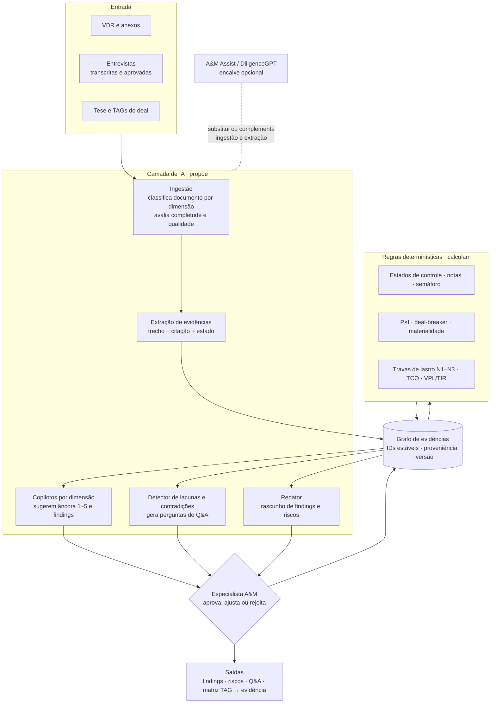
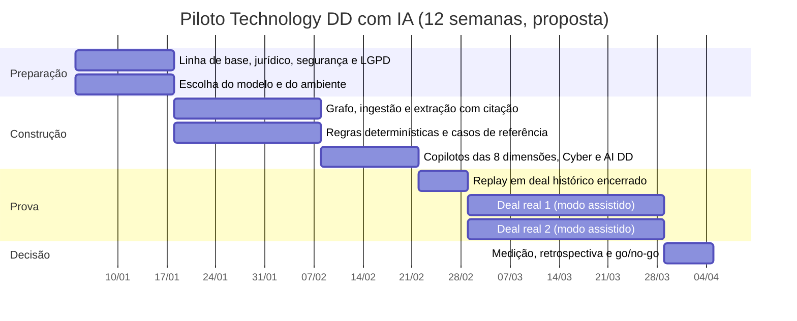
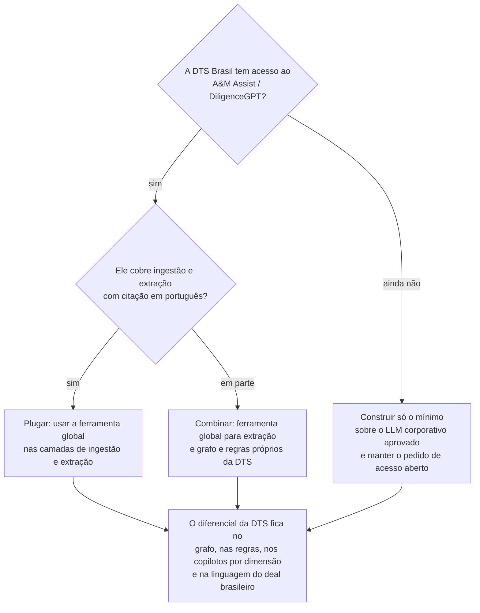

# Piloto: Technology Due Diligence com IA, desenhado do zero

> **Em uma frase 💡:** em 12 semanas, provar com 1 deal histórico e 2 deals reais que a esteira de diligência da DTS, apoiada num **grafo de evidências com IA**, entrega a mesma qualidade (ou melhor) em menos horas, com **toda afirmação citada** e sem perder nenhum red flag.

Selos: 📘 método interno (extraído das skills, ver [engenharia](10-engenharia-e-modelo-semantico-da-diligencia.md)) · 🔎 referência de mercado ([benchmark](09-benchmark-de-mercado.md)) · 💡 proposta deste documento.

**Regra de origem:** nenhum código das skills é reaproveitado. O que se aproveita é o **método**: conceitos, estados de evidência, âncoras, travas e vocabulário 📘. O produto nasce com um modelo de dados único, o que resolve na raiz os problemas E1, E2 e E7 do diagnóstico de engenharia.

---

## 1. O que o piloto precisa provar

| # | Hipótese 💡 | Como medir | Critério para seguir |
|---|---|---|---|
| H1 | A IA encurta a **fase documental** (VDR → primeiro rascunho dos findings) | Horas e dias corridos, comparados com a linha de base do time | Redução relevante, com meta definida na semana 0 pela liderança |
| H2 | A IA **não piora a qualidade** | Red flags e pontos críticos do relatório histórico reencontrados no replay | **Nenhum** red flag do relatório original perdido |
| H3 | Toda afirmação do rascunho é **rastreável** | % de afirmações com citação; precisão da citação numa amostra auditada | 100% com citação; precisão alta na amostra (meta fixada na semana 0) |
| H4 | O especialista **confia e usa** | Taxa de aceitação das sugestões de nota; retrabalho; entrevista com o time | Aceitação estável e retrabalho menor que no processo atual |
| H5 | O cliente **percebe valor** | Prazo de entrega; perguntas de Q&A mais precisas; feedback do comitê | Feedback positivo em pelo menos 1 dos 2 deals reais |
| H6 | O custo de IA por deal é **pequeno frente ao honorário** | Consumo de modelo por deal e por documento | Custo compatível com a margem-alvo |

> As metas numéricas de H1 e H3 ficam em branco de propósito. Elas devem vir da **linha de base real** do time, medida na semana 0, e não de números de mercado sem comparação justa.

## 2. Escopo

| Dentro | Fora (fica para as ondas seguintes) |
|---|---|
| Technology DD, profundidade *Standard* | Profundidades *Red Flag* e *Deep Dive* |
| Módulos **IT Core** (as 8 dimensões A&M) + **Cyber & Privacy** + **AI DD** (novo, ver B5 na [estratégia](07-estrategia-e-inovacao.md)) | Software & Code DD (depende de ferramenta parceira) |
| Do Data Request ao rascunho de findings, riscos e iniciativas | Business case completo e relatório final formatado |
| 1 deal histórico encerrado (replay) + 2 deals reais em andamento | Integração com ferramentas do cliente (Jira, ServiceNow) |
| Interface simples para o especialista revisar e aprovar | Portal para o cliente |

**Por que essa ordem:** o replay num deal encerrado mede qualidade sem risco para cliente nenhum, porque existe um relatório "gabarito". Os dois deals reais medem velocidade e adoção.

## 3. Arquitetura do piloto

**Três princípios que não se negociam:**

1. **A IA propõe, a regra calcula, o especialista decide.** Nenhuma nota final, criticidade ou número sai direto do modelo de linguagem.
2. **Sem citação, não existe.** Uma afirmação sem trecho de origem é descartada pelo sistema, e não apenas sinalizada.
3. **"Não recebido" nunca vira "não existe"** 📘. O estado *Informação não recebida* tem precedência máxima e gera pergunta de Q&A automaticamente.

## 4. Modelo de dados mínimo

Um único grafo substitui a troca de arquivos entre etapas. Cada nó tem ID estável, versão, autor (IA ou pessoa) e proveniência.

| Nó | ID | Campos essenciais | Quem cria |
|---|---|---|---|
| Tese | `TES-01` | Lógica de valor, profundidade por dimensão | Especialista |
| TAG | `TAG-NN` | Pergunta, prioridade *Must/Should/Could*, dimensão, alavanca de valor | Especialista (IA pode sugerir) |
| Pedido | `DR-NNN` | TAG de origem, status, prazo | IA sugere a partir do banco de perguntas; especialista aprova |
| Documento | `DOC-NNN` | Origem, data, dimensão, completude, qualidade | IA |
| Evidência | `EVI-NNNN` | Trecho, citação (doc, página, linha), estado *Evidenciado / Inferido / Não confirmado*, base da inferência | IA; especialista valida |
| Domínio | `DOM-<DIM>-NN` | Nota 1–5 ou *Não avaliado*, âncora usada, evidências | IA sugere; **regra** aplica a âncora; especialista aprova |
| Finding | `FIND-<DIM>-NN` | Descrição, severidade, causa raiz | IA rascunha; especialista aprova |
| Risco | `RIS-NNN` | P, I, criticidade, classe (até *Deal-breaker*) | **Regra** calcula; especialista confirma |
| Iniciativa | `INI-NNN` | Natureza, prioridade P0–P3, horizonte | Especialista (IA sugere) |
| Valor | `VAL-NNN` | Montante em R$, lastro N1/N2/N3, confiança | Especialista; **regra** aplica as travas |
| Pergunta de Q&A | `QA-NNN` | Lacuna ou contradição de origem, destinatário | IA |

**O que muda frente à esteira atual:** a TAG acompanha cada nó desde o início (resolve E2); não há contratos entre arquivos que possam divergir (resolve E1); a matriz *TAG → resposta → evidência* deixa de ser busca por palavra-chave e vira consulta ao grafo.

## 5. Quem faz o quê, etapa por etapa

| Etapa | IA | Regra determinística | Especialista |
|---|---|---|---|
| Tese e TAGs | Sugere TAGs a partir do material do deal | — | **Define** |
| Data Request | Seleciona perguntas do banco por TAG e profundidade | Prioridade derivada da profundidade | Aprova e envia |
| Ingestão | Classifica, avalia completude e qualidade | — | Corrige amostra |
| Evidências | Extrai trecho, cita e propõe estado | Estado *não recebido* tem precedência | Valida em temas críticos |
| Conflitos | Detecta e mostra as duas versões | Ordem: corroboração > especificidade > atualidade > natureza 📘 | Decide quando a regra não resolve |
| Nota do domínio | Sugere âncora com justificativa | Maior âncora compatível; empate fica com a menor 📘 | **Aprova** |
| Findings | Rascunha e agrupa por causa raiz | Severidade *Ponto Crítico* exige 2 critérios 📘 | **Aprova** |
| Riscos | Rascunha consequência (máx. 2 elos de inferência) | P×I, deal-breaker (CAPEX > 2% do EV), materialidade (> 5% do valuation) 📘 | **Confirma** |
| Valores | — | Travas N1–N3; ROI só com lastro N1/N2 **nos dois lados** 📘 | Define premissas |
| Q&A | Gera perguntas de lacunas e contradições | — | Prioriza |
| QA final | Monta a matriz TAG → evidência | Rebaixa TAG apoiada só em evidência fraca 📘 | **Assina** |

## 6. Motor determinístico: testes antes do primeiro deal

O diagnóstico de engenharia achou erros de cálculo na esteira atual (E3 a E6). O piloto só começa depois que um **conjunto de casos de referência** passar:

| Teste | Caso | Resultado esperado |
|---|---|---|
| Trava de ROI (E3) | Investimento N1, benefício N3 | ROI **não** é calculado; aparece "lastro insuficiente" |
| Trava de ROI | Investimento N2, benefício N1 | ROI calculado |
| TCO (E4) | Horizonte de 3 e de 5 anos com CAPEX e OPEX | Payback inclui OPEX; VPL e TIR presentes |
| Valores em reais (E5) | "R$ 1.250", "R$ 1.250,50", "1,2 mi" | 1250; 1250,50; 1.200.000 |
| Semáforo (E6) | Notas 2,5 e 3,5 | Regra explícita e documentada para frações |
| Taxonomia de custos (E9) | Mesmo item em dois módulos | Mesma categoria entre as 6 do baseline |
| Deal-breaker | CAPEX não previsto de 2,1% do EV | Classe *Deal-breaker* sugerida; especialista confirma |

## 7. Cronograma

Ordem de grandeza do esforço: **Onda 1 + Piloto** na [estratégia](07-estrategia-e-inovacao.md#10-quanto-custa-construir), ou seja, 13 FTE-mês no caminho enxuto e 21 no proprietário 💡.

## 8. Time

| Papel | Dedicação 💡 | Responsabilidade |
|---|---|---|
| Product owner da Technology DD | Integral | Escopo, linha de base, critérios de go/no-go |
| 2 especialistas de diligência | Parcial, mais alta nos deals | Validar âncoras, revisar saídas, medir retrabalho |
| Engenheiro de dados e IA | Integral | Ingestão, extração, copilotos e avaliação |
| Desenvolvedor | Integral | Grafo, regras, interface de revisão |
| Jurídico, segurança da informação e privacidade | Pontual | Aprovação do uso de dados de deal e do ambiente |

## 9. Dados, LGPD e confidencialidade

| Requisito | Como o piloto atende 💡 |
|---|---|
| Base legal e autorização do cliente | Cláusula na carta de contratação autorizando o uso de ferramentas de IA no trabalho, revisada pelo jurídico |
| Isolamento por deal | Um espaço de dados por deal; nenhuma consulta cruza deals |
| Sem treino com dados do cliente | Contrato com o provedor de modelo vedando retenção e treino |
| Residência e acesso | Ambiente aprovado pela segurança da informação; acesso por papel; log de toda consulta |
| Dados pessoais em documentos | Minimização: mascarar dados pessoais que não sejam necessários à análise |
| Retenção | Apagar o espaço do deal ao fim do prazo contratual; manter só métricas anonimizadas do piloto |
| Regulação de IA | Registrar o uso conforme a política interna da A&M; acompanhar o PL 2338/2023 🔎 |
| Clean team | Respeitar as restrições de informação concorrencialmente sensível definidas no deal |

## 10. Construir ou plugar: a decisão sobre o A&M Assist

A A&M global lançou o DiligenceGPT em janeiro de 2024 ✅, e há indícios de que ele evoluiu para o A&M Assist 🔎 ([benchmark](09-benchmark-de-mercado.md)). O piloto não deve competir com essas ferramentas.

Em qualquer caminho, o que a DTS precisa possuir é o **método codificado** (âncoras, travas, vocabulário) e o **grafo** que acumula memória de deal a deal. A camada de leitura de documentos é a mais substituível.

## 11. Riscos do piloto

| Risco | Sinal de alerta | Resposta |
|---|---|---|
| Alucinação de evidência | Citação que não bate com o documento | Bloqueio automático de afirmação sem trecho; auditoria por amostra |
| Viés de automação | Especialista aceita tudo sem ler | Medir tempo de revisão; amostras com erro plantado no replay |
| Documentos ruins (escaneados, planilhas soltas) | Baixa taxa de extração | OCR e pedido de reenvio via Q&A |
| Time puxado para o TMO | Atraso na construção | Squad protegido, como decidido na [estratégia](07-estrategia-e-inovacao.md#12-decisões-que-a-liderança-precisa-tomar) |
| Cliente não autoriza IA | Recusa na carta de contratação | Ter 3 deals candidatos para escolher 2 |

## 12. O que acontece depois do go

1. **Se passar:** a Technology DD 2.0 vira o padrão da área, o grafo começa a acumular memória de deals e a mesma base sustenta Screening, Day 1, TSA Control Tower e Exit Readiness (ondas 2 a 4).
2. **Se passar em parte:** manter o que provou valor (por exemplo, extração com citação e Q&A) e refazer o resto antes da Onda 2.
3. **Se não passar:** o método e os testes do motor determinístico continuam valendo; a camada de IA é trocada ou plugada no A&M Assist.
