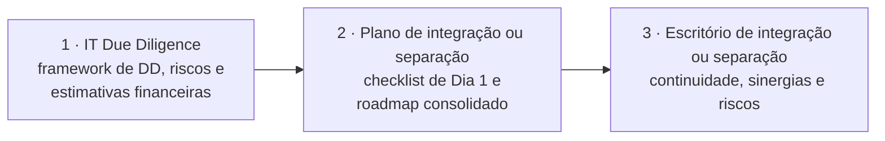
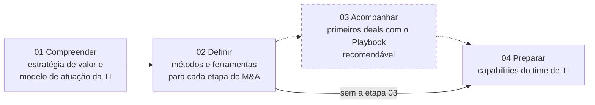
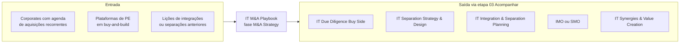

# IT M&A Playbook

> **Torna a TI do cliente autossuficiente em M&A: métodos, ferramentas e um time capacitado para diligenciar, planejar e executar deals com mais velocidade e menos dependência de consultorias.** 💡

| Código | Família | Fase(s) do ciclo | Lado | Readiness (atual → alvo FY) | PO | Squad |
|---|---|---|---|---|---|---|
| ITMA-01 | Estratégia & Design 💡 | M&A Strategy 🗂️ | Corporate; plataformas de PE 💡 | 2,7 → 3,7 🗂️ | Thiago Lorusso 🗂️ | Glaucea N, Tatiane N 🗂️ |

**Em síntese** 💡

- **Única oferta posicionada antes do deal.** O Playbook não executa uma transação: ele constrói a capacidade de M&A da área de TI do cliente, para todas as transações seguintes.
- **Entrega ao cliente o "método A&M".** As três áreas de foco (diligência, planejamento e escritório de integração ou separação) espelham ofertas que a A&M vende como serviço. A etapa 03, Acompanhar (recomendável), é a ponte natural para o pull-through.
- **Maturidade baixa.** Com readiness 2,7 (nível 2, "Oferta inicial", risco alto), a oferta está abaixo da média da service line (3,29). O deck não traz preço, prazo, equipe-tipo nem cases, e essas lacunas explicam a nota.

---

## 1. Descrição oficial 🗂️

> "Desenvolvimento de Playbook de TI para M&A do cliente, sob medida, para preparar a organização de TI na avaliação, preparação, gerenciamento e execução de aquisições e integrações ou separações no âmbito de tecnologia."

*Fonte: slide "A&M é M&A", do Deck Comercial. O texto foi reconstruído das linhas 375–417 da extração, onde aparece intercalado com a descrição do IT Due Diligence (Sell Side), e confere com `descricao_oficial` em `data/ofertas.yaml`.*

**Posição no ciclo.** A fase M&A Strategy segue a classificação de `data/ofertas.yaml`. Na extração (linha 365), o título "IT M&A Playbook" aparece na mesma linha da régua de fases, mas não dá para recuperar a posição exata no slide (trecho ambíguo na extração).

**Leitura da descrição** 💡: os quatro verbos da descrição oficial cobrem as três áreas de foco descritas no deck (seção 3):

| Verbo da descrição oficial | Área de foco correspondente |
|---|---|
| Avaliação | IT Due Diligence |
| Preparação | Plano de integração ou separação |
| Gerenciamento e execução | Escritório de integração ou separação |

---

## 2. O problema que resolve 📘

O deck não descreve a dor do cliente de forma direta. Ele a apresenta pelo avesso, no slide **"Por que ter um playbook de M&A?"** (linhas 505–545), com **seis benefícios** organizados em três pares:

| # | Benefício | O que o deck afirma (reconstruído) |
|---|---|---|
| 1 | **Desenvolvimento** | Equipe de TI com diferencial competitivo e posicionamento estratégico no programa de M&A, atuando como "advisors ao deal". |
| 2 | **Análise** | Mais assertividade nos diagnósticos das empresas-alvo, com antecipação das análises e das tomadas de decisão em novos deals. |
| 3 | **Autonomia** ¹ | Mais autonomia para realizar projetos de IT M&A e redução de despesas com consultorias especializadas no segmento. |
| 4 | **Planejamento** ¹ | Planejamento robusto da tomada de controle na integração ou separação das empresas, mitigando riscos e perda de valor do negócio. |
| 5 | **Controle** | Maior confidencialidade da estratégia de M&A frente aos concorrentes. |
| 6 | **Execução** | Integrações ou separações executadas com mais eficácia e transparência para stakeholders, clientes e colaboradores. |

¹ *Trecho ambíguo na extração: as colunas de Autonomia e Planejamento vêm intercaladas linha a linha (linhas 527–535). A divisão acima é a única que produz frases gramaticais nas duas colunas. Ela é coerente com o restante da seção: a redução de despesas com consultorias reaparece na linha 563, e a tomada de controle, nas linhas 483, 499 e 589. Confirmar no slide original.*

### A dor por trás de cada benefício 💡

| Benefício | Dor do cliente sem playbook | Sintoma típico |
|---|---|---|
| Desenvolvimento | A TI é chamada tarde ao deal e vista como área de suporte | Riscos de TI só aparecem depois do signing |
| Análise | Cada diligência é reinventada, sem padrão nem histórico | Diagnósticos lentos e heterogêneos; decisão atrasada |
| Autonomia | Dependência de consultoria externa a cada transação | Custo recorrente; o conhecimento sai com o consultor |
| Planejamento | Tomada de controle improvisada | Perda de valor e risco operacional no Dia 1 |
| Controle | Muitos terceiros envolvidos em cada deal | Perímetro de informação sensível ampliado |
| Execução | Integração ou separação conduzida sem método comum | Baixa transparência para stakeholders, clientes e colaboradores |

*Contexto geral do deck (fora do intervalo):* a abertura do deck registra que as empresas têm reconhecido "a importância do envolvimento de especialistas em IT M&A em todas as etapas do processo" (linha 55). O Playbook responde a isso internalizando esse conhecimento no time de TI do cliente.

---

## 3. Objetivo e escopo 📘

**Objetivo** (linha 473): "assessorar e desenvolver as áreas de tecnologia, no estabelecimento de ferramentas e padrões, nas diversas etapas de um ciclo de M&A".

**Proposta da abordagem** (linha 553): a A&M assessora as áreas de tecnologia "na criação de ferramentas e processos de trabalho para atuação estratégica em projetos de M&A".

| Dimensão de escopo | O que o deck informa |
|---|---|
| Quem recebe a entrega | A área de tecnologia, ou seja, o time de TI da companhia (linhas 473, 485 e 563) |
| Tipos de transação | Aquisições, integrações ou separações (descrição oficial; linhas 499, 501 e 563) |
| Lado do deal (Corporate, PE, VC) | Não informado no deck |
| O que fica fora do escopo | Não informado no deck |

### Áreas de foco e capacitação 📘 (linhas 489–501)

O deck considera três áreas de foco para "acelerar o desenvolvimento das capabilities de IT M&A no time de tecnologia e criar uma plataforma de integração de empresas".

| # | Área de foco | Escopo segundo o deck |
|---|---|---|
| 1 | **IT Due Diligence** | Construção de framework para realizar IT Due Diligence e de modelo para avaliação e mitigação de riscos e para estimativas financeiras. |
| 2 | **Plano de integração ou separação** | Criação de plataforma de integração ou separação, com checklist de tomada de controle no Dia 1 e roadmap consolidado de execução das iniciativas. |
| 3 | **Escritório de integração ou separação** | Execução da estratégia de integração ou separação com foco em continuidade do negócio, captura de sinergias e mitigação de riscos, garantindo que as estratégias de IT M&A sejam atingidas. |

💡 As três áreas seguem a ordem natural do deal (antes do signing, entre signing e closing, depois do closing). A seção 8 mostra que cada uma delas espelha uma oferta que a A&M presta como serviço.

---

## 4. Abordagem A&M: como fazemos 📘

### 4.1 Metodologia em quatro etapas 📘 (linhas 471–485)

| Nº | Etapa | O que acontece, segundo o deck | Caráter |
|---|---|---|---|
| 01 | **Compreender** | Entender a estratégia de geração de valor da companhia e o modelo de atuação da área de TI diante dos desafios operacionais e estratégicos do plano de M&A. | Núcleo |
| 02 | **Definir** | Definir e implementar métodos e ferramentas que apoiem a TI nas diferentes etapas do M&A, como IT Due Diligence, plataforma de integração ou separação e checklist de tomada de controle, entre outros. | Núcleo |
| 03 | **Acompanhar** | Acompanhar e assessorar os primeiros projetos de M&A da companhia conduzidos com o Playbook desenvolvido. | **Recomendável** (asterisco no deck) |
| 04 | **Preparar** | Desenvolver as capabilities do time de TI para que ele planeje e execute os projetos de M&A com as ferramentas e os processos definidos no Playbook. | Núcleo |

**Nota sobre a ordem** 💡: o deck numera Acompanhar como 03 e Preparar como 04. Na extração, a etapa 03 aparece em bloco separado das etapas 01, 02 e 04, o que é coerente com seu caráter opcional. Há duas leituras possíveis:

- a capacitação (04) se consolida depois dos primeiros deals assistidos, num modelo de aprender fazendo;
- as etapas 03 e 04 correm em paralelo.

Quando a etapa 03 não é contratada, o fluxo é 01 → 02 → 04. Confirmar com o PO.

### 4.2 Do contexto do cliente ao Playbook 📘 (linhas 549–593)

O slide "Abordagem A&M" organiza o trabalho em três blocos: **como fazemos** (o entendimento do cliente), o **núcleo** (Criação do Playbook de M&A) e os **entregáveis** (detalhados na seção 5).

**Núcleo: Criação do Playbook de M&A** (linha 563, em paráfrase). O núcleo desenvolve as capabilities de IT M&A da área de tecnologia com métodos e ferramentas personalizados, tendo como direcionadores a estratégia e as alavancas de valor da empresa. O resultado pretendido é que novas análises e planejamentos de aquisições ou separações sejam feitos "pelo próprio time de TI da companhia". Isso diminui ou evita despesas com consultorias de M&A e aumenta a velocidade de decisão, planejamento e execução.

**Como fazemos: dimensões de entendimento do cliente**

| # | Dimensão | Classificação |
|---|---|---|
| 1 | Objetivos de negócio da empresa | Insumo |
| 2 | Entendimento da estratégia de M&A adotada | Insumo |
| 3 | Entendimento do modelo operacional das áreas de negócio ² | Insumo |
| 4 | Posicionamento da área de tecnologia frente ao contexto de M&A ² | Insumo |
| 5 | Modelos de geração de valor da empresa | Insumo (classificação provável) ³ |
| 6 | Capabilities e modelo de organização das empresas | Insumo (classificação provável) ³ |

² *Os itens 3 e 4 vêm de duas colunas intercaladas nas linhas 567–575 e foram recompostos pela gramática.*
³ *Trecho ambíguo na extração: o texto não preserva a posição dos itens no slide, então a separação entre "Como fazemos" e "Entregáveis" foi feita pela natureza de cada item. Os itens 5 e 6 descrevem o contexto do cliente e, por isso, estão como insumos. Confirmar no slide original.*

```mermaid
flowchart LR
    subgraph CF [Como fazemos - entendimento do cliente]
        direction TB
        I1[Objetivos de negócio]
        I2[Estratégia de M&A adotada]
        I3[Modelo operacional das áreas de negócio]
        I4[Posicionamento da TI no contexto de M&A]
        I5[Modelos de geração de valor]
        I6[Capabilities e modelo de organização]
    end
    P((Criação do<br/>Playbook de M&A))
    subgraph EN [Entregáveis]
        direction TB
        D1[Ferramentas de IT Due Diligence]
        D2[Template de IT Data Request]
        D3[Modelos de estimativas financeiras<br/>para o Business Plan]
        D4[Drivers de priorização do roadmap<br/>de integração ou separação]
        D5[Ferramentas de planejamento<br/>da integração ou separação]
        D6[Checklist de tomada de controle]
        D7[Plano de treinamento da operação]
    end
    CF --> P --> EN
```

### 4.3 Projetos tailor-made: os quatro pilares 📘 (linhas 597–621)

O deck grafa "taylor made". Os títulos dos pilares e os textos aparecem separados na extração, e a correspondência abaixo foi feita pelo conteúdo, sem ambiguidade relevante.

| Pilar | O que significa, segundo o deck |
|---|---|
| **Alinhamento estratégico** | Entender o modelo de geração de valor e os objetivos de negócio da companhia, além da estratégia de M&A e de expansão dos negócios. |
| **Boas práticas e benchs** | Trazer benchmarks de "mais de 100 projetos executados em M&A" para apoiar a definição da estratégia, do planejamento e da execução mais adequados a cada tipo de M&A. |
| **Soluções customizadas** | Experiência em diversos setores e nichos de mercado e em diferentes estratégias de deal, com soluções específicas e exclusivas para a necessidade de cada cliente. |
| **DNA hands-on** | Abordagem de execução com equipe sênior, como agente de transformação que captura os resultados previstos. Accountability e senso de dono são os pilares, para eliminar problemas e acelerar decisões. |

---

## 5. Entregáveis 📘

### 5.1 Entregáveis da abordagem A&M 📘 (linhas 555–593)

| # | Entregável | Área de foco relacionada 💡 | Etapa da metodologia 💡 |
|---|---|---|---|
| 1 | Ferramentas para realização de IT Due Diligence | IT Due Diligence | 02 Definir |
| 2 | Template personalizado para IT Data Request | IT Due Diligence | 02 Definir |
| 3 | Modelos para estimativas financeiras para compor o Business Plan | IT Due Diligence | 02 Definir |
| 4 | Drivers de priorização para o roadmap de integração ou separação ³ | Plano de integração ou separação | 02 Definir |
| 5 | Ferramentas para planejamento da integração ou separação das empresas | Plano de integração ou separação | 02 Definir |
| 6 | Checklist de tomada de controle | Plano de integração ou separação | 02 Definir |
| 7 | Plano de treinamento da operação, personalizado | Transversal às três áreas | 04 Preparar |

³ *Classificado como entregável por ser um instrumento de priorização (ver nota ³ na seção 4.2).*

### 5.2 Entregáveis (exemplos) 📘 (linhas 625–637)

O slide de exemplos mostra quatro peças:

1. **IT Tactical design**
2. **Ferramentas de IT DD**
3. **Ferramentas de planejamento de integração ou separação de TI**
4. **Ferramentas de execução de integração ou separação de TI**

O conteúdo visual dos exemplos (layouts, dimensões, escalas) não foi capturado pela extração de texto, que traz apenas os títulos. **Estrutura de cada exemplo: não informado no deck (na extração).** O one-pager 📎 está pendente e não foi utilizado aqui.

**Leitura provável** 💡 (a validar com o PO; não é conteúdo do deck):

| Exemplo | Hipótese de função no Playbook |
|---|---|
| IT Tactical design | Pelo nome, faz a ponte entre a estratégia (etapa 01) e as ferramentas (etapa 02), descrevendo como a TI se organiza taticamente para cada tipo de deal. Confirmar formato, dimensões e escalas. |
| Ferramentas de IT DD | Materializa os entregáveis 1 a 3 da seção 5.1. |
| Ferramentas de planejamento | Materializa os entregáveis 4 a 6 da seção 5.1. |
| Ferramentas de execução | É a única evidência de entregável para a área 3 (Escritório de integração ou separação), que não tem item próprio na seção 5.1. |

### 5.3 Matriz de cobertura 💡

| Área de foco | Entregáveis da abordagem (5.1) | Exemplos (5.2) |
|---|---|---|
| IT Due Diligence | 1, 2, 3 | Ferramentas de IT DD |
| Plano de integração ou separação | 4, 5, 6 | Ferramentas de planejamento |
| Escritório de integração ou separação | Nenhum item explícito | Ferramentas de execução |
| Transversal (capacitação e desenho) | 7 | IT Tactical design (provável) |

**Leitura:** a área 3 é a menos documentada do deck. É a primeira lacuna a fechar no one-pager.

---

## 6. Modelo comercial, prazo e equipe 📘

| Dimensão | O que o deck informa |
|---|---|
| Modelo comercial / preço | Não informado no deck |
| Prazo / duração | Não informado no deck |
| Modularidade | A etapa 03, Acompanhar, é marcada como "Recomendável", ou seja, é opcional na metodologia (linhas 477–479). |
| Equipe | "Equipe sênior", com abordagem de execução hands-on (linha 613). Composição e dimensionamento: não informado no deck. |
| Momento recomendado para início | Não informado no deck. Outras seções trazem o marcador "Momento recomendado para início" na régua do ciclo (ex.: linha 709); a seção do Playbook não traz. |

**Implicações comerciais** 💡 (hipóteses a validar com o PO):

- **Dois módulos.** O núcleo (etapas 01, 02 e 04) teria escopo e preço fechados. A etapa Acompanhar (03) seria uma extensão por deal ou por retainer, o que cria receita atrelada ao pipeline de M&A do cliente.
- **Padrão interno.** Outras seções do deck explicitam modelo de investimento, modelo de contratação e prazo (ex.: linhas 1015–1063). Aplicar esse padrão ao Playbook reduz o risco de readiness.
- **Argumento de ROI.** O próprio deck vende a redução de despesas com consultorias. O business case pode comparar o custo do Playbook com o custo de consultoria por deal multiplicado pelo número de deals previstos no plano de M&A.

---

## 7. Clientes e cases 📘

| Item | O que o deck informa |
|---|---|
| Cases específicos do IT M&A Playbook | Não informado no deck. Não há case nas linhas 469–642, e o termo "Playbook" só aparece no catálogo e na própria seção. |
| Clientes específicos do Playbook | Não informado no deck |
| Credenciais citadas na seção | Benchmarks de "mais de 100 projetos executados em M&A" (linha 609); experiência em diversos setores e nichos de mercado (linha 611) |
| Contexto adjacente (fora do intervalo) | O slide "Experiência em diversos setores" (linhas 461–465) lista Varejo, Logística, Indústria, Educação, Alimentar, Mercado Financeiro, Tecnologia, Agro, Saúde e Geração de Energia. O slide "Clientes" logo antes (linhas 453–457) não tem nomes extraíveis, só marcações internas de validação pendente. |

💡 **Prioridade:** registrar uma ou duas referências, ainda que anonimizadas, de corporates com programa recorrente de aquisições. Sem case, a oferta depende só do argumento de método.

---

## 8. Conexões no ciclo de M&A 💡

**Entrada (de onde vem a demanda)**

- Corporates com programa recorrente de aquisições ou agenda inorgânica anunciada.
- Plataformas de PE em tese de buy-and-build, em conexão com IT Synergies & Value Creation.
- Clientes com integrações ou separações anteriores problemáticas, por exemplo depois de um IMO ou SMO. O Playbook institucionaliza o aprendizado.

**Saída (pull-through)**

- A etapa 03, Acompanhar, leva a A&M aos primeiros deals do cliente e abre espaço para diligência, planejamento e escritório de integração ou separação.

**Cada área de foco espelha uma oferta do portfólio**

| Área de foco do Playbook | Oferta A&M equivalente | Dossiê |
|---|---|---|
| IT Due Diligence | IT Due Diligence (Buy Side), ITMA-02. As variantes Corporate e Venture Capital estão em revisão. | [02](02-it-due-diligence-buy-side.md) |
| Plano de integração ou separação | IT Integration & Separation Planning (ITMA-04) e IT Separation Strategy & Design (ITMA-03) | [04](04-it-integration-separation-planning.md), [03](03-it-separation-strategy-design.md) |
| Escritório de integração ou separação | IMO (ITMA-05) e SMO (ITMA-06, em revisão) | [05](05-it-integration-management-office.md), [06](06-it-separation-management-office.md) |

**Tensão estratégica.** O Playbook vende autonomia e redução de despesas com consultorias (linhas 529–533 e 563), ou seja, pode substituir exatamente as ofertas da coluna central. Há duas leituras:

- **Canibalização:** o cliente passa a fazer sozinho o que hoje compra.
- **Land-and-expand:** a A&M se torna a autora do método do cliente e a primeira chamada para os deals complexos e para o módulo Acompanhar.

A recomendação é posicionar o Playbook como "método proprietário do cliente, com a A&M como parceira de primeira chamada", e precificar o Acompanhar como continuidade natural.

**Reúso de ativos.**

- O framework de IT DD da A&M, com seis competências (Pessoas, Governança, Segurança, Infraestrutura, Sistemas e Digital; linhas 869–877), é a base natural do entregável 1. A ferramenta do cliente herdaria só as dimensões e escalas, sem achados de alvos.
- A lógica "Compreender → …", comum às metodologias de Separation Strategy & Design (linhas 695–703) e de DD Buy Side (linhas 847–861), facilita manter o padrão entre o Playbook e as ofertas executadas.

**Linhas em revisão.** Com IT Due Diligence (Corporate) tachada no slide de status, o Playbook pode virar o veículo para atender compradores estratégicos que querem conduzir a diligência internamente. É uma hipótese a confirmar.

---

## 9. Maturidade e governança 🗂️

> *Uso interno. Esta seção traz nomes de profissionais vindos de `data/governanca.yaml` e não deve ser publicada fora da A&M.*

### Readiness

| Indicador | IT M&A Playbook | Service line IT M&A | Diferença |
|---|---|---|---|
| Readiness atual | **2,7** | 3,29 | −0,59 |
| Readiness alvo FY | **3,7** | 3,95 | −0,25 |
| Evolução planejada | **+1,0** | +0,66 | +0,34 |

| Posição na escala oficial | Nível | Nome | Risco |
|---|---|---|---|
| Atual (2,7) | 2 | Oferta inicial | Alto |
| Alvo FY (3,7) | 3 | Oferta definida | Médio |

*Escala do slide de status: 1 Oferta incompleta (risco muito alto) · 2 Oferta inicial (alto) · 3 Oferta definida (médio) · 4 Oferta estruturada (baixo) · 5 Oferta otimizada (muito baixo). A média da service line é simples, sobre as 10 linhas.*

💡 **Posição relativa.** Com 2,7, o Playbook empata em 7º lugar entre as 10 linhas, ao lado de IT Vendor Due Diligence (Sell Side). Só IT Due Diligence (Venture Capital), com 2,5, e IT Synergies & Value Creation, com 2,3, estão abaixo. O salto planejado de +1,0 é o maior do portfólio, empatado com Sell Side, Synergies & Value Creation e DD Venture Capital. Mesmo atingindo o alvo, a oferta continua abaixo do nível 4 (Oferta estruturada).

### Governança

| Papel | Nome / situação |
|---|---|
| Líder da service line | Thiago Vieira |
| Product Owner | Thiago Lorusso |
| Squad | Glaucea N, Tatiane N |
| Status no fluxo (Pendente de Avaliação → Em Avaliação do PO → Pendente de Aprovação → Aprovada) | Vazio no slide |
| Situação no slide de status | Ativa (linha não tachada) |
| Aviso do slide | "POs e Membros serão reajustados" |

💡 **Observações.**

- **Concentração de PO.** Thiago Lorusso também é PO de IT Integration & Separation Planning (readiness 4,0) e de IT Due Diligence (Corporate), cuja linha está tachada. A proximidade com Planning favorece o reúso de ferramentas de planejamento, já que Planning é uma das ofertas mais maduras. Por outro lado, há risco de capacidade se as frentes evoluírem em paralelo.
- **Concentração de squad.** Tatiane N também integra os squads de IMO e de IT Due Diligence (Venture Capital).
- **O que separa 2,7 de 3,7.** Tudo o que o deck não traz: preço e prazo, equipe-tipo, cases, conteúdo dos exemplos, momento recomendado de início e KPIs de resultado (ver seção 10).

---

## 10. Lacunas e perguntas em aberto 💡

**Lacunas de fonte**

1. Modelo comercial, preço e prazo: não informados no deck.
2. Equipe-tipo (papéis, senioridade, dedicação): o deck só menciona "equipe sênior".
3. Cases e clientes do Playbook: não informados.
4. Conteúdo dos entregáveis-exemplo (IT Tactical design e demais): a extração traz só os títulos, e o one-pager 📎 está pendente.
5. Momento recomendado para início na régua do ciclo: ausente nesta seção.
6. KPIs de sucesso do Playbook (por exemplo, tempo até o Dia 1 ou deals conduzidos pelo time interno): não informados.
7. A área 3 (Escritório de integração ou separação) não tem entregável próprio na lista da abordagem.

**Perguntas para o PO**

1. **Ordem das etapas:** Acompanhar (03) vem antes de Preparar (04) de fato, ou as duas correm em paralelo?
2. **Etapa Acompanhar:** quantos deals cobre, por quanto tempo e com qual modelo de cobrança?
3. **Cliente-alvo:** só corporates, ou também plataformas de PE? O deck fala em "companhia" e "time de TI da companhia".
4. **Lado vendedor:** o Playbook cobre a preparação para venda ou carve-out? A descrição oficial cita separações, mas não fala em diligência de venda.
5. **Reconstruções a confirmar no slide original:**
   - os pares de benefícios Autonomia e Planejamento;
   - a classificação de "Modelos de geração de valor", "Capabilities e modelo de organização" e "Drivers de priorização";
   - a posição do Playbook na régua de fases.
6. **Linhas tachadas (em revisão, motivo não explicado no slide):**
   - O Playbook absorve a demanda de IT Due Diligence (Corporate)?
   - A área "Escritório de integração ou separação" depende da revisão do SMO?
7. **Autonomia versus pull-through:** como posicionar comercialmente a oferta sem canibalizar DD, Planning, IMO e SMO?
8. **"Plataforma de integração de empresas"** (linha 491): é um ativo tecnológico (repositório, ferramenta) ou um conjunto de processos e templates?
9. **One-pager:** o que o "One-pagers DTS.pptx" traz sobre esta oferta? Está pendente de ingestão.

---

## Fontes

- 📘 **Deck Comercial — "Deck Comercial - DIGITAL & TECHNOLOGY SERVICES - M&A - Full v7"**, com capa datada de JAN/2023 (linha 9 da extração). Usada a seção IT M&A Playbook, **linhas 469–642 da extração**:
  - metodologia: linhas 471–485;
  - áreas de foco e capacitação: linhas 489–501;
  - "Por que ter um playbook de M&A?": linhas 505–545;
  - abordagem A&M: linhas 549–593;
  - projetos tailor-made: linhas 597–621;
  - entregáveis (exemplos): linhas 625–637.
- 🗂️ **Slide "A&M é M&A"**, no Deck Comercial: linhas 361–445 da extração. A descrição do Playbook foi reconstruída das linhas 365 e 375–417 e confere com `descricao_oficial` em `data/ofertas.yaml`.
- 🗂️ **Slide "Status das Ofertas – IT M&A"**, via `data/ofertas.yaml` (readiness e escala) e `data/governanca.yaml` (PO, squad, liderança e aviso do slide).
- **Referências cruzadas no Deck Comercial**, fora do intervalo e usadas só para contexto e comparação:
  - linha 55: importância de especialistas em IT M&A;
  - linhas 453–465: clientes e setores;
  - linhas 693–709 e 845–861: metodologias de ofertas irmãs e marcador "Momento recomendado para início";
  - linhas 869–887: framework de IT DD;
  - linhas 1015–1063: modelos comerciais de outras ofertas.
- 📎 **One-pagers DTS.pptx:** pendente de ingestão; não utilizado.
- **Notas de método:**
  - O PDF tem layout em colunas, e a extração intercala frases de colunas vizinhas. As reconstruções estão sinalizadas no texto (notas ¹, ² e ³).
  - Foram corrigidos erros evidentes de digitação sem mudar o sentido: "Por quê" virou "Por que", "taylor made" virou "tailor-made", "Dilligence" virou "Diligence", "metodos" virou "métodos", e palavras coladas na extração foram separadas.
  - Os campos `analise.*` de `data/ofertas.yaml` são hipóteses anteriores e não foram usados como fonte.
