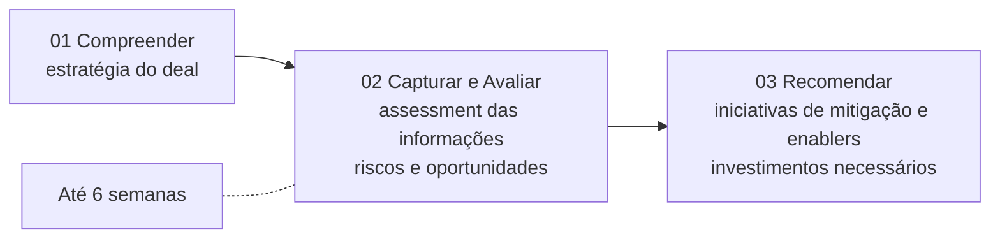
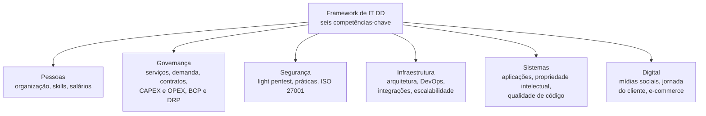
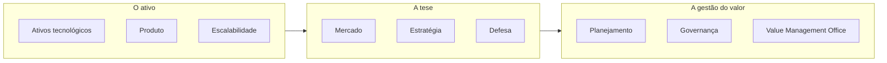
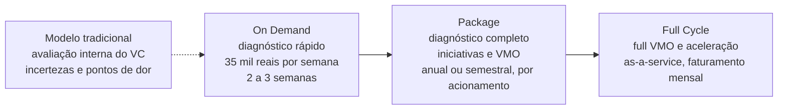
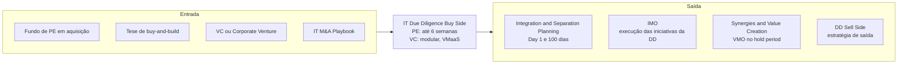

# IT Due Diligence (Buy Side)

> **Converte a tecnologia da empresa-alvo em insumo de decisão de investimento: riscos que mexem no valor do deal, investimentos necessários e iniciativas priorizadas. A profundidade é sob medida para Private Equity, e o formato é modular e recorrente para Venture Capital.** 💡

| Código | Família | Fase(s) do ciclo | Lado | Readiness (atual → alvo FY) | PO | Squad |
|---|---|---|---|---|---|---|
| ITMA-02 | Diligência 💡 | Pré-deal 🗂️ | Buy side: Private Equity e Venture Capital 🗂️ (variante Corporate em revisão) | 4,5 → 4,7 🗂️ | Matheus Teixeira 🗂️ | Julio F 🗂️ |

**Variantes cobertas por este dossiê** 🗂️

| Código | Linha no slide de status | Situação no status | Material no Deck Comercial | Readiness |
|---|---|---|---|---|
| ITMA-02 | IT Due Diligence (Private Equity) | Ativa | Seção "IT Due Diligence (Buy Side)", linhas 841–959 | 4,5 → 4,7 |
| ITMA-09 | ~~IT Due Diligence (Corporate)~~ | Tachada (em revisão) | Nenhuma seção própria | 3,2 → 3,9 |
| ITMA-10 | ~~IT Due Diligence (Venture Capital)~~ | Tachada (em revisão) | Seção "IT Due Diligence (Buy Side VC)", julho/2023, linhas 963–1063 | 2,5 → 3,5 |

**Em síntese** 💡

- **Oferta-âncora do portfólio.** Tem a maior readiness da service line (4,5 → 4,7) e é a mais completa do deck: metodologia com prazo, framework de seis competências, profundidade configurável, três cases nominais e um relatório-exemplo.
- **Duas lógicas sob o mesmo nome.** A variante PE é uma diligência pontual de riscos e recomendações, feita em até seis semanas. A variante VC é modular, com nove módulos orientados à tese de crescimento, e se estende para gestão de valor recorrente (modelos VMaaS). É a única do portfólio com preço explícito: R$ 35 mil por semana no On Demand.
- **A fronteira é o ponto fraco.** São três linhas no slide de status (PE ativa; Corporate e VC tachadas) para uma única caixa no catálogo ("PE or VC"). A variante VC tem o material comercial mais detalhado e, ainda assim, a readiness mais baixa das três (2,5). Corporate não tem material nenhum no deck.

---

## 1. Descrição oficial 🗂️

> "Identificar potenciais riscos ou problemas que possam influenciar no valor do deal, avaliar sinergias e garantir que os investimentos de TI serão considerados dentro do plano estratégico do deal."

*Fonte: slide "A&M é M&A", no Deck Comercial, sob o título "IT Due Diligence (Buy Side) PE or VC" (linha 367). O texto foi reconstruído das linhas 377, 385, 393, 401, 409 e 415 da extração, onde aparece intercalado com as descrições do Playbook, do Planning e do IMO. Confere com `descricao_oficial` em `data/ofertas.yaml`.*

**Nomes da oferta nas fontes**

| Fonte | Nome |
|---|---|
| Catálogo "A&M é M&A" 🗂️ | IT Due Diligence (Buy Side) PE or VC |
| Slide de status 🗂️ | IT Due Diligence (Private Equity) |
| Deck Comercial, títulos de seção 📘 | IT Due Diligence (Buy Side) · IT DD Buy Side · IT Due Diligence (Buy Side VC) |

**Posição no ciclo.** A fase Pré-deal segue a classificação de `data/ofertas.yaml`. A seção traz a régua "M&A Cycle" com cinco fases (Pré-deal, Sign-to-Close, 100 days, Hold period de cerca de 3 a 5 anos, Exit; linhas 857–859), mas a extração não preserva qual fase está destacada (trecho ambíguo na extração).

**Leitura da descrição** 💡: a descrição oficial assume três compromissos. O método do deck cobre dois deles de forma explícita.

| Compromisso da descrição oficial | Onde aparece no método do deck 📘 | Cobertura 💡 |
|---|---|---|
| Identificar riscos ou problemas que influenciam o valor do deal | Objetivo da diligência e etapa 02, Capturar & Avaliar (linhas 845 e 855); módulo Defesa, "Mapeamento de riscos" (linha 989) | Explícita |
| Avaliar sinergias | Nenhuma etapa, competência ou módulo menciona sinergias | **Lacuna**: o compromisso está na descrição, mas não no método |
| Garantir que os investimentos de TI entrem no plano estratégico do deal | Etapa 03, Recomendar, "bem como investimentos necessários" (linha 861); Governança (gestão financeira CAPEX/OPEX, linha 879); módulos Escalabilidade e Governança da variante VC (linhas 981 e 997) | Explícita |

---

## 2. O problema que resolve 📘

A seção PE não tem um slide de "dor do cliente". O problema aparece de três formas:

1. **No propósito do framework.** A IT DD da A&M "foi desenvolvida para auxiliar investidores na avaliação de empresas alvo" (linha 869). O investidor precisa entender como a empresa-alvo "está organizada atualmente" (linha 855) antes de decidir.
2. **Na descrição oficial.** Há riscos de TI que podem "influenciar no valor do deal", e os investimentos de TI podem ficar fora do plano estratégico (seção 1).
3. **Na variante VC, pelo contraste com o "Modelo Tradicional – Equipe Interna de VC"** (linhas 1017–1031). Nesse modelo, a Corporate ou o Venture Capital faz uma avaliação interna da startup ou investida, e o output descrito é:

| # | Output do modelo tradicional, segundo o deck ¹ |
|---|---|
| 1 | Incertezas |
| 2 | Produtos ineficazes |
| 3 | Tecnologias disfuncionais |
| 4 | Estresse do negócio e pontos de dor |

¹ *Trecho com intercalação nas linhas 1019–1031 ("Incertezas Produtos Ineficazes Disfuncionais / Tecnologias Estresse do / Negócio e Pontos de Dor"). A divisão em quatro itens é a única que produz expressões completas. Confirmar no slide original.*

*Contexto geral do deck (fora do intervalo, linhas 73–93):* envolver executivos de TI e de operações na due diligence é "uma sábia decisão", pelas contribuições sobre potenciais riscos, projeção de custos e a realidade prática da integração.

### A dor por trás de cada variante 💡

| Variante | Dor do cliente sem uma IT DD especializada | Sintoma típico |
|---|---|---|
| PE | O preço é fechado sem visibilidade de CAPEX e OPEX de TI ocultos (dívida técnica, licenças, segurança, dependência de pessoas-chave) | Ajuste de valor ou investimento não previsto depois do closing |
| PE | Riscos de TI ficam fora do SPA e do plano de 100 dias | Integração começa sem backlog priorizado |
| VC | A equipe interna do fundo avalia tecnologia sem profundidade técnica | Incertezas e tecnologias disfuncionais só aparecem depois do aporte |
| VC | A tese de crescimento não é testada contra a capacidade da plataforma | Custo de escalar subestimado; produto que não acompanha a tese |
| VC | Não há gestão de valor depois do investimento | "Estresse do negócio e pontos de dor" na investida sem plano de resposta |

---

## 3. Objetivo e escopo 📘

**Objetivo** (linha 845): a diligência de tecnologia tem por objetivo "mapear o cenário atual (As-Is), identificar riscos e oportunidades, bem como endereçá-los através de recomendações (iniciativas de mitigação e enablers)".

**Variante VC** (linha 969): "Nossa abordagem 'modular' é adaptável às necessidades dos VCs".

| Dimensão de escopo | Variante PE (Buy Side) | Variante VC (Buy Side VC, julho/2023) |
|---|---|---|
| Cliente | Investidores (linha 869); "Private Equity" no slide de status | "Corporate / Venture Capital" (linhas 1011, 1019–1021, 1037 e 1043) ² |
| Objeto da análise | Empresa-alvo (linhas 855 e 869) | "Startup / Investida" (linhas 1011, 1031 e 1039) |
| Estrutura do escopo | Seis competências com profundidade de 1 a 3 por disciplina (linhas 869–937) | Nove módulos combináveis (linhas 971–1005) |
| Prazo | Até 6 semanas (linha 853) | 2 a 3 semanas no On Demand; ciclo de investimento da startup no Package; sem prazo no Full Cycle (linhas 1015, 1057 e 1063) |
| Momento no ciclo | Pré-deal (catálogo; destaque na régua não recuperável) | Pré-investimento no On Demand 💡; ciclo de investimento no Package e no Full Cycle |
| O que fica fora do escopo | Não informado no deck | Não informado no deck |

² *"Corporate / Venture Capital" pode significar dois tipos de cliente (corporações e fundos de VC) ou o braço de investimento de uma corporação (Corporate Venture Capital). A grafia do deck não permite decidir. Ver pergunta 2 da seção 10.*

---

## 4. Abordagem A&M: como fazemos 📘

### 4.1 Metodologia em três etapas, até seis semanas 📘 (linhas 843–861)

| Nº | Etapa | O que acontece, segundo o deck |
|---|---|---|
| 01 | **Compreender** | Alinhamento para entendimento da estratégia do deal. |
| 02 | **Capturar & Avaliar** | Assessment das informações recebidas para identificar riscos e oportunidades no modo como a empresa-alvo está organizada atualmente. |
| 03 | **Recomendar** | Endereçamento dos riscos e oportunidades por meio de recomendações, com os investimentos necessários. |

A divisão das seis semanas entre as etapas não é informada no deck.

### 4.2 Framework de IT DD: seis competências-chave 📘 (linhas 869–887)

| # | Competência | O que é avaliado, segundo o deck |
|---|---|---|
| 1 | **Pessoas** | Estrutura organizacional, distribuição de equipes, skills do time, benchmark de salários, modelos de contratação |
| 2 | **Governança** | Modelo de atendimento, maturidade de gestão de serviços, gestão de demanda e projetos, contratos, gestão financeira (CAPEX/OPEX), BCP, DRP |
| 3 | **Segurança** | Light pentest (web e network), modelo e práticas aplicadas, ISO 27001 |
| 4 | **Infraestrutura** | Arquitetura, ambiente, aderência, modelo de contratação, recursos de DevOps, integrações, escalabilidade |
| 5 | **Sistemas** | Aplicações versus processos de negócio, linguagens, tecnologias, propriedade intelectual, modelo de propriedade, qualidade de software, qualidade de código, versionamento |
| 6 | **Digital** | Mídias sociais, jornada do cliente, e-commerce |

*Os títulos das competências e os textos aparecem separados na extração. A correspondência foi feita pela ordem e pelo conteúdo, sem ambiguidade relevante.*

### 4.3 Sob medida: profundidade por disciplina 📘 (linhas 891–941)

A pergunta que abre o slide é "Qual o enfoque da diligência?". Cada uma das seis disciplinas recebe um nível de profundidade de 1 a 3. O deck traz três exemplos de configuração:

| Disciplina | Cenário A: foco em Sistemas e Digital | Cenário B: foco em Sistemas, Governança e Digital | Cenário C: foco em Infraestrutura, Pessoas, Sistemas e Segurança ³ |
|---|:---:|:---:|:---:|
| Pessoas | 1 | 1 | **3** |
| Governança | 2 | **3** | 1 |
| Segurança | 1 | 1 | **3** |
| Infraestrutura | 1 | 1 | **3** |
| Sistemas | **3** | **3** | **3** |
| Digital | **3** | **3** | 1 |
| Soma dos níveis 💡 | 11 de 18 | 12 de 18 | 14 de 18 |

**Como o deck descreve cada cenário** (reconstruído das linhas 917–937):

- **Cenário A:** entrega em nível 1 de Pessoas, Segurança e Infraestrutura, nível 2 de Governança e "enfoque prioritário" em Sistemas e Digital.
- **Cenário B:** entrega em nível 1 de Pessoas, Segurança e Infraestrutura, com enfoque prioritário em Sistemas, Digital e Governança.
- **Cenário C:** entrega em nível 1 de Digital e Governança, "passando detalhadamente" por Sistemas, Infraestrutura, Pessoas e Segurança.

³ *Reconstrução. Os textos dos cenários B e C vêm intercalados linha a linha (linhas 929–937), e o título do cenário C termina na linha 931 ("E SEGURANÇA"). A leitura adotada é a única em que os textos batem com as seis linhas de números das grades (linhas 903–923), lidas na ordem Pessoas, Governança, Segurança / Infraestrutura, Sistemas, Digital. A correspondência entre os cenários e os rótulos "Exemplo 1", "Exemplo 2" e "Exemplo 3" (linhas 897, 939 e 941) não é recuperável com segurança na extração.*

**Escala de profundidade.** O deck associa o nível 3 a "enfoque prioritário" e a passar "detalhadamente" pela disciplina, e o nível 1 a uma entrega básica. A definição formal de cada nível (atividades, evidências, esforço) não é informada no deck.

💡 **Leitura.**

- Sistemas é nível 3 nos três exemplos: é o núcleo invariável da diligência.
- A soma dos níveis (de 6 a 18) funciona como um índice simples de esforço e pode ancorar preço e prazo por configuração. O deck não faz essa ligação.
- O cenário C é típico de ativos industriais ou de operação intensiva; os cenários A e B, de ativos digitais ou de varejo. É uma hipótese a validar com o PO.

### 4.4 Variante VC: abordagem modular 📘 (linhas 963–1005, julho/2023)

| # | Módulo | O que cobre, segundo o deck |
|---|---|---|
| 1 | **Ativos tecnológicos** | Propriedade intelectual; hardware; software; licenças; contratos |
| 2 | **Mercado** | Avaliação de posicionamento de mercado; potenciais gaps de clientes; concorrência |
| 3 | **Escalabilidade** | Habilidade e robustez para crescer de acordo com as alavancas de valor da tese; estimativa de custos para atender o crescimento |
| 4 | **Estratégia** | Estratégia de compra (stand-alone, market-extension, product-extension etc.); plano de crescimento; estratégia de investimento; estratégia futura de saída |
| 5 | **Defesa** | Potencial risco de adoção de tecnologias por competidores; cibersegurança; mapeamento de riscos |
| 6 | **Planejamento** | Revisar e avaliar drivers e alavancas de investimento da target; avaliar e entender indicadores de performance financeira; modelo de reporting |
| 7 | **Governança** | Qualidade do desenvolvimento; avaliação do roadmap tecnológico; avaliação do time de TI; avaliação de custos e estimativas de investimento |
| 8 | **Value Management Office** | Maturidade de processos da target; mapeamento de iniciativas de investimento e desinvestimento, estratégicas e operacionais; plano ou roadmap de melhoria de valor; monitoramento contínuo do valor de projetos e iniciativas |
| 9 | **Produto** | Cenário atual e proposto de caso de uso do produto ou serviço; maturidade do produto ou serviço; abertura de mercado |

**Agrupamento proposto** 💡 (não consta do deck):

### 4.5 PE versus VC: o que muda 💡

| Competência da variante PE | Módulos equivalentes na variante VC | Observação |
|---|---|---|
| Pessoas | Governança (avaliação do time de TI) | Na VC, pessoas entram como parte da governança |
| Governança | Governança; Planejamento | A VC acrescenta indicadores financeiros e modelo de reporting |
| Segurança | Defesa (cibersegurança, mapeamento de riscos) | A VC amplia para risco competitivo de tecnologia |
| Infraestrutura | Ativos tecnológicos (hardware); Escalabilidade | A VC liga a infraestrutura às alavancas da tese |
| Sistemas | Ativos tecnológicos (software, propriedade intelectual, licenças); Governança (qualidade do desenvolvimento, roadmap) | Equivalência direta |
| Digital | Produto; Mercado | A VC avalia o produto como tese de mercado, não só como canal |
| Sem equivalente | Estratégia; Value Management Office | **Novidades da VC**: estratégia de compra e saída e gestão contínua de valor |

**Leitura.** A variante PE olha para a TI como **risco e custo a precificar**. A variante VC olha para a tecnologia como **o próprio ativo e a tese de crescimento**, e estende a relação para depois do aporte via VMO. Isso explica por que só a variante VC tem modelos de engajamento recorrentes (seção 6).

---

## 5. Entregáveis 📘

### 5.1 Variante PE 📘

O intervalo da seção PE não tem um slide intitulado "Entregáveis". Os produtos do trabalho estão descritos na metodologia e no framework:

| # | Entregável | Origem no deck |
|---|---|---|
| 1 | Mapeamento do cenário atual (As-Is) da TI da empresa-alvo | Objetivo, linha 845 |
| 2 | Riscos e oportunidades identificados | Linhas 845 e 855 |
| 3 | Avaliação das seis competências, na profundidade contratada (níveis 1 a 3) | Linhas 869–937 |
| 4 | Recomendações: iniciativas de mitigação e enablers | Linhas 845 e 859–861 |
| 5 | Investimentos necessários para endereçar riscos e oportunidades | Linha 861 |
| 6 | Iniciativas mapeadas que servem de base para o plano de integração | Case Virutex Ilko, linha 959 |

### 5.2 Variante VC: saídas por módulo 📘

O deck não traz lista de entregáveis da variante VC. As saídas explícitas nos módulos são:

| Módulo | Saída explícita no texto do módulo |
|---|---|
| Escalabilidade | Estimativa de custos para atender o crescimento |
| Defesa | Mapeamento de riscos |
| Planejamento | Modelo de reporting |
| Governança | Estimativas de investimento |
| Value Management Office | Mapeamento de iniciativas de investimento e desinvestimento; plano ou roadmap de melhoria de valor; monitoramento contínuo de valor |
| Demais módulos | Avaliações (posicionamento, maturidade, estratégia); formato do entregável não informado no deck |

### 5.3 Exemplo de relatório de IT DD 📘

O deck traz, logo depois desta seção, um exemplo detalhado de relatório de IT DD sob o título "Entregáveis (Exemplos)", datado de **julho de 2023** (linhas 1067–1788 da extração). Ele é tratado em um anexo próprio: **[Exemplo de relatório de IT DD](anexos/it-dd-relatorio-exemplo.md)**.

O anexo documenta a estrutura do relatório de forma anonimizada: findings organizados pelas seis competências, assessment de disciplinas, matriz de risco, recomendações com prazo, CAPEX e OPEX em cenários, e avaliação de maturidade As-Is, entre outras peças. Este dossiê não reproduz o conteúdo.

💡 O exemplo tem a mesma data da variante VC (julho/2023), mas segue as seis competências da variante PE. Isso sugere que o framework de seis competências é o formato de entrega comum às duas variantes. Confirmar com o PO.

---

## 6. Modelo comercial, prazo e equipe 📘

### 6.1 Variante PE 📘

| Dimensão | O que o deck informa |
|---|---|
| Prazo | Até 6 semanas (linha 853) |
| Modularidade | Profundidade "sob medida", de 1 a 3 por disciplina (linhas 891–937) |
| Preço / modelo de investimento | Não informado no deck |
| Modelo de contratação | Não informado no deck |
| Equipe | Não informado no deck |

### 6.2 Variante VC: modelos VMaaS 📘 (linhas 1007–1063)

| Modelo | Núcleo do serviço ⁴ | Modelo de investimento | Modelo de contratação | Prazo | Output ⁴ |
|---|---|---|---|---|---|
| **VMaaS On Demand** | Diagnóstico rápido da startup ou investida, ao lado da avaliação interna do cliente | R$ 35 mil por semana | On-Demand | 2 a 3 semanas | Investimento assertivo pontual |
| **VMaaS Package** | Diagnóstico completo; implementação de iniciativas e VMO | Pacote de serviços (consumo por acionamento) | Anual / semestral | Ciclo de investimento da startup | Garantir a valorização do investimento |
| **VMaaS Full Cycle** | Full VMO e aceleração; gestão do portfólio e dos investimentos e iniciativas; "solid foundation" de investidas | Parceria, com faturamentos mensais | As-a-Service | "–" (não definido no deck) | Maximização do investimento ("State of Art") |
| *Referência: Modelo Tradicional* | *Avaliação interna pela equipe do VC* | *n/a* | *n/a* | *n/a* | *Incertezas, produtos ineficazes, tecnologias disfuncionais, estresse do negócio e pontos de dor* |

⁴ *Trecho ambíguo na extração. Os cartões dos modelos aparecem intercalados (linhas 1007–1063), sobretudo Package e Full Cycle. As condições comerciais de cada modelo (investimento, contratação, prazo) estão em linhas íntegras e não deixam dúvida. Já a alocação de "Gestão do Portfólio e Investimentos / Iniciativas" (linha 1047), de "Solid Foundation de Investidas" (linha 1055) e dos outputs entre Package e Full Cycle é uma leitura provável, feita pela progressão de escopo entre os modelos. Confirmar no slide original.*

*A leitura do diagrama como escada de engajamento é 💡 análise. O deck apresenta os três modelos lado a lado.*

**Sigla VMaaS.** O deck não a expande. Pela presença do módulo Value Management Office e da sigla VMO nos modelos, a leitura provável é "Value Management as a Service" 💡.

### 6.3 Implicações comerciais 💡

- **Ticket de entrada da VC.** Pelos parâmetros do deck, um On Demand custa de R$ 70 mil (2 semanas) a R$ 105 mil (3 semanas). É um preço de entrada baixo, desenhado para conversão em Package ou Full Cycle.
- **PE sem preço.** A variante mais madura do portfólio não tem modelo de investimento no deck. Uma régua de preço por configuração (soma dos níveis da seção 4.3) daria previsibilidade comercial sem perder o "sob medida".
- **Data do preço.** O valor de R$ 35 mil por semana vem de material de julho/2023 e precisa de confirmação de vigência antes de uso comercial.
- **Recorrência.** Package e Full Cycle são os únicos modelos recorrentes do portfólio documentados no deck. Eles aproximam a DD VC de IT Synergies & Value Creation ("Value Creation as a Service"). Ver seção 8.

---

## 7. Clientes e cases 📘

| Cliente | Contexto | O que a A&M fez | Resultado informado | Linha |
|---|---|---|---|---|
| **CERC** | Primeira registradora de recebíveis de crédito autorizada pelo Banco Central do Brasil | IT DD para um possível investimento do **Mubadala Capital** | Não informado no deck | 953 |
| **Virutex Ilko** | Companhia de consumer goods sediada em Santiago (Chile), fabricante de produtos de limpeza e utensílios de cozinha, com presença na Argentina, Colômbia, Peru, México e Ásia | IT DD | **17 iniciativas** mapeadas para endereçar riscos e oportunidades, base do plano de integração | 959 |
| **Braveo** | Tese de distribuição indireta de FMCG (Fast Moving Consumer Goods) | Desenho da arquitetura, IT DDs e planejamentos de PMI de **4 das 15 investidas** da tese | **35 iniciativas** de 2 investidas planejadas para o plano de 100 dias. Segundo o deck, o planning do PMI acelera as demais aquisições no modelo de rollout e prepara o IMO | 957 |

**Outras informações do slide**

- O slide tem o bloco "Clientes que escolhem A&M" (linha 949), mas os logos não são extraíveis como texto.
- O Braveo está sob o rótulo "Cases recentes com grande envolvimento A&M" (linha 955) e reaparece, com redação quase idêntica, na seção de Integration & Separation Planning (linha 2291).
- *Referência cruzada, fora do intervalo:* na seção de Integration & Separation Planning, a A&M executou para a **Plurix** (holding do Pátria Investimentos no varejo regional) a ITDD de **6 targets**, além da arquitetura de referência da tese, do planejamento das integrações e do PMI de TI do D1 ao D100 (linha 2289).

**Cases da variante VC:** não informados no deck.

💡 **Leitura.** Os cases mostram a DD como **porta de entrada**. Em Virutex Ilko, as iniciativas da DD viram a base do plano de integração. Em Braveo e Plurix, a DD faz parte de uma tese de buy-and-build que leva a arquitetura, planejamento, PMI e IMO. Os três cases são de investidores financeiros (fundos) ou de teses de PE. Nenhum é de comprador estratégico (Corporate) nem de VC, o que reforça as perguntas sobre as linhas tachadas.

---

## 8. Conexões no ciclo de M&A 💡

**Entrada (de onde vem a demanda)**

- **Fundos de PE em processo de aquisição:** abertura de data room, carta de intenções, ativo com TI crítica para a tese.
- **Plataformas de buy-and-build:** cada nova aquisição da tese gera uma DD (Braveo, Plurix).
- **VCs e Corporate Venture:** rodada de investimento ou acompanhamento de portfólio de startups.
- **IT M&A Playbook:** a área de foco "IT Due Diligence" do Playbook entrega ao cliente o framework de DD. Quando o cliente não tem capacidade interna para um deal específico, a DD é contratada como serviço.

**Saída (pull-through), com evidência no deck**

| Oferta de destino | Evidência no Deck Comercial 📘 |
|---|---|
| IT Integration & Separation Planning (ITMA-04) | Virutex Ilko: as iniciativas da DD foram "base para o plano de integração" (linha 959). O Planning lista como benefício a visão da área de TI "aprofundando o entendimento da IT DD" (linhas 2155–2163) |
| IT Integration Management Office (ITMA-05) | O IMO prevê a "execução das iniciativas mapeadas na diligência" (linha 2345). No Braveo, o planning do PMI "prepara o IMO" (linha 957) |
| IT Synergies & Value Creation (ITMA-08) | VMaaS Package e Full Cycle (VMO, gestão de portfólio, monitoramento contínuo de valor) atuam no hold period (linhas 999 e 1033–1063) |
| IT Due Diligence (Sell Side) (ITMA-07) | O módulo Estratégia da variante VC inclui a "estratégia futura de saída" (linha 985) |

**Taxonomias diferentes entre ofertas.** As seis competências da DD (Pessoas, Governança, Segurança, Infraestrutura, Sistemas, Digital) não coincidem com as cinco dimensões usadas no Planning (Pessoas, Processos, Aplicações, Infraestrutura, Governança) nem com as da DD Sell Side. A passagem da DD para o Planning exige retradução dos achados. Ver o achado transversal em [Reconciliação de fontes](../docs/06-reconciliacao-de-fontes.md).

**Fronteira com Value Creation.** A variante VC, com VMO e modelos as-a-service, e a oferta IT Synergies & Value Creation ("Value Creation as a Service") atendem ao mesmo comprador, o investidor, no hold period. As duas linhas têm o mesmo PO (seção 9). Convém decidir se o VMaaS é o modelo comercial do Value Creation as a Service ou uma oferta distinta.

---

## 9. Maturidade e governança 🗂️

> *Uso interno. Esta seção traz nomes de profissionais vindos de `data/governanca.yaml` e não deve ser publicada fora da A&M.*

### Readiness

| Indicador | ITMA-02 · DD (Private Equity) | ITMA-09 · ~~DD (Corporate)~~ | ITMA-10 · ~~DD (Venture Capital)~~ | Service line IT M&A |
|---|---|---|---|---|
| Readiness atual | **4,5** | 3,2 | 2,5 | 3,29 |
| Readiness alvo FY | **4,7** | 3,9 | 3,5 | 3,95 |
| Evolução planejada | +0,2 | +0,7 | +1,0 | +0,66 |
| Nível atual (escala oficial) | 4 · Oferta estruturada · risco baixo | 3 · Oferta definida · risco médio | 2 · Oferta inicial · risco alto | n/a |
| Nível alvo FY | 4 · Oferta estruturada · risco baixo | 3 · Oferta definida · risco médio | 3 · Oferta definida · risco médio | n/a |

*Escala do slide de status: 1 Oferta incompleta (risco muito alto) · 2 Oferta inicial (alto) · 3 Oferta definida (médio) · 4 Oferta estruturada (baixo) · 5 Oferta otimizada (muito baixo). A média da service line é simples, sobre as 10 linhas, incluindo as três tachadas.*

💡 **Posição relativa.**

- **ITMA-02 lidera o portfólio** no readiness atual (4,5; a seguinte é o Planning, com 4,0) e no alvo FY (4,7). Fica 1,21 ponto acima da média atual da service line e tem a menor evolução planejada (+0,2): a oferta está em fase de otimização, não de construção.
- **Lida como família**, a DD Buy Side é bem menos madura do que a linha PE sugere. A média simples das três linhas é 3,4 hoje e 4,03 no alvo FY.
- **O paradoxo da variante VC.** É a variante com mais detalhe comercial no deck (preço, três modelos, prazo), mas tem readiness 2,5. Pesam provavelmente a falta de cases VC, de equipe-tipo e de entregáveis próprios, e o material datado de julho/2023.

### Governança

| Papel | ITMA-02 · DD (Private Equity) | ITMA-09 · ~~DD (Corporate)~~ | ITMA-10 · ~~DD (Venture Capital)~~ |
|---|---|---|---|
| Líder da service line | Thiago Vieira | Thiago Vieira | Thiago Vieira |
| Product Owner | Matheus Teixeira | Thiago Lorusso | Guilherme Brein |
| Squad | Julio F | Victor F, Thais M | Tatiane N, Thais M |
| Status no fluxo (Pendente de Avaliação → Em Avaliação do PO → Pendente de Aprovação → Aprovada) | Vazio no slide | Vazio no slide | Vazio no slide |
| Situação no slide de status | Ativa | Tachada | Tachada |

**Aviso do slide:** "POs e Membros serão reajustados".

💡 **Observações.**

- **Três POs para uma única caixa do catálogo.** Se Corporate e VC forem consolidadas na Buy Side, a governança precisa de um único dono, ou de um dono por variante com regras de fronteira claras.
- **Ligação VC e Value Creation.** Guilherme Brein é PO da DD Venture Capital e de IT Synergies & Value Creation. A sobreposição de PO reforça a hipótese de que o VMaaS e o Value Creation as a Service são a mesma proposta vista de dois ângulos.
- **Ligação Corporate e Playbook.** Thiago Lorusso é PO da DD Corporate, do IT M&A Playbook e do Integration & Separation Planning. Para compradores estratégicos, o Playbook (DD conduzida internamente) pode ser o veículo natural, caso a linha Corporate seja descontinuada.
- **Squad enxuto na linha mais madura.** Julio F é o único membro do squad da ITMA-02. Thais M está nos squads das duas linhas tachadas, o que indica um provável núcleo de reaproveitamento caso elas sejam consolidadas.

---

## 10. Lacunas e perguntas em aberto 💡

**Lacunas de fonte**

1. Preço e modelo de contratação da variante PE: não informados no deck.
2. Equipe-tipo (papéis, senioridade, dedicação), nas duas variantes: não informada.
3. Definição formal dos níveis de profundidade 1, 2 e 3 e seu efeito em prazo e preço: não informada.
4. Divisão das seis semanas entre as etapas Compreender, Capturar & Avaliar e Recomendar: não informada.
5. Método para "avaliar sinergias", compromisso da descrição oficial: ausente da metodologia.
6. Lista de entregáveis e cases da variante VC: não informados.
7. Prazo do VMaaS Full Cycle: "–" no deck.
8. Fase destacada na régua "M&A Cycle" da seção: não recuperável na extração.
9. Variante Corporate: sem nenhum material no deck.
10. One-pager 📎: pendente de ingestão.

**Perguntas para o PO e a liderança**

1. **Linhas tachadas (motivo não explicado no slide; tratadas como "em revisão").**
   - ~~IT Due Diligence (Corporate)~~: foi consolidada na Buy Side, descontinuada ou pausada? Se foi consolidada, por que o catálogo fala apenas em "PE or VC"? Se foi descontinuada, como a A&M atende compradores estratégicos: pela Buy Side, pelo IT M&A Playbook ou por outra via?
   - ~~IT Due Diligence (Venture Capital)~~: a seção "Buy Side VC" de julho/2023 é a versão vigente dessa linha? A caixa "PE or VC" do catálogo absorveu a variante VC?
   - O readiness 4,5 da ITMA-02 vale também para a variante VC, ou só para PE? E as metas 3,9 (Corporate) e 3,5 (VC) continuam valendo depois da revisão?
2. **"Corporate / Venture Capital"** nos diagramas VMaaS designa dois tipos de cliente ou o Corporate Venture Capital? A resposta muda a relação com a linha Corporate tachada.
3. **Preço.** A taxa de R$ 35 mil por semana (julho/2023) segue vigente? Aplica-se, como referência, à variante PE?
4. **Níveis 1 a 3.** Que atividades e evidências definem cada nível? Existe régua de preço e prazo por configuração?
5. **Sinergias.** Como a DD cumpre o compromisso de "avaliar sinergias" da descrição oficial? Isso fica com o Planning ou com o Value Creation?
6. **VMaaS.** Qual é a sigla por extenso? O VMaaS é o modelo comercial do "Value Creation as a Service" (ITMA-08) ou uma oferta distinta? Onde termina a DD VC e começa o Value Creation?
7. **Package.** Como se combinam a contratação "anual / semestral" e o prazo "ciclo de investimento da startup"? O pacote é renovável até o exit?
8. **Reconstruções a confirmar no slide original:**
   - a correspondência entre os cenários A, B e C e os rótulos "Exemplo 1, 2 e 3";
   - a alocação de conteúdos e outputs entre Package e Full Cycle;
   - os quatro outputs do modelo tradicional.
9. **Cases.** O resultado do case CERC (decisão de investimento, ajustes) pode ser divulgado? Há cases de VC ou de compradores estratégicos para a ficha comercial?
10. **One-pager.** O que o "One-pagers DTS.pptx" traz sobre esta oferta e suas variantes? Está pendente de ingestão.

---

## Fontes

- 📘 **Deck Comercial — "Deck Comercial - DIGITAL & TECHNOLOGY SERVICES - M&A - Full v7"**, seções IT Due Diligence (Buy Side) e IT Due Diligence (Buy Side VC), **linhas 841–1066 da extração**:
  - escopo e metodologia: linhas 841–861;
  - abordagem A&M e framework de IT DD: linhas 865–887;
  - sob medida, profundidade por disciplina: linhas 891–941;
  - clientes e cases: linhas 945–959;
  - variante VC (julho/2023), abordagem modular: linhas 961–1005;
  - modelos VMaaS e modelo tradicional: linhas 1007–1063.
- 📘 **Anexo:** exemplo de relatório de IT DD, linhas 1067–1788 da extração, tratado em [anexos/it-dd-relatorio-exemplo.md](anexos/it-dd-relatorio-exemplo.md). Aqui, apenas referenciado.
- 🗂️ **Slide "A&M é M&A"**, no Deck Comercial: linhas 361–445 da extração. A descrição da oferta foi reconstruída das linhas 367, 377, 385, 393, 401, 409 e 415 e confere com `descricao_oficial` em `data/ofertas.yaml`.
- 🗂️ **Slide "Status das Ofertas – IT M&A"**, via `data/ofertas.yaml` (readiness e escala das linhas ITMA-02, ITMA-09 e ITMA-10) e `data/governanca.yaml` (PO, squad, liderança e aviso do slide).
- **Referências cruzadas no Deck Comercial**, fora do intervalo e usadas só para contexto:
  - linhas 73–93: TI e operações na due diligence;
  - linhas 2155–2163: benefício do Planning ligado à IT DD;
  - linhas 2289–2291: cases Plurix e Braveo na seção de Planning;
  - linha 2345: execução, no IMO, das iniciativas mapeadas na diligência.
- 📎 **One-pagers DTS.pptx:** pendente de ingestão; não utilizado.
- **Notas de método:**
  - O PDF tem layout em colunas, e a extração intercala frases de colunas vizinhas. As reconstruções estão sinalizadas no texto (notas ¹ a ⁴).
  - Foram corrigidos erros evidentes de digitação sem mudar o sentido: "M&A Cicle" virou "M&A Cycle", "INSFRAESTRUTURA" virou "Infraestrutura", "salarios" virou "salários", "mapeadadas" virou "mapeadas", "Colombia" virou "Colômbia", "TECNOLOGICOS" virou "Tecnológicos", "continuo" virou "contínuo" e "Cybersegurança" virou "cibersegurança". Palavras coladas na extração foram separadas ("iniciativasde", "15investidas").
  - Os campos `analise.*` de `data/ofertas.yaml` são hipóteses anteriores e não foram usados como fonte.
