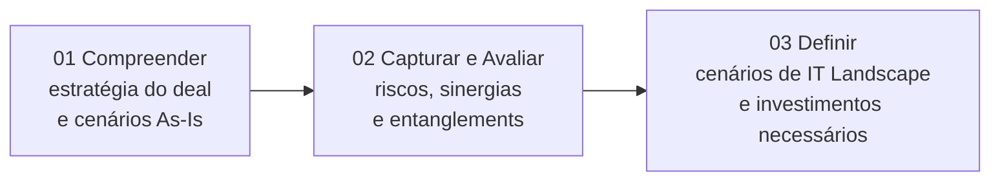
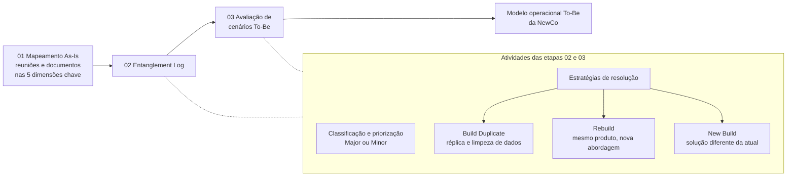
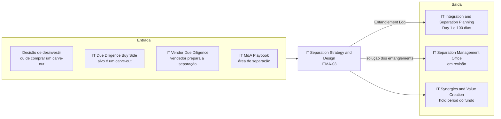

# IT Separation Strategy & Design

> **Transforma o emaranhado de TI de um carve-out em uma estratégia de separação decidida: entanglements mapeados e priorizados, cenários To-Be avaliados e a TI futura da NewCo definida, com o menor impacto operacional.** 💡

| Código | Família | Fase(s) do ciclo | Lado | Readiness (atual → alvo FY) | PO | Squad |
|---|---|---|---|---|---|---|
| ITMA-03 | Estratégia & Design 💡 | Pré-deal 💡 (ver seção 1) | Fundo investidor nos dois cases 📘; Corporate em desinvestimento 💡 | 3,6 → 4,1 🗂️ | Heitor Milani 🗂️ | Marcela B 🗂️ |

**Em síntese** 💡

- **O que é.** É a oferta de desenho da separação de TI em carve-outs. Ela mapeia os entanglements em cinco dimensões (Pessoas, Processos, Aplicações, Infraestrutura e Governança), classifica-os em Major ou Minor, avalia estratégias de resolução (Build Duplicate, Rebuild e New Build) e define o landscape de TI e o modelo operacional To-Be da NewCo, com suporte à definição do TSA.
- **Documentação robusta no deck.** A seção traz fatores críticos de sucesso, escopo em três etapas, cinco dimensões, método de entanglements, fluxo de "como fazemos", seis entregáveis-exemplo e dois cases nomeados com escala: mais de 50 e mais de 67 entanglements mapeados, ambos com o Mubadala.
- **Maturidade acima da média.** Com readiness 3,6 (nível 3, "Oferta definida"), a oferta é a 4ª entre as 10 linhas e fica acima da média da service line (3,29). As lacunas são comerciais (preço, prazo, equipe) e de formato dos entregáveis, não de método.
- **Posição estratégica.** Com o IT Separation Management Office (SMO) tachado no slide de status, esta é a única oferta ativa dedicada exclusivamente a separação. Ela é a porta de entrada da cadeia de separação: desenho, planejamento de Day 1 e execução.

---

## 1. Descrição oficial 🗂️

> "Definição da estratégia de TI para a separação, através do diagnóstico da estrutura atual, mapeamento dos entanglements e definição dos cenários de separação, construindo o landscape de TI futuro."

*Fonte: slide "A&M é M&A", no Deck Comercial. O texto foi reconstruído das linhas 423 e 427–437 da extração, onde aparece intercalado com a descrição do IT Separation Management Office (SMO), e confere com `descricao_oficial` em `data/ofertas.yaml`.*

**Posição no ciclo.** O slide de escopo da oferta traz a régua do ciclo de M&A (Pré-deal, Sign-to-Close, 100 days, Hold period de ~3 a 5 anos e Exit) e o marcador "Momento recomendado para início" (linhas 705–709). A fase marcada, porém, não é recuperável na extração de texto (trecho ambíguo na extração). A classificação Pré-deal segue `data/ofertas.yaml`. 💡 Os cases descrevem "avaliação e planejamento do carve-out" (linha 837), o que é coerente com o Pré-deal e o início do Sign-to-Close.

**Leitura da descrição** 💡: os três movimentos da descrição oficial correspondem às três etapas do escopo (seção 4.1).

| Movimento da descrição oficial | Etapa do escopo |
|---|---|
| Diagnóstico da estrutura atual | 01 Compreender |
| Mapeamento dos entanglements | 02 Capturar & Avaliar |
| Definição dos cenários de separação, construindo o landscape de TI futuro | 03 Definir |

---

## 2. O problema que resolve 📘

O deck abre a seção com a premissa de que, além dos desafios próprios das transações de carve-out, é essencial "atenção especial à mitigação de riscos e prevenção de ruptura das operações de TI existentes" (linha 645).

### 2.1 Fatores críticos de sucesso do carve-out 📘 (linhas 647–687)

O slide "Overview: Fatores Críticos de Sucesso Carve-Out" organiza o problema em quatro pilares.

| # | Pilar | Itens citados no deck |
|---|---|---|
| 1 | **Catalisar as oportunidades** | A formação da NewCo é "uma oportunidade de se revisar e otimizar pilares críticos de TI": (i) estrutura organizacional; (ii) processos; (iii) arquitetura de sistemas; (iv) infraestrutura; (v) governança. |
| 2 | **Minimizar a quebra de sinergias** | (i) Revisão dos contratos e acordos essenciais ao negócio; (ii) redução de despesas one-time; (iii) avaliação dos níveis atuais de suporte e serviço de TI. |
| 3 e 4 | **Manutenção da integridade da operação** e **Mitigar riscos e disputas** ¹ | (a) Entanglements, riscos e planos de ação bem planejados e executados; (b) suporte à operacionalização e ao planejamento das atividades do TSA; (c) implementação do plano de transição; (d) definição de papéis e responsabilidades no TSA; (e) reconciliação dos custos da transação; (f) definição dos comitês de gestão e dos processos de resolução de problemas. |

¹ *Trecho ambíguo na extração. Os seis itens vêm em sequência logo após o título "Manutenção da integridade da operação" (linha 673). O título "Mitigar riscos e disputas" aparece depois de todos eles (linha 687), sem itens próprios. Não é possível atribuir cada item a um pilar. Leitura provável 💡: os itens (a) a (c) sustentam a integridade da operação, e os itens (d) a (f) previnem disputas entre o vendedor e a NewCo. Confirmar no slide original.*

### 2.2 A dor por trás de cada pilar 💡

| Pilar | O que acontece quando é negligenciado | Sintoma típico |
|---|---|---|
| Catalisar as oportunidades | A NewCo herda a TI do vendedor "como está", com dívida técnica e custo dimensionado para outro porte | TI cara e pouco aderente ao novo negócio já no primeiro ano |
| Minimizar a quebra de sinergias | Perda de escala em contratos, licenças e suporte, sem plano de mitigação | Custos one-time acima do previsto e queda do nível de serviço |
| Manutenção da integridade da operação | Dependências não mapeadas aparecem no Day 1 | Ruptura operacional e TSA que se prolonga além do planejado |
| Mitigar riscos e disputas | Escopo, custos e responsabilidades do TSA mal definidos | Conflitos entre vendedor e comprador sobre serviços e valores |

---

## 3. Objetivo e escopo 📘

**Objetivo** (linha 693): a abordagem A&M é "focada na estratégia, alinhada com o cenário presente e objetivos futuros do negócio". O slide de escopo fala em "integrações ou separações", embora a oferta seja dedicada à separação (ver pergunta 11 na seção 10).

**Promessa da abordagem** (linha 717): uma abordagem de ponta a ponta, adaptável às necessidades das empresas, que fornece um "plano estratégico robusto para o processo de separação da TI, tendo como foco a mitigação do impacto operacional".

**Premissa de método** (linha 747): "Para definir o modelo operacional To-Be, é necessário avaliar todos os entanglements e definir como serão resolvidas as dependências".

| Dimensão de escopo | O que o deck informa |
|---|---|
| Tipo de transação | Carve-out (linhas 645, 647, 833 e 837) |
| Entidade para a qual a TI é desenhada | A NewCo (linhas 653, 723, 727, 735, 743 e 789) |
| Dimensões cobertas | Pessoas, Processos, Aplicações, Infraestrutura e Governança (linhas 719–743) |
| Horizonte | Do entendimento da estratégia do deal à definição dos cenários de IT Landscape e dos investimentos necessários (linhas 699–703) |
| Lado do deal | Não informado de forma explícita. No Case 2 o contratante é o fundo (linha 837); o Case 1 não identifica o contratante. |
| O que fica fora do escopo | Não informado no deck. 💡 A execução da separação (transição de serviços, sistemas e ativos e solução dos entanglements) é descrita no catálogo como escopo do SMO (linhas 425–439). |

### 3.1 Conceitos-chave 💡

*Definições de apoio para leitores fora da prática. Não são conteúdo do deck.*

| Termo | Definição |
|---|---|
| Carve-out | Separação de uma unidade, ativo ou operação de um grupo para formar uma entidade independente ou ser transferida a um comprador. |
| NewCo | A nova empresa resultante da separação. No deck, é a entidade para a qual a TI futura é desenhada. |
| Entanglement | Dependência compartilhada entre a parte separada e o grupo de origem (sistema, contrato, licença, infraestrutura, processo ou pessoa) que precisa ser resolvida para a separação. |
| TSA (Transition Services Agreement) | Acordo pelo qual o vendedor continua prestando serviços à NewCo por prazo determinado depois do closing, até que ela opere de forma autônoma. |
| Custos one-time | Custos não recorrentes da separação, como replicação de sistemas, migração de dados e contratação de infraestrutura. |
| Stranded costs | Custos que perdem sua base de rateio com a separação, normalmente no grupo vendedor. O deck os associa aos "Stranded Costs de TI da NewCo" (linha 743); o recorte exato deve ser confirmado com o PO. |
| Major e Minor Entanglements | Classificação usada pelo deck para priorizar esforços (linhas 773–775). Os critérios de corte não são informados. |

---

## 4. Abordagem A&M: como fazemos 📘

### 4.1 Escopo em três etapas 📘 (linhas 691–703)

| Nº | Etapa | O que acontece, segundo o deck |
|---|---|---|
| 01 | **Compreender** | Alinhamento para entender a estratégia do deal e os cenários As-Is. |
| 02 | **Capturar & Avaliar** | Assessment das informações recebidas para identificar riscos, sinergias ou entanglements no modo como a [empresa] está organizada atualmente. ² |
| 03 | **Definir** | Definição de cenários de IT Landscape para viabilizar a estratégia de separação, bem como os investimentos necessários. |

² *O texto da linha 701 omite o substantivo depois de "a". A frase equivalente na seção de IT Due Diligence (Buy Side) traz "a empresa alvo" (linha 855).*

💡 A sequência Compreender → Capturar & Avaliar repete a da IT Due Diligence (Buy Side) (linhas 847–861). A diferença está na terceira etapa: a DD termina em Recomendar, e esta oferta termina em Definir, isto é, entrega decisões de desenho e não só recomendações.

### 4.2 Cinco dimensões chave 📘 (linhas 717–743)

| Dimensão | O que a A&M avalia e define, segundo o deck | Pergunta que a dimensão responde 💡 |
|---|---|---|
| **Pessoas** | Avaliação das capabilities do time de TI e identificação de pessoas críticas para a NewCo, além de análise comparativa entre internalizar ou terceirizar a estrutura futura. | Quem a NewCo precisa reter, contratar ou terceirizar? |
| **Processos** | Entendimento do modelo operacional As-Is e definição dos fluxos de continuidade da operação da NewCo. | Como a operação continua no Day 1 e depois dele? |
| **Aplicações** | Mapeamento das aplicações necessárias para atender à estratégia, em conjunto com a definição da estratégia de licenciamento. | Quais sistemas a NewCo leva, replica ou substitui, e com quais licenças? |
| **Infraestrutura** | Análise e definição da abordagem de infraestrutura, telecom, datacenter e ativos para a NewCo. | Onde a NewCo vai operar e com quais ativos? |
| **Governança** | Avaliação de processos, contratos e política de TI, com detalhamento dos custos de TI da NewCo entre one-time e stranded costs. | Quanto custa separar, e que custo fica sem base depois da separação? |

### 4.3 Do mapeamento As-Is ao To-Be: o método de entanglements 📘 (linhas 745–777)

| Nº | Etapa | O que acontece, segundo o deck |
|---|---|---|
| 01 | **Mapeamento As-Is** | As informações levantadas em reuniões e documentos são analisadas para identificar os entanglements em cada uma das cinco dimensões chave. |
| 02 | **Entanglement Log** | Depois da identificação, avaliam-se as possíveis estratégias de resolução de cada entanglement, visando o melhor atendimento do planejamento e das necessidades da transação. ³ |
| 03 | **Avaliação de cenários To-Be** | Cada entanglement é classificado e priorizado como Major ou Minor, para direcionar os esforços. ³ |

³ *Trecho ambíguo na extração. As duas frases descritivas vêm intercaladas nas linhas 771–777. Pela posição das colunas (a etapa 02 aparece à esquerda da 03 na linha 761, e o fragmento sobre estratégias de resolução está à esquerda na linha 775), a avaliação de estratégias fica na etapa 02 e a classificação Major ou Minor, na 03. Uma leitura só pelo conteúdo poderia inverter a atribuição: classificar no log e avaliar estratégias nos cenários To-Be. O resumo em `data/ofertas.yaml` (campo `deck.abordagem`) agrupa as duas atividades no Entanglement Log. Confirmar no slide original.*

**Estratégias de resolução de entanglements** 📘 (linhas 763–769)

| Estratégia | Definição no deck | Implicações típicas 💡 |
|---|---|---|
| **Build Duplicate** | "Réplica da solução atual e limpeza de dados" | Menor mudança funcional e, em geral, menor prazo. Exige segregar os dados da NewCo e pode transferir dívida técnica e restrições de licença. |
| **Rebuild** | "Mesmo produto da solução atual, mas com uma nova abordagem" | Preserva o conhecimento do produto e redesenha a implantação (nova instância, configuração e integrações). Equilibra risco e oportunidade. |
| **New Build** | "Solução diferente da atual" | Maior oportunidade de otimização, em linha com o pilar Catalisar as oportunidades, mas com mais risco, prazo e investimento. Tende a exigir uma ponte via TSA. |

💡 **O TSA não aparece como estratégia de resolução** neste slide, embora esteja nos fatores críticos (linhas 677 e 681) e nos entregáveis (linha 787). Na prática de mercado, o TSA funciona como ponte temporária enquanto a solução definitiva, qualquer que seja das três, é implantada. Confirmar com o PO se o Entanglement Log registra o TSA como disposição própria.

*O diagrama não atribui as duas atividades a uma etapa específica, por causa da ambiguidade registrada na nota ³.*

### 4.4 Como fazemos: do alinhamento à estratégia de separação 📘 (linhas 781–809)

**Núcleo: Definição de Estratégia de Separação** (linha 785, em paráfrase). A A&M cria recomendações de cenários de TI que atendem às estratégias definidas para a transação, "garantindo o menor impacto operacional", e mapeia todas as iniciativas necessárias para executar a separação.

| # | Elemento do slide | Natureza ⁴ | Linhas |
|---|---|---|---|
| 1 | Alinhamento estratégico inicial | Ponto de partida | 783 |
| 2 | Avaliação do cenário As-Is | Diagnóstico | 793 |
| 3 | Avaliação da infraestrutura de TI ⁵ | Diagnóstico | 795–797 |
| 4 | Avaliação do nível de maturidade atual da TI | Diagnóstico | 797 |
| 5 | Mapeamento de aplicações | Diagnóstico | 799 |
| 6 | Análise sobre quebra de sinergias ⁵ | Diagnóstico | 795 e 801 |
| 7 | Mapeamento de entanglements | Diagnóstico | 809 |
| 8 | Entanglement Log | Saída | 787 |
| 9 | Heatmap de riscos | Saída | 787 |
| 10 | Suporte à definição do TSA | Saída | 787 |
| 11 | Inventário de aplicações necessárias para a NewCo ⁵ | Saída | 787–789 |
| 12 | Definição da estratégia de licenciamento de aplicações ⁵ | Saída | 787 e 791 |
| 13 | Definição da infraestrutura futura de TI ⁵ | Saída | 789 e 793 |
| 14 | Definição da estrutura organizacional To-Be | Saída | 805 |
| 15 | Definição do modelo operacional futuro | Saída | 807 |

⁴ *Trecho ambíguo na extração: o texto não preserva a posição dos elementos no slide. A separação entre diagnóstico e saída foi feita pela natureza de cada item: "avaliação", "análise" e "mapeamento" indicam diagnóstico; "definição", "log", "heatmap", "inventário" e "suporte" indicam saída. Confirmar no slide original.*
⁵ *Itens recompostos a partir de fragmentos intercalados. A concordância apoia a recomposição dos itens 11 e 13: "Necessárias" (feminino plural, linha 789) concorda com "Aplicações", e não com "Infraestrutura", que por sua vez se completa com "futura de TI" (linha 793).*

```mermaid
flowchart LR
    I0[Alinhamento<br/>estratégico inicial]
    subgraph DG [Diagnóstico]
        direction TB
        D1[Avaliação do cenário As-Is]
        D2[Avaliação da infraestrutura de TI]
        D3[Avaliação do nível de<br/>maturidade atual da TI]
        D4[Mapeamento de aplicações]
        D5[Análise sobre<br/>quebra de sinergias]
        D6[Mapeamento de entanglements]
    end
    N((Definição da<br/>Estratégia de<br/>Separação))
    subgraph SA [Saídas]
        direction TB
        S1[Entanglement Log]
        S2[Heatmap de riscos]
        S3[Suporte à definição do TSA]
        S4[Inventário de aplicações<br/>necessárias para a NewCo]
        S5[Estratégia de licenciamento<br/>de aplicações]
        S6[Infraestrutura futura de TI]
        S7[Estrutura organizacional To-Be]
        S8[Modelo operacional futuro]
    end
    I0 --> DG
    DG --> N
    N --> SA
```

### 4.5 Visão integrada 💡

O deck descreve a oferta em três camadas: escopo (4.1), método de entanglements (4.3) e "como fazemos" (4.4). A correspondência abaixo é uma síntese deste repositório, a validar com o PO.

| Etapa do escopo | Etapa do método | Elementos do "como fazemos" | Saídas principais |
|---|---|---|---|
| 01 Compreender | — | Alinhamento estratégico inicial | Entendimento da estratégia do deal e do As-Is |
| 02 Capturar & Avaliar | 01 Mapeamento As-Is e 02 Entanglement Log | Avaliação do As-Is, da infraestrutura e da maturidade; mapeamento de aplicações e de entanglements; análise sobre quebra de sinergias | Entanglement Log, heatmap de riscos, inventário de aplicações |
| 03 Definir | 03 Avaliação de cenários To-Be | Definição da Estratégia de Separação | Infraestrutura futura, estrutura organizacional To-Be, modelo operacional futuro, estratégia de licenciamento, suporte ao TSA, análise de custos |

---

## 5. Entregáveis 📘

### 5.1 Saídas da abordagem 📘 (linhas 787–807)

| # | Entregável | Dimensão principal 💡 | Fator crítico atendido 💡 |
|---|---|---|---|
| 1 | Entanglement Log | Transversal às cinco | Entanglements, riscos e planos de ação |
| 2 | Heatmap de riscos | Transversal às cinco | Mitigar riscos e disputas |
| 3 | Suporte à definição do TSA | Governança, com impacto transversal | Planejamento do TSA; papéis e responsabilidades no TSA |
| 4 | Inventário de aplicações necessárias para a NewCo | Aplicações | Arquitetura de sistemas |
| 5 | Estratégia de licenciamento de aplicações | Aplicações e Governança | Revisão de contratos e acordos essenciais |
| 6 | Infraestrutura futura de TI | Infraestrutura | Infraestrutura |
| 7 | Estrutura organizacional To-Be | Pessoas | Estrutura organizacional |
| 8 | Modelo operacional futuro | Processos | Processos; integridade da operação |

### 5.2 Entregáveis (exemplos) 📘 (linhas 811–821)

O slide de exemplos mostra seis peças:

1. **Análise dos custos (Opex/Capex)**
2. **Contratos e licenciamento** ⁶
3. **Modelo operacional** ⁶
4. **Avaliação de cenários**
5. **Mapeamento de entanglements**
6. **Organização de TI** ⁶

⁶ *Títulos recompostos de fragmentos intercalados: "Contratos" + "e licenciamento" (linhas 815 e 817); "Organização" + "de TI" (linhas 819 e 821).*

O conteúdo visual dos exemplos (layouts, dimensões, escalas) não foi capturado pela extração, que traz só os títulos. **Estrutura de cada exemplo: não informado no deck (na extração).** O one-pager 📎 está pendente e não foi utilizado.

| Exemplo | Onde se apoia na abordagem 💡 |
|---|---|
| Análise dos custos (Opex/Capex) | Dimensão Governança: custos one-time e stranded (linha 743); redução de despesas one-time (linha 669); reconciliação dos custos da transação (linha 683) |
| Contratos e licenciamento | Dimensão Governança (linha 743); estratégia de licenciamento (linhas 731 e 787–791); revisão de contratos (linha 667) |
| Modelo operacional | Dimensão Processos (linha 727); modelo operacional futuro (linha 807) |
| Avaliação de cenários | Etapa 03 do método (linha 761); Definição da Estratégia de Separação (linha 785) |
| Mapeamento de entanglements | Etapas 01 e 02 do método; Entanglement Log (linhas 749–777 e 787) |
| Organização de TI | Dimensão Pessoas (linha 723); estrutura organizacional To-Be (linha 805) |

### 5.3 Estrutura de referência do Entanglement Log 💡

*Não é conteúdo do deck. É uma estrutura mínima montada a partir dos conceitos que o deck cita, para validar com o PO e confrontar com o one-pager quando ele for ingerido.*

| Campo do log | Conceito de origem no deck |
|---|---|
| Identificação e descrição do entanglement | Mapeamento As-Is (linha 757) |
| Dimensão: Pessoas, Processos, Aplicações, Infraestrutura ou Governança | Cinco dimensões chave (linhas 719–743) |
| Classificação Major ou Minor e prioridade | Linhas 773–775 |
| Estratégia de resolução: Build Duplicate, Rebuild ou New Build | Linhas 765–769 |
| Necessidade de TSA, com papéis e responsabilidades | Linhas 677, 681 e 787 |
| Custo estimado: one-time ou stranded; Opex ou Capex | Linhas 743 e 813 |
| Contratos e licenças envolvidos | Linhas 667, 731 e 815–817 |
| Risco associado, que alimenta o heatmap de riscos | Linha 787 |
| Responsável e horizonte de resolução | Não citado no deck; insumo para o planejamento de Day 1 e 100 dias |

**Heatmap de riscos.** Eixos, escala e critérios: não informados no deck.

### 5.4 Cobertura dos fatores críticos de sucesso 💡

O slide de fatores críticos (seção 2.1) descreve o carve-out inteiro, não só o desenho. A matriz mostra o que a oferta cobre com entregável próprio e o que fica para a execução.

| Pilar · item | Onde a oferta endereça | Cobertura |
|---|---|---|
| Catalisar · estrutura organizacional | Estrutura organizacional To-Be; Organização de TI | Coberto |
| Catalisar · processos | Modelo operacional futuro; Modelo operacional | Coberto |
| Catalisar · arquitetura de sistemas | Inventário e mapeamento de aplicações | Coberto |
| Catalisar · infraestrutura | Avaliação e definição da infraestrutura futura | Coberto |
| Catalisar · governança | Contratos e licenciamento; análise dos custos | Coberto |
| Minimizar · revisão de contratos e acordos | Contratos e licenciamento; estratégia de licenciamento | Coberto |
| Minimizar · redução de despesas one-time | Análise dos custos (Opex/Capex) | Coberto |
| Minimizar · níveis de suporte e serviço de TI | Avaliação do nível de maturidade atual da TI | Parcial: o deck não cita níveis de serviço como entregável |
| Integridade e disputas · entanglements, riscos e planos de ação | Entanglement Log; heatmap de riscos | Coberto |
| Integridade e disputas · operacionalização e planejamento do TSA | Suporte à definição do TSA | Parcial: cobre a definição, não a operação |
| Integridade e disputas · papéis e responsabilidades no TSA | Suporte à definição do TSA | Provável |
| Integridade e disputas · reconciliação dos custos da transação | Análise dos custos | Parcial |
| Integridade e disputas · implementação do plano de transição | Nenhum entregável | Fora do escopo explícito; é execução (ver SMO) |
| Integridade e disputas · comitês de gestão e resolução de problemas | Nenhum entregável | Sem entregável explícito |

**Leitura.** Dos 14 itens, 8 têm entregável direto, 4 são cobertos de forma parcial ou provável e 2 não têm entregável. Os dois itens sem cobertura são de execução e governança da transição, justamente o espaço do SMO, que está em revisão.

---

## 6. Modelo comercial, prazo e equipe 📘

| Dimensão | O que o deck informa |
|---|---|
| Modelo comercial / preço | Não informado no deck |
| Prazo / duração | Não informado no deck. O slide de escopo da IT Due Diligence (Buy Side) traz "Até 6 semanas" (linha 853); o desta oferta não traz duração. |
| Equipe | Não informado no deck |
| Modularidade | Não informado no deck. A abordagem é descrita como "adaptável às necessidades das empresas" (linha 717). |
| Momento recomendado para início | O marcador está no slide (linha 709), mas a fase marcada não é recuperável na extração. `data/ofertas.yaml` registra Pré-deal. |
| Contratante nos cases | O fundo, no Case 2 (linha 837). Não informado no Case 1. |

**Implicações comerciais** 💡 (hipóteses a validar com o PO):

- **Drivers de dimensionamento.** Número de entanglements (os cases citam mais de 50 e mais de 67), tamanho do inventário de aplicações, número de sites e ativos de infraestrutura e complexidade do TSA.
- **Formato possível.** Preço fechado por etapa (Compreender; Capturar & Avaliar; Definir), com o suporte ao TSA como módulo opcional que se estende até o signing.
- **Padrão interno.** Outras seções do deck explicitam modelo de investimento, modelo de contratação e prazo (linhas 1015–1063). Aplicar esse padrão a esta oferta fecha a principal lacuna de readiness.
- **Ancoragem de valor.** Comparar o custo da oferta com o custo de um TSA prolongado ou de custos one-time não planejados, que são os riscos que o próprio deck aponta nos fatores críticos.

---

## 7. Clientes e cases 📘 (linhas 827–837)

### Case 1: Mubadala e UniFTC

| Item | O que o deck informa |
|---|---|
| Tipo de transação | Carve-out entre o fundo Mubadala e a UniFTC |
| Resultado da transação | Criação de uma nova instituição de ensino |
| Perímetro | O curso de Medicina e um campus inteiro da UniFTC, com cerca de 3.000 alunos |
| Papel da A&M | Planejamento para a implementação do landscape de TI |
| Escala | Mais de 50 entanglements mapeados |
| O que foi entregue | Avaliação de custos e riscos e proposta do roadmap de implementação do novo ecossistema de tecnologia |
| Contratante | Não informado no deck |
| Resultados obtidos | Não informado no deck |

### Case 2: Mubadala e Invepar (MetroRio e LAMSA)

| Item | O que o deck informa |
|---|---|
| Tipo de transação | Carve-out entre o fundo Mubadala e a Invepar |
| Resultado da transação | Transferência dos ativos MetroRio e LAMSA e criação da holding "Hmobi" |
| Estrutura do deal | Troca de parte da dívida do "fundo brasileiro" pelo controle acionário dos dois ativos pelo "fundo árabe" (termos do deck) ⁷ |
| Contratante | O fundo (Mubadala) |
| Papel da A&M | Avaliação e planejamento do carve-out |
| Escala | Mais de 67 entanglements mapeados |
| O que foi entregue | Investimentos necessários, riscos para o negócio e estrutura de pessoas para suportar a nova empresa |
| Resultados obtidos | Não informado no deck |

⁷ 💡 *O deck chama a contraparte brasileira de "fundo". Em outra seção, o próprio deck descreve a Invepar como empresa que "atua nos segmentos de Aeroportos, Mobilidade Urbana e Rodovias" (linha 2293). Revisar o termo antes de usar o case em material externo.*

### Divergência entre seções do deck 📘

O case de Integration & Separation Planning (linha 2293) descreve o mesmo carve-out de TI da Invepar com outro perímetro: separação de **MetroRio e MetroBarra**, criando a NewCo (Hmobi). O escopo citado ali é o diagnóstico da estrutura, a avaliação e definição dos cenários de separação, a consolidação do landscape de TI futuro e o plano de transição para a nova controladora.

| Aspecto | Esta seção (linha 837) | Seção de I&S Planning (linha 2293) |
|---|---|---|
| Ativos | MetroRio e LAMSA | MetroRio e MetroBarra |
| Holding / NewCo | Hmobi | Hmobi |
| Contratante | O fundo | Não explícito ("preparação de carve-out de TI da Invepar") |
| Escopo | Avaliação e planejamento do carve-out | Diagnóstico, cenários de separação, landscape futuro e plano de transição |

💡 Tudo indica que é o mesmo engajamento, citado em duas ofertas. O perímetro precisa ser conciliado antes de qualquer uso externo (pergunta 6 da seção 10).

### Leitura dos cases 💡

- **Mubadala é uma conta recorrente da prática.** Os dois cases desta oferta são com o fundo, que também aparece na IT DD da CERC, feita para um possível investimento do Mubadala Capital (linha 953). É uma conta para gestão ativa de relacionamento e cross-sell.
- **Padrão comum.** Os dois cases são carve-outs com comprador financeiro e criação de uma nova entidade (instituição de ensino; holding Hmobi), nos setores de Educação e de mobilidade urbana. Educação consta da lista de setores do deck (linhas 461–465).
- **A métrica de escala é o número de entanglements**, mas faltam resultados: duração e custo do TSA, custo de separação frente ao estimado e estabilidade no Day 1. Incluir esses números elevaria a força comercial dos cases.

---

## 8. Conexões no ciclo de M&A 💡

**Entrada (de onde vem a demanda)**

- Decisão de um grupo de desinvestir uma unidade, ou de um fundo de comprar um ativo que precisa ser separado.
- IT Due Diligence (Buy Side), quando o alvo é um carve-out. As duas ofertas compartilham as etapas Compreender e Capturar & Avaliar (linhas 847–861), e o Mubadala também é cliente de DD da prática (linha 953).
- IT Vendor Due Diligence (Sell Side), quando o vendedor prepara a separação antes de ir a mercado. Hipótese: o deck não traz case desse lado.
- IT M&A Playbook, cuja área "Plano de integração ou separação" espelha esta oferta.

**Saída (pull-through)**

- **IT Integration & Separation Planning (Day 1 e 100 dias).** O Entanglement Log é o artefato de passagem: a abordagem de Planning parte do "levantamento de informações detalhadas do parque tecnológico e entanglement log" (linha 2075) e cita "matriz de tecnologia e entanglement log" (linha 1983).
- **IT Separation Management Office (em revisão).** Pela descrição oficial, o SMO deve "garantir que todas as iniciativas para solução dos entanglements sejam realizadas" (linhas 433–435): executa o que esta oferta desenha.
- **IT Synergies & Value Creation.** O fundo comprador segue no hold period com a NewCo recém-criada.

**Cadeia de separação no portfólio**

| Etapa da separação | Oferta | Situação no slide de status | Readiness atual |
|---|---|---|---|
| Desenho | IT Separation Strategy & Design (ITMA-03) | Ativa | 3,6 |
| Planejamento de Day 1 e 100 dias | IT Integration & Separation Planning (ITMA-04) | Ativa | 4,0 |
| Execução e saída do TSA | IT Separation Management Office (ITMA-06) | Tachada (em revisão) | 3,9 |

**Ponto de atenção.** Com o SMO em revisão, a cadeia fica sem oferta dedicada à execução da separação, justamente onde estão os dois fatores críticos sem cobertura (seção 5.4). Há três saídas possíveis: absorver a execução em Planning, estender esta oferta até a saída do TSA ou reativar o SMO com novo desenho. A decisão afeta diretamente o pull-through desta oferta.

**Separação sem par na integração.** O slide de escopo fala em "integrações ou separações" (linha 693), mas o catálogo não tem uma oferta equivalente de desenho para integração. Vale avaliar se o método (cinco dimensões, mapeamento As-Is e cenários To-Be) sustenta uma variante para integração.

---

## 9. Maturidade e governança 🗂️

> *Esta seção traz nomes de profissionais vindos de `data/governanca.yaml`. Antes de compartilhar fora da A&M, confirme que a exibição dos nomes está autorizada.*

### Readiness

| Indicador | IT Separation Strategy & Design | Service line IT M&A | Diferença |
|---|---|---|---|
| Readiness atual | **3,6** | 3,29 | +0,31 |
| Readiness alvo FY | **4,1** | 3,95 | +0,15 |
| Evolução planejada | **+0,5** | +0,66 | −0,16 |

| Posição na escala oficial | Nível | Nome | Risco |
|---|---|---|---|
| Atual (3,6) | 3 | Oferta definida | Médio |
| Alvo FY (4,1) | 4 | Oferta estruturada | Baixo |

*Escala do slide de status: 1 Oferta incompleta (risco muito alto) · 2 Oferta inicial (alto) · 3 Oferta definida (médio) · 4 Oferta estruturada (baixo) · 5 Oferta otimizada (muito baixo). A média da service line é simples, sobre as 10 linhas.*

💡 **Posição relativa.**

- **4ª entre as 10 linhas**, tanto no readiness atual quanto no alvo, atrás de IT Due Diligence (Buy Side) (4,5 → 4,7), IT Integration & Separation Planning (4,0 → 4,3) e SMO (3,9 → 4,3).
- **3ª entre as 7 linhas ativas** (não tachadas), nos dois indicadores.
- **Margem estreita no alvo.** O alvo de 4,1 cruza o limiar de "Oferta estruturada" por apenas 0,1. Qualquer atraso na formalização comercial mantém a oferta no nível 3.

### Governança

| Papel | Nome / situação |
|---|---|
| Líder da service line | Thiago Vieira |
| Product Owner | Heitor Milani |
| Squad | Marcela B |
| Status no fluxo (Pendente de Avaliação → Em Avaliação do PO → Pendente de Aprovação → Aprovada) | Vazio no slide |
| Situação no slide de status | Ativa (linha não tachada) |
| Aviso do slide | "POs e Membros serão reajustados" |

💡 **Observações.**

- **A cadeia de separação compartilha pessoas.** Heitor Milani também é PO do SMO, que está tachado. Marcela B também integra o squad de IT Integration & Separation Planning. Isso favorece a continuidade do Entanglement Log entre desenho, planejamento e execução. Por outro lado, a revisão do SMO recai sobre o mesmo PO.
- **Squad enxuto e concentrado.** É uma das três ofertas ativas com squad de uma só pessoa, ao lado de IT Due Diligence (Buy Side) e de IT Integration & Separation Planning. Marcela B é a única integrante dos squads desta oferta e de Planning, o que concentra em uma pessoa as duas primeiras etapas da cadeia de separação. Há risco de capacidade se a formalização comercial e a padronização dos entregáveis andarem em paralelo.
- **O que separa 3,6 de 4,1.** Modelo comercial, prazo e equipe-tipo explícitos; momento recomendado de início legível; templates padronizados (Entanglement Log, heatmap de riscos, suporte ao TSA); e cases com resultados quantificados, além da contagem de entanglements.

---

## 10. Lacunas e perguntas em aberto 💡

**Lacunas de fonte**

1. Modelo comercial e preço: não informados no deck.
2. Prazo e duração: não informados (a DD Buy Side declara "até 6 semanas"; esta oferta, nada).
3. Equipe-tipo (papéis, senioridade, dedicação): não informada.
4. Momento recomendado para início: o marcador existe (linha 709), mas a fase não é legível na extração.
5. Estrutura dos entregáveis-exemplo: a extração traz só os títulos, e o one-pager 📎 está pendente.
6. Critérios de classificação Major ou Minor: não informados.
7. Critérios de escolha entre Build Duplicate, Rebuild e New Build: não informados. O TSA não aparece como disposição.
8. Alcance do "suporte à definição do TSA": se inclui catálogo de serviços, níveis de serviço, precificação e plano de saída. Não informado.
9. Resultados dos cases (TSA, custo de separação, Day 1): não informados. Só há a contagem de entanglements.
10. Eixos e escala do heatmap de riscos: não informados.

**Perguntas para o PO**

1. **Momento de início:** em que fase a régua do slide de escopo marca o início recomendado? Pré-deal, Sign-to-Close ou ambos?
2. **Prazo, equipe e preço:** qual é a duração típica, a equipe-tipo e o modelo de cobrança? Há módulos (por exemplo, o suporte ao TSA)?
3. **Método:** a classificação Major ou Minor pertence à etapa 02 ou à 03? E a avaliação de estratégias de resolução? (nota ³)
4. **TSA como disposição:** o Entanglement Log registra o TSA como estratégia de resolução própria ou só como ponte para Build Duplicate, Rebuild e New Build?
5. **Fatores críticos:** como os seis itens das linhas 675–685 se dividem entre "Manutenção da integridade da operação" e "Mitigar riscos e disputas"? (nota ¹)
6. **Case Invepar:** o perímetro foi MetroRio e LAMSA (linha 837) ou MetroRio e MetroBarra (linha 2293)? É o mesmo engajamento? Ele deve ser creditado a esta oferta, a Planning ou às duas? O termo "fundo brasileiro" está correto?
7. **Case UniFTC:** quem contratou a A&M, o Mubadala ou a UniFTC? A A&M seguiu na implementação do roadmap?
8. **Fronteira com Planning:** o Entanglement Log aparece nas duas ofertas (linhas 787, 1983 e 2075). Onde termina o desenho e começa o planejamento de Day 1? Qual é o artefato formal de passagem?
9. **Linhas tachadas (em revisão, motivo não explicado no slide):** com o SMO em revisão, quem executa a separação desenhada aqui? A execução será absorvida por Planning, por esta oferta ou por um SMO redesenhado?
10. **Lado vendedor:** a oferta atende o grupo que prepara um carve-out para venda, eventualmente combinada com a IT Vendor Due Diligence?
11. **Integração:** o slide de escopo cita "integrações ou separações" (linha 693). Existe ou deveria existir uma variante de desenho para integração?
12. **Stranded costs:** o recorte é do grupo vendedor, da NewCo ou de ambos? (linha 743)
13. **One-pager:** o que o "One-pagers DTS.pptx" traz sobre esta oferta? Está pendente de ingestão.

---

## Fontes

- 📘 **Deck Comercial — "Deck Comercial - DIGITAL & TECHNOLOGY SERVICES - M&A - Full v7".** Usada a seção IT Separation Strategy & Design, **linhas 643–840 da extração**:
  - premissa e fatores críticos de sucesso do carve-out: linhas 643–687;
  - escopo, régua do ciclo e marcador "Momento recomendado para início": linhas 689–709;
  - abordagem A&M e cinco dimensões chave: linhas 713–743;
  - método de entanglements (Mapeamento As-Is, Entanglement Log, Avaliação de cenários To-Be e estratégias de resolução): linhas 745–777;
  - "Como fazemos?": linhas 781–809;
  - entregáveis (exemplos): linhas 811–821;
  - clientes e cases: linhas 825–837.
- 🗂️ **Slide "A&M é M&A"**, no Deck Comercial: descrição oficial reconstruída das linhas 423 e 427–437 da extração, conferida com `descricao_oficial` em `data/ofertas.yaml`.
- 🗂️ **Slide "Status das Ofertas – IT M&A"**, via `data/ofertas.yaml` (readiness, escala e situação das linhas) e `data/governanca.yaml` (PO, squad, liderança e aviso do slide).
- **Referências cruzadas no Deck Comercial**, fora do intervalo e usadas só para contexto e comparação:
  - linhas 425–439: descrição oficial do SMO;
  - linhas 461–465: setores de atuação;
  - linhas 843–861: escopo da IT Due Diligence (Buy Side), incluindo "Até 6 semanas" (linha 853) e "a empresa alvo" (linha 855);
  - linha 953: IT DD da CERC para o Mubadala Capital;
  - linhas 1015–1063: modelos comerciais de outras ofertas;
  - linhas 1983 e 2075: entanglement log na abordagem de Integration & Separation Planning;
  - linha 2293: case Invepar na seção de Integration & Separation Planning.
- 📎 **One-pagers DTS.pptx:** pendente de ingestão; não utilizado.
- **Notas de método:**
  - O PDF tem layout em colunas, e a extração intercala frases de colunas vizinhas. As reconstruções e ambiguidades estão sinalizadas no texto (notas ¹ a ⁶).
  - Foram corrigidos erros evidentes de digitação sem mudar o sentido: "Catalizar" virou "Catalisar"; "de se revisar de otimizar" virou "de se revisar e otimizar"; "dodeal" virou "do deal"; "As- Is" virou "As-Is"; "ponta-a-ponta" virou "ponta a ponta"; "Dimensões Chaves" virou "dimensões chave"; "mapeando de mais de 67" virou "mapeando mais de 67". Palavras coladas na extração foram separadas.
  - Os campos `analise.*` de `data/ofertas.yaml` são hipóteses anteriores e não foram usados como fonte.
