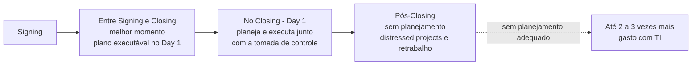
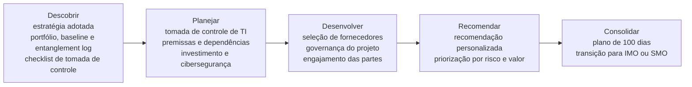
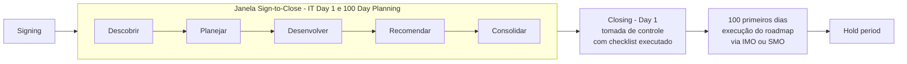
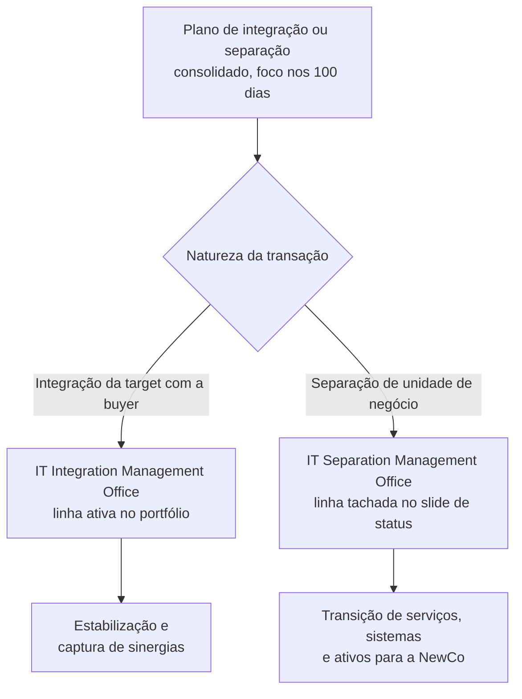
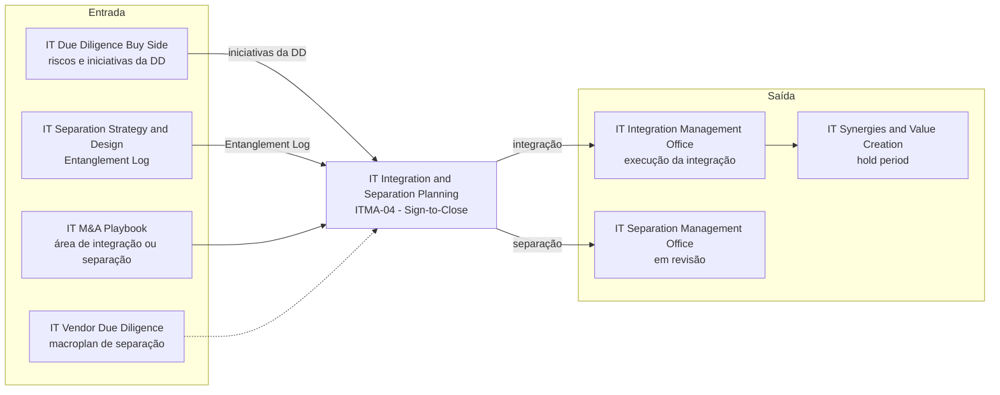

# IT Integration & Separation Planning (IT Day 1 & 100 Day Planning)

> **Converte a janela entre o signing e o closing em um plano de TI executável no Day 1 e orientado a valor nos 100 primeiros dias: tomada de controle sem ruptura, iniciativas priorizadas com charter, custo e responsável, e passagem organizada para o IMO ou o SMO.** 💡

| Código | Família | Fase(s) do ciclo | Lado | Readiness (atual → alvo FY) | PO | Squad |
|---|---|---|---|---|---|---|
| ITMA-04 | Planejamento & Execução 💡 | Sign-to-Close 📘 (linha 2193) | Buyer, na integração da target; empresa em separação de unidades de negócio 📘 | 4,0 → 4,3 🗂️ | Thiago Lorusso 🗂️ | Marcela B 🗂️ |

**Em síntese** 💡

- **O que é.** É o planejamento de TI da fase inicial de uma integração (target com a buyer) ou de uma separação (unidades de negócio), com foco no Day 1 e nos 100 primeiros dias. Percorre cinco fases (Descobrir, Planejar, Desenvolver, Recomendar e Consolidar), cobre cinco dimensões-chave (Pessoas, Processos, Aplicações, Infraestrutura e Governança) e termina na transição para o IMO ou o SMO.
- **O argumento central é o timing.** O deck aponta a janela entre Signing e Closing como o melhor momento para planejar e afirma que empresas sem planejamento adequado "podem gastar de 2 a 3 vezes mais com TI". A fonte desse número não é citada.
- **Método bem documentado; dimensão comercial ausente.** A seção traz 14 atividades em cinco fases, 12 elementos de "como fazemos" e um bloco central de saídas, 4 pilares tailor-made, 10 benefícios, 3 cenários de timing, 4 passos com 10 artefatos-exemplo e 3 cases nomeados (Plurix, Braveo e Invepar). Não traz preço, prazo nem equipe-tipo.
- **Maturidade alta.** Com readiness 4,0 (nível 4, "Oferta estruturada"), é a 2ª entre as 10 linhas, atrás apenas da IT Due Diligence (Buy Side). O nível declarado contrasta com a ausência de informação comercial no deck.
- **Posição de dobradiça no portfólio.** Na cadeia que vai da diligência à execução, é a única oferta ativa que atende tanto integração quanto separação. Recebe demanda da diligência e do desenho da separação e entrega para a execução. Com o SMO tachado no slide de status, o ramo de separação fica sem destino ativo depois do planejamento.

---

## 1. Descrição oficial 🗂️

> "Planejamento robusto do projeto e mudança, garantindo que a TI esteja envolvida no processo de M&A junto com as principais áreas funcionais, mitigando riscos e antecipando captura de valor para a transação."

*Fonte: slide "A&M é M&A", no Deck Comercial. O texto foi reconstruído das linhas 379, 387, 395, 403, 411, 417 e 419 da extração, onde aparece intercalado com as descrições das ofertas vizinhas, e confere com `descricao_oficial` em `data/ofertas.yaml`. Foi corrigido "para da transação" para "para a transação".*

**Nomes da oferta no material**

| Onde | Nome | Linha |
|---|---|---|
| Catálogo "A&M é M&A" | IT Integration & Separation Planning (Day 1 & 100-Day) ¹ | 369 |
| Slide "Status das Ofertas – IT M&A" | IT Integration & Separation Planning | `data/ofertas.yaml` |
| Título da seção no deck | Integration & Separation Planning · IT Day 1 & 100 Day Planning | 1941–1943 |
| Seção do IMO, como etapa anterior | "IT Day 1 & Day 100 Planning" e "IT Day1 & Day 100 Plan" | 2335 e 2345 |

¹ *O catálogo grafa "(Day1-&100-Day)". A grafia foi normalizada.*

**Posição no ciclo.** Sign-to-Close. O deck é explícito: "O melhor momento para planejar a integração ou separação é entre os períodos de Signing e Closing do cronograma de M&A" (linha 2193). O slide de escopo traz a régua do ciclo (Pré-deal, Sign-to-Close, 100 days, Hold period de ~3 a 5 anos e Exit) com o marcador "Momento ideal para realizar o planejamento de I&S" (linhas 2029–2033). A fase marcada não é legível na extração, mas a seção do IMO posiciona o "IT Day 1 & Day 100 Planning" entre Signing e Closing (linhas 2335–2337).

**Leitura da descrição** 💡

| Movimento da descrição oficial | Onde se materializa na seção |
|---|---|
| "Planejamento robusto do projeto e mudança" | Cinco fases do escopo (4.1) e "avaliação de maturidade para gestão de mudanças" no bloco central do "como fazemos" (4.3) |
| TI envolvida "junto com as principais áreas funcionais" | Engajamento das partes interessadas, internas e externas; alinhamento entre buyer e target; plano de comunicação (4.3 e 4.4) |
| "Mitigando riscos e antecipando captura de valor" | Matriz de priorização e riscos; benefícios "Antecipação da mitigação de riscos e geração de valor" e "Foco total na captura de sinergias" (2.3) |

---

## 2. O problema que resolve 📘

### 2.1 O custo de planejar tarde 📘 (linhas 2193–2207)

O deck sustenta a oferta em um argumento de timing: o momento em que o planejamento é feito "pode aumentar consideravelmente o fator de riscos e os custos de TI" durante o processo de integração ou separação (linhas 2199–2201). Segundo o deck, empresas que não planejam adequadamente seus M&As:

| Consequência citada no deck | Natureza |
|---|---|
| Podem gastar **de 2 a 3 vezes mais com TI** ao final do processo | Financeira |
| Aumento dos riscos de cibersegurança | Segurança |
| Perda de talentos | Pessoas |
| Danos à imagem da empresa | Reputação |
| Ruptura de negócios | Operação |

*O deck não cita a fonte nem a base de cálculo do multiplicador "2 a 3 vezes" (ver seção 10).*

### 2.2 Cenários e impactos: três momentos para planejar 📘 (linhas 2191–2235)

A tese do slide: planejar entre Signing e Closing gera "menor custo, adiantamento de problemas e a mitigação de rupturas na operação" (linha 2193).

| Momento | O que acontece, segundo o deck | Custo e risco |
|---|---|---|
| **Entre Signing e Closing** | Melhor momento para planejar a integração ou separação. Antecipa problemas, tomada de decisão e geração de valor. Entrega um cronograma de iniciativas consolidado e executável no Day 1. | Menor |
| **No Closing (Day 1)** | O planejamento e a execução começam junto com a tomada de controle da operação. As incertezas aumentam o fator de risco, a complexidade e os custos. | Intermediário |
| **Pós-Closing** | A tomada da operação sem planejamento de I&S gera *distressed projects*, retrabalho, maior custo, aumento do fator de risco e atrasos no plano de M&A. | Maior |

*Reconstrução das três colunas intercaladas nas linhas 2219–2235. A ordem do custo e do risco segue o texto de cada coluna e a afirmação da linha 2193.*

**Gráfico do slide.** O slide traz um gráfico com os rótulos "Planejamento", "IMO ou SMO", "Entre Signing e Closing", "No Closing (Day 1)", "Após Closing" e "Day 1" (linhas 2195–2207). Os rótulos dos eixos chegam como letras soltas no meio do parágrafo (trecho ambíguo na extração). 💡 As letras são compatíveis com rótulos verticais "Operação" e "Risco", mas isso não é confirmável. O gráfico sugere a sequência Planejamento → IMO ou SMO ao longo da linha do tempo.

### 2.3 Por que fazer: dez benefícios 📘 (linhas 2143–2189)

| Nº no deck ² | Benefício | Tema 💡 |
|---|---|---|
| 01–04 ou 06 | Estabilização da operação, evitando rupturas para o negócio | Continuidade |
| 01–04 ou 06 | Comunicação ativa entre todas as partes (interno e externo) | Alinhamento |
| 01–04 ou 06 | Antecipação da mitigação de riscos e da geração de valor | Risco e valor |
| 01–04 ou 06 | Visão detalhada da área de TI, aprofundando o entendimento da IT DD | Diagnóstico |
| 01–04 ou 06 | Foco total na captura de sinergias e na mitigação de impactos | Risco e valor |
| 05 | Engajamento de todas as partes interessadas (interno e externo) | Alinhamento |
| 07–09 | Visão clara da estratégia, alinhada entre todas as partes | Alinhamento |
| 07–09 | Governança objetiva e definida | Governança |
| 07–09 | Plano de integração ou separação detalhado e executável no Day 1 | Plano |
| 10 | Plano de investimentos em tecnologia atualizado | Plano |

² *Trecho ambíguo na extração. Os números 01 a 04 aparecem juntos na linha 2149, o 06 isolado na linha 2167 e os números 07 a 09 juntos na linha 2169. Só os itens 05 e 10 vêm com o número colado ao texto (linhas 2187 e 2189). Os cinco primeiros textos ocupam as posições 01 a 04 e 06, em ordem não recuperável; os três seguintes ocupam 07 a 09. Os textos foram recompostos de fragmentos intercalados nas linhas 2149–2181.*

### 2.4 A dor por trás dos benefícios 💡

| Sem planejamento de I&S | Sintoma típico no Day 1 ou nos 100 dias | Benefício que endereça |
|---|---|---|
| Tomada de controle improvisada | Sistemas, acessos ou fornecedores críticos sem dono no Day 1 | Estabilização da operação; plano executável no Day 1 |
| Partes desalinhadas | Buyer e target, ou vendedor e unidade separada, com agendas e prioridades conflitantes | Comunicação ativa; engajamento; visão clara da estratégia |
| DD não convertida em plano | Riscos identificados na diligência sem iniciativa, custo nem responsável | Visão detalhada da TI, aprofundando a IT DD; antecipação da mitigação de riscos |
| Governança indefinida | Decisões lentas e escopo que se expande | Governança objetiva e definida |
| Orçamento desatualizado | Investimento de TI do business plan descolado da realidade | Plano de investimentos em tecnologia atualizado |

---

## 3. Objetivo e escopo 📘

**Objetivo** (linha 1947, em paráfrase): executar um planejamento robusto para a integração da target com a buyer ou para a separação de unidades de negócio. Para isso, a A&M se propõe a compreender profundamente o negócio e "escolher a estratégia mais apropriada para cada tipo de integração ou separação e suas particularidades".

**Promessa da abordagem** (linha 2041): uma abordagem de ponta a ponta, adaptável às necessidades das empresas, que fornece "um planejamento robusto da fase inicial de integração ou separação com foco nos 100 primeiros dias".

| Dimensão de escopo | O que o deck informa |
|---|---|
| Tipo de transação | Integração da target com a buyer, ou separação de unidades de negócio (linha 1947) |
| Horizonte do plano | Fase inicial da integração ou separação, com foco no Day 1 e nos 100 primeiros dias (linhas 1965, 2015, 2041 e 2267) |
| Momento da contratação | Entre Signing e Closing (linha 2193) |
| Dimensões cobertas | Pessoas, Processos, Aplicações, Infraestrutura e Governança (linhas 2043–2067) |
| Lado do deal | Buyer, na integração; empresa em separação de unidades de negócio. Nos cases: teses de investimento (Plurix, do Pátria Investimentos; Braveo) e um carve-out corporativo (Invepar) |
| Ponto de chegada | "Transição para o IMO ou SMO" e início da execução das iniciativas planejadas (linhas 2019–2027) |
| O que fica fora do escopo | Não informado no deck. 💡 A execução cabe ao IMO ou ao SMO. No case Plurix, porém, a A&M também conduziu o PMI de TI entre o D1 e o D100 (linha 2289). |

### 3.1 Conceitos-chave 💡

*Definições de apoio para leitores fora da prática. Não são conteúdo do deck.*

| Termo | Definição |
|---|---|
| Signing e Closing | Assinatura do contrato de compra e venda e efetiva transferência de controle. Entre os dois há uma janela, em geral de semanas a meses (aprovações regulatórias, condições precedentes), em que o comprador ainda não opera o ativo. |
| Day 1 (Dia 1) | Primeiro dia de operação sob o novo controle, logo após o closing. A empresa precisa continuar operando sem ruptura. |
| 100 primeiros dias | Horizonte de estabilização e de primeiras capturas de valor depois do Day 1. |
| Tomada de controle | Assunção da gestão da TI (acessos, contratos, fornecedores, pessoas e operação) pelo novo controlador. |
| IMO / SMO | Integration Management Office / Separation Management Office: escritórios que executam o programa de integração ou de separação. |
| Entanglement log | Registro das dependências compartilhadas entre as partes que precisam ser resolvidas (ver o dossiê [03](03-it-separation-strategy-design.md)). |
| Project charter | Documento de abertura de cada iniciativa, com escopo, entregáveis, benefícios, riscos, prazo e custo. |
| Heatmap de pessoas | Mapa de alocação e carga das pessoas por iniciativa e período. |
| Matriz RACI | Matriz de responsabilidades: quem é Responsável, Aprovador, Consultado e Informado em cada atividade. |
| Distressed projects | Projetos em crise: estouro de prazo ou custo, retrabalho e perda de controle. |
| DRP / BCP | Disaster Recovery Plan / Business Continuity Plan: planos de recuperação de desastres e de continuidade de negócios. |
| ITSM / SLM | IT Service Management / Service Level Management: gestão de serviços e de níveis de serviço de TI. |
| LGPD | Lei Geral de Proteção de Dados Pessoais (Lei nº 13.709/2018). |

---

## 4. Abordagem A&M: como fazemos 📘

### 4.1 Escopo em cinco fases 📘 (linhas 1945–2027)

| Fase | Atividades, segundo o deck ³ |
|---|---|
| **Descobrir** | 1. Entendimento detalhado da estratégia adotada. 2. Análise do portfólio de projetos atuais da empresa, baseline de tecnologia e entanglement log. ⁴ 3. Execução de checklist de tomada de controle, a fim de apurar pontos críticos para o Dia 1. |
| **Planejar** | 1. Planejamento da tomada de controle de TI. 2. Levantamento de premissas, restrições e dependências de cada iniciativa abordada e de como serão implementadas. 3. Estratégia de investimento. 4. Avaliação de cibersegurança atual e plano de mitigação de risco. ³ |
| **Desenvolver** | 1. Seleção de fornecedor, com análise e refinamento de propostas a partir da experiência e do benchmark da A&M. 2. Definição da governança do projeto. 3. Engajamento das partes interessadas, internas e externas. ³ |
| **Recomendar** | 1. Recomendação personalizada conforme a estratégia definida. 2. Priorização de acordo com os riscos e oportunidades ou com a geração de valor para o negócio, as premissas tecnológicas e o plano de crescimento. |
| **Consolidar** | 1. Plano de integração ou separação com foco nos 100 primeiros dias, contendo roadmap de iniciativas consolidado, matriz de priorização e riscos, cronograma de investimento detalhado e alocação de pessoas. ⁵ 2. Transição para o IMO ou SMO e início da execução das iniciativas planejadas. |

³ *Trecho ambíguo na extração. As cinco colunas do slide vêm intercaladas linha a linha (linhas 1949–2027). A recomposição seguiu a continuidade sintática de cada fragmento. Os bullets "Avaliação de cibersegurança atual e plano de mitigação de risco" (linhas 2011, 2019 e 2025) e "Engajamento das partes interessadas (interno e externo)" (linhas 2013 e 2021) foram atribuídos a Planejar e a Desenvolver, respectivamente, pela ordem de aparição na extração. A atribuição inversa não pode ser descartada. Confirmar no slide original.*
⁴ *Na linha 1983, "consolidado, matriz de" pertence ao Consolidar ("roadmap de iniciativas consolidado, matriz de priorização e riscos", linhas 1975, 1983 e 1991). "Tecnologia e entanglement log" completa o "baseline de" do Descobrir.*
⁵ *"Cronograma de investimento detalhado e alocação de pessoas" foi recomposto das linhas 1991, 2001 e 2009. "Estratégia de investimento" aparece completa na linha 2003, como bullet do Planejar.*

💡 A sequência fecha um ciclo completo de planejamento: diagnóstico (Descobrir), desenho do plano (Planejar), mobilização de fornecedores e governança (Desenvolver), escolhas (Recomendar) e empacotamento para a execução (Consolidar). Diferentemente das ofertas de diligência, que terminam em recomendação, esta termina na passagem para quem executa.

### 4.2 Cinco dimensões-chave 📘 (linhas 2039–2067)

O slide se intitula "Planejamento orientado a cinco dimensões-chave".

| Dimensão | O que a A&M avalia e planeja, segundo o deck | Pergunta que a dimensão responde no Day 1 💡 |
|---|---|---|
| **Pessoas** | Avaliação de maturidade da estrutura atual, plano de reorganização da área de TI, análise de dependências e engajamento de todas as partes interessadas | Quem decide e quem opera a TI a partir do Day 1? |
| **Processos** | Análise de aderência da TI aos processos de negócio, nível de automatização e oportunidades de melhoria ou ausência de processos | Os processos críticos continuam rodando sem ruptura? |
| **Aplicações** | Simplificação, escalabilidade, compliance, segurança e recomendação das melhores soluções do mercado para atender às necessidades | Que sistemas se mantêm, convergem ou são substituídos? |
| **Infraestrutura** | Estratégia de cloud, gestão dos serviços, backup, segurança, disponibilidade, escalabilidade e evolução | A base técnica aguenta a operação combinada ou separada? |
| **Governança** | Avaliação de DRP, ITSM, cibersegurança, SLM, contratos, IMO/SMO, gestão de demandas, LGPD e BCP | Quem governa a transição e com quais controles? |

💡 São as mesmas cinco dimensões da IT Separation Strategy & Design ([03](03-it-separation-strategy-design.md)), o que facilita a passagem do Entanglement Log entre as duas ofertas. A dimensão Governança é a única que cita explicitamente o escritório de execução (IMO/SMO), o que reforça que o desenho do IMO ou do SMO faz parte do planejamento.

### 4.3 Como fazemos 📘 (linhas 2069–2099)

O slide "Abordagem A&M · Como fazemos?" apresenta 12 elementos ao redor de um bloco central de saídas. ⁶

**Elementos do método**

| # | Elemento | Natureza 💡 | Fase provável 💡 |
|---|---|---|---|
| 1 | Entendimento, alinhamentos e plano de comunicação | Mobilização | Descobrir |
| 2 | Coleta de todas as documentações necessárias (internas e externas) | Levantamento | Descobrir |
| 3 | Levantamento de informações detalhadas do parque tecnológico e entanglement log | Levantamento | Descobrir |
| 4 | Análise e entendimento do portfólio de projetos atual da empresa | Levantamento | Descobrir |
| 5 | Checklist de tomada de controle e plano de trabalho | Planejamento do Day 1 | Descobrir e Planejar |
| 6 | Definição da governança do projeto, papéis e responsabilidades de todas as partes | Governança | Desenvolver |
| 7 | Engajamento e seleção de fornecedores | Mobilização | Desenvolver |
| 8 | Alinhamento das iniciativas e estratégias entre buyer e target | Alinhamento | Recomendar |
| 9 | Matriz de priorização e riscos das atividades | Priorização | Recomendar |
| 10 | Visão de investimentos e maturidade para gestão de mudanças | Investimento e mudança | Planejar e Consolidar |
| 11 | Cronograma de iniciativas consolidado | Consolidação | Consolidar |
| 12 | Plano de alocação de pessoas (heatmap) | Consolidação | Consolidar |

⁶ *Trecho ambíguo na extração: a posição e a ordem dos elementos no slide não são recuperáveis (linhas 2073–2099). A numeração acima é editorial, agrupada pela natureza de cada elemento.*

**Bloco central: o que o plano de I&S contém** (linha 2079, decomposta em seus seis componentes)

| Componente | Conteúdo citado no deck |
|---|---|
| a. Project charters | Detalhamento de escopo, entregáveis, benefícios, riscos, situação atual e descrição de cada iniciativa do plano de integração ou separação |
| b. Engajamento | Engajamento das partes interessadas, internas e externas |
| c. Estratégia e cronograma | Racionais das estratégias adotadas para as iniciativas; cronograma de atividades consolidado; alocação, situação e necessidades de recursos |
| d. Visão financeira | Visão financeira revisada (capex e opex) |
| e. Premissas | Premissas, restrições e dependências de todas as iniciativas planejadas |
| f. Processos e mudança | Mapeamento de processos, definição de políticas e procedimentos e avaliação de maturidade para gestão de mudanças |

```mermaid
flowchart LR
    subgraph MOB [Mobilizar e levantar]
        direction TB
        M1[Entendimento, alinhamentos<br/>e plano de comunicação]
        M2[Coleta de documentações<br/>internas e externas]
        M3[Parque tecnológico<br/>e entanglement log]
        M4[Portfólio de projetos atual]
    end
    subgraph PLA [Planejar e decidir]
        direction TB
        P1[Checklist de tomada de controle<br/>e plano de trabalho]
        P2[Governança, papéis<br/>e responsabilidades]
        P3[Engajamento e seleção<br/>de fornecedores]
        P4[Alinhamento entre<br/>buyer e target]
        P5[Matriz de priorização<br/>e riscos]
        P6[Investimentos e maturidade<br/>para gestão de mudanças]
    end
    subgraph CON [Consolidar]
        direction TB
        C1[Cronograma de iniciativas<br/>consolidado]
        C2[Heatmap de alocação<br/>de pessoas]
    end
    N((Plano de integração<br/>ou separação<br/>charters, cronograma,<br/>capex e opex, premissas,<br/>processos e mudança))
    MOB --> PLA --> CON --> N
```

💡 O elemento 8 ("entre buyer e target") é específico da integração. A seção não descreve o alinhamento equivalente na separação (vendedor, unidade separada e NewCo) nem menciona o TSA, que aparece em outras seções do deck (linhas 677, 681 e 787). Ver seção 10.

### 4.4 Projetos tailor-made: quatro pilares de diferenciação 📘 (linhas 2101–2141)

O slide abre com a promessa de soluções específicas para cada cliente e afirma: "Nosso modelo de trabalho é hands-on, gerando accountability, dor de dono e adiantando situações que necessitam foco e atenção" (linha 2103). ⁷

| Pilar | O que o deck afirma |
|---|---|
| **Alinhamento e engajamento** | Entendimento das diferentes agendas de todas as partes interessadas; plano de comunicação que dá visibilidade do projeto aos stakeholders; engajamento de colaboradores e fornecedores que participarão da execução do plano de I&S. |
| **DNA hands-on** | Execução no DNA da equipe, aliada a um time sênior, com o objetivo de ser o agente de transformação nos clientes e capturar os resultados previstos. Accountability e senso de dono como pilares, para eliminar problemas e dar velocidade às decisões. |
| **Boas práticas e benchs** | Benchmarks de **mais de 100 projetos executados em M&A**, aplicados a redução de custos, negociação, definição de escopo e seleção de fornecedor, com recomendação das melhores soluções e boas práticas de mercado. |
| **Soluções customizadas** | Experiência em diversos setores e nichos de mercado e em diferentes estratégias de deals de M&A, com soluções específicas e exclusivas para cada cliente. |

⁷ *O deck grafa "taylor made"; a forma correta é "tailor-made". Os textos de "DNA hands-on" e "Soluções customizadas" vêm intercalados em duas colunas (linhas 2117–2133). A recomposição foi confirmada pela versão não intercalada do mesmo texto na seção do IT M&A Playbook (linhas 611 e 613).*

💡 **Comparação com o IT M&A Playbook** (linhas 597–621). A estrutura de quatro pilares se repete, com duas adaptações nesta oferta: o primeiro pilar passa de "Alinhamento estratégico" a "Alinhamento e engajamento", e o benchmark deixa de apoiar a "definição de estratégia, planejamento e execução" para apoiar redução de custos, negociação, escopo e **seleção de fornecedor**. A adaptação é coerente com a fase Desenvolver: esta é a única seção do deck em que a seleção de fornecedores aparece como atividade explícita (linhas 1953 e 2091).

### 4.5 O que o plano entrega para o Day 1 e para os 100 dias 💡

*O deck não separa formalmente os entregáveis do Day 1 e os dos 100 dias. A classificação abaixo é deste repositório; cada item é rastreável ao deck pelas linhas indicadas.*

**Horizonte Day 1: tomada de controle sem ruptura**

| Elemento 📘 | Onde aparece no deck |
|---|---|
| Checklist de tomada de controle, para apurar pontos críticos para o Dia 1 | Descobrir (linhas 1987–2015); "Checklist de tomada de controle e plano de trabalho" (linha 2085); passo 3 dos entregáveis (linhas 2259–2261) |
| Planejamento da tomada de controle de TI | Planejar (linhas 1951 e 1959) |
| Avaliação de cibersegurança atual e plano de mitigação de risco | Planejar (linhas 2011, 2019 e 2025) |
| Governança do projeto, papéis e responsabilidades; matriz RACI | Desenvolver (linhas 1993 e 2001); "como fazemos" (linha 2077); exemplos (linha 2279) |
| Estratégia e plano de comunicação; engajamento das partes interessadas | "Como fazemos" (linha 2073); Desenvolver (linhas 2013 e 2021); exemplos (linha 2277) |
| Plano de integração ou separação "detalhado e executável no Day 1" | Benefícios (linhas 2173–2181) |
| Cronograma de iniciativas "consolidado e executável no Day 1" | Cenário Entre Signing e Closing (linhas 2227–2231) |

**Horizonte 100 dias: roadmap orientado a valor**

| Elemento 📘 | Onde aparece no deck |
|---|---|
| Plano de integração ou separação com foco nos 100 primeiros dias: roadmap consolidado, matriz de priorização e riscos, cronograma de investimento detalhado e alocação de pessoas | Consolidar (linhas 1957–2009) |
| Cronograma de integração ou separação com foco nos 100 primeiros dias | Passo 4 dos entregáveis (linha 2267) |
| Project charters com escopo, prazo e custo detalhados | Exemplos (linha 2265); bloco central (linha 2079) |
| Estratégia de investimento; estratégias de orçamentação de tecnologia; visão financeira revisada (capex e opex) | Planejar (linha 2003); exemplos (linha 2269); bloco central (linha 2079) |
| Seleção de fornecedores com análise e refinamento de propostas | Desenvolver (linhas 1953–1979); "como fazemos" (linha 2091) |
| Estratégias de implementação das iniciativas | Exemplos (linha 2275) |
| Transição para o IMO ou SMO e início da execução das iniciativas planejadas | Consolidar (linhas 2019–2027) |

💡 **Critério de sucesso do Day 1.** O slide "Desafios holísticos", na abertura do deck, resume o que o Day 1 precisa garantir ao negócio: capacidade de "comprar", "faturar", "atender" e "acessar", com continuidade (linha 125). É um bom teste de aceitação para o checklist de tomada de controle.

### 4.6 A decisão IMO ou SMO 📘

O plano termina com a passagem para um escritório de execução. O deck sinaliza essa decisão em quatro pontos:

| Evidência | Linha |
|---|---|
| Consolidar: "Transição para o IMO ou SMO e início da execução das iniciativas planejadas" | 2019–2027 |
| Dimensão Governança: avaliação do "IMO/SMO", ao lado de DRP, ITSM, SLM, contratos, LGPD e BCP | 2067 |
| Gráfico de cenários: sequência "Planejamento" → "IMO ou SMO" | 2195–2197 |
| Case Braveo: o planejamento do PMI "prepara o IMO" | 2291 |

💡 **Lógica de decisão.** A natureza da transação define o destino: integração da target com a buyer leva ao IMO; separação de unidade de negócio leva ao SMO. Os critérios para desenhar o escritório (porte, governança, cadência, papéis) não são detalhados no deck.

💡 **Ponto de atenção.** No slide de status, a linha do IT Separation Management Office está tachada, sem motivo explicado; neste repositório ela é tratada como "em revisão". Na prática, o ramo de separação desta oferta não tem hoje uma oferta ativa de execução para a qual transferir o plano.

### 4.7 Visão integrada 💡

*Síntese deste repositório, a validar com o PO.*

| Fase | Elementos do "como fazemos" | Entregáveis-exemplo | Horizonte |
|---|---|---|---|
| Descobrir | Entendimento e plano de comunicação; coleta de documentações; parque tecnológico e entanglement log; portfólio de projetos | Artefatos de baselines e portfólio atual da empresa; kick-off | Day 1 (pontos críticos) |
| Planejar | Checklist de tomada de controle e plano de trabalho; visão de investimentos | Levantamento de premissas, restrições e dependências; estratégias de orçamentação de tecnologia | Day 1 e 100 dias |
| Desenvolver | Governança, papéis e responsabilidades; engajamento e seleção de fornecedores | Matriz RACI; estratégia e plano de comunicação | Day 1 |
| Recomendar | Alinhamento entre buyer e target; matriz de priorização e riscos | Matriz de priorização; matriz de riscos; estratégias de implementação das iniciativas | 100 dias |
| Consolidar | Cronograma de iniciativas consolidado; heatmap de alocação de pessoas | Project charters; roadmap consolidado; cronograma de 100 dias; heatmap de pessoas; consolidação das iniciativas do programa | 100 dias e passagem ao IMO/SMO |

---

## 5. Entregáveis 📘

### 5.1 Entregáveis (exemplos): sequência em quatro passos 📘 (linhas 2239–2279)

| Passo | Descrição no deck |
|---|---|
| 1 | O planejamento começa com a análise do portfólio de projetos de TI da empresa e o levantamento dos baselines necessários. |
| 2 | Definição de papéis, responsabilidades e mecanismos de gerenciamento do projeto. ⁸ |
| 3 | Detalhamento de cada projeto e execução do checklist de tomada de controle para o Day 1. |
| 4 | Consolidação do cronograma de integração ou separação, com foco nos 100 primeiros dias. |

**Artefatos e rótulos exibidos no slide**

| # | Artefato | Passo provável ⁸ 💡 |
|---|---|---|
| — | Rótulos "Kick off" e "Levantamento" | 1 e 2 |
| 1 | Artefatos de baselines e portfólio atual da empresa | 1 |
| 2 | Consolidação das iniciativas do programa | 1 ou 2 |
| 3 | Project charters com escopo, prazo e custo detalhados | 3 |
| 4 | Estratégias de orçamentação de tecnologia | 4 |
| 5 | Matriz de priorização e heatmap de pessoas | 4 |
| 6 | Levantamento de premissas, restrições e dependências | 3 ou 4 |
| 7 | Matriz de riscos e roadmap consolidado | 4 |
| 8 | Estratégias de implementação das iniciativas | 4 |
| 9 | Estratégia e plano de comunicação | 2 ou 4 |
| 10 | Matriz de responsabilidades RACI | 2 ou 4 |

⁸ *Trecho ambíguo na extração. O texto do passo 2 vem partido em "Definindo papéis, responsabilidades de gerenciamento do projeto" e "e mecanismos" (linhas 2245–2247) e foi recomposto. Os títulos dos artefatos foram recompostos de fragmentos intercalados (linhas 2249–2279), por exemplo "Matriz de riscos e" + "roadmap consolidado" e "Levantamento de premissas," + "restrições e dependências". A associação de cada artefato a um passo não é recuperável; a coluna "Passo provável" é inferência pelo conteúdo.*

### 5.2 Catálogo consolidado de entregáveis 📘

União dos entregáveis citados nos slides de escopo, "como fazemos" e exemplos, sem duplicidade.

| # | Entregável | Onde aparece (linhas) | Horizonte 💡 | Dimensão principal 💡 |
|---|---|---|---|---|
| 1 | Checklist de tomada de controle e plano de trabalho | 1987–2015, 2085, 2259–2261 | Day 1 | Transversal |
| 2 | Baseline de tecnologia e portfólio de projetos atual | 1967–1983, 2083, 2241–2255 | Day 1 | Aplicações e Infraestrutura |
| 3 | Entanglement log e levantamento do parque tecnológico | 1983, 2075 | Day 1 | Transversal |
| 4 | Avaliação de cibersegurança e plano de mitigação de risco | 2011–2025 | Day 1 | Governança e Infraestrutura |
| 5 | Governança do projeto, papéis e responsabilidades (RACI) | 1993, 2077, 2279 | Day 1 | Governança |
| 6 | Estratégia e plano de comunicação | 2073, 2277 | Day 1 | Pessoas |
| 7 | Seleção de fornecedores, com análise e refinamento de propostas | 1953–1979, 2091 | 100 dias | Governança (contratos) |
| 8 | Project charters por iniciativa (escopo, prazo, custo e demais campos) | 2079, 2265 | 100 dias | Transversal |
| 9 | Premissas, restrições e dependências por iniciativa | 1969–1995, 2079, 2271–2273 | 100 dias | Transversal |
| 10 | Matriz de priorização e riscos | 1991, 2087, 2271–2275 | 100 dias | Transversal |
| 11 | Roadmap e cronograma consolidados de integração ou separação (foco em 100 dias) | 1957–1991, 2089, 2267, 2275 | 100 dias | Transversal |
| 12 | Estratégia de investimento, orçamentação de tecnologia e visão financeira (capex e opex) | 2003, 2079, 2099, 2269 | 100 dias | Governança |
| 13 | Heatmap de alocação de pessoas | 2009, 2081, 2271 | 100 dias | Pessoas |
| 14 | Estratégias de implementação das iniciativas | 2275 | 100 dias | Transversal |
| 15 | Mapeamento de processos, políticas e procedimentos; avaliação de maturidade para gestão de mudanças | 2079, 2099 | 100 dias | Processos |
| 16 | Transição para o IMO ou SMO | 2019–2027 | Passagem | Governança |

### 5.3 Anatomia do project charter 📘

Os campos abaixo são os que o deck atribui aos project charters (linhas 2079 e 2265). Os campos marcados com 💡 são complementos sugeridos a partir de outros elementos do próprio deck.

| Campo | Origem |
|---|---|
| Descrição da iniciativa | 📘 linha 2079 |
| Situação atual | 📘 linha 2079 |
| Escopo | 📘 linhas 2079 e 2265 |
| Entregáveis | 📘 linha 2079 |
| Benefícios | 📘 linha 2079 |
| Riscos | 📘 linha 2079 |
| Prazo | 📘 linha 2265 |
| Custo (capex e opex) | 📘 linhas 2079 e 2265 |
| Racional da estratégia adotada | 📘 linha 2079 (no nível do plano) |
| Premissas, restrições e dependências | 💡 vinculado do levantamento por iniciativa (linhas 1969–1995) |
| Prioridade e classificação de risco | 💡 vinculado da matriz de priorização e riscos (linha 2087) |
| Responsáveis | 💡 vinculado da matriz RACI (linha 2279) |
| Recursos alocados | 💡 vinculado do heatmap de pessoas (linha 2081) |
| Horizonte (Day 1, até o D100 ou posterior) | 💡 a partir do foco do plano (linhas 2015 e 2267) |

### 5.4 Estrutura de referência do checklist de tomada de controle 💡

*Não é conteúdo do deck. É uma estrutura mínima montada a partir dos conceitos que o deck cita, para validar com o PO e confrontar com o one-pager quando ele for ingerido.*

| Campo | Conceito de origem no deck |
|---|---|
| Item de controle | "Checklist de tomada de controle" (linhas 1987, 2085 e 2261) |
| Dimensão: Pessoas, Processos, Aplicações, Infraestrutura ou Governança | Cinco dimensões-chave (linhas 2043–2067) |
| Criticidade para o Dia 1 | "Apurar pontos críticos para Dia 1" (linhas 2005–2015) |
| Capacidade de negócio protegida: comprar, faturar, atender ou acessar | Slide "Desafios holísticos" (linha 125) |
| Responsável e aprovador | Matriz RACI (linha 2279) |
| Dependências e premissas | Linhas 1969–1995 |
| Risco e ação de mitigação | Matriz de riscos (linha 2273); plano de mitigação de cibersegurança (linhas 2011–2025) |
| Status e evidência de prontidão | Não citado no deck |

### 5.5 Estrutura visual dos exemplos

A extração traz apenas os títulos dos exemplos. Layouts, escalas e eixos (por exemplo, da matriz de priorização, da matriz de riscos e do heatmap de pessoas) **não estão informados no deck (na extração)**. O one-pager 📎 está pendente e não foi utilizado.

---

## 6. Modelo comercial, prazo e equipe 📘

| Dimensão | O que o deck informa |
|---|---|
| Modelo comercial / preço | Não informado no deck |
| Prazo / duração do engajamento | Não informado no deck. O deck informa o **horizonte do plano** (Day 1 e 100 primeiros dias), não a duração do projeto. |
| Janela de execução | Entre Signing e Closing (linha 2193) |
| Equipe | Não informado no deck em composição e tamanho. O deck cita "equipe sênior" e modelo de trabalho hands-on (linhas 2103 e 2117–2133). |
| Base de experiência declarada | Benchmarks de "mais de 100 projetos executados em M&A" (linha 2115) |
| Modularidade | Não informado no deck. A abordagem é "adaptável às necessidades das empresas" (linha 2041) e tailor-made (linha 2103). |
| Contratante nos cases | Plurix (holding do Pátria Investimentos): a A&M "foi contratada", sem identificar o contratante. Braveo: não informado. Invepar: não informado nesta seção. |

**Implicações comerciais** 💡 (hipóteses a validar com o PO)

- **Drivers de dimensionamento.** Número de empresas a integrar (Plurix: 6 targets na ITDD; Braveo: 2 investidas no plano); número de iniciativas (Braveo: 35, cerca de 17 por investida); tipo de transação (integração ou separação); duração da janela entre signing e closing; e número de processos de seleção de fornecedores.
- **Formato possível.** Preço fechado por fase (Descobrir a Consolidar), com o plano consolidado e a transição para o IMO ou SMO como entregável final. A extensão para o PMI do D1 ao D100, como no case Plurix, pode ser oferecida como opção ou como porta de entrada do IMO.
- **Ancoragem de valor.** O custo da oferta pode ser comparado ao risco de gastar "de 2 a 3 vezes mais com TI" e ao custo de *distressed projects*. Antes de uso externo, o número precisa de fonte.
- **Modelo de rollout.** No Braveo, o planejamento do PMI é "um acelerador das demais aquisições no modelo de Rollout" (linha 2291). Em teses de buy-and-build, há espaço para um pacote recorrente: o primeiro plano gera o template, e os seguintes saem mais rápido e mais baratos.
- **Gatilho comercial.** A assinatura do contrato (signing) abre a janela da oferta. O ideal é que a proposta já esteja pronta na conclusão da DD.

---

## 7. Clientes e cases 📘 (linhas 2281–2295)

O slide traz o bloco "Clientes que escolhem A&M", cujo conteúdo (provavelmente logotipos) não foi capturado pela extração, e três "Cases recentes com grande envolvimento A&M".

### Case 1: Plurix

| Item | O que o deck informa |
|---|---|
| Cliente | Plurix, holding do Pátria Investimentos com foco no varejo regional |
| Tipo de transação | Aquisições de uma tese de consolidação (integração) |
| Papel da A&M | (1) ITDD de 6 targets; (2) suporte à construção da arquitetura de referência da tese; (3) planejamento das integrações; (4) atividades de PMI de TI entre o D1 e o D100 |
| Escala | 6 targets |
| Resultados obtidos | Não informado no deck |

### Case 2: Braveo

| Item | O que o deck informa |
|---|---|
| Cliente | Braveo, tese de distribuição indireta de FMCG (*Fast Moving Consumer Goods*) |
| Tipo de transação | Aquisições de uma tese de investimento, em modelo de rollout (integração) |
| Papel da A&M | Planejamento de 35 iniciativas de 2 investidas para o plano de integração com foco nos 100 primeiros dias; participação no desenho da arquitetura, em IT DDs e em planejamentos de PMI de 4 das 15 investidas da tese |
| Escala | 35 iniciativas; 2 investidas no plano de 100 dias; 4 das 15 investidas com planejamento de PMI |
| Mensagem do case | O planejamento do PMI é um acelerador das demais aquisições no modelo de rollout e "prepara o IMO" |
| Resultados obtidos | Não informado no deck |

### Case 3: Invepar

| Item | O que o deck informa |
|---|---|
| Cliente | Invepar, que atua nos segmentos de aeroportos, mobilidade urbana e rodovias |
| Tipo de transação | Carve-out de TI (separação) |
| Perímetro | Separação dos ativos MetroRio e MetroBarra, criando a NewCo (Hmobi) |
| Papel da A&M | Preparação do carve-out de TI: diagnóstico da estrutura; avaliação e definição dos cenários de separação; consolidação do landscape de TI futuro; plano de transição para a nova controladora |
| Resultados obtidos | Não informado no deck |

### Divergências entre seções do deck 📘

| Case | Esta seção | Outra seção do deck |
|---|---|---|
| Braveo | Plano "de integração com foco nos 100 primeiros dias" (linha 2291) | IT DD Buy Side: "Plano de 100 dias", com redação quase idêntica (linha 957) |
| Invepar | Ativos **MetroRio e MetroBarra**; contratante não explícito (linha 2293) | IT Separation Strategy & Design: ativos **MetroRio e LAMSA**; contratada "pelo fundo" (Mubadala), com mais de 67 entanglements (linha 837) |

💡 Tudo indica que o case Invepar é o mesmo engajamento, citado em duas ofertas com perímetros diferentes. O perímetro precisa ser conciliado antes de qualquer uso externo. O conteúdo descrito aqui (diagnóstico, cenários de separação, landscape futuro) corresponde mais ao escopo da IT Separation Strategy & Design; a parte típica desta oferta é o "plano de transição para a nova empresa controladora".

### Leitura dos cases 💡

- **Plurix é o case de cadeia completa.** DD, arquitetura de referência, planejamento e execução do D1 ao D100: é a melhor evidência de pull-through do portfólio e mostra a oferta como elo entre a diligência e o PMI.
- **Braveo comprova o modelo de rollout.** Com planejamento de PMI em 4 das 15 investidas (cerca de 27% da tese), há um espaço natural de expansão nas 11 restantes.
- **Separação tem um único case**, e ele se sobrepõe à IT Separation Strategy & Design. Dois dos três cases são de integração em teses de investimento, o que reforça a leitura de que a oferta é, na prática, mais madura do lado da integração.
- **Faltam resultados.** Nenhum case traz métricas de desfecho: incidentes no Day 1, aderência ao plano de 100 dias, sinergias antecipadas, custo de TI frente ao planejado. Incluí-las elevaria a força comercial dos cases e daria lastro ao argumento "2 a 3 vezes".
- **Setores.** Varejo regional, distribuição de bens de consumo e infraestrutura de mobilidade.

---

## 8. Conexões no ciclo de M&A 💡

**Entrada (de onde vem a demanda)**

- **IT Due Diligence (Buy Side)** ([02](02-it-due-diligence-buy-side.md)). É a principal porta de entrada. Um dos benefícios desta oferta é a visão da TI "aprofundando o entendimento da IT DD" (linhas 2155–2163); no case Virutex Ilko, as 17 iniciativas da DD foram "base para o plano de integração" (linha 959); Plurix e Braveo combinam DD e planejamento.
- **IT Separation Strategy & Design** ([03](03-it-separation-strategy-design.md)). Na separação, o Entanglement Log é o artefato de passagem: esta oferta parte do "levantamento de informações detalhadas do parque tecnológico e entanglement log" (linha 2075).
- **IT M&A Playbook** ([01](01-it-ma-playbook.md)). A área de foco "Plano de integração ou separação" do Playbook prevê "checklist de tomada de controle no dia 1 e roadmap consolidado de execução de iniciativas" (linha 499). O Playbook institucionaliza no cliente o que esta oferta entrega como serviço.
- **IT Due Diligence (Sell Side)** ([07](07-it-due-diligence-sell-side.md)). O macroplan de separação da VDD (linha 1831) pode ser o insumo do planejamento do Day 1 da separação. Hipótese: o deck não traz case desse encadeamento.

**Saída (pull-through)**

| Oferta de destino | Evidência no Deck Comercial 📘 |
|---|---|
| IT Integration Management Office (ITMA-05) | O IMO prevê a "Execução das iniciativas mapeadas na diligência e no IT Day1 & Day 100 Plan" (linha 2345). No Braveo, o planejamento do PMI "prepara o IMO" (linha 2291). |
| IT Separation Management Office (ITMA-06, tachada) | Consolidar: "Transição para o IMO ou SMO" (linhas 2019–2027) |
| IT Synergies & Value Creation (ITMA-08) | Benefício "Foco total na captura de sinergias" (linhas 2157–2165); a tese de investimento segue no hold period. Sem evidência direta de encadeamento. |

**Cadeias de integração e de separação no portfólio**

| Etapa | Integração | Separação |
|---|---|---|
| Diligência ou desenho | IT Due Diligence (Buy Side), ITMA-02 · ativa · 4,5 | IT Separation Strategy & Design, ITMA-03 · ativa · 3,6 |
| Planejamento do Day 1 e dos 100 dias | **IT Integration & Separation Planning, ITMA-04 · ativa · 4,0** | **IT Integration & Separation Planning, ITMA-04 · ativa · 4,0** |
| Execução | IT Integration Management Office, ITMA-05 · ativa · 3,5 | IT Separation Management Office, ITMA-06 · tachada · 3,9 |

**Leitura.** Esta é a única oferta presente nas duas cadeias. Na integração, a cadeia está completa e todas as linhas estão ativas. Na separação, o elo de execução está em revisão. Há uma assimetria adicional: o readiness desta oferta (4,0) é maior que o do IMO (3,5), que recebe a passagem; o elo seguinte da integração é menos maduro que o planejamento que o alimenta.

---

## 9. Maturidade e governança 🗂️

> *Uso interno. Esta seção traz nomes de profissionais vindos de `data/governanca.yaml` e não deve ser publicada fora da A&M.*

### Readiness

| Indicador | IT Integration & Separation Planning | Service line IT M&A | Diferença |
|---|---|---|---|
| Readiness atual | **4,0** | 3,29 | +0,71 |
| Readiness alvo FY | **4,3** | 3,95 | +0,35 |
| Evolução planejada | **+0,3** | +0,66 | −0,36 |

| Posição na escala oficial | Nível | Nome | Risco |
|---|---|---|---|
| Atual (4,0) | 4 | Oferta estruturada | Baixo |
| Alvo FY (4,3) | 4 | Oferta estruturada | Baixo |

*Escala do slide de status: 1 Oferta incompleta (risco muito alto) · 2 Oferta inicial (alto) · 3 Oferta definida (médio) · 4 Oferta estruturada (baixo) · 5 Oferta otimizada (muito baixo). A média da service line é simples, sobre as 10 linhas.*

💡 **Posição relativa.**

- **2ª entre as 10 linhas no readiness atual**, atrás apenas da IT Due Diligence (Buy Side) (4,5). No alvo, é a 2ª, empatada com o SMO (4,3), atrás da IT Due Diligence (Buy Side) (4,7).
- **2ª entre as 7 linhas ativas** (não tachadas), nos dois indicadores.
- **Evolução modesta.** O incremento de +0,3 é o segundo menor do portfólio, à frente apenas da IT Due Diligence (Buy Side) (+0,2). A oferta permanece no nível 4 durante todo o FY; o alvo não prevê a passagem a "Oferta otimizada".
- **Paradoxo de maturidade.** O nível "estruturada" convive com a ausência, no deck, de preço, prazo, equipe-tipo e resultados de cases. Ou o readiness mede sobretudo método e entrega, ou a informação comercial está em outro material (por exemplo, o one-pager pendente). Ver pergunta 12 da seção 10.

### Governança

| Papel | Nome / situação |
|---|---|
| Líder da service line | Thiago Vieira |
| Product Owner | Thiago Lorusso |
| Squad | Marcela B |
| Status no fluxo (Pendente de Avaliação → Em Avaliação do PO → Pendente de Aprovação → Aprovada) | Vazio no slide |
| Situação no slide de status | Ativa (linha não tachada) |
| Aviso do slide | "POs e Membros serão reajustados" |

💡 **Observações.**

- **PO com três linhas.** Thiago Lorusso também é PO do IT M&A Playbook e da IT Due Diligence (Corporate), linha tachada. A área "Plano de integração ou separação" do Playbook espelha esta oferta (linha 499), o que favorece o reúso de ferramentas (checklist de tomada de controle, roadmap). Em contrapartida, concentra capacidade em uma só pessoa.
- **Squad de uma pessoa, compartilhado com a separação.** Marcela B também integra o squad da IT Separation Strategy & Design. Isso favorece a continuidade do Entanglement Log entre desenho e planejamento, mas concentra em uma pessoa duas etapas da cadeia de separação, além de todo o ramo de integração desta oferta.
- **O que leva de 4,0 a 4,3 e, depois, a 5.** Modelo comercial e prazo explícitos; equipe-tipo; templates padronizados (checklist de tomada de controle, project charter, matriz de priorização e riscos, heatmap de pessoas, RACI); um playbook de passagem para o IMO e o SMO; e cases com resultados quantificados.

---

## 10. Lacunas e perguntas em aberto 💡

**Lacunas de fonte**

1. Modelo comercial e preço: não informados no deck.
2. Prazo do engajamento: não informado. O deck informa só o horizonte do plano (Day 1 e 100 dias).
3. Equipe-tipo (papéis, senioridade, dedicação): só "equipe sênior" e hands-on.
4. Fonte e base de cálculo do multiplicador "de 2 a 3 vezes mais com TI": não citadas.
5. Atribuição de dois bullets do escopo (cibersegurança e engajamento) entre Planejar e Desenvolver: ambígua na extração (nota ³).
6. Numeração dos benefícios 01 a 04, 06 e 07 a 09: ambígua na extração (nota ²).
7. Layout do "como fazemos" e associação dos artefatos-exemplo aos quatro passos: não recuperáveis (notas ⁶ e ⁸).
8. Rótulos dos eixos do gráfico de cenários: fragmentados na extração.
9. Estrutura visual dos entregáveis-exemplo: só títulos; one-pager 📎 pendente.
10. Separação formal entre entregáveis do Day 1 e dos 100 dias: inexistente no deck (a seção 4.5 é classificação deste repositório).
11. Critérios de desenho e de passagem para o IMO ou o SMO: não detalhados.
12. TSA e alinhamento vendedor–NewCo: ausentes da seção, embora a oferta cubra separações.
13. Resultados dos cases: não informados.

**Perguntas para o PO**

1. **Prazo e janela:** qual a duração típica do engajamento e como ela se encaixa na janela entre signing e closing? Se o cliente chega no closing ou depois (cenários "No Closing" e "Pós-Closing"), existe uma variante de planejamento acelerado ou de recuperação de *distressed projects*?
2. **Preço e equipe:** qual o modelo de cobrança (fechado por fase, por target, por iniciativa) e a equipe-tipo?
3. **"2 a 3 vezes":** qual é a fonte do número? É dado de mercado ou da base de mais de 100 projetos da A&M?
4. **Escopo:** "Avaliação de cibersegurança" pertence a Planejar ou a Desenvolver? E "Engajamento das partes interessadas"? (nota ³)
5. **Benefícios:** qual é a numeração correta dos itens 01 a 04, 06 e 07 a 09? (nota ²)
6. **Checklist de tomada de controle:** existe template padrão? Com quais dimensões e critérios de criticidade? É o mesmo do IT M&A Playbook (linha 589)?
7. **Fronteira com a IT Separation Strategy & Design:** o case Invepar deve ser creditado a qual oferta, ou às duas? O perímetro foi MetroRio e MetroBarra (linha 2293) ou MetroRio e LAMSA (linha 837)? Quem contratou?
8. **Fronteira com o IMO:** no case Plurix, o PMI de TI do D1 ao D100 foi executado no escopo desta oferta ou do IMO? Onde termina o planejamento e começa a execução?
9. **Linhas tachadas (em revisão, motivo não explicado no slide):** com o SMO em revisão, quem recebe a passagem do plano de separação? Esta oferta absorve a execução do D1 ao D100 na separação?
10. **Separação:** como a oferta trata o TSA e o alinhamento entre vendedor e NewCo, que não aparecem na seção?
11. **Braveo:** o plano de 100 dias (35 iniciativas, 2 investidas) é o mesmo citado na IT DD Buy Side (linha 957)? Há plano de expansão para as 11 investidas restantes da tese?
12. **Readiness:** quais critérios sustentam o nível 4 sem modelo comercial explícito no deck? O que falta para o nível 5?
13. **One-pager:** o que o "One-pagers DTS.pptx" traz sobre esta oferta? Está pendente de ingestão.

---

## Fontes

- 📘 **Deck Comercial — "Deck Comercial - DIGITAL & TECHNOLOGY SERVICES - M&A - Full v7".** Usada a seção Integration & Separation Planning (IT Day 1 & 100 Day Planning), **linhas 1941–2298 da extração**:
  - escopo, cinco fases e régua do ciclo com o marcador "Momento ideal para realizar o planejamento de I&S": linhas 1941–2033;
  - cinco dimensões-chave: linhas 2035–2067;
  - abordagem A&M, "Como fazemos?": linhas 2069–2099;
  - projetos tailor-made: linhas 2101–2141;
  - benefícios, "Por que fazer?": linhas 2143–2189;
  - cenários e impactos, incluindo "IMO ou SMO" e o multiplicador "2 a 3 vezes": linhas 2191–2235;
  - entregáveis (exemplos): linhas 2237–2279;
  - clientes e cases: linhas 2281–2297.
- 🗂️ **Slide "A&M é M&A"**, no Deck Comercial: nome da oferta na linha 369 e descrição oficial reconstruída das linhas 379–419 da extração, conferida com `descricao_oficial` em `data/ofertas.yaml`.
- 🗂️ **Slide "Status das Ofertas – IT M&A"**, via `data/ofertas.yaml` (readiness, escala e situação das linhas) e `data/governanca.yaml` (PO, squad, liderança e aviso do slide).
- **Referências cruzadas no Deck Comercial**, fora do intervalo e usadas só para contexto e comparação:
  - linha 125: capacidades de negócio no Day 1 (slide "Desafios holísticos");
  - linhas 499 e 589: área "Plano de integração ou separação" e "Checklist de tomada de controle" no IT M&A Playbook;
  - linhas 597–621: pilares tailor-made na seção do IT M&A Playbook;
  - linhas 677, 681 e 787: menções ao TSA na seção de IT Separation Strategy & Design;
  - linha 837: case Invepar na seção de IT Separation Strategy & Design;
  - linhas 957 e 959: cases Braveo e Virutex Ilko na seção de IT Due Diligence (Buy Side);
  - linha 1831: macroplan de separação na seção de IT Due Diligence (Sell Side);
  - linhas 2333–2345: posição do "IT Day 1 & Day 100 Planning" e execução do plano na seção do IMO.
- 📎 **One-pagers DTS.pptx:** pendente de ingestão; não utilizado.
- **Notas de método:**
  - O PDF tem layout em colunas, e a extração intercala frases de colunas vizinhas. As reconstruções e ambiguidades estão sinalizadas no texto (notas ¹ a ⁸).
  - Foram corrigidos erros evidentes de digitação sem mudar o sentido: "taylor made" virou "tailor-made"; "Porquê fazer?" virou "Por que fazer?"; "cybersegurança" e "cyber segurança" viraram "cibersegurança"; "portfolio" virou "portfólio"; "check-list" virou "checklist"; "ponta-a-ponta" virou "ponta a ponta"; "com focos nos" virou "com foco nos"; "Rolloute" virou "Rollout e"; "carve- out" virou "carve-out"; "para da transação" virou "para a transação". Palavras coladas na extração foram separadas.
  - Os campos `analise.*` de `data/ofertas.yaml` são hipóteses anteriores e não foram usados como fonte.
