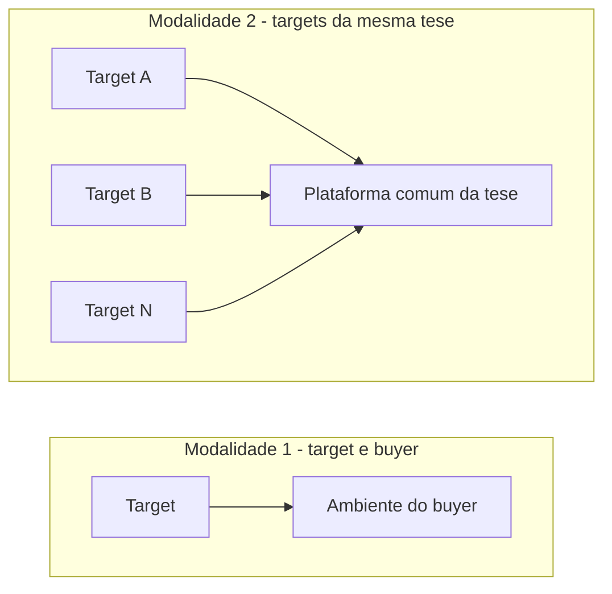
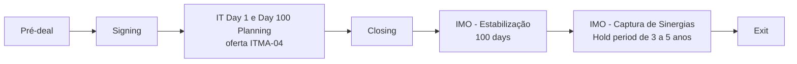
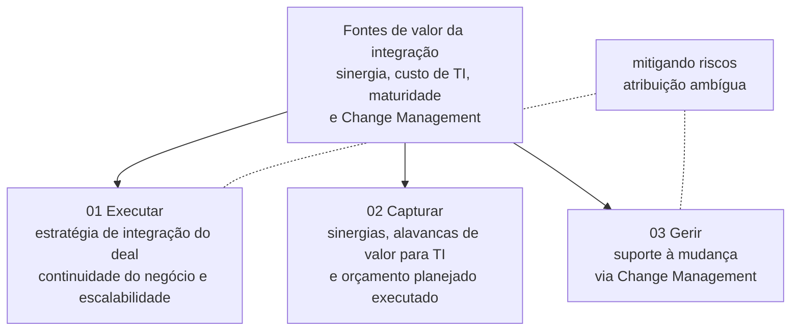
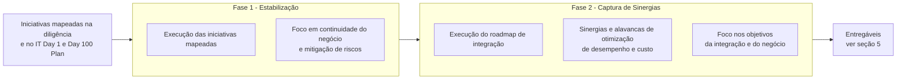
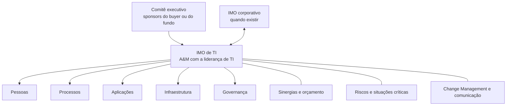
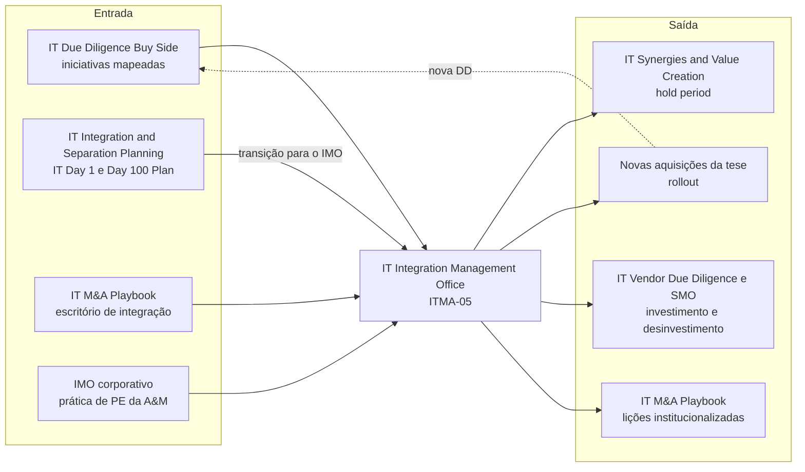

# IT Integration Management Office (IMO)

> **Transforma o plano de integração em valor realizado. Primeiro estabiliza a operação depois do Closing; em seguida, executa o roadmap que captura sinergias, reduz o custo de TI e eleva a maturidade tecnológica, com gestão da mudança entre buyer e targets.** 💡

| Código | Família | Fase(s) do ciclo | Lado | Readiness (atual → alvo FY) | PO | Squad |
|---|---|---|---|---|---|---|
| ITMA-05 | Planejamento & Execução 💡 | 100 days e Hold period 🗂️; início provável no Closing 💡 (ver seção 3.3) | Comprador: integração target–buyer ou entre targets da mesma tese de investimento 📘; Corporate e Private Equity 💡 | 3,5 → 4,0 🗂️ | Talita Galvão 🗂️ | Tatiane N, Guilherme C 🗂️ |

**Em síntese** 💡

- **O que é.** É a oferta de execução da integração de TI depois do Closing (PMI). Organiza-se em três pilares (Executar, Capturar e Gerir) e em duas fases (Estabilização e Captura de Sinergias). Atende duas modalidades: a integração da target com o buyer e a integração entre targets da mesma tese de investimento.
- **Documentação enxuta no deck.** São dois slides de escopo, com objetivo, pilares, régua do ciclo, abordagem, atividades por fase e entregáveis. Não há dimensões, "como fazemos", entregáveis-exemplo, cases, prazo nem modelo comercial. A extração do deck termina nesta seção, e o deck pode continuar além dela.
- **Maturidade intermediária e alvo sem folga.** Com readiness 3,5 (nível 3, "Oferta definida"), a oferta é a 5ª entre as 10 linhas e a 4ª entre as 7 ativas. O alvo de 4,0 cai exatamente no limiar de "Oferta estruturada", sem nenhuma margem.
- **Posição estratégica.** É o elo em que o valor apontado na diligência e planejado para o Day 1 vira resultado, e é a oferta de integração com o horizonte mais longo (100 dias mais o hold period). Na cadeia de integração, o readiness cai à medida que a cadeia se aproxima da captura de valor: DD Buy Side 4,5 → Planning 4,0 → IMO 3,5 → Synergies & Value Creation 2,3.

---

## 1. Descrição oficial 🗂️

> "Execução de todo o programa de integração (PMI – Post Merger Integration) identificando e controlando riscos e situações críticas."
>
> "Gerindo todas as frentes de trabalho que permeiam tecnologia de forma a garantir a plena captura de valor no menor tempo."

*Fonte: slide "A&M é M&A", no Deck Comercial, sob o título "IT Integration Management Office (IMO)" (linha 371). O texto foi reconstruído das linhas 381, 389, 397 e 405 da extração, onde aparece intercalado com as descrições das ofertas vizinhas, e confere com `descricao_oficial` em `data/ofertas.yaml`. Foram separadas palavras coladas na extração ("Execuçãode", "Gerindotodas").*

**Posição no ciclo.** No slide de catálogo, a oferta ocupa as fases "100 days" e "Hold period" (campo `fases` em `data/ofertas.yaml`). O primeiro slide de escopo traz a régua do ciclo com o marcador "Melhor momento para iniciar" (linhas 2321–2327), mas a fase marcada não é recuperável na extração (trecho ambíguo na extração). O segundo slide de escopo posiciona o IMO depois do Closing (seção 3.3).

**Leitura da descrição** 💡: os movimentos da descrição oficial correspondem aos três pilares do escopo (seção 4.1).

| Movimento da descrição oficial | Pilar do escopo |
|---|---|
| Execução de todo o programa de integração (PMI) | 01 Executar |
| Identificando e controlando riscos e situações críticas | 01 Executar ou 03 Gerir (ver nota ⁴ na seção 4.1) |
| Gerindo todas as frentes de trabalho que permeiam tecnologia | 03 Gerir |
| Garantir a plena captura de valor no menor tempo | 02 Capturar |

💡 **Duas ênfases a conciliar.** O catálogo enfatiza o controle de riscos e a velocidade ("no menor tempo"). O slide de escopo enfatiza as fontes de valor (sinergia, custo e maturidade) e o Change Management. Uma narrativa comercial única deveria juntar as duas: velocidade de captura com risco sob controle.

---

## 2. O problema que resolve 📘

A seção do IMO não formula o problema de forma explícita. Ela o apresenta pelo avesso, como as fontes de valor que um processo de integração precisa alcançar (linha 2303).

| # | Fonte de valor citada no deck 📘 | O que se perde sem um IMO de TI 💡 |
|---|---|---|
| 1 | Sinergia entre as empresas | As sinergias do business case ficam no papel, e a tese perde credibilidade com o board ou com o comitê do fundo. |
| 2 | Economia e eficiência de custos de TI | Contratos, licenças e infraestrutura duplicados continuam ativos, e o custo de TI combinado fica acima do planejado. |
| 3 | Melhoria da maturidade em tecnologia | A empresa combinada herda o pior dos dois ambientes, e a dívida técnica passa a limitar o crescimento. |
| 4 | Suporte ao Change Management entre os targets | Resistência à mudança, saída de pessoas-chave e baixa adoção dos processos e sistemas comuns. |

### 2.1 Contexto do deck: o custo de integrar sem planejamento e sem escritório 📘

Fora dos slides do IMO, o deck oferece três argumentos que sustentam a oferta.

- **Peso da TI na integração** (linhas 53–61, referência cruzada). Segundo o deck, mais de 50% "dos esforços de integração de uma fusão e aquisição estão em TI".
- **O IMO como desafio de negócio** (linha 153, referência cruzada). Entre os dez "desafios holísticos" de M&A, o deck lista "Estabelecer IMO, plano de comunicação e alinhar stakeholders".
- **Cenários e impactos** (linhas 2193–2235, seção de Integration & Separation Planning). O slide em que aparece o rótulo "IMO ou SMO" (linha 2197) ¹ compara três momentos de planejamento.

| Cenário | O que o deck descreve |
|---|---|
| Entre Signing e Closing | Melhor momento para planejar a integração ou separação. Antecipa problemas, tomada de decisão e geração de valor, com cronograma de iniciativas consolidado e executável no Day 1. |
| No Closing (Day 1) | Planejamento e execução começam junto com a tomada de controle da operação. As incertezas aumentam o fator de risco, a complexidade e os custos. |
| Pós-Closing | A tomada da operação sem planejamento de I&S gera "Distressed Projects", retrabalho, maior custo, aumento do fator de risco e atrasos no M&A. |

No mesmo slide, o deck afirma que empresas sem planejamento adequado "podem gastar de 2 a 3 vezes mais com TI ao final do processo". Acrescenta o aumento dos riscos de cibersegurança, a perda de talentos, os danos à imagem da empresa e a ruptura de negócios (linhas 2199–2207).

¹ *Trecho ambíguo na extração. "Planejamento" (linha 2195) e "IMO ou SMO" (linha 2197) aparecem soltos, como rótulos de um gráfico, entre letras de eixo intercaladas (linhas 2199–2207). A relação gráfica entre os dois rótulos não é recuperável. Os textos dos três cenários foram recompostos de fragmentos intercalados (linhas 2213–2235).*

💡 **Implicação para o IMO.** O IMO herda o que o planejamento deixou. Se entra depois de um IT Day 1 & Day 100 Plan, executa um backlog priorizado. Se entra sem ele, começa apagando incêndios e precisa reconstruir o plano com a operação em andamento. É o argumento para vender Planning e IMO em sequência.

---

## 3. Objetivo e escopo 📘

**Objetivo** (linha 2303). O IMO "atua com o objetivo de alcançar as principais fontes de valor num processo de integração": sinergia entre as empresas, economia e eficiência de custos de TI e melhoria da maturidade em tecnologia, além de suportar o Change Management entre os targets.

**Abordagem** (linha 2333). A oferta executa a "integração de plataformas, seja entre a target e o buyer, ou entre targets da mesma tese de investimento", para atender à estratégia do negócio e promover a continuidade da operação.

| Dimensão de escopo | O que o deck informa |
|---|---|
| Tipo de transação | Integração (linhas 2303 e 2333). A separação não aparece no escopo desta oferta; o equivalente para separações é o SMO (ITMA-06, em revisão). |
| Modalidades | Target com buyer; targets da mesma tese de investimento entre si (linha 2333). |
| Fontes de valor | Sinergia entre as empresas; economia e eficiência de custos de TI; melhoria da maturidade em tecnologia; Change Management entre os targets (linha 2303). |
| Pilares | 01 Executar · 02 Capturar · 03 Gerir (linhas 2305–2319). |
| Fases | Estabilização → Captura de Sinergias (linha 2343). |
| Insumos | Iniciativas mapeadas na diligência e no IT Day 1 & Day 100 Plan (linha 2345). |
| Horizonte | Do Closing ao Hold period (~3 a 5 anos), passando pelos 100 dias (linhas 2335–2365). Leitura provável; ver seção 3.3. |
| Dimensões de TI cobertas | Não informado no deck. A seção não traz dimensões. O Planning usa cinco: Pessoas, Processos, Aplicações, Infraestrutura e Governança (linhas 2043–2067). |
| Lado do deal | Comprador, implícito nas duas modalidades. A seção não menciona Corporate nem Private Equity; "tese de investimento" sugere um fundo 💡. |
| O que fica fora do escopo | Não informado no deck. |

### 3.1 Duas modalidades de integração 📘

O deck nomeia as duas modalidades (linha 2333). A caracterização abaixo é análise 💡, exceto onde indicado.

| Aspecto | Modalidade 1: target com buyer | Modalidade 2: targets da mesma tese |
|---|---|---|
| Definição no deck 📘 | Integração de plataformas entre a target e o buyer | Integração de plataformas entre targets da mesma tese de investimento |
| Cliente típico 💡 | Comprador estratégico (Corporate) ou plataforma de PE já em operação | Fundo de PE com tese de buy-and-build (roll-up) |
| Centro de gravidade 💡 | Absorver a target no ambiente do buyer | Construir uma plataforma comum a partir de ativos heterogêneos |
| Desafio dominante 💡 | Continuidade da operação da target durante as migrações | Arquitetura de referência e padronização entre várias empresas, aquisição após aquisição |
| Evidência no deck 📘 | Nenhum case nomeado | Plurix (6 targets) e Braveo (4 de 15 investidas), citados na seção de Planning (linhas 2289–2291) |

### 3.2 Conceitos-chave 💡

*Definições de apoio para leitores fora da prática. Não são conteúdo do deck, exceto onde a linha é citada.*

| Termo | Definição |
|---|---|
| IMO (Integration Management Office) | Escritório que governa a execução da integração: frentes de trabalho, riscos, orçamento, sinergias e mudança. Nesta oferta, o recorte é a tecnologia. |
| PMI (Post Merger Integration) | Fase de integração posterior ao Closing. O catálogo descreve o IMO como a execução de "todo o programa de integração (PMI)" (linhas 381–389). |
| Estabilização | Primeira fase do IMO no deck: execução das iniciativas já mapeadas, com foco em continuidade e mitigação de riscos (linhas 2343–2347). |
| Captura de Sinergias | Segunda fase: execução do roadmap de integração e das alavancas de otimização de desempenho e custo (linhas 2343 e 2353–2355). |
| Change Management | Gestão da mudança organizacional (pessoas, processos e comunicação). No deck, sustenta o pilar Gerir (linhas 2311–2315). |
| Tese de investimento | Racional de um fundo para um conjunto de aquisições num mesmo setor, como as teses Plurix e Braveo citadas no deck. |
| Rollout | Termo do deck (case Braveo) para a sequência de aquisições de uma tese: o planejamento do PMI "acelera" as aquisições seguintes e "prepara o IMO" (linha 2291). |
| Distressed Projects | Termo do deck para os projetos em dificuldade gerados por uma tomada de operação sem planejamento (linha 2227). |
| Hold period | Período em que o investidor mantém o ativo; o deck o estima em ~3 a 5 anos (linha 2325). |

### 3.3 Momento de início e posição na linha do tempo 📘

O deck traz duas representações temporais do IMO.

1. **Primeiro slide de escopo** (linhas 2321–2327). Régua "M&A Cycle", com Pré-deal, Sign-to-Close, 100 days, Hold period (~3 a 5 anos) e Exit, o rótulo "IT Integration Management Office (IMO)" e o marcador "Melhor momento para iniciar". A fase marcada não é recuperável na extração ².
2. **Segundo slide de escopo** (linhas 2335–2365). Linha do tempo com Pré-deal, Signing, IT Day 1 & Day 100 Planning e Closing, seguida do IMO com as fases Estabilização e Captura de Sinergias, sobre os rótulos "100 days" e "Hold period (~3 a 5 anos)" ³.

² *Trecho ambíguo na extração. O marcador é um elemento gráfico; a extração preserva o texto, mas não a posição dele sobre a régua.*
³ *Trecho ambíguo na extração. A ordem da linha do tempo foi recomposta das linhas 2335–2339. "IT Day 1 & Day 100 Planning" aparece duas vezes (linhas 2335 e 2351), provavelmente como rótulo da linha do tempo e como legenda. A associação de Estabilização aos 100 dias e de Captura de Sinergias ao hold period é leitura provável 💡, pela posição dos rótulos "100 days" (linha 2351) e "Hold period" (linha 2365) na extração. O slide não a afirma por escrito.*

💡 **Leitura.** O momento provável de início do IMO é o Closing (Day 1), em continuidade ao Planning, que o deck situa entre Signing e Closing (linha 2193). `data/ofertas.yaml` registra "A partir do Closing: 100 dias e hold period". Uma prática comum de mercado é mobilizar o IMO ainda no Sign-to-Close, para que ele assuma o plano em vez de apenas recebê-lo. Confirmar com o PO qual das duas opções o marcador indica.

---

## 4. Abordagem A&M: como fazemos 📘

### 4.1 Três pilares: Executar, Capturar e Gerir 📘 (linhas 2305–2319)

| Nº | Pilar | Descrição reconstruída ⁴ | Fonte de valor associada 💡 |
|---|---|---|---|
| 01 | **Executar** | Executar a estratégia de integração do deal, com foco em continuidade do negócio e escalabilidade [mitigando riscos] | Continuidade da operação, base para as demais fontes de valor |
| 02 | **Capturar** | Capturar sinergias, garantindo que as alavancas de valor para TI sejam alcançadas e o orçamento planejado seja executado | Sinergia entre as empresas; economia e eficiência de custos de TI |
| 03 | **Gerir** | Suportar a mudança através de Change Management [mitigando riscos] | Change Management entre os targets; maturidade em tecnologia |

⁴ *Trecho ambíguo na extração. Os três textos vêm intercalados linha a linha (linhas 2307–2319). A recomposição de Capturar e a do início de Executar e de Gerir são seguras pela gramática. O fragmento "mitigando riscos" (linha 2319) pode fechar tanto Executar quanto Gerir. A vírgula depois de "Change Management," (linha 2315) sugere que o texto de Gerir continua. Já a frase quase idêntica da área "Escritório de integração ou separação" do Playbook, "com foco em continuidade do negócio, capturando sinergias e mitigando riscos" (linha 501), sugere que o fragmento pertence a Executar. Confirmar no slide original. Foi corrigido "emcontinuidade" para "em continuidade".*

### 4.2 Atividades por fase: Estabilização e Captura de Sinergias 📘 (linhas 2341–2355)

| Fase | Atividade (leitura provável ⁵) | Foco declarado |
|---|---|---|
| **1. Estabilização** | Execução das iniciativas mapeadas na diligência e no IT Day 1 & Day 100 Plan (linha 2345) | Continuidade do negócio e mitigação de riscos (linha 2347) |
| **2. Captura de Sinergias** | Execução do roadmap de integração, identificando as possíveis sinergias e alavancas de otimização de desempenho e custo (linha 2353) | Objetivos da integração e do negócio (linha 2355) |

⁵ *Trecho ambíguo na extração. O slide traz os rótulos "Atividades:" (linha 2341) e "Entregáveis:" (linha 2349) e os cabeçalhos de fase "Estabilização" e "Captura de Sinergias" (linha 2343). Na extração, dois marcadores vêm depois de "Atividades:" e seis depois de "Entregáveis:". Cada marcador é uma frase inteira, mas a posição dele na grade não foi preservada. **Leitura provável, adotada aqui:** os dois pares paralelos "Execução de… / Foco em…" são as atividades de cada fase, e os quatro marcadores restantes são os entregáveis (seção 5.1). **Leitura literal alternativa:** só os dois primeiros marcadores são atividades, e os seis restantes são entregáveis. É a leitura registrada em `data/ofertas.yaml` (campo `deck.entregaveis`). Foram corrigidos "IT Day1" para "IT Day 1" e "Day100" para "Day 100".*

### 4.3 Visão integrada: pilares por fase 💡

O deck apresenta os pilares e as fases em slides diferentes, sem cruzá-los. A matriz abaixo é uma síntese deste repositório, a validar com o PO.

| Pilar | Fase 1: Estabilização | Fase 2: Captura de Sinergias |
|---|---|---|
| 01 Executar | Executar as iniciativas da diligência e do IT Day 1 & Day 100 Plan sem ruptura da operação | Executar o roadmap de integração e preparar o ambiente de tecnologia para o crescimento |
| 02 Capturar | Proteger o valor: evitar perdas, custos não planejados e desvios de orçamento | Identificar e realizar sinergias e alavancas de desempenho e custo, com o orçamento planejado sob controle |
| 03 Gerir | Comunicação, engajamento e controle de riscos e situações críticas na tomada de controle | Change Management em projetos complexos e elevação da maturidade de TI |

### 4.4 O que a seção não traz 📘

As seções de outras ofertas no deck seguem um padrão mais completo. A comparação abaixo mostra o que falta ao IMO no trecho extraído.

| Elemento presente em outras seções do deck | Situação no IMO |
|---|---|
| Dimensões-chave (Planning, Separation Strategy & Design, IT DD) | Não informado no deck |
| "Como fazemos?" passo a passo | Não informado no deck |
| Modelo de governança (comitês, ritos, papéis) | Não informado no deck. O Planning cita a "Definição da governança do projeto, papéis e responsabilidades de todas as partes" (linha 2077) e a "Matriz de responsabilidades RACI" (linha 2279), que podem servir de ponte. |
| Benefícios ("Porquê fazer?") | Não informado no deck |
| Entregáveis (exemplos) | Não informado no deck |
| Clientes e cases | Não informado no deck |
| Prazo e modelo comercial | Não informado no deck |

💡 Como a extração termina nesta seção (linha 2367), parte dessas ausências pode ser da extração, e não do deck. Ver a seção 10.

### 4.5 Modelo operacional de referência para o IMO de TI 💡

*Não é conteúdo do deck. É uma proposta para validar com o PO, montada com elementos que o deck cita em outras seções.*

- **Frentes de trabalho.** As cinco dimensões do Planning (linhas 2043–2067) como frentes do IMO, para manter a continuidade entre o plano e a execução.
- **Trilhas transversais.** Sinergias e orçamento (pilar Capturar), riscos e situações críticas (descrição oficial) e Change Management (pilar Gerir).
- **Cadência.** Acompanhamento semanal por frente e comitê executivo quinzenal ou mensal, com decisões e escalonamentos registrados.
- **Passagem entre fases.** Um portão formal de Estabilização para Captura de Sinergias, com critérios como operação estável, iniciativas críticas do Day 100 concluídas e linha de base de custos e maturidade medida.

---

## 5. Entregáveis 📘

### 5.1 Entregáveis declarados 📘 (linhas 2349–2363)

**Leitura provável** (nota ⁵):

| # | Entregável | Pilar relacionado 💡 | Fonte de valor relacionada 💡 | Linha |
|---|---|---|---|---|
| 1 | Elevação da maturidade de TI | 03 Gerir e 01 Executar | Melhoria da maturidade em tecnologia | 2357 |
| 2 | Preparação do ambiente de tecnologia para o crescimento | 01 Executar (escalabilidade) | Maturidade em tecnologia; estratégia do negócio | 2359 |
| 3 | Gestão da mudança em projetos complexos | 03 Gerir | Change Management entre os targets | 2361 |
| 4 | Suporte às estratégias de investimento e desinvestimento | 02 Capturar | Sinergia entre as empresas; estratégia do investidor | 2363 |

**Itens adicionais na leitura literal alternativa** (também listados como entregáveis em `data/ofertas.yaml`):

| # | Item | Linha |
|---|---|---|
| 5 | Execução do roadmap de integração, identificando as possíveis sinergias e alavancas de otimização de desempenho e custo | 2353 |
| 6 | Foco nos objetivos da integração e do negócio | 2355 |

💡 **Observações.**

- **Resultados, não artefatos.** Os entregáveis descrevem resultados (maturidade elevada, ambiente preparado, mudança gerida). Nenhum é um documento ou ferramenta tangível, como um painel de sinergias ou um registro de riscos. Isso dificulta a precificação e a evidência de entrega (ver 5.3).
- **Alcance além da integração.** O entregável "Suporte às estratégias de investimento e desinvestimento" leva o IMO a decisões de portfólio no hold period, como novas aquisições (add-ons) e desinvestimentos. Isso aproxima a oferta do SMO e da IT Vendor Due Diligence.

### 5.2 Entregáveis (exemplos)

**Não informado no deck (na extração).** Outras seções trazem slides de "Entregáveis (exemplos)", como a de Integration & Separation Planning (linhas 2239–2279); a do IMO não traz, no trecho extraído. O one-pager 📎 está pendente e não foi utilizado.

### 5.3 Estrutura de referência dos artefatos do IMO de TI 💡

*Não é conteúdo do deck. É uma estrutura mínima, anonimizada, montada a partir dos conceitos que o deck cita, para validar com o PO e confrontar com o one-pager quando ele for ingerido.*

| # | Artefato | Estrutura proposta (campos, escalas e formato) | Ancoragem no deck |
|---|---|---|---|
| 1 | Backlog de integração | Identificador; origem (diligência, IT Day 1 & Day 100 Plan ou nova); fase (Estabilização ou Captura); frente (cinco dimensões do Planning); responsável; prazo; status em semáforo; dependências | Linha 2345; project charters do Planning (linha 2265) |
| 2 | Rastreador de sinergias | Alavanca; tipo (redução de custo, custo evitado ou receita habilitada por TI); linha de base; meta; realizado; custo one-time para capturar; mês de captura; grau de confiança | Linhas 2303, 2309–2319 e 2353 |
| 3 | Controle orçamentário da integração | Capex e Opex planejados e executados, por iniciativa e por frente; desvio e reprevisão | "o orçamento planejado seja executado" (linhas 2317–2319) |
| 4 | Registro de riscos e situações críticas | Descrição; probabilidade e impacto em escala de 1 a 5; plano de mitigação; responsável; gatilho de escalonamento | Descrição oficial (linha 389); linha 2347 |
| 5 | Plano de gestão da mudança e comunicação | Mapa de stakeholders (influência e impacto); plano de comunicação; indicadores de adoção | Linhas 2303, 2315 e 2361 |
| 6 | Avaliação de maturidade de TI, antes e depois | Disciplinas de TI com escala de 1 a 5; linha de base no Closing e medições periódicas | Linhas 2303 e 2357 |
| 7 | Painel executivo do IMO | Status por frente; sinergias realizadas contra a meta; orçamento; principais riscos; decisões pendentes | Síntese dos itens 1 a 6 |

**Indicadores de sucesso sugeridos** 💡: percentual de sinergias de TI capturadas contra o plano; tempo até a captura; desvio do orçamento de integração; incidentes críticos no período de estabilização; evolução do índice de maturidade de TI; retenção de pessoas-chave de TI.

### 5.4 Cobertura das fontes de valor pelos entregáveis 💡

| Fonte de valor (linha 2303) | Onde a oferta endereça | Cobertura |
|---|---|---|
| Sinergia entre as empresas | Execução do roadmap com identificação de sinergias (linha 2353); suporte às estratégias de investimento e desinvestimento (linha 2363) | Parcial: não há artefato de medição |
| Economia e eficiência de custos de TI | Alavancas de otimização de desempenho e custo (linha 2353); orçamento planejado executado (pilar Capturar) | Parcial: não há linha de base nem meta citadas |
| Melhoria da maturidade em tecnologia | Elevação da maturidade de TI (linha 2357); preparação do ambiente para o crescimento (linha 2359) | Coberto como resultado, sem métrica |
| Change Management entre os targets | Gestão da mudança em projetos complexos (linha 2361); pilar Gerir | Coberto |

**Leitura.** As quatro fontes de valor têm alguma cobertura, mas nenhum entregável mede o valor capturado. Para uma oferta cuja promessa é a "plena captura de valor no menor tempo", essa é a lacuna que mais limita o readiness.

---

## 6. Modelo comercial, prazo e equipe 📘

| Dimensão | O que o deck informa |
|---|---|
| Modelo comercial / preço | Não informado no deck |
| Prazo / duração | Não informado no deck. A linha do tempo cobre "100 days" e "Hold period (~3 a 5 anos)" (linhas 2351 e 2365), o que delimita o horizonte possível, não a duração contratada. |
| Equipe | Não informado no deck |
| Modularidade | Não informado no deck. 💡 As duas fases são candidatas naturais a módulos. |
| Momento de início | Marcador "Melhor momento para iniciar" (linha 2327), com fase não recuperável. Leitura provável: Closing (seção 3.3). |
| Contratante | Não informado no deck |

**Argumentos transversais disponíveis no deck** 📘, na seção de Planning e aplicáveis à execução 💡:

- **Modelo hands-on** (linhas 2103–2133, em paráfrase). Execução como parte do DNA da A&M, com equipe sênior no papel de agente de transformação para capturar os resultados previstos; accountability e senso de dono como pilares, para eliminar problemas e acelerar decisões.
- **Benchmarks** de "mais de 100 projetos executados em M&A" (linhas 609 e 2115).

**Implicações comerciais** 💡 (hipóteses a validar com o PO):

- **Formato.** Estabilização em escopo fechado (por exemplo, até o Day 100) e Captura de Sinergias em retainer mensal ou as-a-service. O deck já usa esse formato no VMaaS Full Cycle da DD para Venture Capital: "Parceria - Faturamentos Mensais", com contratação "As-a-Service" (linhas 1049–1057).
- **Drivers de dimensionamento.** Número de empresas a integrar (modalidade 2), número de iniciativas herdadas (o case Braveo cita 35 iniciativas de 2 investidas), número de frentes e volume de sinergias em jogo.
- **Ancoragem de valor.** Comparar o honorário com o valor das sinergias de TI e com o custo evitado; o deck fala em gastar "de 2 a 3 vezes mais com TI" sem planejamento (linhas 2203–2205). Um componente variável atrelado a sinergias realizadas é uma opção a avaliar com as áreas de compliance e risco.
- **Receita recorrente.** É a oferta de integração com o horizonte potencial mais longo do portfólio. Explicitar o modelo comercial é a principal alavanca para subir o readiness.

---

## 7. Clientes e cases 📘

**Nesta seção do deck: nenhum case.** A extração termina sem um slide de clientes e cases para o IMO (ver seção 10).

### Cases correlatos citados em outras seções 📘

O deck não credita estes cases ao IMO. Eles aparecem nas seções de Planning e de IT DD e descrevem a execução de PMI ou a preparação do IMO.

| Case | Seção do deck | O que o deck informa | Relação com o IMO 💡 | Linhas |
|---|---|---|---|---|
| **Plurix** (holding do Pátria Investimentos com foco no varejo regional) | Integration & Separation Planning | A A&M executou a ITDD de 6 targets, apoiou a construção da arquitetura de referência da tese, planejou as integrações e realizou "posteriormente as atividades de PMI de TI entre o D1 e D100" | A execução do PMI de TI do D1 ao D100 equivale à fase de Estabilização, na modalidade 2 (targets da mesma tese) | 2289 |
| **Braveo** (tese de Distribuição Indireta de FMCG) | Integration & Separation Planning e IT DD Buy Side | 35 iniciativas de 2 investidas planejadas para o plano de 100 dias; desenho da arquitetura, IT DDs e planejamentos de PMI de 4 das 15 investidas; o planejamento do PMI acelera as demais aquisições no modelo de rollout e "prepara o IMO" | Passagem explícita do Planning para o IMO, na modalidade 2 | 2291 e 957 |

*Foi corrigido "Rolloute" para "Rollout e" (linha 2291).*

### Leitura dos cases 💡

- **A evidência é toda da modalidade 2.** Os dois cases são teses de PE com várias targets. Não há case de integração de uma target com um buyer estratégico.
- **Plurix é o candidato natural a case próprio do IMO.** Falta confirmar se o PMI do D1 ao D100 foi vendido como IMO e se a atuação seguiu no hold period.
- **Faltam resultados.** Nenhum dos cases traz sinergias capturadas, custo frente ao planejado ou prazo de integração.
- **Ponte com outra prática da A&M.** A prática de Private Equity da A&M lista "IMO capability" entre seus focos (linha 329). O IMO de TI pode entrar como frente de um IMO corporativo conduzido por essa prática.

---

## 8. Conexões no ciclo de M&A 💡

**Entrada (de onde vem a demanda)**

- **IT Due Diligence (Buy Side).** O IMO executa "as iniciativas mapeadas na diligência" (linha 2345).
- **IT Integration & Separation Planning.** O IMO executa o IT Day 1 & Day 100 Plan (linha 2345). A etapa Consolidar do Planning prevê a "Transição para o IMO ou SMO" e o início da execução das iniciativas planejadas (linhas 2019–2027) ⁶. A dimensão Governança do Planning avalia, entre outros itens, o "IMO/SMO" (linha 2067). No case Braveo, o planejamento do PMI "prepara o IMO" (linha 2291).
- **Benefícios do Planning que antecipam as fases do IMO.** "Estabilização da operação evitando rupturas para o negócio" (linha 2149) e "Foco total na captura de sinergias e mitigação de impactos" (linhas 2157–2165, recomposto).
- **IT M&A Playbook.** A área "Escritório de integração ou separação" (linha 501) prepara o cliente para operar o próprio escritório e cria demanda por apoio na primeira execução.
- **IMO corporativo.** A "IMO capability" da prática de Private Equity da A&M (linha 329) é uma porta de entrada para a frente de TI.

**Saída (pull-through)**

- **IT Synergies & Value Creation.** No hold period, a captura de sinergias continua como agenda de value creation do fundo.
- **Novas aquisições da tese (rollout).** Cada nova target reabre o ciclo DD, Planning e IMO.
- **IT Vendor Due Diligence (Sell Side) e SMO.** O entregável "Suporte às estratégias de investimento e desinvestimento" (linha 2363) liga o IMO à preparação de saídas e de carve-outs.
- **IT M&A Playbook.** As lições do IMO podem ser institucionalizadas num playbook do cliente.

⁶ *Recomposto de fragmentos intercalados: "Transição para o IMO ou SMO e" (linha 2019), "início da execução das iniciativas" (linha 2025) e "planejadas" (linha 2027). Os fragmentos "atual e plano de mitigação" e "de risco" pertencem à coluna vizinha, sobre cibersegurança.*

**Cadeia de integração no portfólio**

| Etapa da integração | Oferta | Situação no slide de status | Readiness atual → alvo FY |
|---|---|---|---|
| Diligência | IT Due Diligence (Buy Side) (ITMA-02) | Ativa | 4,5 → 4,7 |
| Planejamento de Day 1 e 100 dias | IT Integration & Separation Planning (ITMA-04) | Ativa | 4,0 → 4,3 |
| Execução da integração | IT Integration Management Office (ITMA-05) | Ativa | 3,5 → 4,0 |
| Valor no hold period | IT Synergies & Value Creation (ITMA-08) | Ativa | 2,3 → 3,3 |

**Pontos de atenção**

- **Maturidade decrescente rumo ao valor.** O portfólio é mais maduro onde se diagnostica e planeja do que onde se captura valor. Para fundos, que compram resultado, essa é a parte da cadeia que mais pesa na recompra.
- **Fronteira com Planning.** O case Plurix aparece na seção de Planning, mas inclui a execução do PMI de TI do D1 ao D100, que é escopo do IMO pela descrição oficial. É preciso definir quem executa os primeiros 100 dias.
- **Fronteira com Synergies & Value Creation.** As duas ofertas capturam sinergias no hold period. Uma divisão possível é que o IMO executa a integração e a S&VC conduz a agenda de valor do fundo além dela. Confirmar.
- **Relação com o SMO (em revisão).** O SMO está tachado no slide de status, sem motivo explicado. Guilherme C integra os dois squads, e o IMO já declara "suporte a desinvestimento". A consolidação dos dois escritórios numa oferta única é uma hipótese a avaliar (pergunta 10 da seção 10).

---

## 9. Maturidade e governança 🗂️

> *Uso interno. Esta seção traz nomes de profissionais vindos de `data/governanca.yaml` e não deve ser publicada fora da A&M.*

### Readiness

| Indicador | IT Integration Management Office | Service line IT M&A | Diferença |
|---|---|---|---|
| Readiness atual | **3,5** | 3,29 | +0,21 |
| Readiness alvo FY | **4,0** | 3,95 | +0,05 |
| Evolução planejada | **+0,5** | +0,66 | −0,16 |

| Posição na escala oficial | Nível | Nome | Risco |
|---|---|---|---|
| Atual (3,5) | 3 | Oferta definida | Médio |
| Alvo FY (4,0) | 4 | Oferta estruturada | Baixo |

*Escala do slide de status: 1 Oferta incompleta (risco muito alto) · 2 Oferta inicial (alto) · 3 Oferta definida (médio) · 4 Oferta estruturada (baixo) · 5 Oferta otimizada (muito baixo). A média da service line é simples, sobre as 10 linhas.*

💡 **Posição relativa.**

- **5ª entre as 10 linhas**, tanto no readiness atual quanto no alvo. À frente estão IT Due Diligence (Buy Side) (4,5 → 4,7), IT Integration & Separation Planning (4,0 → 4,3), SMO (3,9 → 4,3) e IT Separation Strategy & Design (3,6 → 4,1).
- **4ª entre as 7 linhas ativas** (não tachadas), nos dois indicadores.
- **Alvo sem folga.** O alvo de 4,0 coincide com o limiar de "Oferta estruturada". Qualquer atraso deixa a oferta no nível 3.
- **Ambição abaixo da média.** A evolução planejada (+0,5) é menor que a média da service line (+0,66), embora as lacunas comerciais, de entregáveis tangíveis e de cases sejam evidentes (seção 10).

### Governança

| Papel | Nome / situação |
|---|---|
| Líder da service line | Thiago Vieira |
| Product Owner | Talita Galvão |
| Squad | Tatiane N, Guilherme C |
| Status no fluxo (Pendente de Avaliação → Em Avaliação do PO → Pendente de Aprovação → Aprovada) | Vazio no slide |
| Situação no slide de status | Ativa (linha não tachada) |
| Aviso do slide | "POs e Membros serão reajustados" |

💡 **Observações.**

- **PO dedicado.** Talita Galvão é PO apenas desta oferta, assim como Matheus Teixeira (DD Buy Side) e Eric Anjos (Sell Side). É uma vantagem de foco para fechar as lacunas da seção 10.
- **Squad multialocado.** Tatiane N integra três squads (Playbook, IMO e IT Due Diligence (Venture Capital), esta tachada). Guilherme C integra os squads do IMO e do SMO, também tachado; ele é a ponte natural se os dois escritórios forem consolidados.
- **Passagem de bastão sem pessoas em comum.** Ninguém do squad do IMO participa dos squads de Planning (Marcela B) ou de DD Buy Side (Julio F), e os POs são diferentes. A transição Planning → IMO, que o deck descreve como explícita, não tem continuidade de pessoas na governança das ofertas.
- **O que separa 3,5 de 4,0.** Modelo comercial e prazo explícitos; entregáveis tangíveis (painel de sinergias, registro de riscos, controle orçamentário); um case próprio com resultados quantificados; momento de início legível; e um "como fazemos" com governança e frentes de trabalho.

---

## 10. Lacunas e perguntas em aberto 💡

**Lacunas de fonte**

1. **Fim da extração.** O texto extraído termina nesta seção (linha 2367, rodapé "Digital & Technology Services"). O deck pode continuar além do trecho extraído, com slides de "como fazemos", benefícios, entregáveis-exemplo, clientes e cases do IMO e, possivelmente, seções de SMO e de Synergies & Value Creation. Verificar no PDF original.
2. Modelo comercial e preço: não informados no deck.
3. Prazo e duração: não informados. A linha do tempo delimita apenas o horizonte (100 dias e hold period).
4. Equipe-tipo (papéis, senioridade e dedicação): não informada.
5. Momento de início: o marcador existe (linha 2327), mas a fase não é legível na extração.
6. Atribuição de "mitigando riscos" ao pilar Executar ou Gerir: ambígua (nota ⁴).
7. Fronteira entre atividades e entregáveis no segundo slide de escopo: ambígua (nota ⁵).
8. Entregáveis-exemplo: ausentes na extração; o one-pager 📎 está pendente.
9. Dimensões, frentes de trabalho e modelo de governança do IMO: não informados.
10. Cases próprios e resultados quantificados: ausentes.
11. Indicadores de sucesso (sinergias capturadas, custo, maturidade): não informados.

**Perguntas para o PO**

1. **Momento de início:** em que fase a régua do primeiro slide marca o início recomendado? No Closing ou já no Sign-to-Close?
2. **Duração e formato:** as fases são contratadas em separado? A Estabilização tem duração padrão (os 100 dias)? A Captura de Sinergias é vendida como retainer?
3. **Pilares:** "mitigando riscos" pertence a Executar ou a Gerir? (nota ⁴)
4. **Atividades e entregáveis:** a leitura provável da nota ⁵ está correta? Os quatro entregáveis valem para as duas fases ou se dividem entre elas?
5. **Artefatos:** quais documentos e ferramentas o IMO entrega de fato (painel de sinergias, registro de riscos, controle orçamentário)? Existem templates?
6. **Medição de valor:** como se mede a "sinergia capturada" e a "elevação da maturidade"? A linha de base vem da diligência?
7. **Cases:** os trabalhos em Plurix (PMI de TI do D1 ao D100) e Braveo podem ser creditados ao IMO? Há resultados quantificados?
8. **Fronteira com Planning:** quem executa os primeiros 100 dias, o Planning ou o IMO? Qual é o artefato formal da "transição para o IMO"?
9. **Fronteira com Synergies & Value Creation:** onde termina a captura de sinergias da integração e começa a agenda de value creation do fundo?
10. **Linhas tachadas (em revisão, motivo não explicado no slide):** o SMO será absorvido pelo IMO? O entregável "suporte a desinvestimento" já aponta nessa direção?
11. **IMO corporativo:** como o IMO de TI se articula com um IMO corporativo, inclusive o da prática de Private Equity da A&M ("IMO capability")?
12. **Modalidade 1:** há experiência ou case de integração de uma target com um buyer estratégico (Corporate)?
13. **One-pager:** o que o "One-pagers DTS.pptx" traz sobre esta oferta? Está pendente de ingestão.

---

## Fontes

- 📘 **Deck Comercial — "Deck Comercial - DIGITAL & TECHNOLOGY SERVICES - M&A - Full v7".** Usada a seção IT Integration Management Office (IMO), **linhas 2299–2367 da extração** (fim do arquivo extraído):
  - título da seção e do primeiro slide de escopo: linhas 2299–2301;
  - objetivo e fontes de valor: linha 2303;
  - pilares Executar, Capturar e Gerir: linhas 2305–2319;
  - régua "M&A Cycle" e marcador "Melhor momento para iniciar": linhas 2321–2327;
  - segundo slide de escopo, com abordagem e modalidades: linhas 2331–2333;
  - linha do tempo (Pré-deal, Signing, IT Day 1 & Day 100 Planning, Closing e IMO): linhas 2335–2339, 2351 e 2365;
  - atividades por fase (Estabilização e Captura de Sinergias): linhas 2341–2347 e 2353–2355;
  - entregáveis: linhas 2349–2363.
- 📘 **Menções ao IMO na seção de Integration & Separation Planning**, linhas 1941–2298 da extração:
  - "Transição para o IMO ou SMO" na etapa Consolidar: linhas 2019–2027;
  - "IMO/SMO" na dimensão Governança: linha 2067;
  - governança do projeto e RACI: linhas 2077 e 2279;
  - modelo hands-on e benchmarks: linhas 2103–2133 e 2115;
  - benefícios de estabilização e captura de sinergias: linhas 2149–2165;
  - cenários e impactos, com o rótulo "IMO ou SMO": linhas 2193–2235;
  - entregáveis-exemplo do Planning: linhas 2239–2279;
  - cases Plurix e Braveo: linhas 2289–2291.
- 🗂️ **Slide "A&M é M&A"**, no Deck Comercial: descrição oficial reconstruída das linhas 371, 381, 389, 397 e 405 da extração, conferida com `descricao_oficial` em `data/ofertas.yaml`.
- 🗂️ **Slide "Status das Ofertas – IT M&A"**, via `data/ofertas.yaml` (readiness, escala e situação das linhas) e `data/governanca.yaml` (PO, squad, liderança e aviso do slide).
- **Referências cruzadas no Deck Comercial**, fora do intervalo e usadas só para contexto e comparação:
  - linhas 53–61: peso da TI nos esforços de integração;
  - linha 153: "Estabelecer IMO" entre os desafios holísticos;
  - linha 329: "IMO capability" na prática de Private Equity da A&M;
  - linha 501: área "Escritório de integração ou separação" do IT M&A Playbook;
  - linha 609: benchmarks de mais de 100 projetos;
  - linha 957: case Braveo na seção de IT DD;
  - linhas 1049–1057: modelo VMaaS Full Cycle.
- 📎 **One-pagers DTS.pptx:** pendente de ingestão; não utilizado.
- **Notas de método:**
  - O PDF tem layout em colunas, e a extração intercala frases de colunas vizinhas. As reconstruções e ambiguidades estão sinalizadas no texto (notas ¹ a ⁶).
  - Foram corrigidos erros evidentes de digitação sem mudar o sentido: "M&A Cicle" virou "M&A Cycle"; "emcontinuidade" virou "em continuidade"; "IT Day1" virou "IT Day 1"; "Day100" virou "Day 100"; "Pré Deal" virou "Pré-deal"; "Rolloute" virou "Rollout e". Palavras coladas na extração foram separadas.
  - Os campos `analise.*` de `data/ofertas.yaml` são hipóteses anteriores e não foram usados como fonte.
