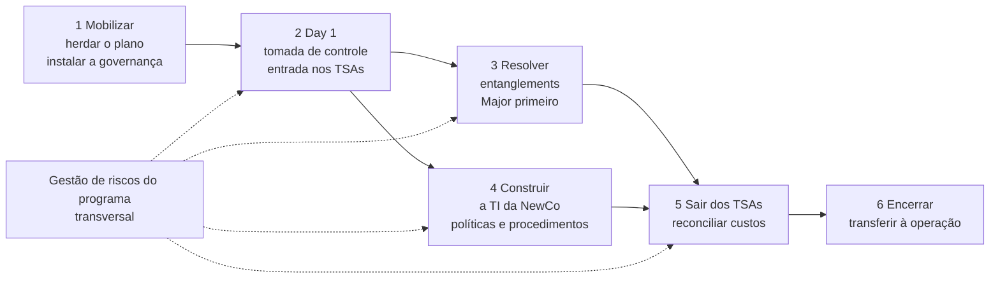
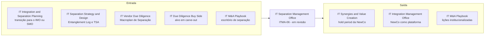

# IT Separation Management Office (SMO)

> **Leva a separação de TI do closing à autonomia da NewCo: transição de serviços, sistemas e ativos, solução de todos os entanglements e saída dos TSAs, com risco controlado e sem ruptura da operação.** 💡

| Código | Família | Fase(s) do ciclo | Lado | Readiness (atual → alvo FY) | PO | Squad |
|---|---|---|---|---|---|---|
| ITMA-06 | Planejamento & Execução 💡 | 100 days e Hold period 🗂️ (classificação do repositório; ver seção 1) | Não informado no deck; 💡 NewCo e seu controlador, com o vendedor como contraparte | 3,9 → 4,3 🗂️ · **linha tachada** | Heitor Milani 🗂️ | Guilherme C 🗂️ |

> **Linha TACHADA no slide "Status das Ofertas – IT M&A"** 🗂️
>
> A linha do IT Separation Management Office aparece tachada no slide de status, e o slide não explica o motivo. Neste repositório ela é tratada como **em revisão**. A mesma oferta, porém, continua no catálogo voltado ao cliente ("A&M é M&A"). Antes de apresentá-la a um cliente, confirme com o PO e com a liderança da service line se ela segue ativa (seção 10, pergunta 1).

**Em síntese** 💡

- **O que é.** Pela descrição oficial, é o escritório que executa o programa de separação de TI. Ele transiciona serviços, sistemas e ativos para o novo ambiente da NewCo, garante que todas as iniciativas de solução dos entanglements sejam concluídas, gerencia os riscos do programa e apoia a implantação de procedimentos e políticas da NewCo. É o elo de execução da cadeia de separação: desenho, planejamento e execução.
- **Tachada no status, viva no catálogo.** A contradição entre os dois slides precisa ser resolvida antes de qualquer uso comercial. O motivo do tachado não é informado.
- **Fonte escassa.** O deck não tem seção dedicada ao SMO, e a extração termina na seção do IMO. Fora do catálogo, a sigla "SMO" aparece só três vezes, todas na seção de Integration & Separation Planning, contra 14 menções a "IMO" no deck. "TSA" aparece três vezes, todas na seção de Separation Strategy & Design. "Standalone" não aparece nenhuma vez. Por isso, as seções 2 a 7 deste dossiê dependem de evidência indireta e de análise, sinalizadas bloco a bloco.
- **Paradoxo de maturidade.** O readiness de 3,9 é o 3º maior entre as 10 linhas e supera o do IMO (3,5), que tem seção própria no deck. É a linha tachada com a maior nota e, sozinha, eleva a média da service line em 0,07 ponto (de 3,22 para 3,29).
- **O que está em jogo.** Sem um SMO ativo, a cadeia de separação perde a oferta de execução exatamente onde estão os fatores críticos de carve-out mais operacionais: TSA, plano de transição, reconciliação de custos e comitês de gestão. A seção 10 traz quatro opções para a revisão da linha.

### Mapa de evidências: o que a fonte sustenta 💡

| Seção do dossiê | Evidência direta sobre o SMO | Evidência indireta usada | Apoio na fonte |
|---|---|---|---|
| 1. Descrição oficial | Sim: catálogo "A&M é M&A" (linhas 421–439) | — | Direto |
| 2. Problema | Não | Fatores críticos de carve-out (643–687); custo de planejar tarde (2191–2235) | Indireto |
| 3. Objetivo e escopo | Parcial: só a descrição oficial | Dimensões da NewCo na Separation Strategy & Design (719–743) | Parcial |
| 4. Abordagem | Não | Playbook (501), Planning (2019–2027, 2067, 2077, 2197), seção do IMO (2299–2365) | Nenhum direto |
| 5. Entregáveis | Não | Entregáveis de Separation Strategy & Design (787–821) e de Planning (2239–2279), como insumos | Nenhum direto |
| 6. Modelo comercial, prazo e equipe | Não | Modelos de outras ofertas (853, 1015–1063); credenciais da firma (253, 261) | Nenhum |
| 7. Cases | Não | Cases de separação de outras ofertas (833, 837, 2293) | Nenhum direto |
| 9. Maturidade e governança | Sim: slide de status | — | Direto |

**Frequência dos termos-chave na extração** 📘

| Termo | Linhas com ocorrência | Onde aparece |
|---|---|---|
| SMO | 4 (425, 2019, 2067, 2197) | Catálogo (1) e Integration & Separation Planning (3) |
| IMO | 14 | Desafios, esferas de atuação, catálogo, case Braveo, Planning e seção própria (2299–2339) |
| TSA | 3 (677, 681, 787) | Só em Separation Strategy & Design |
| NewCo | 9 (431, 439, 653, 723, 727, 735, 743, 789, 2293) | Catálogo do SMO (2), Separation Strategy & Design (6), case Invepar em Planning (1) |
| Entanglement(s) | 17 linhas | Catálogo do SMO (433), Separation Strategy & Design (14), Planning (1983 e 2075) |
| Carve-out | 6 (329, 645, 647, 833, 837, 2293) | Esferas de atuação, Separation Strategy & Design e case Invepar |
| Standalone | 0 | — |

---

## 1. Descrição oficial 🗂️

A descrição do catálogo tem três componentes. Cada um vai citado separadamente.

| # | Componente | Texto do catálogo | Leitura 💡 |
|---|---|---|---|
| 1 | Executar a transição | "Execução do programa de separação e transição dos serviços, sistemas e ativos de TI para o novo ambiente da NewCo" | Mandato de entrega: o SMO é dono do programa, e não apenas do plano. |
| 2 | Concluir os entanglements | "Garantir que todas as iniciativas para solução dos entanglements sejam realizadas" | Compromisso de completude: cada dependência mapeada precisa de uma iniciativa concluída. |
| 3 | Gerir riscos e institucionalizar a NewCo | "Gerenciamento dos riscos do programa, suporte à implementação de novos procedimentos e políticas da NewCo" | Dupla função: controlar o programa e construir a governança de TI da nova empresa. |

*Fonte: slide "A&M é M&A", no Deck Comercial. O texto foi reconstruído das linhas 421, 425 e 429–439 da extração, onde aparece intercalado linha a linha com a descrição da IT Separation Strategy & Design, e confere com `descricao_oficial` em `data/ofertas.yaml`. Palavras coladas na extração foram separadas ("Execuçãodo", "Garantirque", "Gerenciamentodos"). O trecho "suporte a implementação novos procedimentos" foi corrigido para "suporte à implementação de novos procedimentos", sem mudança de sentido.*

**Nomes da oferta no material**

| Onde | Nome | Linha |
|---|---|---|
| Catálogo "A&M é M&A" | IT Separation Management Office (SMO) | 421 e 425. O nome vem quebrado em duas linhas, com o nome da IT Separation Strategy & Design intercalado na linha 423. |
| Slide "Status das Ofertas – IT M&A" | IT Separation Management Office (linha tachada) | `data/ofertas.yaml` |
| Corpo do deck | Só a sigla, nas expressões "IMO ou SMO" e "IMO/SMO" | 2019, 2067 e 2197 |

**Posição no ciclo.** O catálogo traz a régua do ciclo de M&A: M&A Strategy, Pré-deal, Sign-to-Close, 100 days, Hold period (~3–5 anos) e Exit (linha 365). A posição de cada caixa na régua não é recuperável na extração de texto (trecho ambíguo na extração). A classificação em 100 days e Hold period segue `data/ofertas.yaml` e `docs/02-jornada-do-deal.md`, em simetria com o IMO.

💡 A classificação é coerente com a sequência documentada no deck. O planejamento de Day 1 e 100 dias, feito idealmente "entre os períodos de Signing e Closing" (linha 2193), termina na "Transição para o IMO ou SMO" (linhas 2019–2027). O SMO, portanto, começa no closing e se estende enquanto houver serviços em transição.

---

## 2. O problema que resolve 📘

Não há slide de problema dedicado ao SMO. O deck descreve o problema da separação em duas outras seções, usadas aqui como evidência indireta.

### 2.1 Fatores críticos de sucesso do carve-out 📘 (linhas 643–687, seção IT Separation Strategy & Design)

O slide abre com a premissa de que, em carve-outs, é essencial "atenção especial à mitigação de riscos e prevenção de ruptura das operações de TI existentes" (linha 645). Os 14 itens do slide estão abaixo, com a natureza de cada um.

| Pilar | Item do deck | Natureza 💡 |
|---|---|---|
| **Catalisar as oportunidades** | A formação da NewCo como oportunidade de revisar e otimizar estrutura organizacional, processos, arquitetura de sistemas, infraestrutura e governança (5 itens) | Desenho e execução: o SMO implanta o que foi redesenhado |
| **Minimizar a quebra de sinergias** | Revisão dos contratos e acordos essenciais ao negócio | Desenho e execução |
| | Redução de despesas one-time | Execução |
| | Avaliação dos níveis atuais de suporte e serviço de TI | Desenho |
| **Manutenção da integridade da operação** e **Mitigar riscos e disputas** ¹ | (a) Entanglements, riscos e planos de ação bem planejados e executados | **Execução** |
| | (b) Suporte à operacionalização e planejamento das atividades do TSA | **Execução** |
| | (c) Implementação do plano de transição | **Execução** |
| | (d) Definição de papéis e responsabilidades no TSA | Desenho e governança |
| | (e) Reconciliação dos custos da transação | **Execução** |
| | (f) Definição dos comitês de gestão e dos processos de resolução de problemas | **Execução** (governança do programa) |

¹ *Trecho ambíguo na extração. Os seis itens (a) a (f) vêm logo após o título "Manutenção da integridade da operação" (linha 673). O título "Mitigar riscos e disputas" aparece depois de todos eles (linha 687), sem itens próprios. A divisão dos itens entre os dois pilares não é recuperável.*

💡 **Leitura.** Ao menos cinco dos 14 itens descrevem execução, e não desenho: (a), (b), (c), (e) e (f). O slide que justifica a IT Separation Strategy & Design é, em boa parte, o caso de negócio do SMO. O dossiê da Strategy & Design ([03](03-it-separation-strategy-design.md), seção 5.4) registra que os itens de execução e governança da transição não têm entregável naquela oferta.

### 2.2 O custo de chegar ao closing sem plano 📘 (linhas 2191–2235, seção Integration & Separation Planning)

- **Custo.** "Empresas que não realizam o planejamento adequado de seus M&As podem gastar de 2 a 3 vezes mais com TI ao final do processo" (linhas 2201–2205). O deck não cita a fonte do número.
- **Riscos associados.** O mesmo trecho cita aumento dos riscos de cibersegurança, perda de talentos, danos à imagem da empresa e ruptura de negócios (linhas 2205–2207).
- **Após o closing.** A tomada da operação sem planejamento de integração ou separação "gera Distressed Projects, retrabalho, maior custo, aumento do fator de risco e atrasos no plano de M&A" (linhas 2223–2235, reconstruído de três colunas intercaladas).

💡 É no período do SMO que esses custos se materializam ou são evitados. O planejamento define o plano; a execução é que determina o custo final.

### 2.3 Contexto geral do deck 📘 (não específico do SMO)

- O slide "Desafios holísticos" (linhas 109–153) é escrito sob a ótica da integração ("integrando os diferentes aspectos da buyer e target", linha 111) e cita só o IMO: "Estabelecer IMO, plano de comunicação e alinhar stakeholders" (linha 153). Não há menção equivalente a separação.
- O mesmo slide lista a "Capacidade de 'comprar', 'faturar', 'atender', 'acessar' no Day 1, continuidade" (linha 125). 💡 Para uma NewCo, essa é a régua mínima do Day 1 e o primeiro teste do SMO.
- A prática de Private Equity da A&M declara foco em projetos como "PMI, Carve-Out, governança de portfólio de PE, M&A blueprint Op. Model, IMO capability" (linha 329). O carve-out é, portanto, foco declarado da firma, fora da DTS.

### 2.4 A dor por trás da execução da separação 💡

| Sintoma | Causa típica | Consequência para o deal |
|---|---|---|
| TSA que se prolonga sem data de saída | Iniciativas de resolução de entanglements sem dono, sem prazo ou sem orçamento | Custo recorrente pago ao vendedor e dependência operacional da NewCo |
| Entanglement "esquecido" que aparece no Day 1 ou na saída do TSA | Log desatualizado entre o desenho e a execução | Ruptura de serviço, retrabalho e solução emergencial cara |
| Custos one-time acima do previsto e custos remanescentes (stranded) no vendedor | Ausência de reconciliação periódica entre orçado e realizado | Erosão do valor da transação para as duas partes |
| Disputas entre vendedor e NewCo | Escopo, níveis de serviço e preço do TSA mal definidos ou mal acompanhados | Desgaste da relação, escalonamentos e custo jurídico |
| NewCo operando com regras herdadas, ou sem regras | Procedimentos e políticas próprios não implantados a tempo | Riscos de segurança, de compliance (LGPD) e de controle |
| Saída de pessoas críticas | Falta de plano para as "pessoas críticas para NewCo" (linha 723) | Perda de conhecimento no momento de maior risco operacional |

---

## 3. Objetivo e escopo 📘

**Objetivo.** Não informado no deck: não há slide de objetivo do SMO. O objetivo que se depreende da descrição oficial 🗂️ é executar a separação e a transição dos serviços, sistemas e ativos de TI para o novo ambiente da NewCo, garantindo a solução de todos os entanglements, com os riscos do programa sob controle e com procedimentos e políticas próprios implantados.

| Dimensão de escopo | O que a fonte informa |
|---|---|
| Tipo de transação | Separação com criação de uma NewCo (linhas 431 e 439) 🗂️ |
| Objeto da transição | Serviços, sistemas e ativos de TI (linhas 429–431) 🗂️ |
| Destino | "Novo ambiente da NewCo" (linha 431) 🗂️ |
| Frentes de trabalho | Programa de separação e transição; solução dos entanglements; riscos do programa; procedimentos e políticas da NewCo (linhas 429–439) 🗂️ |
| Dimensões cobertas | Não informado no deck. 💡 O candidato natural são as cinco dimensões usadas na Strategy & Design (719–743) e no Planning (2039–2067): Pessoas, Processos, Aplicações, Infraestrutura e Governança. |
| Momento | Não informado no deck. Classificação do repositório: 100 days e Hold period (seção 1). |
| Lado e contratante | Não informado no deck. |
| Instrumentos contratuais | A descrição do SMO não cita o TSA. O termo aparece só na seção de Strategy & Design (677, 681 e 787). 📘 |
| Fora do escopo | Não informado no deck. 💡 O desenho da separação cabe à IT Separation Strategy & Design ([03](03-it-separation-strategy-design.md)), e o plano de Day 1 e 100 dias, à IT Integration & Separation Planning ([04](04-it-integration-separation-planning.md)). |

### 3.1 Conceitos-chave 💡

*Definições de apoio para leitores fora da prática. Não são conteúdo do deck, salvo indicação.*

| Termo | Definição |
|---|---|
| SMO | Separation Management Office: escritório que governa e executa o programa de separação, do closing até a autonomia da nova empresa. É o equivalente do IMO para separações e carve-outs. |
| NewCo | A nova empresa que nasce da separação. No deck, o termo aparece no catálogo do SMO, na Strategy & Design e no case Invepar (NewCo Hmobi, linha 2293). |
| Carve-out | Separação de uma unidade de negócio de um grupo, para venda ou para constituir uma empresa independente. |
| Entanglement | Dependência compartilhada entre a unidade separada e o restante do grupo (sistema, contrato, infraestrutura, pessoa, processo). O deck classifica os entanglements em Major e Minor e prevê três estratégias de resolução: Build Duplicate, Rebuild e New Build (linhas 763–775). 📘 |
| TSA | Transition Service Agreement: contrato pelo qual o vendedor continua prestando serviços à NewCo por prazo determinado, até que ela tenha solução própria. O deck cita a operacionalização e a definição de papéis no TSA (677 e 681) e o "Suporte à definição do TSA" (787). 📘 |
| TSA reverso | Serviço prestado pela NewCo ao vendedor durante a transição. Não aparece no deck. |
| Custos one-time | Custos não recorrentes da separação (projetos, migrações, contratos novos). O deck cita "One-time e Stranded Costs de TI da NewCo" (linha 743). 📘 |
| Stranded costs | Custos que permanecem com uma das partes depois da separação, sem a receita ou a escala que os justificava. |
| Saída do TSA | Encerramento de um serviço de TSA após a migração para a solução própria da NewCo. |
| Standalone | Condição da NewCo quando opera sem depender de serviços do vendedor. O termo não aparece no deck. |

---

## 4. Abordagem A&M: como fazemos 📘

**Não informado no deck.** A extração não traz etapas, método nem slide de "como fazemos" do SMO. Esta seção reúne (4.1) o que o deck diz sobre escritórios de execução em geral, (4.2) o modelo do IMO como referência, (4.3) a posição do SMO na cadeia documentada e (4.4) uma proposta de abordagem 💡, a validar com o PO.

### 4.1 O que o deck diz sobre a execução de separações 📘

| # | Onde no deck | O que diz | Linhas | Relevância para o SMO 💡 |
|---|---|---|---|---|
| 1 | IT M&A Playbook, áreas de foco | Área "Escritório de integração ou separação": "Execução da estratégia de integração ou separação, com foco em continuidade do negócio, capturando sinergias e mitigando riscos" | 501 | Única definição genérica de escritório de separação no deck. Põe continuidade do negócio e mitigação de riscos no centro. |
| 2 | IT M&A Playbook, "Por quê ter playbook de M&A?" | Benefício "Execução": "Execução das integrações ou separações com maior eficácia e transparência para stakeholders, clientes e colaboradores" ² | 539–545 | Transparência com stakeholders como atributo da boa execução. |
| 3 | IT M&A Playbook, entregáveis | "Ferramentas de execução de integração ou separação de TI" | 635–637 | Indica ferramental de execução que um SMO poderia reaproveitar. |
| 4 | Separation Strategy & Design, "Como fazemos?" | A estratégia de separação inclui o "mapeamento de todas as iniciativas necessárias para execução da separação" | 785 | Define o backlog que o SMO executa. |
| 5 | Separation Strategy & Design, fatores críticos | Itens de integridade da operação: TSA, plano de transição, reconciliação de custos e comitês | 675–685 | Ver seção 2.1. |
| 6 | Integration & Separation Planning, fase Consolidar | "Transição para o IMO ou SMO e início da execução das iniciativas planejadas" ³ | 2019–2027 | Ponto formal de passagem para o SMO. |
| 7 | Integration & Separation Planning, "Como fazemos?" | "Definição da governança do projeto, papéis e responsabilidades de todas as partes" | 2077 | Governança que o SMO herda. |
| 8 | Integration & Separation Planning, project charters | Inclui "mapeamento de processos, definição de políticas e procedimentos" | 2079 | O Planning define políticas e procedimentos; o SMO apoia a implantação na NewCo (descrição oficial). |
| 9 | Integration & Separation Planning, dimensão Governança | "IMO/SMO" avaliado ao lado de DRP, ITSM, cibersegurança, SLM, contratos, gestão de demandas, LGPD e BCP | 2067 | O desenho do escritório de execução começa no planejamento. |
| 10 | Integration & Separation Planning, cenários e impactos | Gráfico com a sequência "Planejamento" → "IMO ou SMO" | 2195–2197 | Confirma a posição do SMO depois do planejamento. |
| 11 | IT Integration Management Office (seção irmã) | Modelo de escritório de execução, só para integração; lista "Suporte às estratégias de investimento e desinvestimento" | 2299–2363 | Único escritório de execução detalhado no deck (seção 4.2). |
| 12 | Credenciais da A&M | "DNA de turnaround – Forte histórico em implementação com participação ativa na execução"; pragmatismo e "posições interinas, se necessário" | 253 e 261 | Diferenciais da firma que sustentam uma oferta de execução. |

² *Trecho reconstruído. As colunas "Controle" e "Execução" vêm intercaladas nas linhas 537–545. O texto de "Controle" é "Maior confidencialidade da estratégia de M&A frente aos concorrentes".*
³ *Trecho reconstruído das linhas 2019, 2025 e 2027, intercaladas com o item "Avaliação de cibersegurança atual e plano de mitigação de risco". Foram corrigidos "inicio" para "início" e "cybersegurança" para "cibersegurança".*

### 4.2 O IMO como referência 📘 (linhas 2299–2365)

O IMO é a única oferta de execução com seção própria no deck. A comparação mostra o que o SMO teria de explicitar para ter o mesmo nível de documentação.

| Aspecto | IT Integration Management Office 📘 | IT Separation Management Office |
|---|---|---|
| Objetivo | "Alcançar as principais fontes de valor num processo de integração", como sinergia, economia e eficiência de custos de TI e maturidade (linha 2303) | 🗂️ Executar a separação e a transição para a NewCo (descrição oficial) |
| Lógica de valor | Capturar sinergias | 💡 Minimizar a quebra de sinergias (linhas 665–671), evitar ruptura e controlar custos one-time e stranded |
| Etapas | Executar, Capturar e Gerir (linhas 2305–2319) ⁴ | Não informado no deck |
| Fases de atividade | Estabilização e Captura de Sinergias (linha 2343) | 💡 Day 1, operação sob TSA, resolução dos entanglements e saída dos TSAs |
| Entregáveis | Execução das iniciativas da diligência e do Day 1 & Day 100 Plan; execução do roadmap de integração; elevação da maturidade de TI; preparação para o crescimento; gestão da mudança; suporte às estratégias de investimento e desinvestimento (linhas 2345–2363) | Não informado no deck |
| Momento | Marcador "Melhor momento para iniciar" (linha 2327); a fase marcada não é legível na extração | Não informado no deck; classificação do repositório: 100 days e Hold period |
| Contrapartes | Target e buyer, ou targets da mesma tese de investimento (linha 2333) | 🗂️ NewCo (linhas 431 e 439); 💡 vendedor como provedor dos TSAs |
| Instrumento contratual central | Não citado | 💡 TSA, citado só na seção de Strategy & Design |

⁴ *Trecho ambíguo na extração. Os textos das três etapas vêm intercalados (linhas 2307–2319). A leitura provável é: Executar a estratégia de integração do deal com foco em continuidade do negócio e escalabilidade; Capturar sinergias, garantindo as alavancas de valor e a execução do orçamento; Gerir a mudança por meio de Change Management. A atribuição de "mitigando riscos" a uma das etapas não é recuperável.*

💡 **Leitura.** A diferença de fundo está na direção do valor. O IMO soma estruturas para capturar sinergias. O SMO desfaz dependências e protege o valor contra a quebra de sinergias, o custo de transição e a ruptura. Por isso, o modelo do IMO não se transpõe automaticamente ao SMO: TSA, NewCo e stranded costs não têm equivalente na integração.

### 4.3 A posição do SMO na cadeia de separação documentada 📘

O deck documenta todos os elos que antecedem o SMO e a passagem para ele, mas não o SMO em si.

*Elos e passagens: Macroplan de Separação (linha 1831, próximo ao rótulo "Desinvestimento", linha 1817); Entanglement Log e Suporte à definição do TSA (linha 787); Entanglement Log como insumo do Planning (linhas 1983 e 2075); transição para o IMO ou SMO (linhas 2019–2027); NewCo (linhas 431 e 439). A seta tracejada é hipótese 💡: o deck não liga explicitamente o Macroplan de Separação à Strategy & Design.*

### 4.4 Abordagem proposta 💡 (hipótese a validar com o PO)

A proposta abaixo não está no deck. Ela organiza a execução em seis fases e ancora cada uma em elementos que o deck já usa em outras ofertas.

| Fase 💡 | O que acontece | Âncora no deck 📘 |
|---|---|---|
| **1. Mobilizar** | Receber o plano de Day 1 e 100 dias, o Entanglement Log e o desenho dos TSAs; instalar a governança do SMO (comitês, papéis, ritos de decisão e de escalonamento) | "Transição para o IMO ou SMO" (2019–2027); comitês de gestão e processos de resolução de problemas (685); governança, papéis e responsabilidades (2077) |
| **2. Day 1 e entrada nos TSAs** | Executar o checklist de tomada de controle; ativar os serviços de TSA com papéis definidos e níveis de serviço acompanhados | Checklist de tomada de controle (2085 e 2261); papéis e responsabilidades no TSA (681); operacionalização das atividades do TSA (677) |
| **3. Resolver os entanglements** | Executar as iniciativas de resolução, começando pelos Major, segundo a estratégia definida (Build Duplicate, Rebuild ou New Build) | Descrição oficial (433–435); classificação Major e Minor e estratégias de resolução (763–775); seleção de fornecedores (2091) |
| **4. Construir a TI da NewCo** | Implantar estrutura organizacional, modelo operacional, infraestrutura, aplicações e licenças da NewCo; publicar procedimentos e políticas | Descrição oficial (437–439); formação da NewCo como oportunidade (653); infraestrutura necessária para a NewCo (789); estrutura To-Be e modelo operacional futuro (805–807) |
| **5. Sair dos TSAs e reconciliar custos** | Migrar cada serviço, encerrar os TSAs e reconciliar custos one-time e stranded contra o orçado | Implementação do plano de transição (679); reconciliação dos custos da transação (683); one-time e stranded costs (743) |
| **6. Encerrar e transferir** | Transferir a operação à TI da NewCo e o roadmap ao hold period | Sem âncora direta. O IMO prevê "Preparação do ambiente de tecnologia para o crescimento" (2359). |
| **Transversal: riscos** | Gestão dos riscos e issues do programa e prevenção de disputas entre as partes | Descrição oficial (437); "Mitigar riscos e disputas" (687); heatmap de riscos (787) |

💡 As fases 3 e 4 correm em paralelo. A saída de cada TSA depende de a solução própria correspondente estar pronta. Por isso, o marco que governa o programa é a data de saída de cada serviço, e não o fim dos 100 dias.

---

## 5. Entregáveis 📘

**Não informado no deck.** Não há lista de entregáveis do SMO. Esta seção mostra (5.1) os artefatos que o SMO herda das ofertas anteriores, que estão no deck, (5.2) os entregáveis implícitos na descrição oficial e (5.3) uma proposta de estrutura de entregáveis 💡.

### 5.1 Insumos que o SMO herda 📘

| Origem | Artefato | Linhas | Uso pelo SMO 💡 |
|---|---|---|---|
| Separation Strategy & Design | Entanglement Log (Major e Minor, com estratégia de resolução) | 761–775, 787 | Backlog de resolução e base do controle de completude |
| Separation Strategy & Design | Heatmap de riscos | 787 | Ponto de partida do registro de riscos do programa |
| Separation Strategy & Design | Suporte à definição do TSA | 787 | Base do acompanhamento dos TSAs e do plano de saída |
| Separation Strategy & Design | Inventário de aplicações e estratégia de licenciamento | 787–791, 799 | Escopo da migração de aplicações e das licenças da NewCo |
| Separation Strategy & Design | Infraestrutura necessária para a NewCo | 789 | Escopo da construção da infraestrutura própria |
| Separation Strategy & Design | Estrutura organizacional To-Be e modelo operacional futuro | 805–807 | Alvo da implantação organizacional |
| Separation Strategy & Design | Análise dos custos (Opex/Capex) | 813 | Linha de base da reconciliação de custos |
| Integration & Separation Planning | Project charters com escopo, prazo e custo detalhados | 2265 | Unidade de gestão de cada iniciativa |
| Integration & Separation Planning | Cronograma de integração ou separação com foco nos 100 primeiros dias | 2267 | Linha de base de prazo |
| Integration & Separation Planning | Checklist de tomada de controle para o Day 1 | 2259–2261 | Roteiro do Day 1 |
| Integration & Separation Planning | Matriz de priorização e heatmap de pessoas; matriz de riscos e roadmap consolidado | 2271–2275 | Priorização e alocação durante a execução |
| Integration & Separation Planning | Estratégias de orçamentação de tecnologia; estratégias de implementação das iniciativas | 2269, 2275 | Controle orçamentário e plano de implementação |
| Integration & Separation Planning | Estratégia e plano de comunicação; matriz RACI | 2277–2279 | Comunicação com as partes e responsabilidades |
| IT Vendor Due Diligence | Macroplan de Separação (no desinvestimento) | 1817, 1831 | Visão do vendedor sobre a separação, quando existir |
| IT M&A Playbook | Ferramentas de execução de integração ou separação de TI; checklist de tomada de controle | 589, 635–637 | Ferramental reaproveitável, quando o cliente já tiver playbook |

### 5.2 Entregáveis implícitos na descrição oficial 💡

| Componente da descrição 🗂️ | Entregável implícito 💡 |
|---|---|
| Execução do programa de separação e transição | Plano-mestre de execução, cronograma de transição por onda e relatório periódico de status |
| Transição de serviços, sistemas e ativos | Registro de TSAs e plano de saída por serviço; plano de cutover por onda |
| Solução de todos os entanglements | Log de resolução de entanglements com status e evidência de conclusão |
| Gerenciamento dos riscos do programa | Registro de riscos, ações, issues e decisões, com escalonamento |
| Implantação de procedimentos e políticas da NewCo | Kit de políticas e procedimentos de TI da NewCo, com plano de adoção |

### 5.3 Estrutura proposta de entregáveis 💡

*Estrutura e formato apenas, de forma genérica. Nenhum conteúdo de cliente.*

| Artefato 💡 | Estrutura sugerida | Cadência |
|---|---|---|
| **Charter e governança do SMO** | Objetivos e critérios de sucesso; comitês (direção, gestão do programa, frentes por dimensão); papéis e matriz RACI; ritos de decisão e de escalonamento entre vendedor e NewCo | Na mobilização, revisado por fase |
| **Registro de TSAs** | Uma linha por serviço: dimensão, provedor e receptor, descrição, nível de serviço, custo mensal, início, data-alvo de saída, critério de saída, dependências, status (verde, amarelo, vermelho) | Semanal |
| **Log de resolução de entanglements** | Identificador herdado do Entanglement Log; dimensão; classificação Major ou Minor; estratégia (Build Duplicate, Rebuild ou New Build); iniciativa e responsável; marco; evidência de conclusão; status | Semanal |
| **Registro de riscos e issues** | Risco ou issue, dimensão, probabilidade e impacto em escala de 1 a 5, mitigação, dono, prazo e gatilho de escalonamento; parte do heatmap de riscos herdado | Semanal, com consolidação no comitê |
| **Plano de cutover e checklist por onda** | Pré-requisitos, sequência, janela, responsáveis, critérios de go/no-go e plano de retorno | Por onda de migração |
| **Kit de políticas e procedimentos da NewCo** | Lista por domínio (segurança da informação, ITSM, contratos, LGPD, continuidade e recuperação de desastres, gestão de demandas), com dono, status de publicação e plano de adoção | Por marco |
| **Reconciliação de custos** | Custos one-time e stranded, orçado contra realizado, por dimensão e por iniciativa; custo acumulado dos TSAs | Mensal |
| **Plano de saída dos TSAs e relatório de encerramento** | Sequência de saídas, critérios de aceite, lições aprendidas e transferência para a operação | Na fase 5 e no encerramento |
| **Painel executivo** | Indicadores de avanço (iniciativas concluídas, TSAs encerrados, entanglements resolvidos), custo contra orçamento, riscos críticos e decisões pendentes | Quinzenal ou mensal |

*Os domínios do kit de políticas seguem os itens da dimensão Governança do Planning (DRP, ITSM, cibersegurança, SLM, contratos, gestão de demandas, LGPD e BCP; linha 2067).*

### 5.4 Cobertura dos fatores críticos de sucesso 💡

| Fator crítico do deck 📘 (linhas 647–687) | Separation Strategy & Design | Integration & Separation Planning | SMO, proposto 💡 |
|---|---|---|---|
| NewCo como oportunidade de revisar e otimizar estrutura, processos, sistemas, infraestrutura e governança | Desenha o To-Be | Planeja | Implanta (fase 4; kit de políticas) |
| Revisão de contratos e acordos essenciais | Avalia contratos e licenciamento | Avalia contratos (dimensão Governança) | Executa renegociações e novos contratos |
| Redução de despesas one-time | Estima custos | Orça | Controla e reconcilia |
| Avaliação dos níveis de suporte e serviço de TI | Avalia | Planeja | Monitora os níveis de serviço dos TSAs |
| (a) Entanglements, riscos e planos de ação planejados e executados | Mapeia e planeja | Consolida no plano | Executa e comprova (log de resolução) |
| (b) Operacionalização e planejamento do TSA | Suporta a definição | Não explícito | Opera e acompanha (registro de TSAs) |
| (c) Implementação do plano de transição | Não | Elabora o plano | Implementa (fases 2 a 5) |
| (d) Papéis e responsabilidades no TSA | Suporta a definição | RACI | Aplica e arbitra (charter e governança) |
| (e) Reconciliação dos custos da transação | Não | Não | Reconcilia (mensal) |
| (f) Comitês de gestão e resolução de problemas | Não | Define a governança do projeto | Opera os comitês |

💡 **Leitura.** Sem o SMO, os itens (c), (e) e (f) ficam sem dono depois do Day 1, e (b) e (d) ficam só desenhados.

---

## 6. Modelo comercial, prazo e equipe 📘

| Item | IT Separation Management Office |
|---|---|
| Modelo comercial | Não informado no deck |
| Preço | Não informado no deck |
| Prazo ou duração | Não informado no deck |
| Equipe-tipo | Não informado no deck |

### 6.1 Referências do portfólio no deck 📘 (outras ofertas)

| Oferta | Referência | Linhas |
|---|---|---|
| IT Due Diligence (Buy Side) | "Até 6 semanas" | 853 |
| IT Due Diligence (Venture Capital), VMaaS On Demand | R$ 35 mil por semana; contratação on demand; prazo de 2 a 3 semanas | 1015 |
| VMaaS Package | Pacote de serviços com consumo por acionamento; contratação anual ou semestral; prazo igual ao ciclo de investimento | 1063 |
| VMaaS Full Cycle | Parceria com faturamentos mensais; contratação as-a-service | 1057 |
| IT Integration Management Office | Não informado no deck | — |

💡 Nenhuma oferta de execução (IMO ou SMO) tem modelo comercial ou duração no deck. Os únicos modelos recorrentes documentados estão na variante de Venture Capital, também tachada no slide de status.

### 6.2 Atributos de equipe declarados pela firma 📘 (não específicos do SMO)

- "DNA de turnaround – Forte histórico em implementação com participação ativa na execução" (linha 253).
- Executivos vindos da indústria, de consultorias e de instituições financeiras, com pragmatismo para destravar situações críticas e assumir "posições interinas, se necessário"; times seniores compostos conforme as especialidades de cada setor (linha 261).
- Benchmarks de "mais de 100 projetos executados em M&A" (linhas 609 e 2115).

### 6.3 Hipóteses para a formalização 💡

- **Modelo comercial.** Honorário mensal durante a vigência dos TSAs, com marcos de saída explícitos. Um componente variável atrelado à saída dos TSAs no prazo poderia alinhar incentivos, mas exige critérios objetivos de aceite.
- **Duração.** Definida pelo calendário de saída dos TSAs, e não pelos 100 dias. Deve ser dimensionada a partir do Registro de TSAs herdado do desenho.
- **Equipe-tipo.** Líder do SMO (sênior, interlocutor dos comitês); líderes de frente por dimensão (Pessoas, Processos, Aplicações, Infraestrutura e Governança); analista de PMO para registros, custos e painel. Opcional: liderança interina de TI da NewCo, coerente com a credencial de "posições interinas" (linha 261).
- **Continuidade de equipe.** Manter na execução ao menos uma pessoa do desenho ou do planejamento preserva o conhecimento do Entanglement Log e reduz o risco de dependência esquecida.

---

## 7. Clientes e cases 📘

**Não informado no deck: nenhum case é atribuído ao SMO.** O deck relata três trabalhos de separação em outras ofertas. Nenhum deles descreve a execução da transição.

| Case | O que o deck relata | Linha | Seção do deck | Relação com o SMO 💡 |
|---|---|---|---|---|
| Mubadala e UniFTC | Carve-out que criou uma nova instituição de ensino (curso de Medicina e um campus inteiro, cerca de 3.000 alunos). A A&M planejou a implementação do landscape de TI, mapeou mais de 50 entanglements, avaliou custos e riscos e propôs o roadmap de implementação do novo ecossistema de tecnologia. | 833 | Separation Strategy & Design | O roadmap de implementação é o backlog típico de um SMO. O deck não diz se a A&M seguiu na execução. |
| Mubadala e Invepar (MetroRio e LAMSA, holding Hmobi) | A A&M foi contratada pelo fundo para avaliação e planejamento do carve-out, com mais de 67 entanglements mapeados, investimentos necessários, riscos para o negócio e estrutura de pessoas para a nova empresa. | 837 | Separation Strategy & Design | Fase de desenho e planejamento. A execução não é relatada. |
| Invepar (MetroRio e MetroBarra, NewCo Hmobi) | Preparação do carve-out de TI: diagnóstico da estrutura, cenários de separação, landscape de TI futuro e "plano de transição para a nova empresa controladora". | 2293 | Integration & Separation Planning | O plano de transição é exatamente o artefato que um SMO executaria. |

💡 **Leitura.**

- **A demanda por separação está provada; a execução, não.** Os três relatos mostram a A&M contratada para desenhar e planejar separações, inclusive com o mesmo cliente (Mubadala) duas vezes. Se a A&M executou alguma dessas transições, esse seria o primeiro case do SMO, e o mais urgente a documentar.
- **Divergência de perímetro.** O case Invepar aparece com MetroRio e LAMSA (linha 837) e com MetroRio e MetroBarra (linha 2293). Convém conciliar antes de qualquer uso externo (ver o dossiê [03](03-it-separation-strategy-design.md), pergunta 6).
- **Slide de clientes.** O slide "Clientes" do deck traz a anotação "Validar c/ Quintão" (linhas 453–457), e os logos não são legíveis na extração.

---

## 8. Conexões no ciclo de M&A 💡

**Entrada (de onde vem a demanda)**

- **IT Integration & Separation Planning** ([04](04-it-integration-separation-planning.md)): principal porta de entrada. A fase Consolidar termina na "Transição para o IMO ou SMO" (linhas 2019–2027).
- **IT Separation Strategy & Design** ([03](03-it-separation-strategy-design.md)): entrega o Entanglement Log e o suporte à definição do TSA. A descrição oficial do SMO retoma literalmente a "solução dos entanglements".
- **IT Vendor Due Diligence (Sell Side)** ([07](07-it-due-diligence-sell-side.md)): o "Macroplan Separação" no desinvestimento (linhas 1817 e 1831) sugere demanda pelo lado do vendedor, que também precisa governar os TSAs que presta.
- **IT Due Diligence (Buy Side)** ([02](02-it-due-diligence-buy-side.md)): quando o alvo é um carve-out, a diligência antecipa os entanglements e o custo de transição.
- **IT M&A Playbook** ([01](01-it-ma-playbook.md)): a área "Escritório de integração ou separação" (linha 501) e a etapa recomendável "Acompanhar" (linha 477) podem gerar um primeiro SMO assistido.

**Saída (pull-through)**

- **IT Synergies & Value Creation**: a NewCo autônoma entra no hold period do fundo controlador.
- **IT Integration Management Office** ([05](05-it-integration-management-office.md)): quando a NewCo vira plataforma de novas aquisições.
- **IT M&A Playbook**: institucionalizar as lições da separação para os próximos deals do cliente.

**Cadeia de separação no portfólio**

| Etapa da separação | Oferta | Situação no slide de status | Readiness atual |
|---|---|---|---|
| Desenho | IT Separation Strategy & Design (ITMA-03) | Ativa | 3,6 |
| Planejamento de Day 1 e 100 dias | IT Integration & Separation Planning (ITMA-04) | Ativa | 4,0 |
| Execução e saída dos TSAs | IT Separation Management Office (ITMA-06) | **Tachada (em revisão)** | 3,9 |

**Fronteiras a definir**

| Fronteira | Evidência no deck 📘 | Risco se não for definida 💡 |
|---|---|---|
| SMO × IMO | O IMO lista "Suporte às estratégias de investimento e desinvestimento" (linha 2363); o Playbook fala em um só "Escritório de integração ou separação" (linha 501) | Sobreposição de escopo e dúvida sobre quem vende a execução de um carve-out |
| SMO × Planning | O Planning termina na transição para o IMO ou SMO (2019–2027) e define políticas e procedimentos (2079) | Lacuna ou duplicidade entre o plano de 100 dias e a execução até a saída dos TSAs |
| SMO × Strategy & Design | A Strategy & Design dá "Suporte à definição do TSA" (787) | Ninguém responsável por operar e encerrar o TSA que foi desenhado |

---

## 9. Maturidade e governança 🗂️

> *Esta seção traz nomes de profissionais vindos de `data/governanca.yaml`. Antes de compartilhar fora da A&M, confirme que a exibição dos nomes está autorizada.*

**Situação no slide de status: linha TACHADA.** O motivo não é explicado no slide. Neste repositório, a linha é tratada como "em revisão" (pergunta 1 da seção 10). As outras duas linhas tachadas são IT Due Diligence (Corporate) e IT Due Diligence (Venture Capital).

### Readiness

| Indicador | IT Separation Management Office | Service line IT M&A | Diferença |
|---|---|---|---|
| Readiness atual | **3,9** | 3,29 | +0,61 |
| Readiness alvo FY | **4,3** | 3,95 | +0,35 |
| Evolução planejada | **+0,4** | +0,66 | −0,26 |

| Posição na escala oficial | Nível | Nome | Risco |
|---|---|---|---|
| Atual (3,9) | 3 | Oferta definida | Médio |
| Alvo FY (4,3) | 4 | Oferta estruturada | Baixo |

*Escala do slide de status: 1 Oferta incompleta (risco muito alto) · 2 Oferta inicial (alto) · 3 Oferta definida (médio) · 4 Oferta estruturada (baixo) · 5 Oferta otimizada (muito baixo). A média da service line é simples, sobre as 10 linhas, incluindo as três tachadas.*

💡 **Posição relativa.**

- **3ª entre as 10 linhas no readiness atual**, atrás de IT Due Diligence (Buy Side), com 4,5, e de IT Integration & Separation Planning, com 4,0. **Empatada em 2º no alvo** (4,3), com o Planning, atrás da DD Buy Side (4,7).
- **A linha tachada mais madura.** As outras tachadas têm 3,2 (DD Corporate) e 2,5 (DD Venture Capital).
- **Acima do IMO**, sua oferta irmã, por 0,4 no atual (3,9 contra 3,5) e por 0,3 no alvo (4,3 contra 4,0), embora o IMO tenha seção própria no deck e o SMO não.
- **Efeito no índice.** Sem o SMO, a média das outras nove linhas seria 3,22 no atual e 3,91 no alvo. A linha tachada eleva o índice da service line em 0,07 e 0,04 ponto, respectivamente.
- **A 0,1 do nível 4.** Com 3,9, a oferta está a um décimo de "Oferta estruturada". A evolução planejada (+0,4) é a 3ª menor do portfólio.

💡 **O paradoxo a explicar.** O SMO tem a maior nota entre as linhas tachadas e não tem, no deck, seção, método, entregáveis, cases nem modelo comercial. Há três leituras possíveis, nenhuma confirmável pela fonte: (i) o readiness mede ativos internos que não estão no deck comercial (templates, experiência da equipe, one-pager); (ii) a nota reflete o material compartilhado com a Strategy & Design e o Planning, que têm o mesmo PO ou o mesmo squad; (iii) a nota foi atribuída antes da decisão de tachar a linha.

### Governança

| Papel | Nome / situação |
|---|---|
| Líder da service line | Thiago Vieira |
| Product Owner | Heitor Milani |
| Squad | Guilherme C |
| Status no fluxo (Pendente de Avaliação → Em Avaliação do PO → Pendente de Aprovação → Aprovada) | Vazio no slide |
| Situação no slide de status | **Tachada** |
| Aviso do slide | "POs e Membros serão reajustados" |

💡 **Observações.**

- **Mesmo PO para desenho e execução da separação.** Heitor Milani também é PO da IT Separation Strategy & Design. Isso favorece a continuidade entre o Entanglement Log e a sua resolução, mas concentra no mesmo PO a revisão do SMO e a evolução da Strategy & Design: juntas, +0,9 ponto, cerca de 14% do esforço de evolução da service line no ano (6,6 pontos).
- **Ponte entre os dois escritórios.** Guilherme C integra também o squad do IMO, ao lado de Tatiane N. Os dois "management offices" já compartilham pessoa, o que é coerente com uma eventual fusão em um único escritório de execução (seção 10, opção B).
- **Squad de uma pessoa.** Com uma só pessoa no squad e sem conteúdo no deck, a meta de 4,3 depende de produzir do zero a seção comercial, os entregáveis-padrão e ao menos um case.
- **O que separa 3,9 de 4,3.** Uma seção própria no deck (escopo, etapas, dimensões e entregáveis); modelo comercial e duração de referência; templates de Registro de TSAs, log de resolução de entanglements e reconciliação de custos; e um case de execução documentado.

---

## 10. Lacunas e perguntas em aberto 💡

**Lacunas de fonte**

1. Seção dedicada no deck: não existe no texto extraído, que termina na seção do IMO (linha 2365).
2. Motivo do tachado no slide de status: não informado.
3. Etapas, método e dimensões: não informados.
4. Entregáveis: não informados.
5. Modelo comercial, preço, prazo e equipe-tipo: não informados.
6. Cases: nenhum atribuído ao SMO.
7. Momento de início: a posição da caixa na régua do catálogo não é recuperável na extração.
8. Lado e contratante (NewCo, comprador, vendedor): não informados.
9. Papel do SMO nos TSAs (operação, níveis de serviço, saída, TSA reverso): não informado; o TSA só aparece na Strategy & Design.
10. Base do readiness de 3,9: não explicada.
11. One-pager 📎: pendente de ingestão.

**Perguntas para o PO e para a liderança da service line**

1. **Tachado:** por que a linha está tachada? É consolidação (com o IMO ou com o Planning), descontinuação ou pausa? Quem decidiu e quando?
2. **Catálogo:** se o tachado se mantiver, o slide "A&M é M&A" será atualizado? Até lá, a oferta pode ser apresentada a clientes?
3. **Deck:** o "Full v7" tem seção do SMO depois da seção do IMO? A extração termina ali.
4. **Readiness:** o que sustenta a nota de 3,9 sem conteúdo no deck? O alvo de 4,3 continua valendo com a linha tachada?
5. **Índice:** a linha tachada deve continuar compondo a média da service line (3,29 e 3,95)?
6. **Cases:** a A&M executou a transição em algum carve-out? Seguiu na implementação do roadmap da UniFTC ou do plano de transição da Invepar/Hmobi?
7. **Lado:** o SMO atende a NewCo e seu controlador, o vendedor que presta os TSAs, ou os dois? Inclui TSA reverso?
8. **TSA:** o SMO opera e encerra os TSAs que a Strategy & Design ajuda a definir? Quem negocia aditivos e prorrogações?
9. **Fronteira com o Planning:** onde termina o plano de 100 dias e começa o SMO? Qual é o artefato formal de passagem?
10. **Fronteira com o IMO:** o "Suporte às estratégias de investimento e desinvestimento" do IMO (linha 2363) cobre execução de separações?
11. **Comercial:** qual é o modelo de cobrança, a duração típica e a equipe-tipo? A oferta inclui liderança interina de TI da NewCo?
12. **Dimensões:** o SMO adota as cinco dimensões da Strategy & Design e do Planning?
13. **Stranded costs:** o SMO atua também no lado do vendedor para reduzir os custos remanescentes?
14. **One-pager:** o que o "One-pagers DTS.pptx" traz sobre o SMO?

### Opções para a revisão da linha 💡

| Opção | Descrição | A favor | Contra |
|---|---|---|---|
| **A. Reativar como oferta própria, redesenhada** | Manter o SMO como linha independente, com seção própria no deck | Mecânica própria da separação (TSA, NewCo, stranded costs); demanda comprovada por três trabalhos de separação a montante; readiness já em 3,9 | Nenhum conteúdo comercial no deck; nenhum case de execução; squad de uma pessoa |
| **B. Fundir IMO e SMO em um escritório de execução de transações, com trilha de separação** | Uma oferta de execução para integração ou separação, com módulo específico de separação (TSA, entanglements, políticas da NewCo) | O deck já pensa assim: "Escritório de integração ou separação" (501) e "IMO ou SMO" (2019, 2197); o IMO cita desinvestimento (2363); squads já compartilham pessoa | Dilui a narrativa de separação; a lógica de valor é oposta (sinergia contra quebra de sinergia) |
| **C. Absorver a execução no Planning ou estender a Strategy & Design até a saída dos TSAs** | Uma das ofertas ativas da cadeia passa a cobrir a execução | Continuidade do Entanglement Log; mesmo PO da Strategy & Design | Mistura planejamento e execução; o Planning é focado em 100 dias, e a saída dos TSAs tende a ir além |
| **D. Descontinuar** | Retirar o SMO do catálogo | Foco do portfólio | Deixa a cadeia de separação sem execução e contradiz o "DNA de turnaround" de execução da firma (253); reduz o pull-through da Strategy & Design |

**Leitura preliminar** 💡: a opção B preserva o que o deck já sugere e aproveita a ponte de pessoas entre IMO e SMO, desde que a trilha de separação mantenha entregáveis próprios (Registro de TSAs, log de resolução de entanglements, reconciliação de custos e kit de políticas da NewCo). Se o PO confirmar um case de execução (pergunta 6), a opção A ganha força. Qualquer que seja a escolha, catálogo, slide de status e índice da service line precisam ser reconciliados.

---

## Fontes

- 📘 **Deck Comercial — "Deck Comercial - DIGITAL & TECHNOLOGY SERVICES - M&A - Full v7"** (capa de JAN/2023). O deck **não tem seção dedicada ao SMO** no texto extraído. Foram usados:
  - **seção "A&M é M&A" (catálogo), linhas 361–445 da extração**, com a descrição oficial do SMO nas linhas 421, 425 e 429–439 e a régua do ciclo na linha 365;
  - menções localizadas pela busca por "SMO", "TSA", "NewCo", "entanglement", "standalone" e "carve" em toda a extração.
- **Referências cruzadas no Deck Comercial**, usadas como evidência indireta:
  - linhas 109–153: desafios holísticos de M&A (Day 1 e IMO);
  - linhas 253 e 261: credenciais de execução e posições interinas;
  - linha 329: esfera de Private Equity (carve-out e IMO capability);
  - linhas 453–457: slide de clientes ("Validar c/ Quintão");
  - linhas 477, 501, 537–545, 589, 609 e 635–637: IT M&A Playbook (escritório de integração ou separação, benefício de execução, ferramentas de execução);
  - linhas 643–837: IT Separation Strategy & Design (fatores críticos de carve-out, dimensões da NewCo, método de entanglements, TSA, entregáveis e cases);
  - linhas 853, 1015, 1057 e 1063: prazos e modelos comerciais de outras ofertas;
  - linhas 1817 e 1831: Macroplan de Separação na IT Vendor Due Diligence;
  - linhas 1941–2293: IT Integration & Separation Planning (transição para o IMO ou SMO, governança, project charters, cenários e impactos, entregáveis e case Invepar);
  - linhas 2299–2365: IT Integration Management Office (seção irmã e fim da extração).
- 🗂️ **Slide "A&M é M&A"**, no Deck Comercial: descrição oficial conferida com `descricao_oficial` em `data/ofertas.yaml`.
- 🗂️ **Slide "Status das Ofertas – IT M&A"**, via `data/ofertas.yaml` (readiness, escala e situação tachada) e `data/governanca.yaml` (PO, squad, liderança e aviso do slide).
- 📎 **One-pagers DTS.pptx:** pendente de ingestão; não utilizado.
- **Notas de método:**
  - O PDF tem layout em colunas, e a extração intercala frases de colunas vizinhas. As reconstruções e ambiguidades estão sinalizadas no texto (notas ¹ a ⁴).
  - Foram corrigidos erros evidentes sem mudar o sentido: "suporte a implementação novos" virou "suporte à implementação de novos"; "Catalizar" virou "Catalisar"; "inicio" virou "início"; "cybersegurança" virou "cibersegurança". Palavras coladas na extração foram separadas.
  - As seções 4.4, 5.2, 5.3, 6.3 e as opções da seção 10 são análise 💡, sem base direta no deck, e devem ser validadas com o PO.
  - Os campos `analise.*` de `data/ofertas.yaml` são hipóteses anteriores e não foram usados como fonte.
