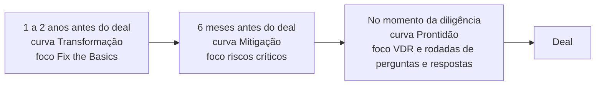
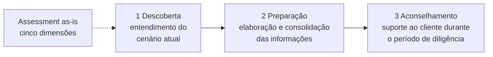
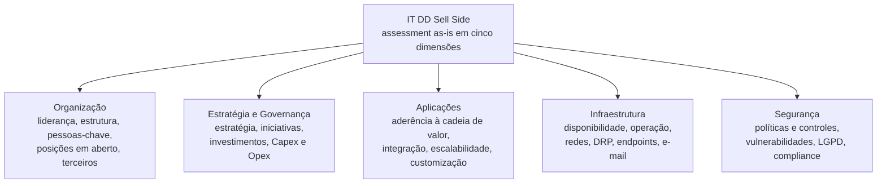
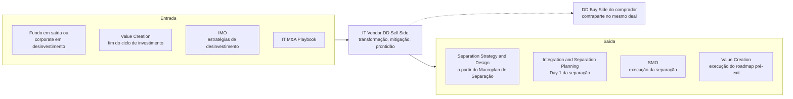

# IT Vendor Due Diligence (Sell Side)

> **Prepara a TI do vendedor para a diligência do comprador: evidências organizadas, riscos tratados antes que virem desconto no preço e uma narrativa de tecnologia que sustenta o valuation. Quanto mais cedo a entrada, de 1 a 2 anos antes do deal até o momento da diligência, maior a alavanca de valor.** 💡

| Código | Família | Fase(s) do ciclo | Lado | Readiness (atual → alvo FY) | PO | Squad |
|---|---|---|---|---|---|---|
| ITMA-07 | Diligência 💡 | Exit 🗂️ | Sell side, o vendedor 📘 (fundo em saída ou corporate em desinvestimento 💡) | 2,7 → 3,7 🗂️ | Eric Anjos 🗂️ | João M, Luana G 🗂️ |

**Em síntese** 💡

- **A única oferta do vendedor.** É a única do portfólio desenhada para o lado sell side e a única posicionada exclusivamente no Exit. Ela fecha o ciclo que a DD Buy Side abre: prepara, do lado de quem vende, as respostas às perguntas que o comprador fará.
- **Proposta organizada pelo relógio do deal.** O deck oferece três momentos de entrada: de 1 a 2 anos antes do deal (transformação), 6 meses antes (mitigação de riscos críticos) ou já na diligência (prontidão). A antecipação aparece associada a mais geração de valor. O método tem três etapas (Descoberta, Preparação, Aconselhamento), um assessment em cinco dimensões, seis frentes de atividade e quatro entregáveis.
- **Método razoável, embalagem comercial ausente.** Com readiness 2,7 (nível 2, "Oferta inicial", risco alto), a oferta divide com o Playbook o 7º lugar entre as 10 linhas. O deck não traz prazo de execução, preço, equipe-tipo nem cases, e os entregáveis aparecem só pelo título. O alvo FY (3,7) exige o salto de um nível inteiro.

---

## 1. Descrição oficial 🗂️

> "Preparação da organização de TI do cliente para o M&A, garantindo prontidão na etapa de diligência, fornecendo as visões necessárias, oportunidades e potenciais de geração de valor com a transação."

*Fonte: slide "A&M é M&A", no Deck Comercial, sob o título "IT Due Diligence (Sell Side)" (linha 373). O texto foi reconstruído das linhas 383, 391, 399, 407 e 413 da extração, onde aparece intercalado com a descrição do IT M&A Playbook, e confere com `descricao_oficial` em `data/ofertas.yaml`.*

**Nomes da oferta nas fontes**

| Fonte | Nome |
|---|---|
| Catálogo "A&M é M&A" 🗂️ | IT Due Diligence (Sell Side) |
| Slide de status 🗂️ | IT Vendor Due Diligence |
| Deck Comercial, títulos de seção 📘 | IT Due Diligence (Sell Side) · IT Sell Side Due Diligence · IT DD Sell Side |

**Posição no ciclo.** Exit. A seção abre com "No processo de venda de uma empresa" (linha 1793), o que confirma o lado vendedor e a fase de saída. Ao contrário das seções de DD Buy Side, Separation Strategy & Design e Integration & Separation Planning, esta seção não traz a régua "M&A Cycle". Ela usa uma linha do tempo própria, o "Momento de entrada no deal" (linhas 1819 e 1831–1835). No catálogo, a posição gráfica da caixa sobre a régua de fases (linha 365) não é recuperável na extração (trecho ambíguo na extração). A classificação Exit segue `data/ofertas.yaml`.

**Leitura da descrição** 💡: a descrição oficial assume quatro compromissos. O método do deck cobre três de forma explícita.

| Compromisso da descrição oficial | Onde aparece no método do deck 📘 | Cobertura 💡 |
|---|---|---|
| Preparar a organização de TI para o M&A | Etapa Preparação (linhas 1881–1883); frentes 01 a 06 (linhas 1809–1831); assessment em cinco dimensões (linhas 1899–1923) | Explícita |
| Garantir prontidão na etapa de diligência | Curva "Prontidão" (linha 1843); foco "VDR e suporte às rodadas de Q&A de tecnologia" (linhas 1839–1841); etapa Aconselhamento (linhas 1887–1891) | Explícita |
| Fornecer as visões necessárias | Objetivo: "Prover informações relevantes sobre a área de tecnologia" (linhas 1865–1873); entregáveis Checklist de Tecnologia e Evidências (linhas 1929–1931) | Explícita |
| Apontar oportunidades e potenciais de geração de valor com a transação | "Curvas de Geração de Valor" (linha 1799); Roadmap de Transformação e Roadmap de Iniciativas (linhas 1811 e 1933) | **Parcial**: não há método para quantificar o valor nem para montar a tese de tecnologia apresentada ao comprador |

---

## 2. O problema que resolve 📘

**A premissa do deck** (linha 1793) tem duas frases:

- "No processo de venda de uma empresa, máxima valorização, atratividade e prontidão são aspectos essenciais."
- "Antecipação e preparação são fatores críticos para preservar, ou mesmo aumentar, o valor da transação."

**A ideia-força visual.** O slide de escopo traz as "Curvas de Geração de Valor" (linha 1799). O gráfico cruza a "Jornada de transformação da companhia" com a "Geração de Valor" (linha 1795) e marca três pontos de entrada: "Entrada entre 1 e 2 anos antes do deal", "Entrada 6 meses antes do deal" e "Entrada no momento da diligência" (linhas 1801–1803). A forma e a altura relativa das curvas não são recuperáveis na extração ¹. 💡 A leitura coerente com a premissa é que, quanto mais cedo a entrada, mais alta a curva de valor.

**Benefícios declarados** (slide "IT Sell Side Due Diligence", linhas 1863–1891) ². O deck não descreve a dor de forma direta; ela aparece pelo avesso dos benefícios:

| # | Benefício, segundo o deck 📘 | Dor que endereça 💡 | Sintoma típico sem a oferta 💡 |
|---|---|---|---|
| 1 | Credibilidade através da apresentação de evidências | Afirmações sobre a TI sem lastro documental | O comprador desconta no preço o que não consegue verificar |
| 2 | Redução da necessidade de engajamento do time interno | Time de TI sobrecarregado e, por sigilo, poucas pessoas sabendo da venda | Respostas lentas ou inconsistentes no Q&A; operação do dia a dia prejudicada |
| 3 | Demonstração de maturidade | TI percebida como ponto fraco do ativo | Pedidos de informação adicionais e diligência mais longa |
| 4 | Suporte especializado em tecnologia e com vasta experiência em M&A | O vendedor não conhece a lógica de uma DD de TI do comprador | Riscos descobertos pelo comprador, não pelo vendedor, e a narrativa se perde |
| 5 | Plano de mitigação para vulnerabilidades e riscos, para reduzir impactos negativos no valuation | Riscos de TI conhecidos, mas sem plano | Ajuste de preço, escrow ou cláusulas de indenização ligadas à TI |

¹ *Trecho com texto rotacionado. As linhas 1801 ("R OLAVE D") e 1809 ("O ÃÇAREG") trazem o rótulo do eixo vertical, "GERAÇÃO DE VALOR", invertido na extração. O eixo horizontal provável é a "Jornada de transformação da companhia" (linha 1795).*

² *Trecho intercalado em três colunas (Objetivo, Abordagem e Benefícios, linhas 1865–1891). A divisão adotada é a única que produz frases completas nas três colunas: por exemplo, "Credibilidade através da" (linha 1869) continua em "apresentação de evidências" (linha 1873), e "Suporte especializado em" (linha 1885) continua em "tecnologia e com vasta" (linha 1889) e "experiência em M&A" (linha 1891).*

---

## 3. Objetivo e escopo 📘

**Objetivo** (linhas 1865, 1869 e 1873): "Prover informações relevantes sobre a área de tecnologia para avaliações e tomadas de decisões."

**Abordagem A&M** (linha 1899): "Através de um assessment das cinco dimensões de tecnologia, identificamos o cenário atual (as-is) que irá orientar as próximas etapas do trabalho."

| Dimensão de escopo | O que o deck informa |
|---|---|
| Cliente | A empresa em processo de venda (linha 1793). O rótulo "Desinvestimento" (linha 1817) indica que a oferta cobre também a venda de unidades de negócio ³ |
| Objeto da análise | A área de tecnologia da empresa à venda (linhas 1865–1873) |
| Estrutura do método | 3 etapas, 5 dimensões, 6 frentes de atividade e 4 entregáveis (seções 4 e 5) |
| Momentos de entrada | De 1 a 2 anos antes do deal, 6 meses antes ou no momento da diligência (linhas 1801–1803 e 1831–1835) |
| Prazo de execução | Não informado no deck |
| O que fica fora do escopo | Não informado no deck |

---

## 4. Abordagem A&M: como fazemos 📘

### 4.1 Momento de entrada no deal e curvas de valor 📘 (linhas 1795–1845)

| Momento de entrada | Texto do gráfico | Curva | Foco declarado ⁴ |
|---|---|---|---|
| **1 a 2 anos antes do deal** | "Entrada entre 1 e 2 anos antes do deal" | Transformação | Fix the Basics |
| **6 meses antes do deal** | "Entrada 6 meses antes do deal" | Mitigação | Mitigação de riscos críticos |
| **No momento da diligência** (Due Diligence) | "Entrada no momento da diligência" | Prontidão | VDR e suporte às rodadas de Q&A de tecnologia |

⁴ *Reconstrução. A ordem dos momentos é explícita na extração ("1 a 2 anos", "6 meses", "Due Diligence", linhas 1831–1835), e os rótulos das curvas aparecem na mesma ordem: "Transformação" (linha 1805), "Mitigação" (linha 1813) e "Prontidão" (linha 1843). Entre os focos, "Mitigação de riscos críticos" (linha 1837) se encaixa no momento de 6 meses, e "VDR e suporte às rodadas de Q&A de tecnologia" (linhas 1839–1841), na diligência. "Fix the Basic" (fim da linha 1841) fica, por exclusão, com a entrada de 1 a 2 anos. Confirmar no slide original.*

### 4.2 Seis frentes de atividade 📘 (linhas 1809–1831)

| Nº | Frente | Linha |
|---|---|---|
| 01 | **Roadmap de Transformação** | 1809–1811 |
| 02 | **Identificação e mitigação de riscos** | 1813–1815 |
| 03 | **Gabarito de Tecnologia (Q&A)** | 1821–1823 |
| 04 | **Criação do VDR e gestão de documentos** | 1825–1827 |
| 05 | **Suporte no processo de diligência** | 1827–1829 |
| 06 | **Macroplan de Separação** ³ | 1831 |

³ *Trecho ambíguo na extração. O rótulo "Desinvestimento" (linha 1817) aparece isolado, entre a frente 02 e o título "Momento de entrada no deal". A leitura provável é que ele qualifica a frente 06: o Macroplan de Separação se aplica quando a venda é um desinvestimento (carve-out de unidade de negócio). Confirmar no slide original. A numeração das frentes 04 e 05 é segura: o "04" (linha 1825) precede "Criação do VDR", e o "05" aparece no meio da linha 1827, antes de "Suporte".*

### 4.3 Três grandes etapas 📘 (linhas 1867–1891)

| Nº | Etapa | O que acontece, segundo o deck |
|---|---|---|
| 1 | **Descoberta** | Entendimento do cenário atual |
| 2 | **Preparação** | Elaboração e consolidação das informações |
| 3 | **Aconselhamento** | Suporte ao cliente durante o período de diligência |

*A ligação entre o assessment e a Descoberta é 💡 leitura: o deck diz que o assessment identifica o cenário atual (linha 1899), e a Descoberta é o "entendimento do cenário atual" (linhas 1875–1877).*

### 4.4 Avaliação em cinco dimensões chave 📘 (linhas 1899–1923)

| # | Dimensão | O que é avaliado, segundo o deck |
|---|---|---|
| 1 | **Organização** | Liderança de tecnologia; estrutura organizacional atual de TI; pessoas-chave; dependências; posições em aberto; extensão do suporte de terceiros |
| 2 | **Estratégia & Governança** | Estratégia de tecnologia; iniciativas planejadas e/ou em andamento, com os respectivos investimentos necessários; Capex/Opex de TI |
| 3 | **Aplicações** | Aderência dos sistemas aos processos da cadeia de valor; integração entre sistemas; escalabilidade; nível de customização |
| 4 | **Infraestrutura** | Disponibilidade; escalabilidade; operação e gestão; arquitetura de redes; DRP; endpoints; e-mail |
| 5 | **Segurança** | Políticas, medidas e controles de segurança; gestão de vulnerabilidades; controles; histórico; LGPD; compliance |

*No slide de escopo, as mesmas cinco dimensões aparecem em torno de "IT DD Sell Side", sob o título "Dimensões avaliadas de tecnologia" (linhas 1797, 1807 e 1847–1857). Ali, a segunda dimensão se chama apenas "Estratégia"; no slide de abordagem, "Estratégia & Governança" (linha 1907).*

### 4.5 Como as peças se encaixam 💡

O deck apresenta momentos, frentes, etapas e dimensões em slides separados e não os cruza. A matriz abaixo é uma proposta de leitura, a validar com o PO. Ela assume que as frentes são cumulativas: quem entra mais cedo percorre também as frentes dos momentos seguintes.

| Momento de entrada | Descoberta | Preparação | Aconselhamento | Entregáveis mais relevantes |
|---|---|---|---|---|
| 1 a 2 anos antes | Assessment completo nas cinco dimensões | 01 Roadmap de Transformação ("Fix the Basics"); 02 Identificação e mitigação de riscos | 03 a 05, quando o processo de venda abrir | Roadmap de Iniciativas; Checklist de Tecnologia |
| 6 meses antes | Assessment focado em riscos críticos | 02 Identificação e mitigação de riscos; 03 Gabarito de Tecnologia; 04 VDR | 05 Suporte no processo de diligência | Checklist; Evidências; plano de mitigação |
| Na diligência | Assessment rápido para abastecer o VDR | 03 Gabarito de Tecnologia; 04 VDR | 05 Suporte nas rodadas de Q&A | Gestão do VDR; Evidências |
| Se a venda for desinvestimento | Dependências entre a unidade vendida e o restante do grupo | 06 Macroplan de Separação | Apoio às perguntas do comprador sobre a separação | Macroplan de Separação |

### 4.6 Sell Side versus Buy Side: duas taxonomias para a mesma TI 💡

O vendedor se prepara para a diligência do comprador. A A&M, porém, usa taxonomias diferentes em cada lado: cinco dimensões no Sell Side e seis competências na DD Buy Side (linhas 869–887).

| Dimensão Sell Side 📘 | Competência equivalente na DD Buy Side 📘 | Diferenças relevantes 💡 |
|---|---|---|
| Organização | Pessoas | O Sell Side olha dependências, posições em aberto e suporte de terceiros (risco de pessoa-chave). O Buy Side acrescenta skills, benchmark de salários e modelos de contratação |
| Estratégia & Governança | Governança | O Sell Side enfatiza estratégia e iniciativas em andamento. O Buy Side acrescenta gestão de serviços, demanda e projetos, contratos, BCP e DRP |
| Aplicações | Sistemas | O Buy Side vai além: propriedade intelectual, linguagens, qualidade de software e de código, versionamento |
| Infraestrutura | Infraestrutura | O DRP fica em Infraestrutura no Sell Side e em Governança no Buy Side. O Buy Side acrescenta DevOps e modelo de contratação |
| Segurança | Segurança | O Sell Side cobre LGPD, compliance e histórico. O Buy Side cobre light pentest e ISO 27001 |
| Sem equivalente | Digital (mídias sociais, jornada do cliente, e-commerce) | **Lacuna**: o vendedor não se prepara para uma competência que a DD do comprador avalia |

**Leitura.** Se a A&M quer vender o Sell Side com o argumento "preparamos você para a diligência que nós mesmos faríamos", o checklist do vendedor deveria espelhar o framework do comprador. Ver o achado transversal em [Reconciliação de fontes](../docs/06-reconciliacao-de-fontes.md).

---

## 5. Entregáveis 📘

### 5.1 Slide "Entregáveis" 📘 (linhas 1927–1935)

A extração traz apenas os títulos. Exemplos visuais, se houver no slide, não são recuperáveis.

| # | Entregável | Vínculo com o restante da seção 💡 | Formato |
|---|---|---|---|
| 1 | **Checklist de Tecnologia** | Base da etapa Preparação, organizada pelas cinco dimensões | Não informado no deck |
| 2 | **Evidências** | Sustenta o benefício "Credibilidade através da apresentação de evidências" | Não informado no deck |
| 3 | **Roadmap de Iniciativas** | Provável desdobramento da frente 01 (Roadmap de Transformação) e do plano de mitigação | Não informado no deck |
| 4 | **Gestão do VDR** | Corresponde à frente 04 e ao foco "VDR e suporte às rodadas de Q&A" | Não informado no deck |

### 5.2 Outros produtos citados na seção, fora do slide de entregáveis 📘

| Produto | Onde aparece |
|---|---|
| Gabarito de Tecnologia (Q&A) | Frente 03 (linha 1823) |
| Plano de mitigação para vulnerabilidades e riscos | Benefício (linha 1891) e frente 02 (linhas 1813–1815) |
| Macroplan de Separação | Frente 06 (linha 1831), associada ao rótulo "Desinvestimento" (linha 1817) |
| Suporte especializado durante a diligência (serviço, não documento) | Frente 05 (linhas 1827–1829) e etapa Aconselhamento (linhas 1887–1891) |

💡 **Inconsistência a corrigir no material comercial.** O escopo promete seis frentes, mas o slide de entregáveis lista quatro produtos. O Gabarito de Tecnologia, o plano de mitigação e o Macroplan de Separação ficam sem entregável correspondente.

### 5.3 Estrutura sugerida para cada entregável 💡

O deck não descreve o formato. A proposta abaixo serve de base para o one-pager e para um kit de entrega padronizado. É análise, não fonte.

| Entregável | Estrutura proposta | Escala ou formato |
|---|---|---|
| Checklist de Tecnologia | Itens agrupados pelas cinco dimensões, cada um com a pergunta típica do comprador, a evidência esperada e um responsável | Status por item: disponível, parcial ou ausente |
| Evidências | Dossiê indexado por dimensão e por item do checklist, com versão, data e nível de confidencialidade | Repositório estruturado, que alimenta o VDR |
| Roadmap de Iniciativas | Iniciativa, dimensão, risco ou alavanca de valor endereçada, horizonte (antes ou depois do deal), Capex/Opex estimado e dono | Ondas: correções de base, mitigação de riscos críticos, iniciativas estruturantes |
| Gestão do VDR | Pastas de TI espelhando as cinco dimensões; regras de acesso por fase do processo; registro de pedidos de informação | Índice do data room e painel de pendências |
| Gabarito de Tecnologia (Q&A) | Banco de respostas pré-aprovadas por tema, com a evidência de suporte | Perguntas frequentes por dimensão |
| Macroplan de Separação | Dependências de alto nível entre a unidade vendida e o grupo, opções de separação e necessidade de serviços transitórios | Plano macro em fases, base para a estratégia detalhada de separação |

---

## 6. Modelo comercial, prazo e equipe 📘

| Dimensão | O que o deck informa |
|---|---|
| Momentos de entrada | 1 a 2 anos antes do deal; 6 meses antes; no momento da diligência (linhas 1801–1803 e 1831–1835) |
| Prazo de execução | Não informado no deck |
| Preço / modelo de investimento | Não informado no deck |
| Modelo de contratação | Não informado no deck |
| Equipe | Não informado no deck. O único traço da equipe é o benefício "Suporte especializado em tecnologia e com vasta experiência em M&A" (linhas 1885–1891) |
| Esforço do cliente | Benefício "Redução da necessidade de engajamento do time interno" (linhas 1877–1879); a redução não é quantificada |

### 6.1 Implicações comerciais 💡

- **Três momentos, três produtos.** Os momentos de entrada já sugerem uma escada comercial: um programa de transformação pré-exit (1 a 2 anos, com faturamento recorrente), um projeto de mitigação de riscos (cerca de 6 meses) e um sprint de prontidão com retainer durante as rodadas de Q&A. Cada degrau pede escopo, prazo e preço próprios.
- **Recorrência e fronteira com Value Creation.** A entrada de 1 a 2 anos transforma a oferta em um programa durante o hold period. Nesse trecho, ela se sobrepõe a IT Synergies & Value Creation (ITMA-08). É preciso decidir se a preparação para o exit é um módulo do Value Creation as a Service ou uma oferta própria.
- **Referência de preço.** O único preço explícito do deck é o da DD Buy Side VC: R$ 35 mil por semana, em material de julho/2023 (linha 1015). Ele não se aplica a esta oferta e serve, no máximo, de ordem de grandeza interna a validar.
- **KPIs para o argumento de venda.** O deck promete "reduzir impactos negativos no valuation" (linha 1891), mas não oferece métrica. Candidatos: pedidos de informação de TI respondidos no prazo do processo; red flags de TI levantadas pelos compradores; ajustes de preço, escrow ou indenizações atribuíveis à TI; horas do time interno dedicadas à diligência.

---

## 7. Clientes e cases 📘

**Não informado no deck.** A seção não traz cases, logos nem o bloco "Clientes que escolhem A&M" presente em outras seções (por exemplo, linha 949, na DD Buy Side).

💡 **Leitura.**

- A ausência de cases é coerente com a readiness 2,7 e é a lacuna comercial mais visível da oferta. Nas ofertas de diligência, o case é o principal argumento de credibilidade.
- Os fundos que aparecem como clientes em cases de buy side em outras seções do deck (por exemplo, Mubadala Capital, linha 953, e Pátria, linha 2289) terão exits no horizonte. O relacionamento existente é o caminho mais curto para um primeiro case de sell side, observadas as regras de independência (seção 8).

---

## 8. Conexões no ciclo de M&A 💡

**Entrada (de onde vem a demanda)**

| Origem | Evidência ou gatilho |
|---|---|
| Fundos em fase de saída e corporates em desinvestimento | Gatilhos: decisão de vender, contratação de assessor financeiro, preparação de data room, equity story em construção |
| IT Synergies & Value Creation (ITMA-08) | Descrição oficial: acompanha "todo o ciclo de investimento" (linha 443); o exit fecha esse ciclo |
| IT Integration Management Office (ITMA-05) | Lista "Suporte às estratégias de investimento e desinvestimento" entre os temas do hold period (linha 2363) |
| DD Buy Side, variante VC (ITMA-10, tachada) | O módulo Estratégia inclui a "estratégia futura de saída" (linha 985), e o VMO mapeia iniciativas de desinvestimento (linha 999) |
| IT M&A Playbook (ITMA-01) | Um playbook corporativo que cubra desinvestimentos pode ter o Sell Side como execução assistida |

**Saída (pull-through)**

| Oferta de destino | Ligação |
|---|---|
| IT Separation Strategy & Design (ITMA-03) | Quando a venda é desinvestimento, o Macroplan de Separação (frente 06) é o insumo natural da estratégia detalhada: entanglements, TSA e landscape da NewCo (linhas 643–840) |
| IT Integration & Separation Planning (ITMA-04) | Planejamento do Day 1 da separação, entre o signing e o closing |
| IT Separation Management Office (ITMA-06, tachada) | Execução da separação e da transição para a NewCo |
| IT Synergies & Value Creation (ITMA-08) | Execução do Roadmap de Transformação quando a entrada é de 1 a 2 anos antes do deal |

**Contraparte no mesmo deal.** O Gabarito de Tecnologia e o VDR do vendedor respondem às perguntas da DD Buy Side (ITMA-02) do comprador. As duas ofertas partem do mesmo princípio, o assessment do cenário atual (as-is), mas usam taxonomias diferentes (seção 4.6).

**Independência.** Atuar no sell side e no buy side do mesmo deal exige regras de independência e de segregação de equipes. O deck não trata do tema. Ver pergunta 2 da seção 10.

---

## 9. Maturidade e governança 🗂️

> *Esta seção traz nomes de profissionais vindos de `data/governanca.yaml`. Antes de compartilhar fora da A&M, confirme que a exibição dos nomes está autorizada.*

### Readiness

| Indicador | ITMA-07 · IT Vendor Due Diligence | Service line IT M&A |
|---|---|---|
| Readiness atual | **2,7** | 3,29 |
| Readiness alvo FY | **3,7** | 3,95 |
| Evolução planejada | **+1,0** | +0,66 |
| Distância para a média da service line | −0,59 hoje; −0,25 no alvo FY 💡 | n/a |
| Nível atual (escala oficial) | 2 · Oferta inicial · risco alto | n/a |
| Nível alvo FY | 3 · Oferta definida · risco médio | n/a |

*Escala do slide de status: 1 Oferta incompleta (risco muito alto) · 2 Oferta inicial (alto) · 3 Oferta definida (médio) · 4 Oferta estruturada (baixo) · 5 Oferta otimizada (muito baixo). A média da service line é simples, sobre as 10 linhas, incluindo as três tachadas.*

💡 **Posição relativa.**

- **7º lugar entre as 10 linhas**, empatada com o IT M&A Playbook (2,7). Só a DD Venture Capital (2,5) e IT Synergies & Value Creation (2,3) estão abaixo. No alvo FY (3,7), a posição se mantém.
- **Salto de +1,0, o maior planejado no portfólio**, empatado com Playbook, Synergies & Value Creation e DD Venture Capital. Mesmo atingindo o alvo, a oferta fica abaixo do nível 4 (Oferta estruturada).
- **O que provavelmente pesa na nota:** ausência de cases, de preço, de prazo e de equipe-tipo; entregáveis só nomeados; e desencontro entre as seis frentes do escopo e os quatro entregáveis. O método (etapas, dimensões, momentos de entrada) está razoavelmente definido. A lacuna é de embalagem comercial e de prova.

### Governança

| Papel | ITMA-07 · IT Vendor Due Diligence |
|---|---|
| Líder da service line | Thiago Vieira |
| Product Owner | Eric Anjos |
| Squad | João M, Luana G |
| Status no fluxo (Pendente de Avaliação → Em Avaliação do PO → Pendente de Aprovação → Aprovada) | Vazio no slide |
| Situação no slide de status | Ativa |

**Aviso do slide:** "POs e Membros serão reajustados".

💡 **Observações.**

- **Time inteiramente dedicado.** O PO e os dois membros do squad não aparecem em nenhuma outra linha do slide de status, situação que só se repete na DD Private Equity. É uma condição favorável para o salto de +1,0, desde que o reajuste anunciado no slide preserve a dedicação.
- **Sem ponte formal com as ofertas vizinhas.** Nenhum membro do time está em Separation Strategy & Design, no SMO ou na DD Buy Side, que são as ofertas com que o Sell Side mais conversa (seção 8). A transferência de método, como o espelhamento do framework do comprador, depende de coordenação explícita.

---

## 10. Lacunas e perguntas em aberto 💡

**Lacunas de fonte**

1. Prazo de execução, por momento de entrada: não informado no deck.
2. Preço e modelo de contratação: não informados.
3. Equipe-tipo (papéis, senioridade, dedicação): não informada.
4. Cases e clientes: não informados.
5. Formato e exemplos dos quatro entregáveis: só os títulos estão no deck.
6. Correspondência entre momentos de entrada, curvas e focos: reconstruída (nota ⁴); a forma das curvas não é recuperável.
7. Significado do rótulo "Desinvestimento" e escopo do Macroplan de Separação: ambíguos na extração (nota ³).
8. Relação entre o Roadmap de Transformação (frente 01) e o Roadmap de Iniciativas (entregável): não explicada.
9. Gabarito de Tecnologia, plano de mitigação e Macroplan de Separação: citados no escopo, mas ausentes do slide de entregáveis.
10. Método para "oportunidades e potenciais de geração de valor com a transação", compromisso da descrição oficial: ausente.
11. Dimensão Digital: avaliada pela DD Buy Side, ausente do Sell Side.
12. One-pager 📎: pendente de ingestão.

**Perguntas para o PO e a liderança**

1. **Vendor DD ou readiness?** No mercado, "Vendor Due Diligence" costuma designar um relatório independente, contratado pelo vendedor e entregue aos compradores, às vezes com carta de reliance. O deck descreve preparação e aconselhamento do vendedor, sem relatório dirigido aos compradores. A A&M emite esse relatório? Se sim, com que responsabilidade perante os compradores?
2. **Independência.** Que regras se aplicam quando a A&M atende o vendedor e um potencial comprador pede a DD Buy Side do mesmo ativo?
3. **Momentos de entrada.** As três entradas (1 a 2 anos, 6 meses, diligência) são produtos distintos, com escopo, prazo e preço próprios? Que frentes cada uma inclui?
4. **"Fix the Basics".** O que entra nesse foco? A execução das correções fica com a A&M ou com o cliente?
5. **Macroplan de Separação e fronteira com Separation Strategy & Design.** Onde termina o macroplan do Sell Side e começa a estratégia de separação da ITMA-03?
6. **Linhas tachadas (motivo não explicado no slide; tratadas como "em revisão").** Três linhas afetam esta oferta:
   - ~~IT Separation Management Office~~: é o destino natural da execução quando a venda é desinvestimento. Se a linha for descontinuada, quem executa a separação planejada a partir do Macroplan?
   - ~~IT Due Diligence (Corporate)~~: compradores estratégicos são contraparte frequente em vendas. O fim dessa linha muda o framework para o qual o vendedor se prepara?
   - ~~IT Due Diligence (Venture Capital)~~: o módulo "estratégia futura de saída" da variante VC alimentava o Sell Side. Essa ponte continua?
7. **Taxonomia.** Há plano de alinhar as cinco dimensões do Sell Side às seis competências da DD Buy Side, incluindo Digital?
8. **Fronteira com Value Creation.** A entrada de 1 a 2 anos é Sell Side ou Value Creation as a Service (ITMA-08)?
9. **Cases.** Existem trabalhos de sell side já realizados, no Brasil ou na rede global da A&M, que possam ser citados?
10. **Readiness.** Quais critérios levam a oferta de 2,7 a 3,7 no FY? Preço, cases e kit de entregáveis estão no plano?
11. **One-pager.** O que o "One-pagers DTS.pptx" traz sobre esta oferta? Está pendente de ingestão.

---

## Fontes

- 📘 **Deck Comercial — "Deck Comercial - DIGITAL & TECHNOLOGY SERVICES - M&A - Full v7"**, seção IT Due Diligence (Sell Side), **linhas 1789–1940 da extração**:
  - escopo, curvas de geração de valor, momento de entrada no deal, frentes 01 a 06 e dimensões avaliadas: linhas 1789–1857;
  - objetivo, abordagem em três etapas e benefícios: linhas 1859–1895;
  - abordagem A&M e avaliação em cinco dimensões chave: linhas 1897–1925;
  - entregáveis: linhas 1927–1939.
- 🗂️ **Slide "A&M é M&A"**, no Deck Comercial: linhas 361–445 da extração. A descrição da oferta foi reconstruída das linhas 373, 383, 391, 399, 407 e 413 e confere com `descricao_oficial` em `data/ofertas.yaml`.
- 🗂️ **Slide "Status das Ofertas – IT M&A"**, via `data/ofertas.yaml` (readiness e escala) e `data/governanca.yaml` (PO, squad, liderança e aviso do slide).
- **Referências cruzadas no Deck Comercial**, fora do intervalo e usadas só para contexto e comparação:
  - linha 365: régua de fases do catálogo;
  - linha 443: descrição oficial de IT Synergies & Value Creation;
  - linhas 643–840: seção IT Separation Strategy & Design;
  - linhas 707, 859, 2031, 2211 e 2325: régua "M&A Cycle" em outras seções;
  - linhas 869–887: framework de seis competências da DD Buy Side;
  - linhas 949 e 953: bloco "Clientes que escolhem A&M" e case CERC/Mubadala Capital na DD Buy Side;
  - linhas 985 e 999: "estratégia futura de saída" e VMO na variante VC;
  - linha 1015: preço do VMaaS On Demand;
  - linha 2289: case Plurix (Pátria) na seção de Integration & Separation Planning;
  - linha 2363: "Suporte às estratégias de investimento e desinvestimento" no IMO.
- 📎 **One-pagers DTS.pptx:** pendente de ingestão; não utilizado.
- **Notas de método:**
  - O PDF tem layout em colunas, e a extração intercala frases de colunas vizinhas. As reconstruções e ambiguidades estão sinalizadas no texto (notas ¹ a ⁴). O rótulo do eixo vertical do gráfico, "Geração de Valor", aparece invertido na extração por estar rotacionado.
  - Foram corrigidos erros evidentes de digitação e de extração sem mudar o sentido: "Roadmap Transformação de" virou "Roadmap de Transformação"; "Identificação mitigação riscos … e de" virou "Identificação e mitigação de riscos"; "Gabarito Tecnologia (Q&A) de" virou "Gabarito de Tecnologia (Q&A)"; "Suporte processo diligência no … de" virou "Suporte no processo de diligência"; "Macroplan Separação" virou "Macroplan de Separação"; "suporte as rodadas" virou "suporte às rodadas"; "Fix the Basic" virou "Fix the Basics"; "e/ou andamento" virou "e/ou em andamento"; "pessoas chave" virou "pessoas-chave".
  - Os campos `analise.*` de `data/ofertas.yaml` são hipóteses anteriores e não foram usados como fonte.
