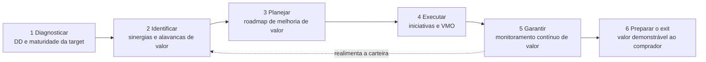
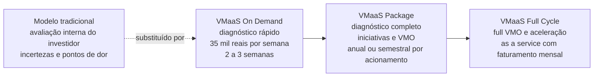
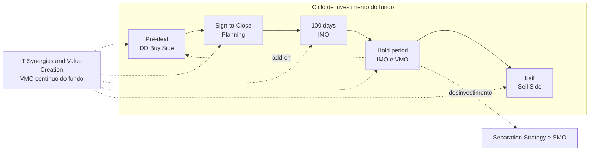

# IT Synergies & Value Creation (Value Creation as a Service)

> **Coloca a tecnologia no centro da agenda de value creation do fundo. Da diligência ao exit, transforma sinergias e alavancas de TI em iniciativas com dono, meta e monitoramento contínuo, até o resultado aparecer no valor do ativo.** 💡

| Código | Família | Fase(s) do ciclo | Lado | Readiness (atual → alvo FY) | PO | Squad |
|---|---|---|---|---|---|---|
| ITMA-08 | Criação de Valor 💡 | Todo o ciclo de investimento, "desde a DD (...) até execução" 🗂️; posição na régua do slide não recuperável na extração | Investidor: fundos de Private Equity 🗂️; extensão a Venture Capital e Corporate pelos modelos VMaaS 💡 | 2,3 → 3,3 🗂️ | Guilherme Brein 🗂️ | Giovanna B, Alexandre B 🗂️ |

**Em síntese** 💡

- **O que é.** Advisor de tecnologia para a estrutura de value creation dos fundos de Private Equity, ao longo de todo o ciclo de investimento. É a única oferta do catálogo cujo horizonte é o ciclo inteiro, a única cuja descrição oficial nomeia o cliente (fundos de PE) e a única com "as a Service" no nome.
- **Fonte rala.** No Deck Comercial, a oferta existe apenas como título e descrição oficial (linhas 441–443). Não há seção dedicada, método, entregáveis, preço, prazo, equipe nem cases.
- **Os blocos existem, mas moram em outra oferta.** A seção de IT Due Diligence (Buy Side VC), de julho/2023, traz um módulo **Value Management Office (VMO)** com quatro componentes e três modelos comerciais **VMaaS** (On Demand, Package e Full Cycle). Ali estão o único preço explícito do portfólio (On Demand) e os únicos formatos recorrentes documentados (Package e Full Cycle). Os quatro componentes do VMO, somados à "implementação de iniciativas" do Package, cobrem um a um os movimentos da descrição oficial desta oferta. Essa ligação é análise deste dossiê, reforçada pelo PO comum às duas linhas.
- **O paradoxo.** É a oferta de maior alavanca estratégica do portfólio e a de menor readiness: 2,3 hoje e 3,3 no alvo FY, último lugar entre as 10 linhas nos dois indicadores. Mesmo que atinja o alvo, chega apenas ao nível que a service line já tem hoje em média (3,29).
- **Caminho mais curto.** Formalizar o VMO como método e adaptar o VMaaS a Private Equity como modelo comercial. Esse movimento fecha, de uma vez, as lacunas de método, entregáveis e preço (seção 9).

---

## 1. Descrição oficial 🗂️

> "Atuar como advisor para os fundos de Private Equities suportando a estrutura de Value Creation no âmbito de tecnologia."
>
> "Acompanhando todo o ciclo de investimento, desde a DD, identificação [de] sinergias e geração de valor até execução, garantindo o resultado."

*Fonte: slide "A&M é M&A", no Deck Comercial, sob o título "IT Synergies & Value Creation (Value Creation as a Service)" (linha 441). A descrição está em uma única linha da extração (linha 443), sem intercalação com as ofertas vizinhas, e confere com `descricao_oficial` em `data/ofertas.yaml`. Foram feitas duas intervenções de forma: a divisão em duas frases e a inclusão da preposição "[de]", ausente no slide.*

**Nomes da oferta nas fontes**

| Fonte | Nome |
|---|---|
| Slide "A&M é M&A" (catálogo, no Deck Comercial) | IT Synergies & Value Creation (Value Creation as a Service) |
| Slide "Status das Ofertas – IT M&A" | IT Synergies & Value Creation |
| Seções do Deck Comercial | Sem seção dedicada no texto extraído |

**Posição no slide.** Na extração, a caixa aparece depois das caixas do SMO e de IT Separation Strategy & Design (linhas 421–443), no fim do slide de catálogo. A régua do slide lista as fases M&A Strategy, Pré-deal, Sign-to-Close, 100 days, Hold period (~3-5 years) e Exit (linha 365), mas a fase sob a qual a caixa está posicionada não é recuperável (trecho ambíguo na extração). O campo `fases` de `data/ofertas.yaml` registra as seis fases, o que é coerente com "todo o ciclo de investimento", mas é uma leitura e não uma posição observada.

### 1.1 Anatomia da descrição oficial 💡

| Elemento | Texto oficial 🗂️ | Leitura 💡 |
|---|---|---|
| Papel | "Atuar como advisor" | Posição de conselheiro do fundo, não de executor isolado. A A&M se acopla a uma estrutura existente. |
| Cliente | "fundos de Private Equities" | É a única descrição oficial do catálogo que nomeia o tipo de cliente. As demais falam em "cliente", "deal" ou "NewCo". |
| Objeto | "suportando a estrutura de Value Creation" | O interlocutor é o time de value creation do fundo (operating partners e equivalentes), não apenas a TI da investida. |
| Recorte | "no âmbito de tecnologia" | A oferta cobre a tecnologia dentro de uma agenda de valor mais ampla, que inclui operações, comercial e finanças. |
| Horizonte | "todo o ciclo de investimento" | É a única oferta com horizonte de ciclo completo. As demais cobrem uma ou duas fases. |
| Cadeia de valor | "desde a DD, identificação [de] sinergias e geração de valor até execução" | Quatro movimentos encadeados: diligência, identificação de sinergias, geração de valor e execução. |
| Compromisso | "garantindo o resultado" | Compromisso com resultado, não com esforço. A descrição do IMO tem compromisso semelhante ("garantir a plena captura de valor"). |
| Modelo de entrega | "(Value Creation as a Service)" | O sufixo indica entrega recorrente. No deck, a única contratação "As-a-Service" documentada é a do VMaaS Full Cycle (linha 1057). |

### 1.2 Valor: o vocabulário comum do catálogo 🗂️

Cinco das oito descrições oficiais do catálogo falam em valor ou sinergia:

| Oferta | Termo de valor na descrição oficial 🗂️ | Linha da extração |
|---|---|---|
| IT Due Diligence (Buy Side) | "influenciar no valor do deal, avaliar sinergias" | 385–393 |
| IT Integration & Separation Planning | "antecipando captura de valor" para a transação | 417–419 |
| IT Integration Management Office | "garantir a plena captura de valor no menor tempo" | 397–405 |
| IT Due Diligence (Sell Side) | "potenciais de geração de valor com a transação" | 407–413 |
| **IT Synergies & Value Creation** | "identificação [de] sinergias e geração de valor até execução, garantindo o resultado" | 443 |

💡 **Leitura.** Nas outras quatro ofertas, o valor é consequência do trabalho (diligência, planejamento, integração ou venda). Nesta, o valor é o próprio objeto. Isso faz da oferta o ponto natural de convergência do portfólio: ela costura, do ponto de vista do investidor, o que as demais entregam fase a fase.

---

## 2. O problema que resolve 📘

O deck não tem seção dedicada a esta oferta e não formula o problema que ela resolve. Os elementos abaixo vêm de outras seções do deck (referência cruzada) e sustentam a tese da oferta.

### 2.1 O que o deck diz sobre valor e sinergias em M&A 📘

| # | Tema | O que o deck afirma | Linhas |
|---|---|---|---|
| 1 | Desafio central do M&A | O principal desafio é "capturar sinergias através de iniciativas, integrando os diferentes aspectos da buyer e target", construindo uma plataforma estratégica e gerando valor aos ativos | 111 |
| 2 | Sinergia como desafio holístico | "Capturar sinergias" está entre os dez "desafios holísticos" de M&A. O descritor associado a esse desafio é trecho ambíguo na extração ¹ | 113–153 |
| 3 | Peso da TI | Mais de 50% "dos esforços de integração de uma fusão e aquisição estão em TI", e o que é exigido em cada fase "tem significativa variação" ² | 53–67, 97–99 |
| 4 | Benefícios do engajamento de TI | Tomada de controle organizada, "evitando perdas de valor para a companhia"; infraestrutura, sistemas e aplicações integrados; sinergia de dados, negócios, projetos e estratégias de TI; redução de custos e otimização de contratos ² | 59–93 |
| 5 | TI na diligência | Envolver executivos de TI e de operações na Due Diligence é "uma sábia decisão", pelas contribuições sobre riscos, projeção de custos e realidade prática da integração ² | 73–93 |
| 6 | Riscos que corroem o business case | Entre os exemplos de risco: "Custo de reimplementação das iniciativas impactando no business case" e perda de receita, clientes e eficiência operacional | 199–205 |
| 7 | Custo de não planejar | Empresas que não planejam adequadamente podem gastar "de 2 a 3 vezes mais com TI" ao final do processo | 2199–2207 |
| 8 | Valor no exit | "Antecipação e preparação são fatores críticos para preservar, ou mesmo aumentar, o valor da transação" | 1793 |
| 9 | Fontes de valor de uma integração | Sinergia entre as empresas, economia e eficiência de custos de TI e melhoria da maturidade em tecnologia | 2303 |

¹ *Trecho ambíguo na extração. Os títulos e os descritores dos dez desafios estão intercalados (linhas 113–153). O título "Capturar sinergias" é legível, mas não é possível afirmar qual descritor lhe corresponde.*

² *Reconstrução de colunas intercaladas (linhas 53–99). O slide associa percentuais (+10%, +35% e +50%) às fases Due Diligence, Planning e Post Merger Integration; a correspondência exata entre percentual e fase é trecho ambíguo na extração.*

### 2.2 O problema no modelo tradicional de investimento 📘

A seção de IT Due Diligence (Buy Side VC), de julho/2023, contrapõe os modelos VMaaS a um **"Modelo Tradicional - Equipe Interna de VC"** (linha 1017). Nesse modelo, o investidor (Corporate ou Venture Capital) avalia a startup ou investida com a própria equipe ("Avaliação Interna"), e o output descrito é negativo (linhas 1019–1031):

1. Incertezas.
2. Produtos ineficazes.
3. Tecnologias disfuncionais.
4. Estresse do negócio e pontos de dor.

💡 O slide foi feito para Venture Capital, mas o diagnóstico vale para Private Equity: quando a tecnologia é avaliada e acompanhada apenas pelo time interno do fundo, generalista, o valor de TI vira premissa sem dono.

### 2.3 As dores do fundo de Private Equity 💡

| # | Dor do fundo | Como aparece no ciclo | Elo com a descrição oficial |
|---|---|---|---|
| 1 | Time de value creation sem especialista em tecnologia | A TI entra no plano de valor como linha genérica de custo, e não como alavanca de receita, margem e escala | "suportando a estrutura de Value Creation" |
| 2 | Sinergias de TI sem baseline nem dono | A sinergia estimada na DD entra no business case e não é rastreada depois do closing | "identificação [de] sinergias" |
| 3 | Descontinuidade entre fases | DD, planejamento, integração e exit com fornecedores diferentes; o conhecimento sobre o ativo se perde a cada passagem | "todo o ciclo de investimento" |
| 4 | Investimento em TI sem retorno medido | CAPEX e OPEX de TI aprovados sem monitoramento de valor por iniciativa | "garantindo o resultado" |
| 5 | Exit com desconto de múltiplo | Dívida técnica, riscos e baixa maturidade aparecem na diligência do comprador | Fecho do ciclo (ver seção 8) |
| 6 | Portfólio heterogêneo | Em teses de buy-and-build, cada investida tem uma TI diferente, sem padrão nem visão consolidada | "fundos" no plural: atuação de portfólio |

---

## 3. Objetivo e escopo 📘

**Objetivo.** Não há slide de objetivo. Pela descrição oficial 🗂️, o objetivo é atuar como advisor de tecnologia da estrutura de value creation do fundo, acompanhando o ciclo de investimento da DD à execução e garantindo o resultado.

**Escopo.** Não informado no deck.

### 3.1 Escopo proposto: os blocos do deck que já cobrem a descrição oficial 💡

Os quatro componentes do módulo **Value Management Office** (linha 999) e o modelo **VMaaS Package** (linhas 1037–1041) cobrem, um a um, os movimentos da descrição oficial. Os componentes vêm do deck 📘; a correspondência é análise 💡.

| # | Movimento da descrição oficial 🗂️ | Elemento do deck que o cobre 📘 | Origem | Fase do ciclo 💡 |
|---|---|---|---|---|
| 1 | "desde a DD" | Avaliação da maturidade de processos da target | VMO, linha 999 | Pré-deal |
| 2 | "identificação [de] sinergias" | Mapeamento de iniciativas de investimento e desinvestimento, estratégicas e operacionais | VMO, linha 999 | Pré-deal e Sign-to-Close |
| 3 | "geração de valor" | Desenvolvimento de plano ou roadmap de melhoria de valor | VMO, linha 999 | Sign-to-Close e 100 days |
| 4 | "até execução" | Implementação de iniciativas e VMO | VMaaS Package, linhas 1037–1041 | 100 days e Hold period |
| 5 | "garantindo o resultado" | Monitoramento contínuo de valor de projetos e iniciativas | VMO, linha 999 | Hold period até o Exit |

💡 **Leitura.** O deck já contém, fora da seção desta oferta, todos os blocos de que a descrição oficial precisa. O que falta é reuni-los sob a oferta, adaptá-los a Private Equity e dar-lhes entregáveis, preço e cases.

### 3.2 Fronteiras com as ofertas vizinhas 💡

| Oferta vizinha | O que ela entrega 📘 | O que caberia a Value Creation 💡 | Zona de sobreposição a resolver |
|---|---|---|---|
| IT Due Diligence (Buy Side) | Riscos, oportunidades e recomendações; "avaliar sinergias" (linha 393) | Converter as oportunidades da DD em tese de valor com baseline e dono | Quem quantifica a sinergia: a DD ou a Value Creation? |
| IT Integration & Separation Planning | Plano de Day 1 e 100 dias; "Plano de investimentos em tecnologia atualizado" (linha 2189) | Garantir que o plano de 100 dias carregue as alavancas de valor do fundo | Priorização das iniciativas por valor |
| IT Integration Management Office | Pilar Capturar e fase Captura de Sinergias (linhas 2309–2319 e 2343–2353) | Governança de valor acima da integração, no nível do fundo e do portfólio | Captura de sinergias no hold period |
| IT Due Diligence (Sell Side) | Entrada de 1 a 2 anos antes do deal, curva Transformação (linhas 1801 e 1831) | Execução do roadmap de valor que prepara o exit | Programa de transformação pré-exit |
| IT M&A Playbook | "Modelos de geração de valor da empresa" (linha 579) | Aplicação contínua do modelo de valor em cada transação do fundo | Plataformas de buy-and-build |

### 3.3 Credenciais declaradas que sustentam o posicionamento 📘

O deck traz, em outras seções, atributos da A&M que dão lastro ao papel de advisor de valor ao longo do ciclo:

| Atributo | Texto do deck | Linha |
|---|---|---|
| Papel de advisor | Abordagem focada em entregar, "atuando como business partner e como advisor" | 257 |
| Velocidade de resultado | "Foco na entrega rápida de resultados (quick wins), acelerando a captura de oportunidades" | 257 |
| Dimensionamento de valor | "acurácia nos dimensionamentos de oportunidades e investimentos necessários" | 253 |
| Relação de ciclo longo | "relacionamentos duradouros, focado em todas as fases do ciclo de vida dos clientes" | 265 |
| Escopo da prática DTS | IT M&A inclui "captura de sinergias e criação de valor através da tecnologia" | 353 |
| Prática de Private Equity da A&M | Atuação com fundos em diligências operacionais, PMI, carve-out, "governança de portfólio de PE" e "IMO capability" | 329 |
| Reconhecimento em PE | Time de Private Equity Performance Improvement da A&M premiado como Specialist Due Diligence Provider of the Year (British Private Equity Awards 2022) | 289, 297 |

---

## 4. Abordagem A&M: como fazemos 📘

**Não informado no deck.** Não há etapas, método nem framework próprios desta oferta no texto extraído. Esta seção reúne os elementos de método que o deck oferece em outras seções e, em seguida, propõe uma abordagem 💡.

### 4.1 Módulo Value Management Office 📘 (linha 999)

O VMO é um dos nove módulos da IT Due Diligence (Buy Side VC), seção datada de **julho/2023** (linhas 963–965), cuja abordagem é descrita como "modular" e "adaptável às necessidades dos VCs" (linha 969).

| # | Componente do VMO 📘 | Natureza 💡 |
|---|---|---|
| 1 | Avaliação da maturidade de processos da target | Diagnóstico (linha de base) |
| 2 | Mapeamento de iniciativas de investimento e desinvestimento estratégico e operacional | Carteira de alavancas de valor |
| 3 | Desenvolvimento de plano / roadmap de melhoria de valor | Plano de valor |
| 4 | Monitoramento contínuo de valor de projetos e iniciativas | Governança e rastreio de resultado |

💡 O componente 4 é o único elemento contínuo de toda a seção de diligência: ele não termina com o relatório. É a ponte natural entre uma DD pontual e uma relação "as a Service".

### 4.2 Os nove módulos da IT DD (Buy Side VC) e sua relevância para Value Creation 📘 (linhas 971–1005)

| # | Módulo 📘 | Conteúdo segundo o deck 📘 | Relevância para Value Creation 💡 |
|---|---|---|---|
| 1 | Ativos tecnológicos | Propriedade intelectual; hardware; software; licenças; contratos | Média: base de ativos e de custos contratuais |
| 2 | Mercado | Posicionamento de mercado; potenciais gaps de clientes; concorrência | Média: alavancas de receita |
| 3 | Escalabilidade | Habilidade e robustez para crescer "de acordo com as alavancas de valor da tese"; estimativa de custos para atender o crescimento | **Alta**: liga a TI às alavancas da tese |
| 4 | Estratégia | Estratégia de compra (stand-alone, market-extension, product-extension etc.); plano de crescimento; estratégia de investimento; estratégia futura de saída | **Alta**: cobre o ciclo da entrada à saída |
| 5 | Defesa | Risco de adoção de tecnologias por competidores; cibersegurança; mapeamento de riscos | Média: proteção de valor |
| 6 | Planejamento | Drivers e alavancas de investimento da target; indicadores de performance financeira; modelo de reporting | **Alta**: base do reporte de valor ao fundo |
| 7 | Governança | Qualidade do desenvolvimento; roadmap tecnológico; time de TI; custos e estimativas de investimento | Média: viabilidade de execução |
| 8 | **Value Management Office** | Ver seção 4.1 | **Núcleo** |
| 9 | Produto | Cenário atual e proposto de caso de uso; maturidade do produto ou serviço; abertura de mercado | Média: alavancas de receita em ativos digitais |

### 4.3 Outros elementos de método aproveitáveis 📘

| Elemento | O que o deck traz | Seção de origem | Linhas |
|---|---|---|---|
| Fontes de valor de uma integração | Sinergia entre as empresas; economia e eficiência de custos de TI; melhoria da maturidade em tecnologia | IMO | 2303 |
| Pilar Capturar | "Capturar sinergias, garantindo que as alavancas de valor para TI sejam alcançadas e o orçamento planejado seja executado" | IMO | 2309–2319 |
| Fase Captura de Sinergias | Execução do roadmap de integração, identificando sinergias e alavancas de otimização de desempenho e custo | IMO | 2343, 2353 |
| Investimento e desinvestimento | "Suporte às estratégias de investimento e desinvestimento" | IMO | 2363 |
| Curvas de geração de valor | Três momentos de entrada antes do exit: 1 a 2 anos (Transformação), 6 meses (Mitigação de riscos críticos) ou na diligência (Prontidão) | Sell Side | 1795–1803, 1831–1843 |
| Escala de maturidade As-Is | Níveis 0 Caótico, 1 Reativo, 2 Proativo, 3 Serviço, 4 Valor e 5 Transformador, aplicados a TI, Pessoas, Processos, Aplicações, Infraestrutura e Governança ³ | Exemplo de relatório de IT DD | 1747–1785 |
| Modelo de valor da empresa | "Modelos de geração de valor da empresa" como entregável; entendimento do modelo de geração de valor como ponto de partida | IT M&A Playbook | 579, 607 |
| Quebra de sinergias na separação | "Minimizar a quebra de sinergias": revisão de contratos e acordos essenciais, redução de despesas one-time e avaliação dos níveis de suporte e serviço de TI | Separation Strategy | 665–671 |

³ *Só a estrutura da escala é citada aqui. As notas atribuídas à empresa do exemplo não são reproduzidas. Ver [Exemplo de relatório de IT DD](anexos/it-dd-relatorio-exemplo.md), seção 6.3.*

### 4.4 Abordagem proposta: o ciclo de valor de TI do fundo 💡

A abordagem abaixo é uma proposta deste dossiê, montada com os blocos das seções 4.1 a 4.3. Não consta do deck.

| Etapa 💡 | Pergunta do fundo | Insumo do deck 📘 | Oferta que pode entregar o módulo 💡 |
|---|---|---|---|
| 1 Diagnosticar | Qual é a linha de base de maturidade e custo de TI do ativo? | VMO, componente 1 (linha 999); escala de maturidade 0 a 5 (linhas 1747–1785) | IT Due Diligence (Buy Side) |
| 2 Identificar | Que sinergias e alavancas de TI sustentam a tese? | VMO, componente 2; módulos Escalabilidade e Estratégia (linhas 981 e 985) | IT Due Diligence (Buy Side) e Value Creation |
| 3 Planejar | Em que ordem e com que investimento capturamos o valor? | VMO, componente 3; módulo Planejamento (linha 993) | IT Integration & Separation Planning |
| 4 Executar | As iniciativas estão sendo entregues no prazo e no orçamento? | VMaaS Package, "Implementação de Iniciativas e VMO" (linhas 1037–1041); pilar Capturar do IMO (linhas 2309–2319) | IT Integration Management Office |
| 5 Garantir | O valor prometido está aparecendo no resultado? | VMO, componente 4; módulo Planejamento, "modelo de reporting" (linha 993) | **Value Creation (núcleo)** |
| 6 Preparar o exit | A TI sustenta o múltiplo na venda? | Módulo Estratégia, "estratégia futura de saída" (linha 985); curvas de valor do Sell Side (linhas 1795–1803) | IT Due Diligence (Sell Side) |

💡 **Arquitetura implícita.** Lida assim, a Value Creation as a Service não compete com as demais ofertas: é a camada contínua de governança de valor que as atravessa. As ofertas de fase funcionam como módulos acionáveis dentro do contrato recorrente com o fundo, e o VMO é o fio que conecta a promessa da DD ao múltiplo do exit.

---

## 5. Entregáveis 📘

**Não informado no deck** para esta oferta. Abaixo, as saídas explícitas dos elementos de origem 📘 e uma proposta de kit 💡.

### 5.1 Saídas explícitas nos elementos de origem 📘

| # | Saída | Elemento de origem | Linha |
|---|---|---|---|
| 1 | Avaliação da maturidade de processos da target | VMO | 999 |
| 2 | Mapeamento de iniciativas de investimento e desinvestimento, estratégicas e operacionais | VMO | 999 |
| 3 | Plano / roadmap de melhoria de valor | VMO | 999 |
| 4 | Monitoramento contínuo de valor de projetos e iniciativas | VMO | 999 |
| 5 | Estimativa de custos para atender o crescimento | Módulo Escalabilidade | 981 |
| 6 | Modelo de reporting | Módulo Planejamento | 993 |
| 7 | Diagnóstico rápido da startup ou investida | VMaaS On Demand | 1011 |
| 8 | Diagnóstico completo | VMaaS Package | 1045 |
| 9 | Implementação de iniciativas e VMO | VMaaS Package | 1037–1041 |
| 10 | Full VMO e aceleração | VMaaS Full Cycle | 1053 |
| 11 | Gestão do portfólio e dos investimentos / iniciativas | Package ou Full Cycle ⁴ | 1047 |
| 12 | "Solid Foundation" de investidas | Package ou Full Cycle ⁴ | 1055 |

**Outputs declarados dos modelos VMaaS** 📘: "Investimento Assertivo Pontual" (On Demand, linha 1013); "Garantir Valorização do Investimento" (linha 1061); "Maximização de Investimento (State of Art)" (linha 1057). A atribuição dos dois últimos a Package e Full Cycle é leitura provável ⁴.

### 5.2 Kit mínimo de entregáveis proposto 💡

A validar com o PO. Descrição de estrutura e formato, sem conteúdo de casos reais.

| # | Entregável proposto 💡 | Estrutura sugerida | Bloco do deck que aproveita |
|---|---|---|---|
| 1 | Tese de valor de TI por investida | Alavancas de valor (receita, margem, escala, risco), premissas, linha de base e meta por alavanca | VMO 1 e 2; módulos Escalabilidade e Estratégia |
| 2 | Registro de valor (value register) | Uma linha por iniciativa: tipo (sinergia de custo, alavanca de receita, CAPEX evitado, risco mitigado), dono, baseline, meta, prazo, status | VMO 2 |
| 3 | Roadmap de melhoria de valor | Iniciativas priorizadas por valor × esforço × risco, em ondas (100 dias, ano 1, até o exit) | VMO 3 |
| 4 | Painel de monitoramento de valor | Previsto × realizado por iniciativa e por investida, com reporte periódico ao comitê do fundo | VMO 4; "modelo de reporting" |
| 5 | Avaliação de maturidade As-Is → To-Be | Escala de 0 a 5 do deck, por dimensão, com meta por ano do hold period | Escala de maturidade (linhas 1747–1785) |
| 6 | Visão de portfólio | Consolidação das investidas do fundo: maturidade, valor capturado e oportunidades de sinergia entre investidas | "Gestão do Portfólio e Investimentos / Iniciativas" (linha 1047) |
| 7 | Dossiê de tecnologia para o exit | Evidências de valor capturado e de riscos tratados, insumo para a IT Due Diligence (Sell Side) | Módulo Estratégia; curvas do Sell Side |

---

## 6. Modelo comercial, prazo e equipe 📘

| Dimensão | Para esta oferta |
|---|---|
| Modelo de investimento / preço | Não informado no deck |
| Modelo de contratação | Não informado no deck. O nome indica entrega "as a Service" 🗂️ |
| Prazo | Não informado no deck. Horizonte: "todo o ciclo de investimento" 🗂️ |
| Equipe | Não informado no deck |

### 6.1 Modelos VMaaS da IT DD (Buy Side VC) 📘 (linhas 1007–1063, julho/2023)

O slide, que traz o rótulo "Modelo de Negócio" (linha 1017), apresenta três modelos VMaaS ao lado de um modelo tradicional de referência. Os diagramas seguem o formato Investimento → Output, com "Corporate / Venture Capital" de um lado e "Startup / Investida" do outro.

| Modelo | Núcleo do serviço | Modelo de investimento | Modelo de contratação | Prazo | Output |
|---|---|---|---|---|---|
| *Modelo Tradicional (referência)* | *Avaliação interna pela equipe do VC* | *n/a* | *n/a* | *n/a* | *Incertezas; produtos ineficazes; tecnologias disfuncionais; estresse do negócio e pontos de dor* |
| **VMaaS On Demand** | Diagnóstico rápido ⁵ | **R$ 35 mil por semana** | On-Demand | **2 a 3 semanas** | Investimento assertivo pontual |
| **VMaaS Package** | Diagnóstico completo; implementação de iniciativas e VMO | Pacote de serviços (consumo por acionamento) | Anual / semestral | Ciclo de investimento da startup | Garantir a valorização do investimento ⁴ |
| **VMaaS Full Cycle** | Full VMO e aceleração; gestão do portfólio e dos investimentos e iniciativas ⁴; "solid foundation" de investidas ⁴ | Parceria, com faturamentos mensais | As-a-Service | "–" (não definido no deck) | Maximização do investimento ("State of Art") ⁴ |

⁴ *Trecho ambíguo na extração. Os cartões de Package e Full Cycle aparecem intercalados (linhas 1033–1063). As condições comerciais estão em linhas íntegras: as de Full Cycle estão na linha 1057, logo após o título do modelo, e as de Package na linha 1063, cujo "Pacote de Serviços" ecoa o nome do modelo. Já a alocação de "Gestão do Portfólio e Investimentos / Iniciativas" (linha 1047), de "Solid Foundation de Investidas" (linha 1055) e dos dois outputs é leitura provável, pela progressão de escopo entre os modelos. Confirmar no slide original.*

⁵ *"Avaliação Interna" aparece tanto no cartão On Demand (linha 1011) quanto no modelo tradicional (linha 1023). A leitura provável é que o diagnóstico rápido da A&M complementa a avaliação interna do investidor. Trecho ambíguo na extração.*

*O deck apresenta os modelos lado a lado. A leitura como escada de engajamento é 💡 análise.*

**Sigla VMaaS.** O deck não a expande. Pela presença do módulo Value Management Office e da sigla VMO nos modelos, a leitura provável é "Value Management as a Service" 💡.

### 6.2 Hipótese: o VMaaS é o modelo comercial da Value Creation as a Service 💡

| Evidência | A favor | Contra ou a confirmar |
|---|---|---|
| Nome | "Value Creation as a Service" (linha 441) e "VMaaS" compartilham o "as a Service" | Siglas diferentes: VCaaS não aparece no deck |
| Conteúdo | O VMO está no Package e no Full Cycle; a descrição oficial fala em valor "até execução, garantindo o resultado" | O VMO é apresentado como módulo de diligência, não como oferta própria |
| Horizonte | O Package dura o "Ciclo de Investimento da Startup" (linha 1063); a descrição oficial acompanha "todo o ciclo de investimento" | O Full Cycle não tem prazo definido ("–") |
| Governança | O mesmo PO, Guilherme Brein, responde pela IT DD (Venture Capital) e por esta oferta (`data/governanca.yaml`) | O slide avisa que "POs e Membros serão reajustados" |
| Cliente | O VMaaS fala em "Investida" e em portfólio | O VMaaS endereça "Corporate / Venture Capital" e "Startup"; a descrição oficial endereça "fundos de Private Equities" |
| Situação | O material existe e tem preço | A IT DD (Venture Capital) está **tachada** no slide de status (em revisão, motivo não explicado); o material é de julho/2023 |

**Conclusão provisória** 💡: a hipótese é forte, mas não é fonte. Se confirmada, o VMaaS precisa de adaptação a Private Equity: a unidade de venda passa de "startup" para investida, plataforma ou portfólio, e o prazo do Package passa a ser o hold period (~3 a 5 anos, linhas 365 e 2211).

### 6.3 Implicações comerciais 💡

- **Porta de entrada.** Pelos parâmetros do deck, um On Demand custa de R$ 70 mil (2 semanas) a R$ 105 mil (3 semanas). Funciona como diagnóstico de entrada, convertível em Package ou Full Cycle.
- **Receita recorrente.** Package (anual ou semestral, por acionamento) e Full Cycle (mensal, as-a-service) são os únicos modelos recorrentes documentados no portfólio. Esta é a oferta em que a recorrência faz mais sentido, porque o horizonte é o ciclo inteiro.
- **"Garantindo o resultado".** A promessa da descrição oficial pede um mecanismo comercial coerente, como metas de valor contratadas ou componente variável. O deck não trata do tema; é pergunta para o PO.
- **Data do preço.** O valor de R$ 35 mil por semana vem de material de julho/2023 e precisa de confirmação de vigência antes de uso comercial.
- **Equipe.** Não informada. O papel de advisor de fundo pede senioridade alta e continuidade de pessoas ao longo do ciclo; o deck afirma, em termos gerais, "times com perfil sênior" (linha 261).

---

## 7. Clientes e cases 📘

**Não informado no deck.** Nenhum case é atribuído a esta oferta.

### 7.1 Cases de outras ofertas com padrão de ciclo de investimento 📘

Os fatos abaixo estão no deck, em outras seções. A relevância para Value Creation é 💡 análise.

| Cliente / fundo | O que o deck registra 📘 | Seção e linha | Por que interessa a Value Creation 💡 |
|---|---|---|---|
| **Plurix** (holding do Pátria Investimentos no varejo regional) | ITDD de 6 targets, construção da arquitetura de referência da tese, planejamento das integrações e PMI de TI entre o D1 e o D100 | Integration & Separation Planning, 2289 | É o case mais próximo de "todo o ciclo": diligência, arquitetura da tese, planejamento e execução para o mesmo investidor |
| **Braveo** (tese de distribuição indireta de FMCG) | Desenho da arquitetura, IT DDs e planejamentos de PMI de 4 das 15 investidas; 35 iniciativas de 2 investidas no plano de 100 dias; o planejamento do PMI acelera as demais aquisições no modelo de rollout e prepara o IMO | IT DD Buy Side, 957; Planning, 2291 | Padrão buy-and-build com 15 investidas: terreno natural para um VMO de portfólio |
| **Mubadala** (fundo) | IT DD da CERC para possível investimento do Mubadala Capital (953); carve-out com a UniFTC, mais de 50 entanglements (833); carve-out com a Invepar e criação da holding Hmobi, mais de 67 entanglements, com a A&M contratada pelo fundo (837; ver também 2293) | IT DD Buy Side; Separation Strategy; Planning | Relação recorrente com o mesmo fundo em três transações: conta-alvo natural para um contrato as-a-service |
| **Virutex Ilko** (consumer goods, Chile) | IT DD com 17 iniciativas mapeadas para endereçar riscos e oportunidades, base do plano de integração | IT DD Buy Side, 959 | Exemplo de DD que já gera a carteira de iniciativas que o VMO monitoraria |

💡 **Leitura.** Nenhum desses trabalhos é apresentado como Value Creation, e o deck não informa valor capturado em nenhum deles. Creditá-los à oferta exige confirmar se houve acompanhamento contínuo de valor e obter métricas de resultado.

---

## 8. Conexões no ciclo de M&A 💡

### 8.1 Entrada: de onde a oferta recebe demanda

| Origem | Gatilho 💡 | Evidência no deck 📘 |
|---|---|---|
| IT Due Diligence (Buy Side), ITMA-02 | Oportunidades e sinergias identificadas na DD precisam de dono depois do closing | "avaliar sinergias" na descrição oficial (linha 393); 17 iniciativas no case Virutex Ilko (linha 959) |
| IT Due Diligence (Venture Capital), ITMA-10 (tachada) | O módulo VMO e os modelos VMaaS já preveem a continuidade após o aporte | Linhas 999 e 1007–1063 |
| IT Integration & Separation Planning, ITMA-04 | O plano de 100 dias define o investimento em tecnologia | "Plano de investimentos em tecnologia atualizado" (linha 2189); "Foco total na captura de sinergias" (linhas 2157–2165) |
| IT Integration Management Office, ITMA-05 | Fim da estabilização; a captura de sinergias segue no hold period | Fase Captura de Sinergias (linha 2343); "Suporte às estratégias de investimento e desinvestimento" (linha 2363) |
| IT M&A Playbook, ITMA-01 | Plataforma de buy-and-build que quer institucionalizar o modelo de valor | "Modelos de geração de valor da empresa" (linha 579) |
| Prática de Private Equity da A&M | Fundo já atendido em governança de portfólio ou IMO | "governança de portfólio de PE", "IMO capability" (linha 329) |

### 8.2 Saída: pull-through gerado

| Destino | Gatilho 💡 | Evidência no deck 📘 |
|---|---|---|
| IT Due Diligence (Buy Side) | Nova aquisição (add-on) na tese de buy-and-build | Modelo de rollout no case Braveo (linhas 957 e 2291) |
| IT Integration & Separation Planning e IMO | Integração de cada add-on | Planning "prepara o IMO" (linha 957) |
| IT Separation Strategy & Design e SMO | Desinvestimento de unidade não core | VMO mapeia "iniciativas de investimento e desinvestimento" (linha 999) |
| IT Due Diligence (Sell Side) | Preparação para o exit, idealmente de 1 a 2 anos antes | Curva Transformação (linhas 1801 e 1831); "estratégia futura de saída" (linha 985) |
| IT M&A Playbook | Institucionalização da capacidade de M&A na plataforma | Linha 563 |

### 8.3 A oferta como camada contínua do ciclo

💡 **Leitura.** As demais ofertas são verticais: cada uma resolve uma fase. Esta é horizontal: acompanha o investidor de ponta a ponta. Por isso concentra o maior pull-through potencial do portfólio e a relação comercial mais longa (o hold period declarado é de ~3 a 5 anos).

**Pontos de atenção** 💡

- **Fronteira com o IMO.** As duas ofertas capturam sinergias no hold period. Uma divisão possível: o IMO executa a integração; a Value Creation governa a agenda de valor do fundo acima e além dela.
- **Fronteira com a DD.** A descrição oficial da DD Buy Side promete "avaliar sinergias"; a desta oferta, "identificação [de] sinergias". É preciso decidir quem quantifica e quem assume a meta.
- **Fronteira com o Sell Side.** A entrada de 1 a 2 anos antes do exit (curva Transformação) é, na prática, um programa de criação de valor. Pode ser módulo desta oferta ou oferta própria.
- **Dependência de uma linha tachada.** O método (VMO) e o modelo comercial (VMaaS) estão documentados na IT DD (Venture Capital), em revisão no slide de status. Se ela for descontinuada sem migração, esta oferta perde os únicos blocos que tem.

---

## 9. Maturidade e governança 🗂️

> *Uso interno. Esta seção traz nomes de profissionais vindos de `data/governanca.yaml` e não deve ser publicada fora da A&M.*

### Readiness

| Indicador | IT Synergies & Value Creation | Service line IT M&A | Diferença |
|---|---|---|---|
| Readiness atual | **2,3** | 3,29 | −0,99 |
| Readiness alvo FY | **3,3** | 3,95 | −0,65 |
| Evolução planejada | **+1,0** (+43%) | +0,66 (+20%) | +0,34 |

| Posição na escala oficial | Nível | Nome | Risco |
|---|---|---|---|
| Atual (2,3) | 2 | Oferta inicial | Alto |
| Alvo FY (3,3) | 3 | Oferta definida | Médio |

*Escala do slide de status: 1 Oferta incompleta (risco muito alto) · 2 Oferta inicial (alto) · 3 Oferta definida (médio) · 4 Oferta estruturada (baixo) · 5 Oferta otimizada (muito baixo). A média da service line é simples, sobre as 10 linhas.*

**As 10 linhas do slide de status, por readiness atual** 🗂️

| # | Oferta | Situação no slide | Atual → alvo FY |
|---|---|---|---|
| 1 | IT Due Diligence (Private Equity) | Ativa | 4,5 → 4,7 |
| 2 | IT Integration & Separation Planning | Ativa | 4,0 → 4,3 |
| 3 | IT Separation Management Office | Tachada | 3,9 → 4,3 |
| 4 | IT Separation Strategy & Design | Ativa | 3,6 → 4,1 |
| 5 | IT Integration Management Office | Ativa | 3,5 → 4,0 |
| 6 | IT Due Diligence (Corporate) | Tachada | 3,2 → 3,9 |
| 7 | IT M&A Playbook | Ativa | 2,7 → 3,7 |
| 7 | IT Vendor Due Diligence | Ativa | 2,7 → 3,7 |
| 9 | IT Due Diligence (Venture Capital) | Tachada | 2,5 → 3,5 |
| **10** | **IT Synergies & Value Creation** | **Ativa** | **2,3 → 3,3** |

💡 **Posição relativa.**

- **Última entre as 10 linhas**, no readiness atual e no alvo FY. Também é a última entre as 7 linhas ativas.
- **Maior salto relativo do portfólio.** O +1,0 empata em valor absoluto com Playbook, Sell Side e DD Venture Capital, mas, sobre a base de 2,3, é o maior em termos relativos (+43%).
- **Alvo que só alcança a média de hoje.** No alvo FY (3,3), a oferta apenas iguala o readiness atual médio da service line (3,29) e continua 0,65 abaixo do alvo médio.
- **Padrão do portfólio.** O readiness é alto no miolo transacional (DD 4,5 e Planning 4,0) e baixo nas pontas e no fio contínuo: Playbook (estratégia, 2,7), Sell Side (exit, 2,7) e Value Creation (ciclo inteiro, 2,3). Na cadeia de integração, o readiness cai à medida que se aproxima da captura de valor: DD Buy Side 4,5 → Planning 4,0 → IMO 3,5 → Value Creation 2,3.

### O paradoxo: maior alavanca, menor readiness 💡

| Por que é a maior alavanca estratégica | Por que tem o menor readiness |
|---|---|
| Único horizonte de ciclo completo: "todo o ciclo de investimento" 🗂️ | Sem seção dedicada no deck: só título e descrição (linhas 441–443) |
| Única descrição oficial que nomeia o cliente: fundos de Private Equity 🗂️ | Sem método, entregáveis, preço, prazo, equipe ou cases próprios |
| Único nome "as a Service" do catálogo: receita recorrente 🗂️ | Método (VMO) e modelo comercial (VMaaS) documentados em outra oferta, hoje tachada |
| Gera pull-through para todas as outras ofertas (seção 8) | Material de origem de julho/2023, desenhado para VC e Corporate, não para PE |
| É onde converge o vocabulário de valor do catálogo (seção 1.2) | Fronteiras indefinidas com DD, IMO e Sell Side |
| Encontra a prática de Private Equity da A&M ("governança de portfólio de PE", linha 329) | Nenhum case com valor capturado documentado |

**Causa-raiz provável** 💡: a oferta tem conteúdo, mas não tem casa. Os blocos de que precisa existem no deck, espalhados por quatro seções (DD VC, IMO, Sell Side e Playbook), e o principal deles está numa linha em revisão.

### O que leva de 2,3 a 3,3 💡

| # | Ação | Lacuna que fecha | Insumo existente |
|---|---|---|---|
| 1 | Declarar o VMO como método da oferta e migrá-lo da DD VC | Método | Linha 999 |
| 2 | Adaptar o VMaaS a PE: unidade investida, plataforma ou portfólio; prazo do hold period | Modelo comercial e prazo | Linhas 1007–1063 |
| 3 | Definir o kit mínimo de entregáveis (seção 5.2), com templates | Entregáveis | VMO, escala de maturidade |
| 4 | Creditar um ou dois cases (Plurix, Braveo) com métricas de valor | Cases | Linhas 957, 2289 e 2291 |
| 5 | Fixar as fronteiras com DD, IMO e Sell Side numa matriz de responsabilidades de valor | Escopo | Seções 3.2 e 8 |
| 6 | Confirmar o preço vigente (R$ 35 mil por semana, de julho/2023) | Preço | Linha 1015 |
| 7 | Ingerir o one-pager 📎 da oferta | Fonte | Pendente |

*Para chegar ao nível 4 (Oferta estruturada), fora do alvo FY, seriam necessários ainda: equipe-tipo, régua de preço por porte de fundo e pelo menos um case com valor capturado quantificado.*

### Governança

| Papel | Nome / situação |
|---|---|
| Líder da service line | Thiago Vieira |
| Product Owner | Guilherme Brein |
| Squad | Giovanna B, Alexandre B |
| Status no fluxo (Pendente de Avaliação → Em Avaliação do PO → Pendente de Aprovação → Aprovada) | Vazio no slide |
| Situação no slide de status | Ativa (linha não tachada) |
| Aviso do slide | "POs e Membros serão reajustados" |

💡 **Observações.**

- **PO comum com a DD Venture Capital.** Guilherme Brein é PO desta oferta e da IT Due Diligence (Venture Capital), tachada, que abriga o VMO e o VMaaS. É o dono natural da migração desses blocos. Junto com Thiago Lorusso e Heitor Milani, é um dos três POs com mais de uma linha.
- **Squad exclusivo e pequeno.** Giovanna B e Alexandre B não aparecem em nenhum outro squad. Isso dá foco, mas isola a oferta: nenhum membro participa dos squads da DD Buy Side, do IMO ou do Sell Side, que são as ofertas de entrada e saída. O squad da DD VC (Tatiane N, Thais M) também não se cruza com este; a ponte com o VMO passa apenas pelo PO.
- **Dimensionamento igual ao das ofertas de fase única.** Os squads do slide têm de um a dois membros. A oferta de horizonte mais amplo tem o mesmo porte (dois membros) das ofertas que cobrem uma única fase.

---

## 10. Lacunas e perguntas em aberto 💡

**Lacunas de fonte**

1. **Sem seção dedicada.** No texto extraído, a oferta aparece só no slide de catálogo (linhas 441–443).
2. **Fim da extração.** O texto extraído termina na seção do IMO. Uma eventual seção de Value Creation mais adiante no PDF original não foi verificada.
3. Objetivo: só pela descrição oficial.
4. Etapas, método e framework: não informados no deck.
5. Entregáveis: não informados no deck.
6. Modelo comercial, preço e prazo: não informados para esta oferta. O VMaaS pertence à seção da DD VC.
7. Equipe-tipo: não informada.
8. Cases: não informados.
9. Posição na régua do slide de catálogo: não recuperável na extração.
10. VMaaS: alocação das linhas 1047 e 1055 e dos outputs entre Package e Full Cycle, ambígua (nota ⁴); papel da "Avaliação Interna" no On Demand, ambíguo (nota ⁵); prazo do Full Cycle indefinido ("–").
11. Data: VMO e VMaaS vêm de material de julho/2023.
12. One-pager 📎 ("One-pagers DTS.pptx"): pendente de ingestão; não utilizado.

**Perguntas para o PO**

1. **VMaaS:** qual é a sigla por extenso? O VMaaS é o modelo comercial da Value Creation as a Service ou uma oferta distinta?
2. **Linhas tachadas (em revisão, motivo não explicado no slide):** com a IT DD (Venture Capital) tachada, o VMO e o VMaaS migram para esta oferta? A IT DD (Corporate) e o SMO, também tachados, afetam o escopo (por exemplo, o desinvestimento mapeado pelo VMO)?
3. **Cliente:** a oferta é só para fundos de PE, como diz a descrição oficial, ou também para VC e Corporate, como no VMaaS? "Corporate / Venture Capital" designa dois tipos de cliente ou o Corporate Venture Capital?
4. **Unidade de venda:** por investida, por plataforma ou tese, ou por fundo (portfólio)?
5. **"Garantindo o resultado":** é compromisso contratual? Há metas de valor ou remuneração variável?
6. **Ponto de entrada típico:** a relação começa na DD ou com o fundo já dono do ativo, no hold period?
7. **Fronteiras:** quem quantifica a sinergia (DD ou Value Creation)? Onde termina a captura de sinergias do IMO e começa a agenda de valor do fundo? A entrada de 1 a 2 anos antes do exit é Sell Side ou Value Creation?
8. **Métricas de valor:** quais indicadores a oferta reporta ao fundo (EBITDA atribuível, custo de TI, CAPEX evitado, maturidade, múltiplo no exit)? A linha de base vem da DD?
9. **Cases:** Plurix, Braveo ou a relação com o Mubadala podem ser creditados a esta oferta? Há valor capturado mensurado?
10. **Preço:** o R$ 35 mil por semana de julho/2023 está vigente? Como se precificam Package e Full Cycle?
11. **Equipe:** qual a equipe-tipo e a senioridade? Como a oferta se articula com o time de Private Equity Performance Improvement e com a prática de Private Equity da A&M?
12. **Catálogo:** sob qual fase da régua a caixa está posicionada no slide "A&M é M&A"?
13. **One-pager:** o que o "One-pagers DTS.pptx" traz sobre esta oferta? Está pendente de ingestão.

---

## Fontes

- 🗂️ **Slide "A&M é M&A"**, no Deck Comercial ("Deck Comercial - DIGITAL & TECHNOLOGY SERVICES - M&A - Full v7"):
  - título da oferta: linha 441 da extração;
  - descrição oficial: linha 443, conferida com `descricao_oficial` em `data/ofertas.yaml`;
  - régua do ciclo: linha 365;
  - termos de valor nas descrições das demais ofertas: linhas 385–419.
- 📘 **Deck Comercial, seção IT Due Diligence (Buy Side VC)**, **linhas 963–1066 da extração**:
  - título, data (julho/2023) e abordagem modular: linhas 963–969;
  - nove módulos de escopo: linhas 971–1005, com o Value Management Office na linha 999;
  - modelo VMaaS On Demand: linhas 1007–1015;
  - modelo tradicional de referência: linhas 1017–1031;
  - modelo VMaaS Package: linhas 1033–1047 e 1059–1063;
  - modelo VMaaS Full Cycle: linhas 1049–1057.
- 📘 **Menções a sinergia e valor em outras seções do Deck Comercial** (busca por "sinergi", "valor", "value", "VMO" e "VMaaS"), usadas como referência cruzada:
  - importância da TI em M&A e benefícios do engajamento de TI: linhas 53–99;
  - desafios holísticos e "Capturar sinergias": linhas 111–153;
  - riscos que afetam o business case: linhas 199–209;
  - "Porquê A&M?": linhas 251–265; prêmios: linhas 289 e 297;
  - prática de Private Equity da A&M: linha 329; escopo da prática DTS: linha 353;
  - IT M&A Playbook: linhas 481, 501, 563, 579 e 607;
  - Separation Strategy: linhas 665–671 e 701; cases Mubadala (UniFTC e Invepar): linhas 833 e 837;
  - IT DD Buy Side: módulos de valor nas linhas 981, 985 e 993; cases CERC, Braveo e Virutex Ilko nas linhas 953, 957 e 959;
  - escala de maturidade As-Is do exemplo de relatório: linhas 1747–1785 (apenas a estrutura);
  - IT Due Diligence (Sell Side), curvas de geração de valor: linhas 1793–1803 e 1831–1843;
  - Integration & Separation Planning: benefícios, linhas 2157–2165 e 2189; cenários, linhas 2199–2211; cases Plurix, Braveo e Invepar, linhas 2289–2293;
  - IT Integration Management Office: linhas 2303–2365.
- 🗂️ **Slide "Status das Ofertas – IT M&A"**, via `data/ofertas.yaml` (readiness, escala e situação das linhas) e `data/governanca.yaml` (PO, squad, liderança e aviso do slide).
- 📎 **One-pagers DTS.pptx:** pendente de ingestão; não utilizado.
- **Notas de método:**
  - O PDF tem layout em colunas, e a extração intercala frases de colunas vizinhas. As reconstruções e ambiguidades estão sinalizadas no texto (notas ¹ a ⁵).
  - Os campos `analise.*` de `data/ofertas.yaml` não foram usados como fonte.
  - A ligação entre esta oferta e o VMO/VMaaS é análise deste dossiê (💡), não afirmação do deck.
