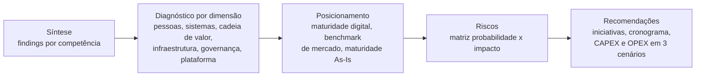
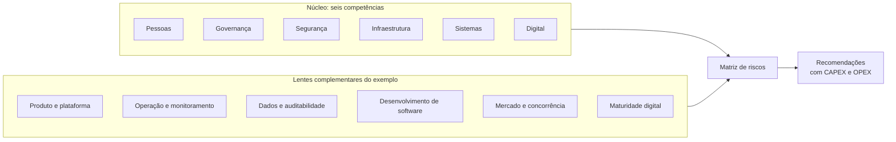
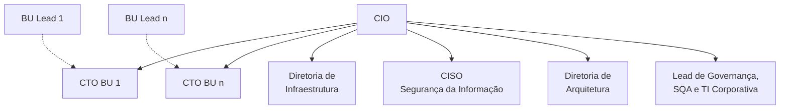
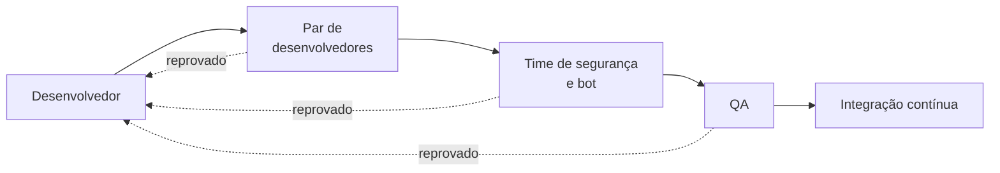
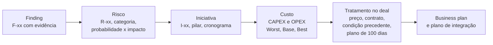

# Anatomia de um relatório de IT Due Diligence

*Anexo da oferta [IT Due Diligence (Buy Side)](../02-it-due-diligence-buy-side.md). Exemplo de entregável, com estrutura anonimizada.*

> **Um relatório de IT DD da A&M segue um caminho fixo. Parte dos findings por competência, passa pelo diagnóstico de cada dimensão e pelas réguas de maturidade, chega à matriz de riscos e termina em recomendações com prazo, CAPEX e OPEX em três cenários. Este anexo isola esse esqueleto para que ele seja reaproveitado em novos deals.** 💡

| Tipo | Ofertas relacionadas | Material de origem | Data | Extensão | Validação sugerida |
|---|---|---|---|---|---|
| Anexo: exemplo de entregável | ITMA-02 IT Due Diligence (Private Equity), ativa, readiness 4,5 → 4,7 🗂️. ITMA-09 (Corporate) e ITMA-10 (Venture Capital) estão tachadas no slide de status, em revisão 🗂️ | Deck Comercial, seção "Entregáveis (Exemplos)" 📘 | Julho de 2023 📘 | 19 slides, contados pelos rodapés da extração 📘 | Matheus Teixeira, PO da ITMA-02 🗂️. O slide avisa que "POs e Membros serão reajustados" |

> **Nota de anonimização.** O deck chama a empresa avaliada apenas de "Target". Mesmo assim, os slides trazem detalhes que permitiriam identificá-la. Por isso, este anexo **não reproduz**:
> - nomes de sistemas, fornecedores, provedores e produtos do alvo;
> - datas de eventos do alvo;
> - números do alvo: FTEs, custo de pessoal, percentuais de aderência, notas de maturidade, indicadores de monitoramento e valores em KBRL;
> - findings individuais, riscos nominais e **qualquer vulnerabilidade, falha ou detalhe técnico de segurança**.
>
> O texto descreve só a estrutura: peças, dimensões, réguas, formatos e convenções. Quando ajuda a calibrar o método, usa proporções derivadas, sem valores absolutos.

**Em síntese** 💡

- **Um relatório, cinco blocos.** As 19 peças se organizam em síntese (findings), diagnóstico por dimensão, posicionamento (maturidade e benchmark), riscos e recomendações. O bloco de recomendações é o mais "vendável": cada iniciativa tem cronograma de 12 meses, CAPEX e OPEX anual em KBRL, nos cenários Worst, Base e Best.
- **A espinha são as seis competências do framework** (Pessoas, Governança, Segurança, Infraestrutura, Sistemas, Digital). O exemplo acrescenta lentes de produto e plataforma, dados, desenvolvimento de software, operação e mercado, que coincidem com módulos da variante VC (Produto, Mercado, Escalabilidade, Defesa).
- **Réguas demais, pouco harmonizadas.** O relatório usa seis réguas diferentes (quatro níveis de maturidade digital, três níveis de aderência de práticas, maturidade de 0 a 5, benchmark binário, probabilidade × impacto e cenários de custo) e três taxonomias de dimensões. É rico, mas difícil de comparar entre deals.
- **Falta o fio da rastreabilidade.** Nada liga, por identificador, o finding ao risco, o risco à iniciativa e a iniciativa ao custo e ao tratamento no deal (preço, contrato, plano de 100 dias). É a principal melhoria para transformar o exemplo em kit.
- **Material comercial sensível.** O exemplo do deck expõe detalhes do alvo. Vale sanitizá-lo antes de qualquer uso externo.

---

## 1. O que é este material 📘

- **Onde está.** Fica no Deck Comercial, logo depois das seções de IT Due Diligence Buy Side (PE: linhas 841–959; VC: linhas 961–1063), sob o título "Entregáveis (Exemplos)", com a data "Julho 2023" (linhas 1067–1071).
- **Tamanho.** São 19 slides, contados pelos rodapés "Digital & Technology Services" entre as linhas 1135 e 1787. A seção de IT DD Sell Side começa na linha 1789.
- **Como o alvo aparece.** Os slides usam "Target" (por exemplo, linhas 1141, 1287, 1561 e 1631). Os nomes de sistemas, provedores, datas e números que aparecem nos slides foram omitidos aqui (ver a nota de anonimização).

💡 **Leitura.**

- **Parece um relatório composto, não um único engagement.** Três indícios apontam nessa direção: o plural "Exemplos"; slides que vêm de contextos de negócio diferentes (uma empresa de operação tradicional, com back-office, ERP e e-commerce, e uma plataforma digital de serviços financeiros); e findings que se excluem mutuamente no mesmo slide, como "Equipe subdimensionada" e "Equipe superdimensionada" (linhas 1091–1093). Por isso, este anexo trata o material como **catálogo de peças**, e não como o relatório de um alvo.
- **A variante de origem é incerta.** O material tem a mesma data da variante VC (julho de 2023, linha 965) e vem logo depois dela. Os findings, porém, seguem as seis competências do framework PE (linhas 869–887). Ver as perguntas em aberto.

---

## 2. Mapa do relatório: as 19 peças 📘

| # | Peça (título no deck) | Bloco 💡 | Dimensão | O que a peça mostra (estrutura) | Formato | Linhas |
|---|---|---|---|---|---|---|
| 1 | Findings | Síntese | As seis competências | Constatações agrupadas por competência, de 3 a 5 por bloco | Seis quadros de bullets | 1067–1133 ¹ |
| 2 | Assessment de Disciplinas | Posicionamento | Digital; Pessoas (liderança e cultura) | Seis disciplinas em quatro níveis, com a posição do alvo e um rótulo-síntese | Matriz de descritores | 1137–1209 ² |
| 3 | Pessoas | Diagnóstico | Pessoas; Segurança (função de CISO) | Organograma de TI, modelo de reporte, FTEs por área, total de FTEs, custo mensal de mão de obra e highlights | Organograma, indicadores e bullets | 1213–1263 |
| 4 | Sistemas | Diagnóstico | Sistemas | Mapa do technology stack por categoria; comentários sobre sourcing, projetos em curso e governança de arquitetura | Mapa por categoria e comentários | 1267–1291 |
| 5 | Suporte de Tecnologia à Cadeia de Valor | Diagnóstico | Sistemas (aplicações × processos de negócio) | Macroprocessos, etapas, o sistema que suporta cada etapa e o tipo de interface | Mapa de processos com legenda | 1295–1417 ³ |
| 6 | Topologia de Infraestrutura | Diagnóstico | Infraestrutura | Diagrama de rede, nuvem e data center; comentários | Diagrama e comentários | 1419–1451 |
| 7 | Governança | Diagnóstico | Governança, incluindo gestão de serviços | Aderência de 33 práticas, em três grupos; distribuição em dois recortes | Lista classificada e dois gráficos | 1455–1499 ⁴ |
| 8 | Arquitetura da Plataforma | Diagnóstico | Sistemas; Produto | Módulos de negócio, camada de API, integração com sistemas de mercado, alta disponibilidade e segregação de acessos | Diagrama de blocos e comentários | 1503–1513 |
| 9 | Avaliação de Plataformas | Diagnóstico | Produto; Segurança | Quadro com assunto, pontos de atenção, observações e recomendações | Tabela de quatro colunas | 1517–1549 |
| 10 | Operação | Diagnóstico | Operação da plataforma (setorial) | Modelo operacional de custódia, backup e recuperação de ativos | Texto e diagrama | 1553–1563 |
| 11 | Monitoramento da Operação | Diagnóstico | Infraestrutura; Operação | Seis indicadores de escala do monitoramento e leitura sobre escalabilidade em nuvem | Painel de indicadores e texto | 1567–1581 |
| 12 | Security reports SLA / Melhorias Realizadas | Diagnóstico | Segurança; Digital | Histórico de evolução da plataforma com evidência externa; gráfico de tempo de resposta × demanda | Gráfico e bullets | 1585–1593 ⁵ |
| 13 | Dados e Transações | Diagnóstico | Dados; Segurança (privacidade) | Auditabilidade por APIs; verificação de exposição de dados sensíveis | Lista de APIs e conclusão | 1597–1613 |
| 14 | Processo de Revisão de Códigos | Diagnóstico | Sistemas (qualidade de código); Segurança | Fluxo de code review em cinco etapas | Fluxo e comentários | 1615–1623 |
| 15 | ITSM | Diagnóstico | Governança (gestão de serviços) | Só o título foi extraído; o conteúdo está em imagem | Não recuperável | 1627 |
| 16 | Target vs Players de Mercado | Posicionamento | Digital; Produto; Mercado | Nove atributos comparados em três colunas numeradas | Tabela comparativa | 1631–1655 |
| 17 | Matriz de Risco | Riscos | Transversal | 14 riscos numerados em probabilidade × impacto, em quatro categorias | Mapa de calor | 1659–1691 ⁶ |
| 18 | Recomendações | Recomendações | Transversal, em cinco pilares | Iniciativas, cronograma de 12 meses, CAPEX e OPEX em três cenários | Tabela com Gantt | 1695–1743 ⁷ |
| 19 | Avaliação de Maturidade | Posicionamento | Transversal, em seis dimensões | Notas As-Is numa escala de 0 a 5 | Gráfico de maturidade | 1747–1785 ⁸ |

**O fio narrativo** 💡 (o agrupamento em blocos é deste repositório; no deck, a Avaliação de Maturidade é a última peça):

---

## 3. Dimensões avaliadas 📘

### 3.1 A espinha: as seis competências do framework

O framework de IT DD do deck (linhas 869–887) define o que cada competência deve cobrir. A tabela mostra onde cada uma aparece no relatório-exemplo.

| Competência | O que o framework manda avaliar 📘 | Peças do exemplo 📘 | Cobertura no exemplo 💡 |
|---|---|---|---|
| **Pessoas** | Estrutura organizacional, distribuição de equipes, skills, benchmark de salários, modelos de contratação | Findings; Pessoas; Assessment de Disciplinas (liderança e cultura) | Alta. Organograma, FTEs, custo e modelo de contratação aparecem. Skills e benchmark salarial não têm peça própria na extração |
| **Governança** | Modelo de atendimento, maturidade de gestão de serviços, gestão de demanda e projetos, contratos, gestão financeira (CAPEX/OPEX), BCP, DRP | Findings; Governança (33 práticas); ITSM | Alta. É a dimensão com a régua mais estruturada |
| **Segurança** | Light pentest (web e network), modelo e práticas aplicadas, ISO 27001 | Findings; Pessoas (CISO); Avaliação de Plataformas; Dados e Transações; Code review; Security reports SLA | Média. Não há, na extração, peça dedicada a resultados de pentest ou à aderência à ISO 27001. Por política deste repositório, os resultados de segurança não são detalhados aqui |
| **Infraestrutura** | Arquitetura, ambiente, aderência, modelo de contratação, recursos de DevOps, integrações, escalabilidade | Findings; Topologia; Monitoramento | Média a alta. DevOps não tem peça própria |
| **Sistemas** | Aplicações × processos de negócio, linguagens, tecnologias, propriedade intelectual, modelo de propriedade, qualidade de software e de código, versionamento | Findings; Sistemas; Cadeia de Valor; Arquitetura da Plataforma; Code review | Alta. A peça de cadeia de valor materializa "aplicações × processos de negócio" |
| **Digital** | Mídias sociais, jornada do cliente, e-commerce | Findings; Assessment de Disciplinas; Target vs Players; Melhorias Realizadas | Média. Mídias sociais não têm peça própria |

### 3.2 Lentes complementares que o exemplo acrescenta 📘

| Lente | Peças | O que examina | Módulo equivalente da variante VC 💡 |
|---|---|---|---|
| Produto e plataforma | Arquitetura da Plataforma; Avaliação de Plataformas | Módulos de negócio, camada de API, integrações, controles da jornada do cliente, reclamações e roadmap de funcionalidades | Produto; Ativos tecnológicos |
| Operação da plataforma | Operação; Monitoramento | Modelo operacional crítico do negócio (no exemplo, custódia de ativos), observabilidade, escalas de plantão | Escalabilidade; Defesa |
| Dados e auditabilidade | Dados e Transações | Rastreabilidade e conciliação de transações; exposição de dados sensíveis em APIs públicas | Defesa |
| Desenvolvimento de software | Processo de Revisão de Códigos | Esteira de revisão, testes automatizados funcionais e de segurança, integração contínua | Governança (qualidade do desenvolvimento) |
| Mercado e concorrência | Target vs Players | Posição do produto do alvo diante de players do setor | Mercado |
| Maturidade de transformação digital | Assessment de Disciplinas | Liderança, cultura, estratégia digital, change management, UX, plataforma integrada | Estratégia |

### 3.3 Três taxonomias convivem no mesmo relatório 📘

| Conceito | Findings (linhas 1073–1133) | Pilares das recomendações (linhas 1697–1735) | Dimensões da maturidade (linhas 1753–1763) |
|---|---|---|---|
| Pessoas | Pessoas | Pessoas | Pessoas |
| Governança | Governança | Governança | Governança |
| Infraestrutura | Infraestrutura | Infraestrutura | Infraestrutura |
| Aplicações e sistemas | Sistemas | Não há | Aplicações |
| Processos | Não há | Processos | Processos |
| Segurança | Segurança | Não há | Não há |
| Digital | Digital | Digital | Não há |
| Visão consolidada | Não há | Não há | TI |

💡 **Leitura.** A Segurança aparece nos findings, mas some nos pilares das recomendações e nas dimensões de maturidade. Processos surge nas recomendações e na maturidade sem existir nos findings. Para o kit, convém adotar **uma única taxonomia**, como as seis competências mais Processos, e usá-la em todas as peças.

---

## 4. Formato de findings 📘

### 4.1 O slide-síntese de findings (linhas 1073–1133)

Um único slide traz seis quadros, um por competência. Cada quadro tem de 3 a 5 bullets curtos.

| Competência | Nº de findings no exemplo | Natureza dos temas, em termos genéricos 💡 |
|---|:---:|---|
| Segurança | 4 | Políticas e controles. Conteúdo não reproduzido |
| Pessoas | 5 | Modelo de contratação e retenção, concentração de conhecimento, liderança formal, dimensionamento da equipe |
| Governança ¹ | 3 | Gestão financeira e de contratos, documentação de soluções e processos core, gestão de ativos e licenciamento |
| Infraestrutura ¹ | 4 | Backup e continuidade, ciclo de vida do parque, instalações, dimensionamento e escalabilidade |
| Sistemas | 4 | Arquitetura e escalabilidade, obsolescência de plataformas, dependência de terceiros e documentação |
| Digital | 3 | Canal de e-commerce e canais de atendimento |
| **Total** | **23** | |

**Padrão de redação observado:**

1. **Frase nominal curta que começa pela lacuna:** "Ausência de…", "Inexistência de…", "Falta de…", "Controles… insuficientes".
2. **Consequência ou agravante entre parênteses**, quando relevante: "(possibilidade de turnover)" (linha 1085), "(risco iminente de multas)" (linhas 1113–1115), "(em alguns casos ausência)" (linhas 1099–1101), "(governança informal)" (linha 1121).
3. **Sem severidade, dono ou evidência no slide-síntese.** A severidade só aparece depois, na matriz de risco.

### 4.2 Outros formatos de finding dentro do relatório

| Formato | Onde aparece | Uso |
|---|---|---|
| **Comentários** sob um diagrama | Sistemas (linhas 1285–1291); Topologia (linhas 1441–1451); Arquitetura da Plataforma (linhas 1509–1513) | Contextualizar o diagrama com fatos, estratégia do alvo e pontos de atenção |
| **Highlights** | Pessoas (linhas 1245–1253) | Destacar características e **pontos fortes** do desenho organizacional |
| **Quadro de quatro colunas**: Assunto, Pontos de Atenção, Observações, Recomendações | Avaliação de Plataformas (linha 1519) | Ligar, na mesma linha, a constatação, o contexto e a recomendação |
| **Verificação conclusiva** | Dados e Transações (linha 1613) | Registrar o resultado de um teste feito pela equipe ("Verificamos que…") |
| **Painel de indicadores** | Monitoramento (linhas 1569–1579) | Dimensionar a operação com números |

💡 **Os findings não são só negativos.** O exemplo registra fortalezas: liderança técnica sólida (linha 1251), uma estratégia de custódia descrita como "a mais recomendada em termos de segurança" (linha 1557), testes de segurança automatizados, o que "eleva a qualidade das entregas" (linha 1619) e evolução contínua da plataforma (linhas 1589–1593). Um relatório equilibrado ganha credibilidade com o investidor.

### 4.3 Tipos de evidência citados no exemplo 📘

| Tipo de evidência | Exemplo de uso no deck | Linhas |
|---|---|---|
| Entrevista | "Durante as entrevistas, também foi informado…" | 1511 |
| Estimativa do próprio time do alvo | Estimativa feita pelo time de infraestrutura do alvo | 1443 |
| Verificação direta pela A&M | "Verificamos…" | 1589 e 1613 |
| Fonte pública, de fora para dentro (outside-in) | Histórico público do site, consultado no archive.org; APIs públicas | 1589 e 1601 |
| Documentação e diagramas de arquitetura | Módulos, camada de API, integrações | 1505–1509 |
| Informação declarada e não detalhada | Procedimento proprietário "não foi detalhado" por privacidade | 1561 |

💡 Para o kit, vale marcar em cada finding o **grau de evidência**: declarada, documentada ou verificada. Isso separa o que o investidor pode usar em negociação do que ainda precisa de confirmação.

### 4.4 Ficha de finding proposta para o kit 💡

| Campo | Conteúdo | Exemplo de preenchimento (genérico) |
|---|---|---|
| ID | F-competência-nº | F-PES-03 |
| Competência | Uma das seis, ou Processos | Pessoas |
| Constatação | Frase nominal curta, no padrão do deck | "Conhecimento crítico concentrado em uma pessoa" |
| Consequência | Entre parênteses, como no deck | (risco de continuidade em caso de saída) |
| Evidência | Tipo e grau | Entrevista; declarada |
| Tipo | Ponto de atenção ou ponto forte | Ponto de atenção |
| Riscos ligados | IDs na matriz | R-01 |
| Iniciativas ligadas | IDs nas recomendações | I-01 |
| Implicação para o deal | Preço, contrato, condição precedente, plano de 100 dias ou nenhuma | Plano de retenção como condição de fechamento |

---

## 5. Peças de diagnóstico: a estrutura de cada uma 📘

### 5.1 Pessoas: organograma e indicadores (linhas 1213–1263)

**Elementos do organograma:** CIO; CTOs por unidade de negócio (BU), um por BU; BU Leads; Diretoria de Infraestrutura; CISO (Information Security); Diretoria de Arquitetura; Lead de Governança, SQA e TI Corporativa. Os rótulos "Matrix" e "Hierarchical" (linhas 1241–1243) indicam que a peça classifica as linhas de reporte em matriciais ou hierárquicas.

**Indicadores:** FTEs por caixa do organograma (linhas 1259–1263), total de FTEs (linha 1255) e custo mensal de mão de obra em R$ milhões (linha 1257). Os valores não são reproduzidos.

**Highlights** (linhas 1247–1253), em quatro temas: o papel do CTO de cada BU; os serviços corporativos compartilhados (infraestrutura, segurança, arquitetura, governança, SQA e estratégia de TI); o perfil técnico da liderança; e o espaço para escalar as equipes.

**Arquétipo do organograma** 💡 (leitura provável; as linhas exatas de reporte não são recuperáveis na extração):

*Linhas tracejadas: relação matricial com o negócio (hipótese de leitura).*

### 5.2 Sistemas: technology stack (linhas 1267–1291)

**Mapa por categoria** (12 categorias): linguagens; projetos; base de conhecimento; ferramentas de colaboração; ERP; service desk; comunicação; monitoramento e dados; recursos humanos; CRM; banco de dados; plataforma. "Monitoring and Data" pode ser uma ou duas categorias (linha 1279).

**Comentários**, em três temas: a estratégia de sourcing do alvo (preferência por PaaS e SaaS); um projeto em curso de migração para SaaS, com prazo e orçamento previstos; e a governança de arquitetura (um comitê que prioriza o stack por disponibilidade de mão de obra e adequação da solução).

### 5.3 Suporte de tecnologia à cadeia de valor (linhas 1295–1417) ³

**Estrutura da peça.** Na horizontal, os sistemas do alvo (marketing, CRM, ERP, controle de ponto) e uma coluna "Manual". Na vertical, os macroprocessos com suas etapas. Cada etapa é ligada ao sistema que a suporta.

**Legenda** (linhas 1301 e 1417): "Interface Manual", "Interface Automatizada", "N/A" e um marcador de "Inclusão de dado para acompanhamento de forma manual".

| Macroprocesso | Etapas mapeadas no exemplo |
|---|---|
| Comercial e pedidos ("Multicanal") | Captação de leads (marketing e SDR); qualificação; negociação; avaliação de crédito; entrada e input de pedido; aprovação em três alçadas; emissão de pedido; faturamento; expedição; pagamento e cobrança |
| Procure to Pay (indiretas) | Solicitação de compra; emissão e aprovação do pedido de compra; disponibilização do pedido; chegada do produto; arquivamento e envio da NF ao financeiro; pagamento |
| Importação e nacionalização | Fluxo provável de compras diretas importadas (trecho ambíguo na extração) |
| Financial Operations | Contas a pagar (preparação, espera da data, pagamento, conciliação) e contas a receber (emissão para pagamento do cliente, espera do vencimento, recebimento, conciliação), a partir do pedido de compra e da ordem de venda |
| BPO e folha de pagamento | Registro de ponto para o BPO; processamento da folha; geração do arquivo; importação para pagamento |
| Accounting and final closing | Fechamento mensal (material, compra, venda, financeiro, impostos e contabilidade); fechamento anual; demonstrações financeiras (consolidação, report e análises); gestão de ativos, orçamento, cobrança e estoque |

💡 **Por que a peça importa.** Ela torna visíveis, numa só tela, as **entradas manuais e as interfaces não automatizadas**. São fonte de risco operacional (dados divergentes), de custo oculto e de sinergia na integração. É a peça mais diretamente reaproveitável no Planning (ITMA-04).

### 5.4 Infraestrutura: topologia (linhas 1419–1451)

**Componentes do diagrama:** link de internet primário e link de contingência, de provedores distintos; firewall; switch core; VPN; nuvem pública; data center; switches de acesso; usuários em mais de um ponto.

**Comentários**, em cinco temas (os achados não são reproduzidos): ciclo de vida e depreciação do parque de servidores; condições físicas do data center; migração para nuvem; recuperação de desastres; proteção de dados em equipamentos de usuários.

### 5.5 Governança: aderência de práticas (linhas 1455–1499) ⁴

A peça lista 33 práticas em três grupos e classifica cada uma como **Atende**, **Atende Parcialmente** ou **Não Atende** (linha 1499). Fecha com dois gráficos de distribuição percentual, com os títulos "Modelo Operacional" e "Governança" (linha 1491). Os percentuais não são reproduzidos.

| Práticas gerais de gestão (14) | Práticas de gerenciamento de serviços (16) | Práticas de gestão técnica (3) |
|---|---|---|
| Gestão estratégica | Análise de negócio | Gerenciamento de implantação |
| Gerenciamento de portfólio (projetos, aplicações) | Gerenciamento de catálogo de serviços | Infraestrutura e gerenciamento de plataforma |
| Gestão de arquitetura | Projeto de serviço | Desenvolvimento e gerenciamento de software |
| Gestão de custos de TI | Gerenciamento de nível de serviço | |
| Força de trabalho e gestão de talentos | Gerenciamento de disponibilidade | |
| Melhoria contínua | Gerenciamento de capacidade e desempenho | |
| Medição e relatórios | Gerenciamento de continuidade de serviço | |
| Gerenciamento de riscos | Monitoramento e gerenciamento de eventos | |
| Gerenciamento de segurança da informação | Gerenciamento de incidentes | |
| Gestão do conhecimento | Gerenciamento de solicitações de serviço | |
| Gerenciamento de mudanças organizacionais | Gerenciamento de problemas | |
| Gerenciamento de projetos | Gerenciamento de liberação | |
| Gestão de relacionamento | Controle de alterações | |
| Gestão de fornecedores | Validação e teste de serviço | |
| | Gerenciamento de configuração de serviço | |
| | Gerenciamento de ativos de TI | |

💡 **Leitura.** A lista reproduz as 34 práticas do ITIL 4 (14 gerais, 17 de serviço e 3 técnicas), com uma exceção: a **central de serviços (service desk)** não aparece na extração. Ancorar a peça num referencial de mercado dá credibilidade e comparabilidade entre deals. Vale confirmar se a omissão está no slide ou só na extração.

### 5.6 ITSM e Security reports SLA

- **ITSM** (linha 1627) e **Security reports SLA** (linha 1585): só os títulos foram extraídos. O conteúdo está em imagem e não é recuperável na extração.

### 5.7 Pacote de plataforma digital (linhas 1503–1623)

Um conjunto de peças aplicável quando o ativo é uma **plataforma digital**, sobretudo de serviços financeiros:

| Peça | Estrutura | Linhas |
|---|---|---|
| Arquitetura da Plataforma | Diagrama dos módulos de negócio, do módulo de segurança e da camada de API. Comentários sobre sistemas de mercado integrados via API, mecanismos de alta disponibilidade (alarmes) e segregação de acessos por projeto | 1503–1513 |
| Avaliação de Plataformas | Quadro com Assunto, Pontos de Atenção, Observações e Recomendações. Temas: controles da jornada de cadastro e de transações, experiência e reclamações de usuários, mix de canais (mobile e aplicativos de terceiros), roadmap de funcionalidades (por exemplo, pagamento instantâneo) | 1517–1549 |
| Operação | Modelo operacional crítico do negócio. No exemplo, a custódia de ativos: segregação, backup e recuperação, rebalanceamento, auditoria de saldos e registro de transações | 1553–1563 |
| Monitoramento da Operação | Seis indicadores de escala (data points, métricas, alarmes, dashboards, sistemas monitorados, escalas de trabalho) e uma leitura de como o monitoramento sustenta o crescimento em nuvem pública | 1567–1581 |
| Melhorias Realizadas | Evidência outside-in da cadência de atualizações (histórico público do site no archive.org), marcos de UI/UX e gráfico de tempo de resposta × crescimento da demanda após a migração para nuvem | 1587–1593 |
| Dados e Transações | APIs públicas de dados de mercado (resumo de 24 horas, livro de ofertas, histórico e resumo diário de negociações), possibilidade de conciliar registros internos com registros públicos e verificação de que não há dados sensíveis expostos | 1597–1613 |
| Processo de Revisão de Códigos | Fluxo em cinco etapas, com retorno ao desenvolvedor em caso de reprovação e testes de segurança automatizados além dos funcionais | 1615–1623 |

**Fluxo de code review documentado no exemplo** 📘 (linhas 1617–1623):

💡 **Técnica a padronizar.** O uso de fontes públicas (histórico do site, APIs abertas) permite avaliar a evolução e a transparência do ativo **sem depender só do VDR**. É útil antes do acesso ao data room e em processos competitivos.

### 5.8 Mercado: Target vs Players (linhas 1631–1655)

Uma tabela de atributos em três colunas numeradas (1, 2, 3). Não é possível saber, pela extração, se o alvo é uma das colunas.

| Atributo | Tipo de valor no exemplo |
|---|---|
| Principal produto (ativo) | Descritivo: categoria de produto |
| Customer experience (loyalty e incentivos) | Sim ou Não |
| Disponibilização de POS | Sim ou Não |
| Esforços em UX/UI | Sim ou Não |
| Práticas ESG | Sim ou Não |
| Disponibilização de APIs | Aberta ou Fechada |
| Internacionalização | Sim ou Não |
| Diferenciais do website (plataforma) | Descritivo: funcionalidades |
| Diferenciais do setor | Descritivo: serviços e certificações |

---

## 6. Réguas de avaliação: maturidade e atributos 📘

### 6.1 Assessment de Disciplinas: maturidade digital em quatro níveis (linhas 1137–1209) ²

| Disciplina | Iniciante | Em desenvolvimento | Intermediária | Madura |
|---|---|---|---|---|
| **Liderança** | Alheia às vantagens e aos riscos da transformação digital | Ação limitada, mas entende benefícios e riscos | Entende a criticidade e a disrupção para o negócio | Identifica estratégia e roadmap para a transformação |
| **Cultura** | Poucos recursos digitais; não percebe as oportunidades | Motivada, mas sem estratégia, conhecimento e metodologia ² | Visão unificada forte, governança bem definida e mão de obra qualificada | Visão transformadora, governança e investimento; muda rapidamente |
| **Estratégia digital** | Sem estratégia para alavancar tecnologias digitais, com reflexo na operação e na experiência do cliente | Entende benefícios e riscos, mas não tem estratégia corporativa para capturá-los | Estratégia iniciada; roadmap da jornada em desenvolvimento | Estratégia e roteiro claros; já obtém retorno sobre os investimentos |
| **Change management** | Processos escassos ou desiguais | Aplicação inconsistente, restrita a iniciativas específicas | Padrões e práticas definidos na maioria dos grupos | Abordagem corporativa, com padrões, KPIs e práticas |
| **User experience** | Esforços desconexos e pouco financiados; gestão de dados ad hoc ² | UX e mapeamento de jornada aplicados aos pain points críticos; gestão de dados limitada | Estratégia formulada para redesenhar recursos; disciplina de gestão de dados criada | UX essencial à estratégia, com foco em inovação; análise prescritiva nas decisões |
| **Plataforma integrada** | Escalabilidade limitada, data centers on-premises, arquitetura legada monolítica ² | Uso limitado de nuvem e de arquitetura de serviços; pouca eficiência no uso da capacidade | Mais desempenho, monitoramento de capacidade e escalabilidade | IaaS público-privado totalmente gerenciado, com políticas de BCP e DR definidas |

**Saída da peça:** a posição do alvo em cada disciplina (em gráfico, não recuperável na extração) e um **rótulo-síntese** do estágio geral (no exemplo, "em transição", linha 1141).

### 6.2 Aderência de práticas de governança: três níveis (linhas 1455–1499)

Atende, Atende Parcialmente e Não Atende, aplicados a cada uma das 33 práticas e consolidados em distribuição percentual nos recortes "Modelo Operacional" e "Governança". Detalhes na seção 5.5.

### 6.3 Avaliação de Maturidade As-Is: de 0 a 5 (linhas 1747–1785) ⁸

| Nível | Nome |
|:---:|---|
| 0 | Caótico |
| 1 | Reativo |
| 2 | Proativo |
| 3 | Serviço |
| 4 | Valor |
| 5 | Transformador |

**Dimensões pontuadas:** TI, Pessoas, Processos, Aplicações, Infraestrutura e Governança. As notas têm uma casa decimal e não são reproduzidas. Na extração, a peça mostra só o As-Is: não há To-Be nem meta.

💡 A escala segue a lógica dos modelos de maturidade de infraestrutura e operações do mercado (caótico, reativo, proativo, serviço, valor) e acrescenta um sexto nível, "Transformador".

### 6.4 Quadro comparativo das réguas 💡

| Régua | Peça | Níveis | Natureza | Uso típico no deal |
|---|---|---|---|---|
| Profundidade da diligência | Escopo da proposta (dossiê ITMA-02, §4.3) | 1 a 3 por competência | Escopo | Precificar e dimensionar o trabalho |
| Maturidade digital | Assessment de Disciplinas | 4 níveis descritivos | Qualitativa | Tese de crescimento e criação de valor |
| Aderência de práticas | Governança | 3 níveis por prática | Conformidade | Gaps de governança e plano de 100 dias |
| Maturidade As-Is | Avaliação de Maturidade | 0 a 5, com decimais | Quantitativa | Visão executiva e comparação entre ativos |
| Benchmark de mercado | Target vs Players | Binário, categórico e descritivo | Comparativa | Posição competitiva do produto |
| Severidade de risco | Matriz de Risco | Probabilidade × impacto | Risco | Priorização e tratamento no contrato |
| Cenários de custo | Recomendações | Worst, Base e Best | Financeira | Business plan, CAPEX e OPEX |

💡 **Recomendação.** Adotar a escala de 0 a 5 como **régua mestra** e publicar as tabelas de conversão: os 4 níveis do assessment para a escala de 0 a 5, e a aderência de práticas em percentual para a escala de 0 a 5. Assim, a maturidade As-Is deixa de ser uma peça isolada e passa a sintetizar o diagnóstico.

---

## 7. Matriz de riscos (linhas 1659–1691) 📘 ⁶

**Estrutura da peça:**

| Elemento | Como aparece no exemplo |
|---|---|
| Riscos | 14, numerados de 1 a 14, cada um com um título curto (frase nominal: "Ausência de…", "Non-compliance…", "Dependência de…") |
| Eixos | Probabilidade (linha 1687) × Impacto (linhas 1681–1685) |
| Categorias | Quatro, na legenda: **Operacional, Estratégico, Compliance, Financeiro** (linhas 1689–1691) |
| Marcadores | "A", "B" e "C" (linhas 1665, 1667 e 1677). O significado (zonas, quadrantes ou grupos) não é recuperável na extração |
| Distribuição por categoria | Não recuperável na extração (cores e posições estão no gráfico) |

💡 **Leitura.**

- A maioria dos riscos retoma temas já presentes nos findings, mas **sem referência cruzada**. O leitor precisa fazer a ligação sozinho.
- A matriz para na severidade. Não diz **como cada risco deve ser tratado no deal**, que é a pergunta do investidor.

**Taxonomia de riscos sugerida para novos deals** 💡 (genérica, não é a lista do alvo):

| Categoria | Riscos típicos a testar | Tratamento usual no deal |
|---|---|---|
| Operacional | Dependência de pessoas-chave; ruptura ou obsolescência de infraestrutura; dados divergentes entre sistemas; ausência de continuidade testada | Plano de 100 dias; retenção; CAPEX de renovação no business plan |
| Estratégico | Descontinuidade de soluções críticas por fornecedores; arquitetura que não escala com a tese; estrutura de TI incompatível com o plano de crescimento | Ajuste de valuation; roadmap de transformação |
| Compliance | Licenciamento de software; proteção de dados pessoais (LGPD); passivos trabalhistas ligados a modelos de contratação; contratos sem cláusulas adequadas | Declarações e garantias, indenização ou escrow no contrato; condição precedente |
| Financeiro | Custos de TI fora do orçamento; investimentos represados; OPEX recorrente subestimado | Ajuste de preço; normalização do EBITDA |
| Segurança (sugestão de categoria própria) | Fragilidades de políticas, de acessos e de proteção de dados, registradas só em anexo confidencial | Condição precedente; plano de remediação com prazo; seguro cibernético |

**Grade de severidade sugerida** 💡 (3 × 3, com zonas de ação):

| Impacto ↓ / Probabilidade → | Baixa | Média | Alta |
|---|---|---|---|
| **Alto** | Monitorar e mitigar | Tratar no contrato | **Red flag**: preço ou condição precedente |
| **Médio** | Aceitar | Plano de 100 dias | Tratar no contrato |
| **Baixo** | Aceitar | Aceitar | Plano de 100 dias |

---

## 8. Recomendações e estimativas de custo: formato KBRL (linhas 1695–1743) 📘 ⁷

### 8.1 Estrutura da tabela

| Coluna | Conteúdo |
|---|---|
| Pilar | Pessoas, Processos, Infraestrutura, Governança, Digital |
| Iniciativa | Título curto e acionável |
| Tempo estimado (meses) | Gantt de 1 a 12 meses, com legenda de **Planejamento** e **Execução** (linhas 1705 e 1737–1743) |
| CAPEX + Cash In/Out (KBRL) | Três cenários: **Worst, Base, Best** |
| OPEX anual (KBRL) | Três cenários: **Worst, Base, Best** |
| Linha de Total | Soma por cenário, separada para CAPEX e OPEX |

**Convenções de formato:**

- **KBRL** = milhares de reais.
- **Valores entre parênteses são negativos**, isto é, entrada de caixa. Entram com sinal negativo no total; a aritmética do exemplo confirma.
- **"-"** = não se aplica. Há iniciativas só de CAPEX, só de OPEX ou com os dois.
- O **CAPEX** soma investimento e movimentações de caixa pontuais. O **OPEX** é o custo **anual recorrente**.

### 8.2 Tipologia das iniciativas no exemplo (oito iniciativas)

| Pilar | Nº | Iniciativas (tipo) | Perfil de custo |
|---|:---:|---|---|
| Pessoas | 1 | Reestruturação da TI e redução de riscos trabalhistas | Só OPEX |
| Processos | 1 | Implantação de sistemas de back-office | CAPEX e OPEX |
| Infraestrutura | 1 | Gestão de ativos e leasing de equipamentos | CAPEX negativo (entrada de caixa) e OPEX |
| Governança | 2 | Gestão de demanda, portfólio de projetos e squad de desenvolvimento; internalização da gestão de custos e construção do PDTI | Só CAPEX |
| Digital | 3 | Implementação e uso de CRM; desenho e implementação de plano de marketing digital; implementação de data analytics | CAPEX e OPEX |

### 8.3 Padrões extraídos do exemplo 💡 (proporções derivadas, sem valores absolutos)

1. **Os totais fecham.** Conferimos a soma das linhas nos seis cenários (CAPEX e OPEX, Worst, Base e Best).
2. **A amplitude dos cenários varia.** No total, o CAPEX fica cerca de 15% acima do Base no Worst e cerca de 15% abaixo no Best. O OPEX fica cerca de 22% acima no Worst e cerca de 15% abaixo no Best. Por linha, as faixas vão de cerca de 10% a cerca de 40% em torno do Base, ora simétricas, ora assimétricas. As faixas mais largas estão nas iniciativas digitais. **O deck não explicita as premissas dos cenários.**
3. **O custo recorrente pesa mais que o investimento.** Nos três cenários, o OPEX anual supera o CAPEX total (no Base, cerca de 1,4 vez). Cerca de dois terços do OPEX vêm do pilar Pessoas. Para o investidor, o efeito no EBITDA recorrente importa mais que o cheque de investimento.
4. **Há uma inconsistência de sinal.** A linha com entrada de caixa tem a **maior entrada no cenário Worst**, o que reduz o CAPEX justamente no pior cenário. Isso sugere cenários escalados de forma mecânica. Num kit, a regra deveria ser: no Worst, a menor entrada de caixa.
5. **O horizonte é curto.** O cronograma vai até 12 meses, e o OPEX é anual. O exemplo não traz projeção plurianual, payback nem ligação explícita com o valuation.

### 8.4 Template em branco para o kit 💡

| ID | Pilar | Iniciativa | Riscos endereçados | Meses 1–12 (P = planejamento, E = execução) | CAPEX + cash in/out (KBRL): Worst / Base / Best | OPEX anual (KBRL): Worst / Base / Best | Premissas |
|---|---|---|---|---|---|---|---|
| I-01 | Pessoas | … | R-01, R-02 | P P E E E E | – / – / – | x / x / x | … |
| I-02 | Infraestrutura | … | R-05 | P E E | (x) / (x) / (x) | x / x / x | … |
| **Total** | | | | | **Σ / Σ / Σ** | **Σ / Σ / Σ** | |

### 8.5 A cadeia de rastreabilidade que o kit deveria tornar explícita 💡

---

## 9. Leitura crítica: o que reaproveitar e o que melhorar 💡

**O que o exemplo faz bem:**

1. **Cobertura ampla.** As seis competências mais as lentes de produto, dados, desenvolvimento de software, operação e mercado.
2. **Quantificação.** FTEs e custo de pessoal, aderência percentual, maturidade de 0 a 5 e CAPEX e OPEX em cenários.
3. **Evidência diversificada.** Inclui fontes públicas (outside-in), além de entrevistas e documentos.
4. **Equilíbrio.** Registra pontos fortes, e não só pontos de atenção.
5. **Recomendações acionáveis.** Iniciativas com prazo, pilar e custo, prontas para alimentar o Planning e o business plan.

**O que falta para virar kit:**

| Lacuna | Efeito | Ajuste proposto |
|---|---|---|
| Sem sumário executivo na extração (o material começa nos findings) | O investidor não vê as red flags na primeira página | Capa com as cinco principais red flags, o investimento total por cenário e a maturidade média |
| Sem IDs entre findings, riscos e iniciativas | A rastreabilidade depende do leitor | IDs F-, R- e I-, com referência cruzada (seção 8.5) |
| Três taxonomias e seis réguas | Difícil comparar deals e consolidar benchmarks | Taxonomia única e régua mestra de 0 a 5 (seções 3.3 e 6.4) |
| Matriz sem tratamento no deal | O risco não vira cláusula, preço ou plano | Coluna "tratamento no deal" (seção 7) |
| Cenários de custo sem premissas e com inconsistência de sinal | Fragiliza a discussão de preço | Premissas por linha e regra de sinal para cash in |
| ITSM e Security reports SLA só em imagem | Peças não auditáveis na base de conhecimento | Versão textual das peças |
| Material comercial com detalhes do alvo | Risco de confidencialidade | Versão sanitizada do exemplo para uso comercial |

**Onde o kit se encaixa no portfólio:**

- **ITMA-01 IT M&A Playbook.** A área de foco "IT Due Diligence" promete "framework para realização de IT Due Diligence e geração de modelo para avaliação e mitigação de riscos e estimativas financeiras" (linha 497). As peças deste anexo (matriz de risco e tabela de CAPEX e OPEX) são exatamente esse material, além do "Template personalizado para IT Data Request" (linha 581) e dos "Modelos para estimativas financeiras" (linha 587).
- **ITMA-07 IT Due Diligence (Sell Side)**, readiness 2,7 → 3,7 🗂️. A mesma anatomia serve para a pré-diligência do vendedor, o gabarito de Q&A de tecnologia e o VDR (linhas 1823–1839). Reaproveitar o kit é um caminho direto para subir a readiness da linha.
- **ITMA-04 Planning e ITMA-05 IMO.** As iniciativas com cronograma alimentam o plano de integração e a execução.
- **ITMA-08 Synergies & Value Creation.** As iniciativas digitais (CRM, marketing digital, data analytics) são alavancas de valor para o hold period.

---

## 10. Checklist de DD de TI 💡

*Derivado das dimensões e peças deste anexo e do framework de seis competências (linhas 869–887). Pode ser reutilizado em novos deals. Ajuste a profundidade de cada bloco com a régua de 1 a 3 do escopo. Cada item indica a evidência típica a solicitar e a peça do relatório que ele alimenta.*

### 10.0 Enquadramento (antes do data request)

- [ ] **ENQ-01** A tese do deal e as alavancas de valor estão claras (stand-alone, integração, carve-out, buy-and-build)? *Evidência:* memorando de investimento, conversa com o deal team. *Peça:* escopo.
- [ ] **ENQ-02** A profundidade (1 a 3) de cada competência está definida e é coerente com a tese? *Peça:* proposta.
- [ ] **ENQ-03** O IT Data Request foi emitido, adaptado ao setor e ao tipo de transação? *Peça:* todas.
- [ ] **ENQ-04** A agenda de entrevistas (CIO, CTOs, infraestrutura, CISO, arquitetura, governança, áreas de negócio) e o acesso ao VDR estão confirmados?
- [ ] **ENQ-05** As regras de confidencialidade e de clean team estão definidas, inclusive para achados de segurança?

### 10.1 Pessoas e organização

- [ ] **PES-01** Há organograma completo de TI, com linhas hierárquicas e matriciais e os papéis de CIO, CTOs, CISO, arquitetura e governança? *Evidência:* organograma, descrições de cargo. *Peça:* Pessoas.
- [ ] **PES-02** Há FTEs por área e custo mensal total de mão de obra, de internos e terceiros? *Evidência:* relatório de headcount e folha. *Peça:* Pessoas.
- [ ] **PES-03** Quais são os modelos de contratação (CLT, PJ, terceiros) e a exposição trabalhista associada? *Peça:* Findings e Matriz de Risco.
- [ ] **PES-04** Há conhecimento crítico concentrado em poucas pessoas? Existe plano de retenção para pessoas-chave?
- [ ] **PES-05** Existe liderança formal responsável pelos planos tático e estratégico de TI?
- [ ] **PES-06** O dimensionamento da equipe é adequado à demanda e ao plano de negócio (sub ou superdimensionamento)?
- [ ] **PES-07** Como estão as skills do time e o benchmark salarial em relação ao mercado?
- [ ] **PES-08** Em que nível estão a liderança e a cultura digital, na régua de quatro níveis? *Peça:* Assessment de Disciplinas.

### 10.2 Governança, gestão de serviços e finanças de TI

- [ ] **GOV-01** As práticas gerais, de serviço e técnicas foram avaliadas na régua Atende / Atende Parcialmente / Não Atende? *Peça:* Governança.
- [ ] **GOV-02** Como funcionam o modelo de atendimento e o ITSM: catálogo, SLAs, incidentes, problemas, mudanças e service desk? *Evidência:* relatórios da ferramenta de ITSM. *Peça:* ITSM.
- [ ] **GOV-03** Existem gestão de demanda, portfólio de projetos e PDTI?
- [ ] **GOV-04** Há CAPEX e OPEX históricos de TI, orçamento e desvios ou custos fora do orçamento? *Evidência:* razão contábil de TI, orçamento.
- [ ] **GOV-05** Os contratos com fornecedores críticos estão em ordem (vigência, SLAs, cláusulas de mudança de controle, documentação)?
- [ ] **GOV-06** Há gestão de ativos e de licenciamento de software, com inventário e conformidade (exposição a auditorias de fornecedores)?
- [ ] **GOV-07** Soluções e processos core estão documentados?
- [ ] **GOV-08** BCP e DRP estão formalizados, implementados e testados?

### 10.3 Segurança da informação e privacidade

- [ ] **SEG-01** As políticas e procedimentos de segurança estão formalizados, aprovados e aplicados?
- [ ] **SEG-02** Como é feita a gestão de identidades e acessos, incluindo acessos privilegiados e segregação de funções?
- [ ] **SEG-03** Dados sensíveis estão protegidos em repouso, em trânsito e nos equipamentos de usuários?
- [ ] **SEG-04** Qual é o histórico de incidentes de segurança e como foram tratados?
- [ ] **SEG-05** Os testes técnicos previstos no escopo (light pentest web e network) foram feitos? Há aderência à ISO 27001?
- [ ] **SEG-06** Existe função de segurança (CISO ou equivalente), com reporte e relatórios periódicos com SLA? *Peça:* Pessoas; Security reports SLA.
- [ ] **SEG-07** O alvo está conforme à LGPD (encarregado, inventário de dados pessoais, bases legais, resposta a incidentes)?
- [ ] **SEG-08** Os achados técnicos de segurança estão registrados apenas em anexo confidencial, de acesso restrito, e não no corpo do relatório?

### 10.4 Infraestrutura, continuidade e operação

- [ ] **INF-01** A topologia está mapeada: links e contingência, perímetro, núcleo de rede, conectividade com nuvem, data centers e sites? *Peça:* Topologia.
- [ ] **INF-02** Qual é o ciclo de vida e a depreciação do parque (servidores, endpoints, rede) e qual CAPEX de renovação ele exige?
- [ ] **INF-03** Como estão as instalações do data center: condições físicas, controle de acesso, redundância?
- [ ] **INF-04** Como funcionam a rotina de backup, o armazenamento e os testes de restauração?
- [ ] **INF-05** Qual é a estratégia e o estágio da migração para nuvem? Quais são os custos de transição?
- [ ] **INF-06** A infraestrutura está dimensionada e escala com o plano de crescimento da tese?
- [ ] **INF-07** Há monitoramento e observabilidade (métricas, alarmes, dashboards, escalas de plantão)? *Peça:* Monitoramento.
- [ ] **INF-08** Quais são os recursos de DevOps e o grau de automação?

### 10.5 Sistemas, dados e cadeia de valor

- [ ] **SIS-01** O stack está mapeado por categoria (ERP, CRM, RH, service desk, colaboração, banco de dados, linguagens, plataforma)? *Peça:* Sistemas.
- [ ] **SIS-02** Cada macroprocesso da cadeia de valor tem sistema? Quais interfaces são manuais e quais são automatizadas? Onde há entrada manual de dados? *Peça:* Cadeia de Valor.
- [ ] **SIS-03** A arquitetura escala? Há monólitos? As integrações passam por API?
- [ ] **SIS-04** Há soluções descontinuadas ou em fim de suporte pelo fornecedor?
- [ ] **SIS-05** Os sistemas críticos desenvolvidos por terceiros têm contrato, documentação, propriedade intelectual e código-fonte assegurados?
- [ ] **SIS-06** Qual é a estratégia de sourcing (SaaS, PaaS, on-premises)? Os projetos em curso têm prazo e orçamento?
- [ ] **SIS-07** Os dados são consistentes entre sistemas? As transações são auditáveis (conciliações)?
- [ ] **SIS-08** Existe governança de arquitetura (comitê, critérios de escolha de stack)?

### 10.6 Desenvolvimento de software e qualidade

- [ ] **DEV-01** O fluxo de code review (pares, segurança, QA, integração contínua) e os critérios de reprovação estão definidos? *Peça:* Revisão de Códigos.
- [ ] **DEV-02** Há testes automatizados funcionais e de segurança?
- [ ] **DEV-03** Como estão o versionamento, a qualidade de código e a qualidade de software?
- [ ] **DEV-04** Qual é a cadência de releases e o histórico de evolução, inclusive por evidências públicas (outside-in)? *Peça:* Melhorias Realizadas.

### 10.7 Digital, produto e mercado

- [ ] **DIG-01** Em que nível estão as seis disciplinas de maturidade digital (liderança, cultura, estratégia digital, change management, UX, plataforma integrada)? *Peça:* Assessment de Disciplinas.
- [ ] **DIG-02** Como se comportam os canais digitais (e-commerce, site, app) em usabilidade, desempenho, segurança e reclamações de usuários?
- [ ] **DIG-03** Como estão os canais de atendimento e a jornada do cliente?
- [ ] **DIG-04** Como está a presença em mídias sociais?
- [ ] **DIG-05** Como o produto se compara aos players (produto principal, CX, UX/UI, ESG, APIs, internacionalização, diferenciais)? *Peça:* Target vs Players.
- [ ] **DIG-06** O roadmap de produto cobre as funcionalidades críticas exigidas pelo mercado?

### 10.8 Módulo setorial opcional: plataformas digitais de serviços financeiros

- [ ] **FIN-01** Como funcionam o onboarding e a verificação de identidade de clientes (KYC, prova de vida)?
- [ ] **FIN-02** Como são feitas a autenticação de transações e a definição de limites por perfil de cliente?
- [ ] **FIN-03** Os ativos de clientes estão segregados sob custódia? Como funcionam backup, recuperação e auditoria de saldos? *Peça:* Operação.
- [ ] **FIN-04** As transações são rastreáveis e conciliáveis (registros internos × registros externos)? *Peça:* Dados e Transações.
- [ ] **FIN-05** As APIs públicas expõem dados sensíveis?
- [ ] **FIN-06** Há contencioso ligado a fraudes ou a acessos indevidos?

### 10.9 Riscos, recomendações e custos

- [ ] **RIS-01** Cada finding relevante virou risco, com ID, categoria (operacional, estratégico, compliance, financeiro, segurança), probabilidade e impacto? *Peça:* Matriz de Risco.
- [ ] **RIS-02** Cada risco tem um tratamento no deal (preço, declarações e garantias, condição precedente, plano de 100 dias, aceitar)?
- [ ] **REC-01** Cada risco relevante tem uma iniciativa por pilar, com cronograma de planejamento e execução em meses? *Peça:* Recomendações.
- [ ] **REC-02** CAPEX (com cash in/out) e OPEX anual estão estimados em KBRL, nos cenários Worst, Base e Best, com as premissas registradas?
- [ ] **REC-03** Os totais foram conferidos? A regra de sinal está correta (no Worst, a menor entrada de caixa)? O one-off e o recorrente aparecem separados no business plan?
- [ ] **REC-04** A maturidade As-Is (0 a 5) por dimensão tem alvo To-Be associado ao roadmap? *Peça:* Avaliação de Maturidade.

### 10.10 Controle de qualidade do relatório

- [ ] **QA-01** O relatório abre com um sumário executivo: red flags, investimento total por cenário, maturidade média?
- [ ] **QA-02** Os findings equilibram pontos de atenção e pontos fortes?
- [ ] **QA-03** Cada afirmação indica o grau de evidência (declarada, documentada, verificada)?
- [ ] **QA-04** Findings, riscos, recomendações e maturidade usam a mesma taxonomia de dimensões?
- [ ] **QA-05** A versão para uso comercial está sanitizada (sem nomes do alvo, de fornecedores ou de sistemas, sem datas, valores ou achados de segurança)?

---

## 11. Perguntas em aberto 💡

1. **Variante de origem.** O exemplo pertence à variante VC (mesma data, julho de 2023, e posição logo depois dela) ou é o relatório-padrão da DD Buy Side? As linhas Corporate (ITMA-09) e VC (ITMA-10) estão tachadas no slide de status, sem motivo explicado, e tratadas como em revisão. O exemplo continua no material depois da revisão?
2. **Composição e autorização.** O material junta mais de um engagement? Os clientes autorizaram o uso, mesmo anonimizado? Quem aprova uma versão sanitizada para uso comercial?
3. **Matriz de risco.** O que significam os marcadores A, B e C? Como os 14 riscos se distribuem entre as quatro categorias?
4. **Aderência de práticas.** Que critério separa os recortes "Modelo Operacional" e "Governança"? A prática de service desk foi omitida de propósito?
5. **Maturidade de 0 a 5.** Qual é o método de pontuação (média de quê, quem pontua, com que evidência)? Por que "TI" aparece como dimensão ao lado das demais? Existe To-Be?
6. **Peças em imagem.** O que mostram os slides "ITSM" e "Security reports SLA"?
7. **Cenários de custo.** Quais são as premissas de Worst, Base e Best? A inconsistência de sinal na entrada de caixa é intencional?
8. **Template oficial.** Existe um template de relatório (PPT) e um IT Data Request padrão no kit do Playbook (ITMA-01)? Se existe, onde está guardado?
9. **Assessment de Disciplinas.** As leituras reconstruídas dos níveis de Cultura, UX e Plataforma Integrada (nota ²) conferem com o slide original?
10. **One-pager.** O "One-pagers DTS.pptx", ainda pendente de ingestão, traz outro exemplo de entregável de IT DD?

---

## Notas de reconstrução

¹ **Findings (linhas 1073–1133).** A abertura "Entregáveis (Exemplos) / Julho 2023" (linhas 1067–1071) não tem rodapé próprio e foi contada com o slide de findings. Os títulos dos quadros aparecem separados do conteúdo ("INFRAESTRUTURA", "SEGURANÇA", "SISTEMAS DIGITAL", linhas 1123–1127). O primeiro bloco, sem título (linhas 1075–1081), foi atribuído a Segurança pelo conteúdo. As colunas de Governança e Infraestrutura vêm intercaladas linha a linha (linhas 1095–1115). A leitura adotada dá 3 itens para Governança e 4 para Infraestrutura, e atribui a Sistemas o trecho "Arquitetura de sistemas não escalável" (linha 1115). É a única divisão que produz frases completas.

² **Assessment de Disciplinas (linhas 1137–1209).** O descritor "Motivado, mas sem estratégia, conhecimento e metodologia" (linha 1163) aparece depois do rótulo "Estratégia Digital", mas Estratégia Digital já tem quatro descritores completos (linhas 1165–1177). Por isso, foi atribuído ao nível "Em desenvolvimento" de Cultura. Pelo mesmo critério, o descritor da linha 1199 foi atribuído ao nível "Iniciante" de User Experience. Os descritores de Plataforma Integrada vêm intercalados (linhas 1201–1209). O trecho "s aossePTarget está EM TRANSIÇÃO" (linha 1141) foi lido como o rótulo vertical "Pessoas", invertido na extração, mais o marcador de posição do alvo. Trecho ambíguo na extração; confirmar no slide original.

³ **Cadeia de valor (linhas 1295–1417).** As linhas 1347–1363 trazem rótulos verticais corrompidos na extração (por exemplo, "seadCr", "tDcrOTB", "ry paPPmI"). A existência de um fluxo de importação e nacionalização (linhas 1355–1363) é provável, mas a ordem exata das etapas é um trecho ambíguo na extração. A legenda da linha 1417 aparece depois do rodapé e foi atribuída a esta peça.

⁴ **Governança (linhas 1455–1499).** Três percentuais aparecem uma única vez (linhas 1493–1497), enquanto a legenda se repete duas vezes (linha 1499). A atribuição dos percentuais a cada um dos dois gráficos é ambígua. Em qualquer caso, os valores não são reproduzidos neste anexo.

⁵ **Security reports SLA / Melhorias Realizadas (linhas 1585–1593).** Os dois títulos estão entre os mesmos rodapés. Não dá para saber se são uma peça ou duas.

⁶ **Matriz de Risco (linhas 1659–1691).** O eixo "Impacto" foi reconstruído dos fragmentos verticais "o", "tc" e "apmI" (linhas 1681–1685). O significado dos marcadores A, B e C não é recuperável na extração.

⁷ **Recomendações (linhas 1695–1743).** As barras do Gantt por iniciativa não são recuperáveis na extração. Só ficaram o eixo de 1 a 12 meses (linha 1705) e a legenda (linhas 1737–1743). A aritmética dos totais foi conferida nos seis cenários.

⁸ **Avaliação de Maturidade (linhas 1747–1785).** As seis notas (linhas 1771–1781) aparecem numa ordem que não permite associá-las com segurança às seis dimensões (linhas 1753–1763). Em qualquer caso, os valores não são reproduzidos.

---

## Fontes

- 📘 **Deck Comercial, "Deck Comercial - DIGITAL & TECHNOLOGY SERVICES - M&A - Full v7"**, seção "Entregáveis (Exemplos)" da IT Due Diligence, de julho de 2023: **linhas 1067–1788 da extração**. Por peça:
  - abertura e findings: linhas 1067–1133;
  - Assessment de Disciplinas: linhas 1137–1209;
  - Pessoas: linhas 1213–1263;
  - Sistemas: linhas 1267–1291;
  - Suporte de Tecnologia à Cadeia de Valor: linhas 1295–1417;
  - Topologia de Infraestrutura: linhas 1419–1451;
  - Governança: linhas 1455–1499;
  - Arquitetura da Plataforma: linhas 1503–1513;
  - Avaliação de Plataformas: linhas 1517–1549;
  - Operação: linhas 1553–1563;
  - Monitoramento da Operação: linhas 1567–1581;
  - Security reports SLA e Melhorias Realizadas: linhas 1585–1593;
  - Dados e Transações: linhas 1597–1613;
  - Processo de Revisão de Códigos: linhas 1615–1623;
  - ITSM: linha 1627;
  - Target vs Players de Mercado: linhas 1631–1655;
  - Matriz de Risco: linhas 1659–1691;
  - Recomendações: linhas 1695–1743;
  - Avaliação de Maturidade: linhas 1747–1785.
- 📘 **Referências cruzadas no Deck Comercial**, fora do intervalo e usadas só para contexto:
  - framework de seis competências: linhas 869–887;
  - profundidade de 1 a 3 por disciplina: linhas 891–937, via [dossiê ITMA-02](../02-it-due-diligence-buy-side.md), §4.3;
  - data da variante VC: linha 965;
  - Playbook, área de foco IT Due Diligence: linhas 497, 581 e 587;
  - Sell Side, gabarito de Q&A e VDR: linhas 1823–1839.
- 🗂️ **Slide "Status das Ofertas – IT M&A"**, via `data/ofertas.yaml` (readiness das linhas ITMA-02, ITMA-07, ITMA-09 e ITMA-10) e `data/governanca.yaml` (PO da ITMA-02 e aviso de reajuste).
- 📎 **One-pagers DTS.pptx:** pendente de ingestão; não utilizado.
- **Notas de método:**
  - O PDF tem layout em colunas, e a extração intercala frases de colunas vizinhas. As reconstruções estão sinalizadas nas notas ¹ a ⁸.
  - Foram corrigidos erros evidentes de digitação sem mudar o sentido: "licençiamento" virou "licenciamento", "Sistema desenvolvidos" virou "Sistemas desenvolvidos", "monoliticos" virou "monolíticos", "e- commerce" virou "e-commerce" e "on-premisses" virou "on-premises". Os títulos em inglês do deck foram mantidos ("Change Mgmt." aparece como "Change management").
  - Por anonimização, foram omitidos deliberadamente: a identidade e o setor detalhado do alvo; nomes de sistemas, provedores e produtos; datas de eventos; todos os números do alvo; findings e riscos nominais; vulnerabilidades e detalhes técnicos de segurança. As proporções da seção 8.3 foram calculadas a partir da tabela do deck, sem expor valores absolutos.
  - O arquivo de extração do deck fica fora do repositório e não foi copiado.
  - Os campos `analise.*` de `data/ofertas.yaml` são hipóteses anteriores e não foram usados como fonte.
